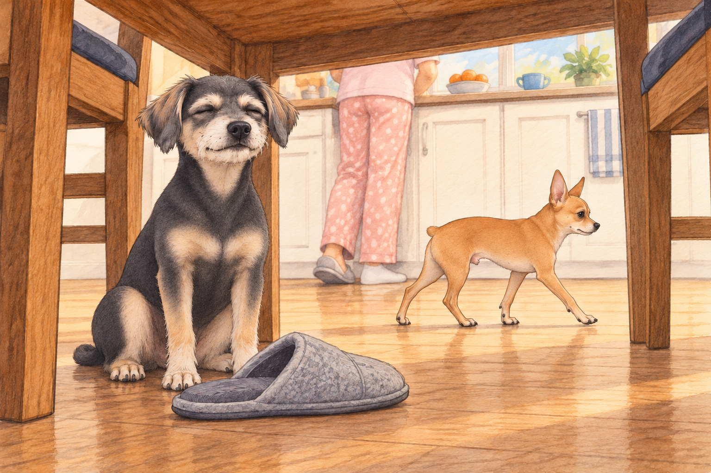
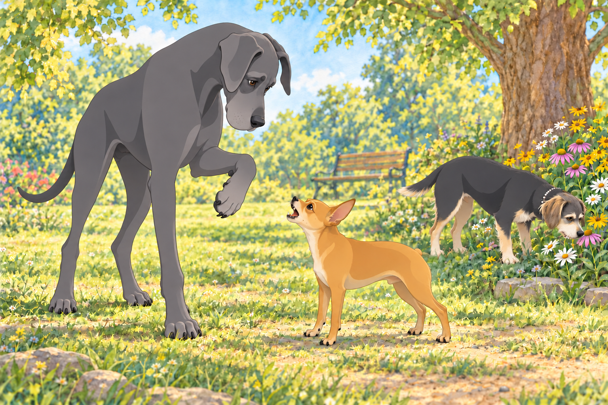
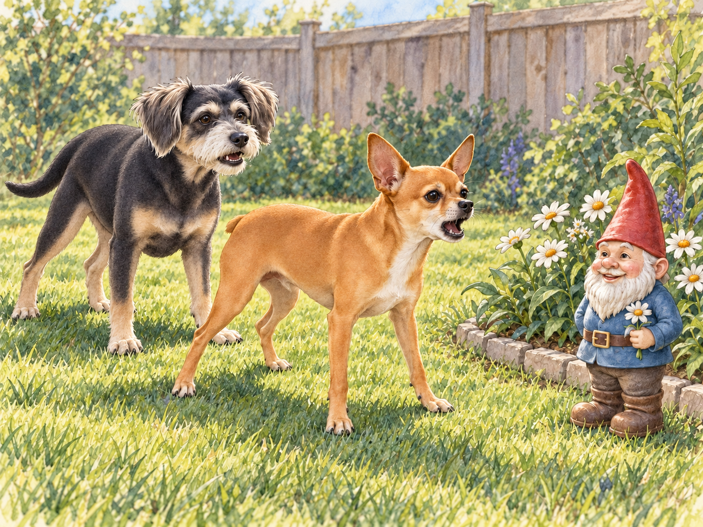

# Meet Neet and Buddy

Barksdale was a sleepy town until five in the morning, when Neet woke up. A four-pound chihuahua with Dorito-shaped ears, he considered this a generous hour for everyone else to begin work. His brother Buddy, a black dachshund-border terrier mix, preferred quiet corners and gentle pats. Ideally, both would be available much later.

Neet’s battle cry echoed through the quiet neighborhood. His owner, Heather, barely had time to open her eyes before Neet launched himself off the bed like a furry missile, landing smack in the middle of her stomach. He bounced once more to make sure she was awake.

Buddy raised his head. Heather was awake. The neighbors were awake. He put his head down again, outvoted.

"You need decaf, little dude," Heather groaned as she stumbled toward the coffee maker, while Neet tore around the kitchen like he was training for the Chihuahua Olympics. Buddy watched from under the dining table, where Heather’s feet offered some protection from the running. He moved a fallen slipper across the gap beside a chair leg and tucked himself behind it.

Neet stopped to inspect the slipper.

"Occupied," Buddy said.

Neet sniffed the toe, accepted this explanation, and resumed his patrol. Buddy closed his eyes. The slipper had achieved in three seconds what Heather had been requesting for twenty minutes.

Neet’s favorite pastime was picking fights with anything that moved — or didn’t. A leaf blowing in the wind? He charged it with unflinching determination. The vacuum cleaner? His sworn enemy. Delivery drivers? They were lucky to escape with their shoelaces intact.

That afternoon, Heather took both dogs to Barksdale Park. Buddy picked a path along the flowers, where he could sniff without having to introduce himself to anyone. Most of the other dogs were lounging in the sun. Buddy found a particularly interesting flower and took his time with it. For several wonderful seconds, nobody needed rescuing.

Neet spotted Max, a towering Great Dane known for his gentle nature. Without hesitation, Neet charged like a wind-up toy gone rogue. Max stared down, puzzled by the vibrating bundle of rage yapping at his ankles. He lifted one enormous paw to see whether he had accidentally stood on something.

Buddy left the flower. There went several wonderful seconds.

"Easy, buddy," Max said in his deep, rumbly voice. "I don’t want any trouble."

"Trouble found YOU, big guy!" Neet snarled, bouncing on his back legs like a hyperactive kangaroo. Max set his paw down somewhere else. Neet followed it.

"Both feet, then?" Max asked.

Before Neet could widen the investigation, Heather scooped him up. Buddy gave a concerned whine, checked that Max’s other feet were staying where they were, and followed Heather out of his shade.

Heather carried Neet home under her arm like a furry handbag, muttering, "You’ve got the heart of a lion and the size of a sandwich."

Neet strained forward from under her arm. Buddy walked beside her, enjoying the first patrol of the day that came with a handle.

But Neet was unfazed. As soon as they got home, he spotted his arch-nemesis: the garden gnome in the backyard. With a triumphant yip, he launched into his signature battle stance. Buddy considered going straight to his quiet corner. Then he padded up behind Neet and offered one tentative bark. The gnome had already survived the first twenty; perhaps it would listen to a different voice.

The gnome smiled on. Neet planted his feet. Buddy sat down beside him; this might take a while.

Heather opened the back door. "Anybody coming in?"

Buddy got up at once. Then he looked back. Neet was still waiting for the gnome to apologize.

Buddy returned, touched his nose to Neet’s shoulder, and set off again. This time Neet followed, keeping one eye on the flower bed.

Inside, Buddy settled behind his slipper. Neet squeezed in beside him.

Buddy shifted over. Apparently it was a two-dog slipper.

## Refinement record

October 3, 2026 expanded comedy pass: Buddy’s slipper refuge, Max’s misplaced-foot misunderstanding and a shared-refuge callback sharpen the introductory comedy. The complete current and original versions were compared; historical household and disputed description remain source voice. See [second-pass decisions](../Productions/E001-meet-neet-and-buddy/comedy-pass-v002.json).

October 3, 2026: individually refined and compared with the complete pre-refinement text. Creative choices, preserved incidents and pending illustration stages are recorded in [the episode record](../Productions/E001-meet-neet-and-buddy/episode.json). Original bytes remain in the external snapshot `/Users/sagar/Documents/ChatGPT/NBC_Archives/NBC-before-refinement-2026-10-03_200659.tar.gz` (member `NBC/Stories/S001-meet-neet-and-buddy.md`). This revision establishes no owner approval.

## Provenance and editorial notes

Working selection dated October 3, 2026. Selection and shelf order are editorial; owner approval and event chronology remain unverified.

Original numbering: manuscript Chapter 1.

Archive recovery: use [Studio recovery guidance](../Studio/Recovery.md). The paths below are paths **inside the verified snapshot**, not active navigation. SHA-256 pins identify the exact sources.

- `legacy-ch01` — `02_Story_Library/Legacy_Chapters/01-meet-neet-and-buddy.md`; SHA-256 `9b465ecabe1a9b8da1680401ec4206f6117e5dc4374244d478507cc8e94b7441`.
