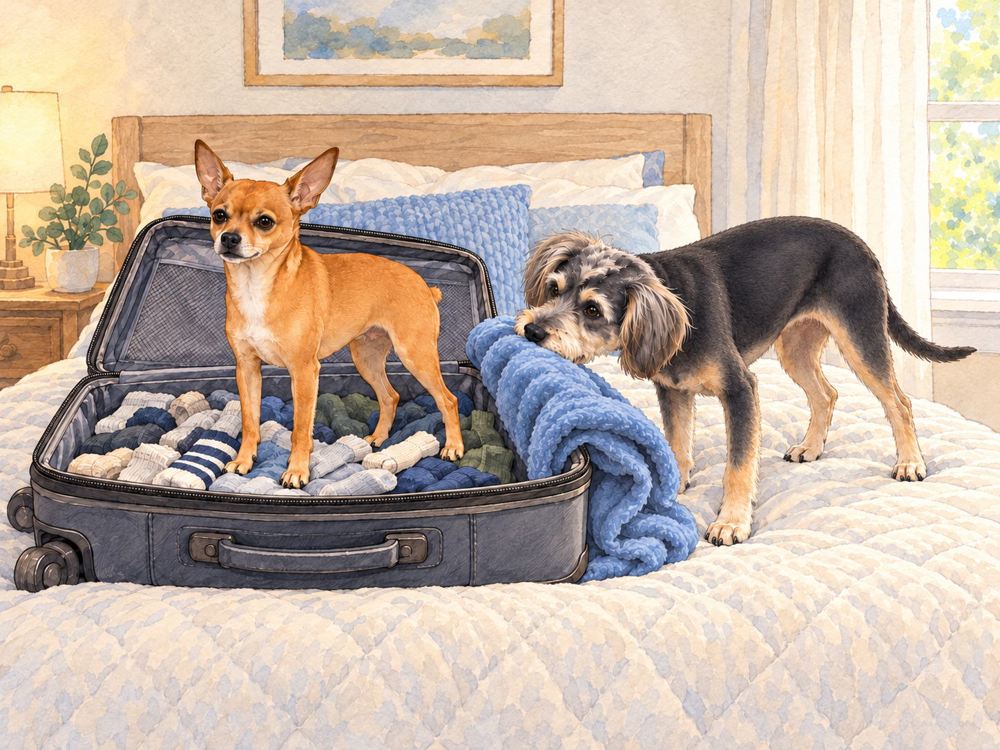
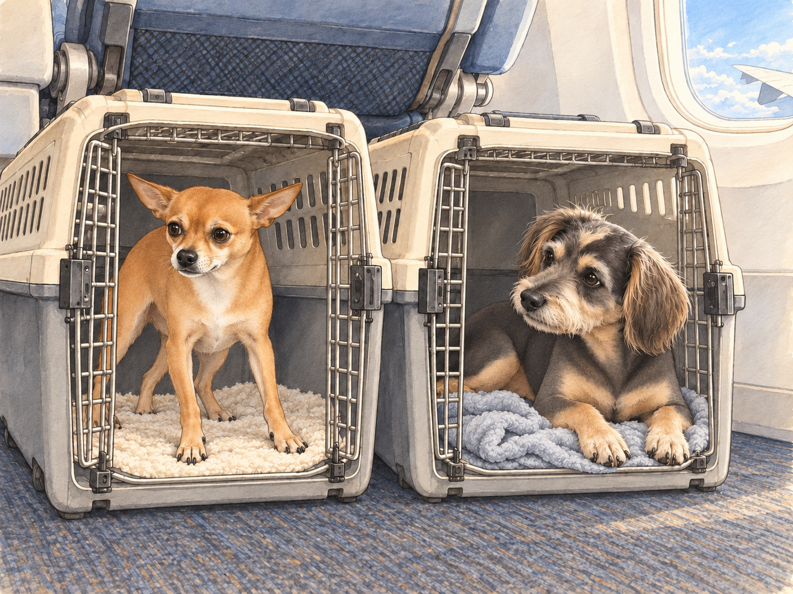
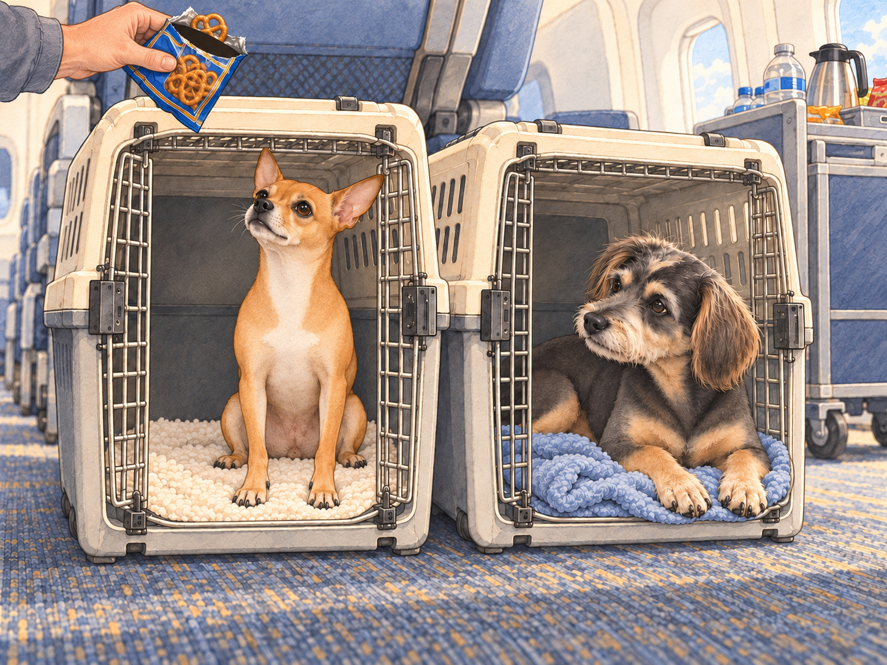

# The Flight to India

Heather opened a suitcase on the bed. Buddy fetched his favorite blanket. Neet, the orange whirlwind of a chihuahua with Dorito-shaped ears, began zipping around the house, barking orders as though the trip had been his idea.

Buddy, the calm and timid dachshund-border terrier mix, wasn’t so sure about the whole idea. He poked his head into Heather’s suitcase and nudged his blanket toward the top. If they had to go to India, he wanted one thing within reach that smelled right. His tail wagged nervously as Neet bounced onto the bed, declaring himself "Flight Captain Neet."

"You ready for this, Buddy?" Neet asked.

Buddy pushed the blanket higher. Heather tucked it down. Buddy pushed it higher again. They were making progress in opposite directions.

"I… guess so," Buddy replied, his voice barely above a whisper. "As long as there aren’t…, you know, too many loud noises."

Heather packed their essentials: travel crates, toys, and even Buddy’s favorite blanket for comfort. She laughed as Neet attempted to pack himself into the suitcase, standing triumphantly atop a pile of socks.

"Captain travels on top," he announced.

Heather lifted him out with one hand and put a sweater in his place.

Buddy watched the sweater settle. "Promotion filled."

The day of the flight arrived. At the airport, Neet was a ball of chaotic energy. He barked at the luggage conveyor belt, tried to chase down a moving cart, and gave a challenging yip at the metal detector when it beeped. Buddy, meanwhile, stuck close to Heather, his floppy ears twitching with every new sound. Neet had challenged three things already. None had stopped doing its job.

"You’re both going to be fine," Heather reassured them, scratching Buddy behind his ears and giving Neet a gentle pat on his tiny head.

Once on the plane, Neet poked his head out of his travel crate, his ears perked up as he scanned the cabin. "So, this is what the big leagues look like," he whispered, his imagination running wild. "Buddy, this must be the cockpit!"

Buddy sighed from his crate, comforted by the blanket that smelled like home. "It’s just a plane, Neet."

"Not just a plane! A flying fortress! I bet they’ll let me fly it," Neet declared.

Buddy pulled one corner of the blanket over his front paws. "I hope they ask someone first."

Heather chuckled as she settled into her seat. Despite his bold words, Neet was clearly not used to turbulence. As the plane took off, his confident stance wavered. His little body trembled slightly, and he whimpered quietly.

Buddy was listening hard to the engine himself. He lifted his head from his blanket and kept his voice steady. "Hey, it’s okay. Just think of it as… a really big car ride."

Neet looked at him, his Dorito-shaped ears drooping for a moment before perking back up. "You’re right. I’m the Flight Captain. I… I’ve got this."

He lowered himself carefully onto his bedding.

"Flying it lying down?" Buddy asked.

"Better grip."

Buddy lay down too. It did help.

By the time the meal carts came around, Neet had regained his swagger. He barked enthusiastically at the flight attendant, convinced she was delivering snacks just for him. Heather apologized profusely as the attendant stifled a laugh, handing over a small pack of pretzels that Neet proudly claimed as his in-flight meal.

"You barked at the cart in the airport," Buddy pointed out.

Neet watched Heather open the packet. "That one didn’t have pretzels."

Heather held the bag out of reach while Neet sat as straight as the crate allowed. At last, someone had discovered the controls.

Buddy nibbled one of Heather’s packed treats. The engine had settled into a steady hum; he could stop listening for changes.

As the plane began its descent into India, Neet pressed his nose against the window of his crate, marveling at the view below. "Look at all the colors, Buddy! The trees! The houses! The… wait, is that a cow on the road? This place is awesome!"

Buddy tilted his head, peeking out cautiously. "It does look… interesting."

Heather checked both crates before landing. Buddy settled his chin on the blanket again. Across from him, the Flight Captain was still looking for the cow.

"Are we there?" Neet whispered.

Buddy closed his eyes. "You’re flying it."

Neet gave the window a very serious look.

## Refinement record

October 3, 2026 expanded comedy pass: captain authority now collides with Buddy’s blanket arrangements, airport machinery and the snack cart. All original travel incidents remain. See [comedy pass and illustration plan](../Productions/E002-the-flight-to-india/comedy-pass-v002.json). Previous edition preserved in `NBC-before-expanded-refinement-2026-10-04_035505Z.tar.gz` outside NBC. Independent expanded visual and complete-reading review remain pending.

October 3, 2026: individually refined and compared with the complete pre-refinement text. Creative choices, preserved incidents and pending illustration stages are recorded in [the episode record](../Productions/E002-the-flight-to-india/episode.json). Original bytes remain in the external snapshot `/Users/sagar/Documents/ChatGPT/NBC_Archives/NBC-before-refinement-2026-10-03_200659.tar.gz` (member `NBC/Stories/S002-the-flight-to-india.md`). This revision establishes no owner approval.

## Provenance and editorial notes

Working selection dated October 3, 2026. Selection and shelf order are editorial; owner approval and event chronology remain unverified.

Original numbering: manuscript Chapter 2.

Archive recovery: use [Studio recovery guidance](../Studio/Recovery.md). The paths below are paths **inside the verified snapshot**, not active navigation. SHA-256 pins identify the exact sources.

- `legacy-ch02` — `02_Story_Library/Legacy_Chapters/02-the-flight-to-india.md`; SHA-256 `d86111a01dc360cd1a798851ee23c7f98670d7652365909cee2f34184e034b65`.
