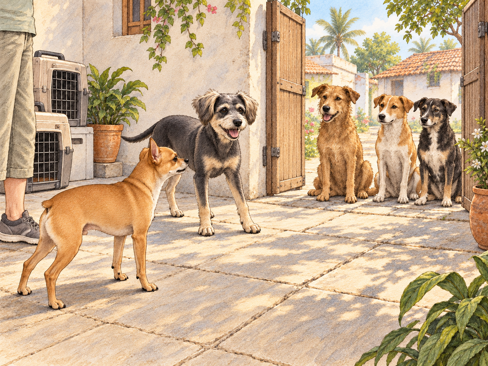
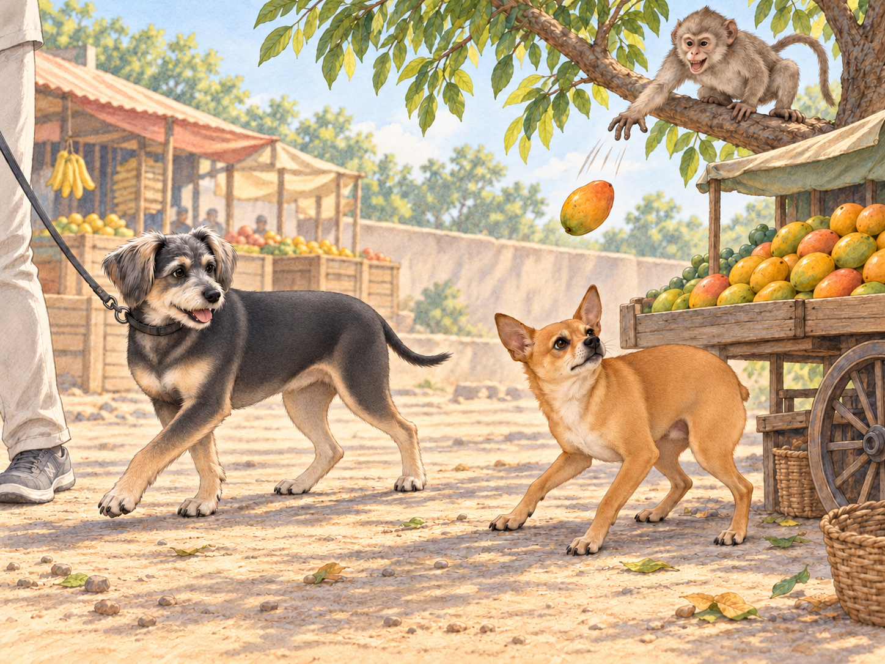
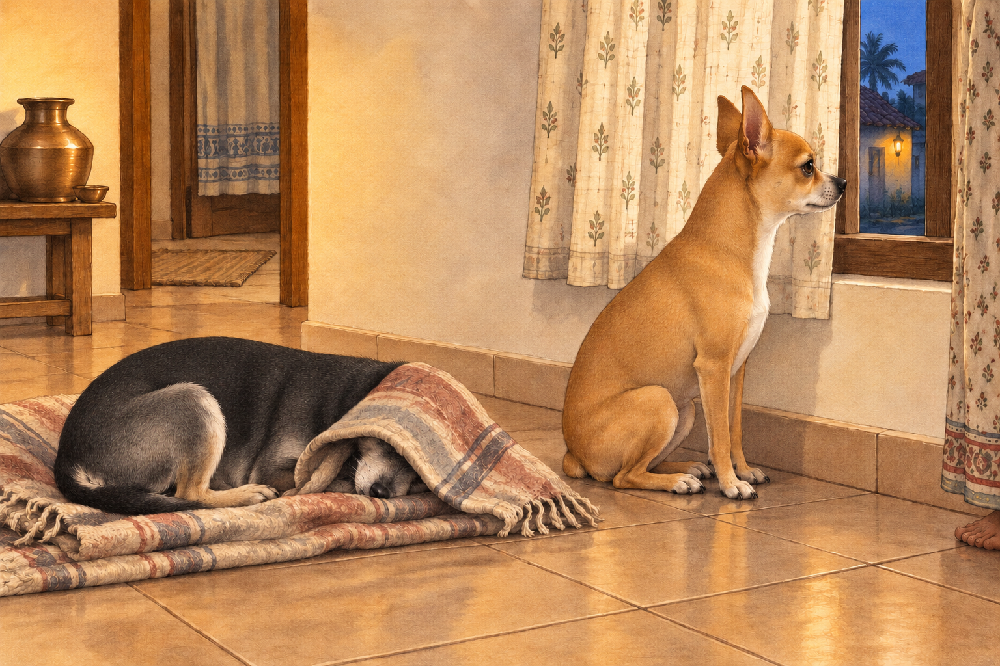

# Arrival in India

Neet and Buddy’s adventure in India began the moment they stepped out of the airport. A horn sounded before Neet had decided whom to bark at. By the time he answered it, three more had joined in. Neet, the fiery orange chihuahua, immediately puffed out his chest, ready to take on this new land. Buddy, his dachshund-border terrier mix brother, stayed close enough for Heather’s bag to brush his back.

Heather hailed a taxi, loading the crates and luggage into the small, bright yellow car. As the vehicle weaved through traffic, Neet pressed his nose against the window, his Dorito-shaped ears twitching with excitement.

"Look, Buddy! Tuk-tuks! Cows! So many bikes! It’s like a giant obstacle course!" Neet exclaimed, his tiny paws scrambling for a better view.

Buddy peeked out from under Heather’s arm, his wide eyes taking in the honking vehicles and bustling streets. "I don’t know, Neet. It’s… loud."

"Loud? This is life, Buddy! Adventure waits for no dog!" Neet declared, his voice barely audible over the horns and shouting vendors.

Buddy waited for him to finish. "What?"

Neet took a breath to repeat the speech. The taxi honked. Buddy settled back under Heather’s arm.

Their first stop was Heather’s family home in a small village. The air was filled with the scent of spices, flowers, and something Neet couldn’t quite place but decided smelled “deliciously dangerous.” As Heather set their crates in the courtyard, a group of curious street dogs gathered at the gate. Neet immediately sprang into action.

"Stay back, you scoundrels! This is my territory now!" he barked from the courtyard.

The street dogs tilted their heads, more amused than threatened. One particularly scruffy dog stepped forward, wagging his tail. "Relax, little one. We’re just saying hello."

Buddy peeked out from behind Heather. The scruffy dog was wagging; Neet was the only one shouting. "Maybe let him say hello first?"

"They need to know who’s boss first!" Neet replied, standing as tall as his four-pound frame would allow.

The scruffy dog sat down to wait. Two others sat beside him.

Neet held his ground. The visitors seemed prepared to watch him do it all afternoon. Buddy edged out from behind Heather and offered the scruffy dog a small, cautious wag. It was answered at once.

"See?" Buddy said. "That was hello."

"I hadn’t finished the warning."

Heather laughed, scooping Neet up before his self-appointed diplomatic mission could escalate. "You can meet the neighbors after you’ve had a drink," she told him. She set both dogs down inside the house, where a cool tiled floor and bowls of water awaited them.

Buddy stretched across a patch of tile. Neet drank noisily, paused to check the doorway, then drank again. Taking charge was thirsty work.

The next day, Heather decided to take Neet and Buddy on a rickshaw ride to the local market. Neet climbed into the colorful three-wheeler before Buddy had finished examining the step. The moment the rickshaw jerked forward, he stood on his hind legs, barking instructions to the driver.

"Faster! Left turn! Watch out for that cow!" Neet yapped, his Dorito ears flapping in the breeze.

The driver went right. Neet swayed left, landed back on the seat, and immediately barked, "Right!"

Buddy clung to Heather, his wide eyes darting from side to side. "This thing doesn’t even have doors!" he whimpered.

Heather drew him closer. Buddy tucked himself firmly between her and the seat back. Neet could have the view. Buddy had secured a corner that did not open onto a cow.

At the market, Neet’s confidence was on full display. He sniffed at piles of spices, barked at hanging fabrics that fluttered in the wind, and tried to climb into a cart full of mangoes. Buddy chose the shaded side of Heather and steered around a fluttering length of fabric. He had found a manageable route through the market; Neet kept trying to leave it. Then Buddy stopped so abruptly that Heather stopped too. A strip of blue cloth had brushed his ear.

He inspected it. He inspected the gap around it. He went the long way.

Neet, halfway up the mango cart, looked over. "It’s cloth."

"And those are fruit," Buddy said.

Their most memorable encounter came when they stopped at a fruit stall. A mischievous monkey perched on a nearby tree took an immediate interest in Neet. The monkey swung down, chattering and pointing at the bold chihuahua. Neet, of course, saw this as a challenge.

"What do you want, you overgrown squirrel?" Neet barked, his tiny body bouncing on the spot.

The monkey responded by snatching a mango and tossing it in Neet’s direction. Neet dodged expertly, his Dorito-shaped ears twitching with adrenaline. "Is that all you’ve got?"

There was an entire cart of mangoes beside the monkey. Buddy looked at it, then at Neet.

Buddy yelped and ducked behind Heather as the monkey prepared for another toss. He tugged toward the clear end of the stall. There was a perfectly good way out. He gave one more determined tug, planting his paws until Heather turned with him. Heather quickly stepped in, shooing the monkey away and scooping Neet into her arms.

"You’re going to start an international incident," she muttered, laughing as Neet wagged his tail triumphantly.

"He’s retreating!" Neet called over her arm.

Buddy kept walking. "So are we. Try to enjoy it."

By the time they returned home, both dogs were exhausted. Buddy collapsed onto his favorite blanket. Neet, however, sat by the window, staring out at the bustling street.

"This place is amazing, Buddy," Neet said softly. "So much to see, so much to do. Tomorrow, we’ll conquer even more."

Buddy sighed, his eyes closing. "As long as it’s not another monkey."

Heather drew the curtain partway across the window. Neet moved his nose into the remaining gap. Buddy put his head beneath the blanket.

"You’ll miss everything," Neet told him.

"That’s the plan."

A horn sounded outside. Neet’s ears lifted.

"Tomorrow," Heather said, rubbing the top of his head.

He stayed by the window, but leaned into her hand. Beneath the blanket, Buddy let out a long, satisfied sigh. For once, the expedition had stopped where he wanted.

## Refinement record

October 3, 2026: second comedy pass preserves the complete arrival, greeting, rickshaw, market and homecoming sequence. Scene choices and comparison with both previous editions are in [the comedy pass](../Productions/E003-arrival-in-india/comedy-pass-v002.json). Additional illustrations and independent review are in progress; this is not a new approval.

October 3, 2026: individually refined and compared with the complete pre-refinement text. Creative choices, preserved incidents and pending illustration stages are recorded in [the episode record](../Productions/E003-arrival-in-india/episode.json). Original bytes remain in the external snapshot `/Users/sagar/Documents/ChatGPT/NBC_Archives/NBC-before-refinement-2026-10-03_200659.tar.gz` (member `NBC/Stories/S003-arrival-in-india.md`). This revision establishes no owner approval.

## Provenance and editorial notes

Working selection dated October 3, 2026. Selection and shelf order are editorial; owner approval and event chronology remain unverified.

Original numbering: manuscript Chapter 3.

Archive recovery: use [Studio recovery guidance](../Studio/Recovery.md). The paths below are paths **inside the verified snapshot**, not active navigation. SHA-256 pins identify the exact sources.

- `legacy-ch03` — `02_Story_Library/Legacy_Chapters/03-arrival-in-india.md`; SHA-256 `b6ebac306869881891a519d1f0695396f6dd5059dded016a7105632282bacd86`.
