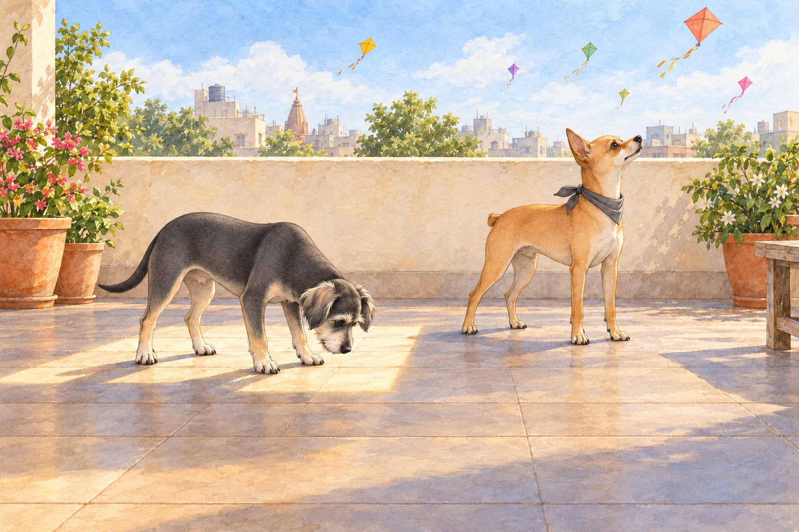
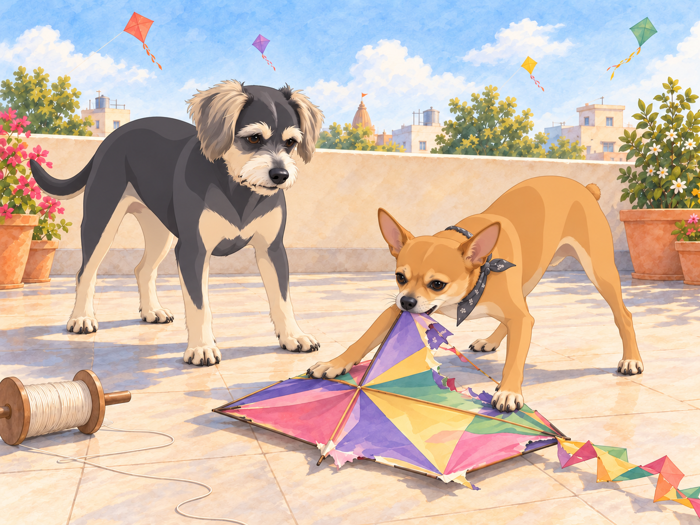
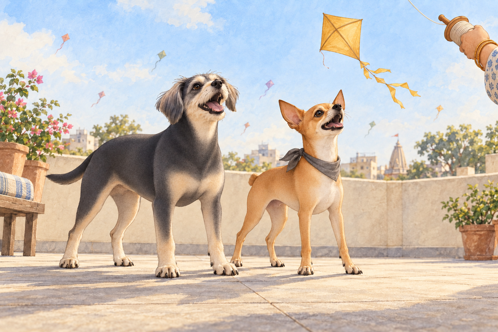

# Uttarayan - Day One

January in Gujarat had filled the sky with kites. By the time Heather, Neet and Buddy reached Ahmedabad for Uttarayan, Neet had tried to follow three of them from the train window.

As they arrived at the train station in Ahmedabad, Neet was immediately on high alert. The bustling crowd, the distant sound of dhol drums, and the aroma of freshly fried fafda and jalebi had him darting his little orange head in every direction.

"Buddy! Look at this place! It’s a carnival of smells and sounds!" Neet exclaimed, his Dorito-shaped ears twitching with excitement.

Buddy stayed close to Heather. "It’s a little… overwhelming," he said, eyeing a passing vendor pushing a cart full of kites.

Their host, a friend of Heather’s named Meera, welcomed them warmly into her rooftop home. The terrace was the heart of Uttarayan celebrations, and Meera had stocked it with stacks of kites and spools of manjha, the special thread coated with glass powder to help cut other kites in the sky.

Neet couldn’t contain himself. "This is it, Buddy! The battleground of champions! Look at all those kites! We’re going to be sky warriors!"

Heather chuckled as she tied a small scarf around Neet’s neck to keep him warm. "You’re going to love this, Neet. But no biting the kites."

Buddy peeked out from behind a spool of manjha. "I think I’ll just watch from here."

Meera picked up the spool. Buddy moved with its shadow for two steps, then discovered he had followed his hiding place into the middle of the terrace. He backed out again.

"You can have the sky," he told Neet. "I’m finding somewhere to stand."

As the festival began, the terrace came alive with neighbors shouting “Kai po che!” each time a kite was cut down. Heather held a kite spool while Neet barked orders at her like a tiny, overzealous coach.

"Pull! Pull! Let it loose now! You’re losing altitude, Heather!" Neet yipped, hopping on his hind legs for a better view.

Heather let out a little thread. Neet hopped higher.

"You’re going to run out of dog before we run out of sky," she told him.

Buddy chose a sunny corner with a view of Heather. He inspected the warm tiles, turned once to check that nobody needed to walk through him, and placed all four paws inside the patch. From there, he could enjoy the colors without joining the shouting.

"Perfect," he said.

A stray kite floated down near him, and he jumped back, letting out a soft yelp. It landed in his sunbeam.

Buddy looked at the rest of the terrace. There was quite a lot of it.

"It’s just paper, Buddy," Neet teased, darting over to inspect the fallen kite. "If you’re not going to fight it, I will."

Heather laughed as Neet pounced on the kite, his tiny teeth tugging at the colorful paper. "Neet, leave that alone! We’re supposed to fly them, not eat them."

Neet lifted his head, carrying a corner of paper. The rest of the kite stayed on the tiles.

"Got it."

"Some of it," Buddy said.

Heather took the piece from his mouth. Buddy nudged an untorn edge of the kite with his nose until it slid out of the sunny patch. Then he stepped back into the warmth. Neet had won a battle; Buddy had cleared the floor.

A large golden kite soared into their airspace. It belonged to a competitive neighbor who had already cut down half the kites in the sky. Neet’s eyes narrowed.

"That one’s mine," he declared, puffing out his tiny chest. "Heather, take the spool! We’re bringing that bird down."

Heather, amused but willing to indulge her spirited chihuahua, worked the spool with precision as Neet barked commands. With a swift flick of the manjha, their kite slashed through the golden kite’s thread, sending it spiraling downward. The terrace erupted in cheers.

"Kai po che!" Neet howled, his tail wagging furiously. "Victory is ours!"

Buddy left his sunny corner to watch the golden kite fall. "You actually did it?" He gave one bark with the others, then looked mildly surprised at himself.

Meera grinned. "That one was Buddy."

He closed his mouth. On the neighboring terrace, someone cheered again. Buddy opened it.

Just once more.

"Of course we did! I’m a champion, Buddy. You’ve got to aim high," Neet said, strutting around like he owned the rooftop.

As the sun began to set, the sky turned into a canvas of orange and pink, dotted with the silhouettes of kites. Heather sat on the terrace with Neet and Buddy, sharing a plate of sweet jalebi and sipping on chai. Buddy nibbled cautiously on a small piece of fafda, while Neet devoured his share with gusto.

"This place is amazing," Neet said, looking up at the sky. "I can’t wait to see what tomorrow brings."

Buddy leaned against Heather. "As long as tomorrow isn’t as loud, I’ll be happy."

A scrap of the fallen kite clung to Neet’s scarf. Buddy watched it flutter while the champion finished his jalebi.

"You’ve still got a kite," Buddy said.

Neet glanced down. "A trophy."

Heather plucked it off and set it beside the plate. Neet watched her do it, then tucked himself against her other side. There was room for both dogs now; neither had to defend it.

Buddy rested his chin against her knee. Next time, he would choose a sunbeam with a roof.

## Refinement record

October 3, 2026: expanded comedy pass preserves the rooftop contest, historical household and quiet close. Buddy now claims and reclaims his sunbeam before voluntarily joining the cheers; Neet’s paper victory and trophy get distinct callbacks. Full comparison and scene decisions are in [the comedy pass](../Productions/E004-uttarayan-day-one/comedy-pass-v002.json). Artwork and independent reviews remain in progress.

October 3, 2026: individually refined and compared with the complete pre-refinement text. Creative choices, preserved incidents and pending illustration stages are recorded in [the episode record](../Productions/E004-uttarayan-day-one/episode.json). Original bytes remain in the external snapshot `/Users/sagar/Documents/ChatGPT/NBC_Archives/NBC-before-refinement-2026-10-03_200659.tar.gz` (member `NBC/Stories/S004-uttarayan-day-one.md`). This revision establishes no owner approval.

## Provenance and editorial notes

Working selection dated October 3, 2026. Selection and shelf order are editorial; owner approval and event chronology remain unverified.

Original numbering: manuscript Chapter 4.

Archive recovery: use [Studio recovery guidance](../Studio/Recovery.md). The paths below are paths **inside the verified snapshot**, not active navigation. SHA-256 pins identify the exact sources.

- `legacy-ch04` — `02_Story_Library/Legacy_Chapters/04-uttarayan-day-one.md`; SHA-256 `25b45ed6727957567b80038834e3c5bbd6f07c6748a54716c2b919f84d509ac6`.
