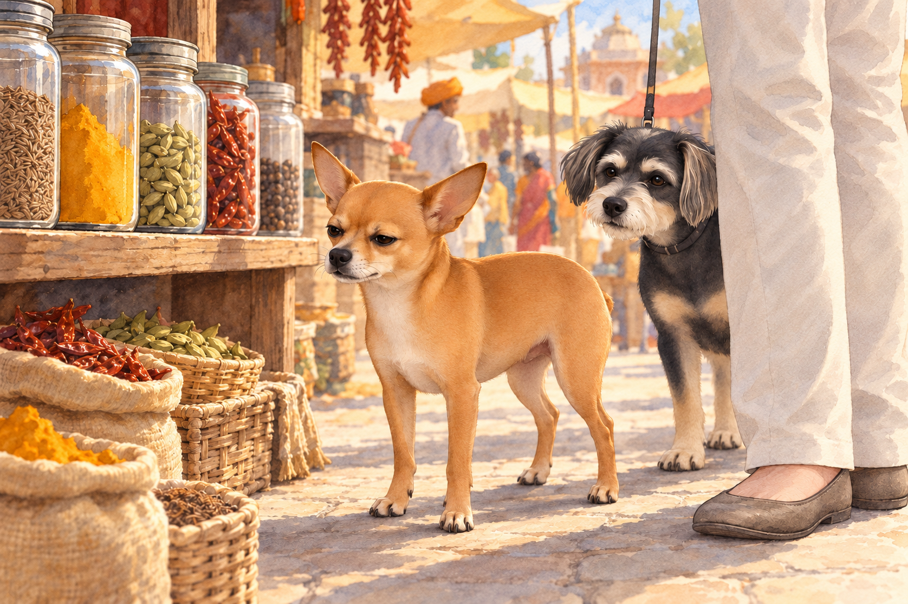
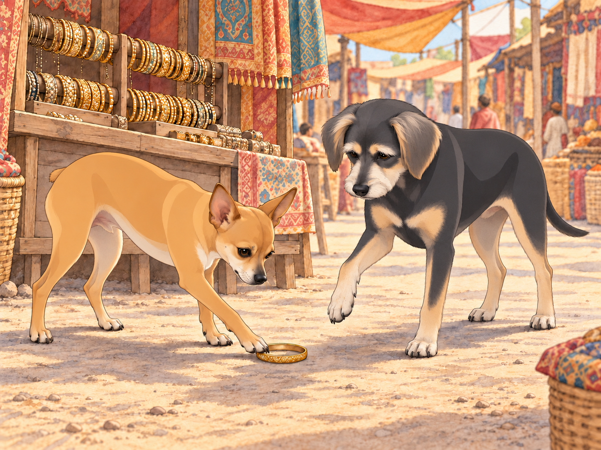
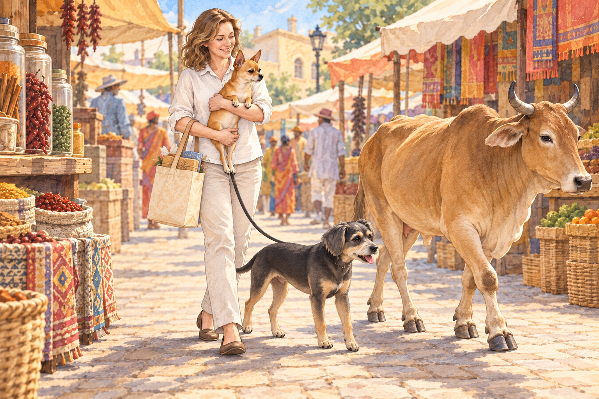

# The Bazaar Adventure

The day after Uttarayan, Heather decided it was time for Neet and Buddy to experience the bustling bazaars of Gujarat. The narrow lanes of the market were alive with energy, packed with vibrant stalls selling everything from spices to handcrafted jewelry. Heather held tightly onto Buddy’s leash while Neet trotted ahead, his Dorito-shaped ears perked up with curiosity.

"Look at all this stuff, Buddy!" Neet exclaimed. "I bet we’ll find treasure here!"

Buddy kept close to Heather’s shopping bag. "I think I’d rather find a quiet corner," he muttered, eyeing a cart piled high with colorful textiles that swayed ominously in the breeze.

The first stop was a spice stall, where the air was thick with the aroma of cumin, turmeric, and cardamom. Heather picked up a small packet of saffron, and Neet sniffed at the jars with unrestrained enthusiasm.

"This one smells like adventure!" he declared, sneezing as a puff of chili powder tickled his nose. "Buddy, you have to try this!"

He sneezed again, harder. The jars stayed where they were. Neet took a step back and watched them.

Buddy cautiously approached the stall, but one whiff of the potent spices sent him retreating behind Heather’s legs. "I think I’ll pass."

"It’s very powerful," Neet said.

"Yes. You’re losing."

The shopkeeper laughed, handing Heather a small biscuit for the dogs. "Your little one is brave," he said, gesturing to Neet. "But this one," he pointed to Buddy, "has the wisdom to avoid trouble."

Further down the lane, they reached a jewelry stall glittering with bangles and earrings. Neet immediately jumped onto a low wooden platform, barking at his reflection in a mirror.

"Hey! Who’s that handsome dog? Oh, wait, it’s me!" Neet wagged his tail, clearly impressed with himself. He tried a stern expression. The other dog was excellent at those too.

Heather chuckled, picking out a set of anklets for herself. Buddy sniffed a bangle that had fallen to the ground.

"Buddy, try it on!" Neet said, nudging the bangle toward his brother.

"I don’t think that’s how it works," Buddy replied. Neet nudged the bangle toward his paw. Buddy lifted the paw just long enough to put it on the other side of the bangle.

The next stall sold freshly fried samosas and kachoris. The vendor’s voice boomed as he advertised his wares, and Neet’s nose twitched with delight.

"Heather! We need to try this!" Neet barked, hopping on his hind legs.

Heather smiled, buying a small plate of kachoris. She tore off tiny pieces, handing one to each dog. Neet finished his before Buddy had worked through the flaky pastry.

"This might be the best thing I’ve ever tasted," Neet declared, licking his nose. "Buddy, isn’t this amazing?"

Buddy finished chewing before he answered. "We could stay here a little longer." He sat down beside Heather’s shopping bag. At last, a stall he wanted to visit.

Heather took a step toward the next shop. Buddy stayed seated.

"You wanted a quiet corner," Neet reminded him.

Buddy glanced at the vendor, who was still booming about his kachoris. "I’ve changed my requirements."

Heather looked down at him, then back at the stall. "Oh, now we like shopping." She finished her kachori while Buddy supervised.

As they made their way back to the entrance of the bazaar, the lanes grew even more crowded. A cow wandered lazily through the market, and Neet immediately saw it as a challenge.

"Buddy, look! It’s huge! We have to defend Heather!" Neet barked, puffing out his chest.

Heather quickly scooped Neet into her arms before he could approach the cow. "Relax, Captain Neet. The cow’s not interested in us."

Buddy stepped out of the cow’s path and looked back to make sure Heather followed. "Let’s leave it some room."

The cow passed without looking at Neet. He watched it from Heather’s arms, his chest still puffed out.

"It’s leaving," he announced.

"So are we," Buddy said.

Heather shifted Neet to make room for the shopping bag. "My protector. Very portable."

Back at Meera’s house, Heather unpacked their purchases while Neet and Buddy rested on a soft cushion. Neet’s tail wagged as he recounted their adventure.

"Buddy, today we conquered the bazaar! We sniffed spices, tried treasures, and faced off against a cow!"

Buddy, already half-asleep, mumbled, "You did all the conquering. I just tried to survive."

Heather settled beside them, her new anklets chiming. Neet opened one eye at the sound. Buddy kept both of his shut; he had tried on enough jewelry for one day.

## Refinement record

Expanded second pass, October 3, 2026: sharper spice reversal, Buddy’s conversion to shopping and Heather’s portable protector; original incidents and anklet ending retained. See [comedy comparison](../Productions/E006-the-bazaar-adventure/comedy-pass-v002.json). Additional illustrations remain proposed until independent visual and complete-reading review. Pre-pass bytes are preserved in the verified `NBC-before-expanded-refinement-2026-10-04_035505Z.tar.gz` snapshot outside NBC.

October 3, 2026: individually refined and compared with the complete pre-refinement text. Creative choices, preserved incidents and pending illustration stages are recorded in [the episode record](../Productions/E006-the-bazaar-adventure/episode.json). Original bytes remain in the external snapshot `/Users/sagar/Documents/ChatGPT/NBC_Archives/NBC-before-refinement-2026-10-03_200659.tar.gz` (member `NBC/Stories/S006-the-bazaar-adventure.md`). This revision establishes no owner approval.

## Provenance and editorial notes

Working selection dated October 3, 2026. Selection and shelf order are editorial; owner approval and event chronology remain unverified.

Original numbering: manuscript Chapter 6.

Archive recovery: use [Studio recovery guidance](../Studio/Recovery.md). The paths below are paths **inside the verified snapshot**, not active navigation. SHA-256 pins identify the exact sources.

- `legacy-ch06` — `02_Story_Library/Legacy_Chapters/06-the-bazaar-adventure.md`; SHA-256 `f24fdb3dbe4b5b89ff1039f38574cc87e6478c9d084cbaf9190475954d43c85c`.
