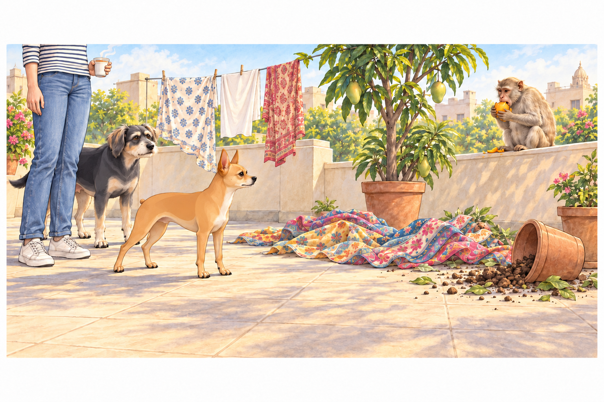
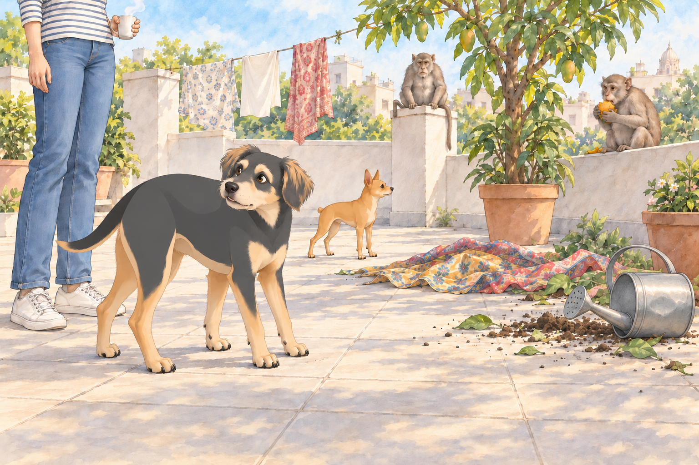

# The Monkey Menace

Heather, Neet, and Buddy had been enjoying their stay at her friend Priya’s bungalow in the outskirts of Ahmedabad. The house was surrounded by lush greenery, with a sprawling rooftop garden that Heather adored. Morning routines often involved Heather savoring chai on the terrace while Neet chased sunbeams and Buddy sniffed at the potted plants.

Buddy had already inspected the doorway. It led indoors, as promised. He hoped they would be using it soon.

Then something tugged the clothesline.

Heather’s peaceful tea moment was interrupted by an alarming rustle. She looked up to see a small group of monkeys hopping over the boundary wall and making their way into the garden. The leader, a burly alpha with a scar running across his face, was particularly intimidating. Heather froze, clutching her tea cup tightly, as the troop began their mischief.

The monkeys wasted no time in creating chaos. They plucked ripe mangoes from the small tree in the corner, flung pots over, and spilled soil everywhere. One particularly mischievous monkey yanked the clothesline, causing Heather’s freshly washed dupattas to tumble into the dirt. Heather’s shriek brought Neet and Buddy bolting to her side.

One monkey sat down with a mango and watched the laundry fall. It had brought breakfast to the entertainment.

Neet immediately assessed the situation with his trademark intensity. His Dorito-shaped ears twitched, and a low growl began in his throat. Meanwhile, Buddy’s eyes widened as he took a cautious step backward, clearly uneasy about the intruders.

“Oh no, no, no,” Heather whispered, trying to calm Neet. “Let’s not escalate this…”

“Too many guests,” Buddy told Neet. “No one brought a bowl.”

But it was too late. Neet erupted into a frenzy of barking, his high-pitched yaps piercing the morning air. The monkeys paused their antics, momentarily startled by the tiny chihuahua’s audacity. The alpha monkey, however, responded with an aggressive snarl, baring his teeth in a clear challenge.

Buddy let out a nervous whine and edged closer to Heather. Heather, torn between panic and disbelief, whispered frantically, “Buddy, help me calm Neet down!” Buddy looked at Neet, then at Heather. This was an ambitious assignment. Neet was already on a mission, darting toward the alpha with reckless abandon.

The alpha monkey leaped onto the garden’s central pillar, grabbing a small watering can and hurling it toward Neet. It missed by inches, clattering to the floor and sending Neet into a barking frenzy. Heather lunged to grab Neet but missed as he darted around, barking incessantly. The smaller monkeys joined in, screeching and jumping from one planter to another, turning the garden into a battlefield.

Buddy wanted to be indoors. But Heather was still reaching for Neet, and the smaller monkeys were closing around her pots. He stepped forward beside her and barked. Surprisingly, his deep bark seemed to momentarily unnerve the smaller monkeys, who paused their chaos to eye him warily. Encouraged, Buddy barked again, standing his ground beside Heather.

The monkey with the mango stopped chewing. Buddy was surprised enough to glance behind him. No larger dog had arrived. That had been his bark.

He tried it once more.

With Buddy beside Heather, Neet darted toward the alpha again. The alpha hissed and swiped at him but missed as Neet darted sideways with surprising agility. Heather’s heart pounded as she grabbed a broomstick lying nearby. Waving it wildly, she shouted, “Shoo! Get out of here!”

The combination of Neet’s relentless barking, Buddy’s booming barks, and Heather’s broom-wielding theatrics finally began to work. The smaller monkeys retreated, climbing over the boundary wall with panicked chatter. But the alpha, with a glint of defiance in his eyes, wasn’t ready to surrender just yet.

The alpha crouched on the pillar. Heather tightened her grip on the broom. With a sharp screech, he lunged at Neet, landing just feet away from the tiny dog. Neet’s fiery bark intensified, and he braced himself, ready to stand his ground. Heather screamed, swinging the broomstick in the alpha’s direction, but the monkey’s movements were too quick.

Buddy, catching the rising tension, sprang into action. With an unexpected burst of speed, he darted between Neet and the alpha, barking ferociously. His sudden intervention startled the alpha, causing him to hesitate. It was the opening Heather needed. She lunged forward, waving the broomstick and shouting at the top of her lungs, her voice echoing through the garden.

The alpha finally retreated, leaping onto the boundary wall and casting one last menacing glare at the trio. With a loud screech, he signaled the rest of the troop, and together, they disappeared into the nearby trees, leaving the rooftop eerily silent.

Heather collapsed onto a chair, clutching her broomstick and breathing heavily. The rooftop garden was in shambles: overturned pots, scattered soil, and a few mangled plants bore evidence of the monkey rampage. Neet strutted around, his tiny nub lifted, clearly proud of his heroic efforts. Buddy, visibly relieved, padded over to Heather and nuzzled her leg, seeking comfort.

“You two are something else,” Heather said, her voice a mix of exasperation and admiration. She pulled both dogs into a hug, laughing despite the mess. “My brave little protectors.”

“We held the garden,” Neet told Buddy.

Buddy looked at a pot lying in three pieces. “Which bits?”

Heather put the broom down and reached for a broken rim. Neet stepped forward to inspect it.

“No,” she said. “You’ve done plenty.”

He accepted this as praise.

As Heather began cleaning up the garden, Neet and Buddy stayed by her side, occasionally sniffing at the wreckage or barking at distant shadows to ensure the monkeys didn’t return. Buddy stayed close enough for Heather’s hand to find his head whenever she paused.

As the sun climbed higher, the trio retreated indoors, leaving the chaos behind. Heather looked back at the broken pots and the broom she was still carrying. Next time she came out for chai, she was bringing sturdier equipment. Neet glanced approvingly at the broom. Buddy went inside first. Then he stood just beyond the doorway and waited for the other two.

“Position secured,” Neet told him as he passed.

Buddy let Heather through before following. At last, they agreed on the position.

## Refinement record

Expanded second pass: doorway setup/payoff, mango spectator, Buddy surprised by his own effective bark, broken-pot victory and Heather’s exhausted praise sharpen the comedy without changing the confrontation. See [comparison record](../Productions/E007-the-monkey-menace/comedy-pass-v002.json). Proposed expanded artwork awaits independent visual and complete-reading review.

October 3, 2026: individually refined and compared with the complete pre-refinement text. Creative choices, preserved incidents and pending illustration stages are recorded in [the episode record](../Productions/E007-the-monkey-menace/episode.json). Original bytes remain in the external snapshot `/Users/sagar/Documents/ChatGPT/NBC_Archives/NBC-before-refinement-2026-10-03_200659.tar.gz` (member `NBC/Stories/S007-the-monkey-menace.md`). This revision establishes no owner approval.

## Provenance and editorial notes

Working selection dated October 3, 2026. Selection and shelf order are editorial; owner approval and event chronology remain unverified.

Original numbering: manuscript Chapter 8.

Archive recovery: use [Studio recovery guidance](../Studio/Recovery.md). The paths below are paths **inside the verified snapshot**, not active navigation. SHA-256 pins identify the exact sources.

- `legacy-ch08` — `02_Story_Library/Legacy_Chapters/08-the-monkey-menace.md`; SHA-256 `86ffce497e3cf5f358af3ecf53178208a7c19113ba536c522af8c42371177eb6`.
