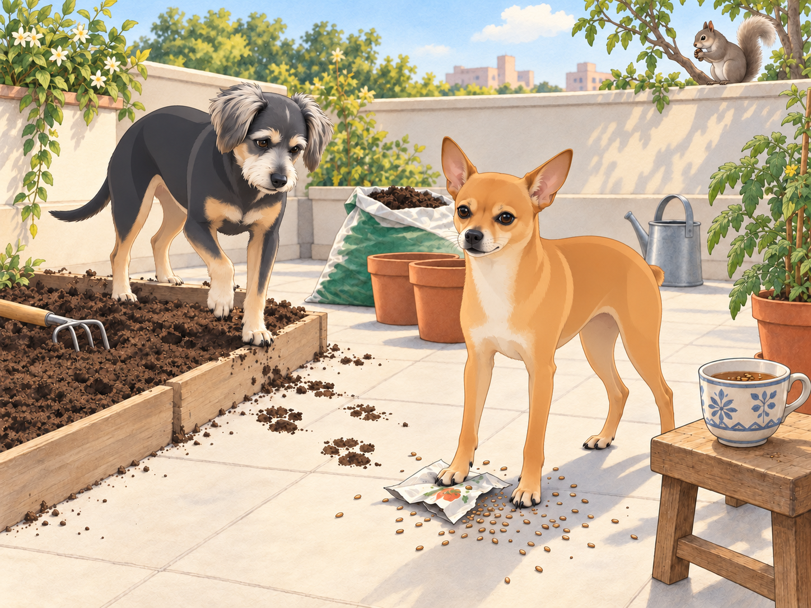
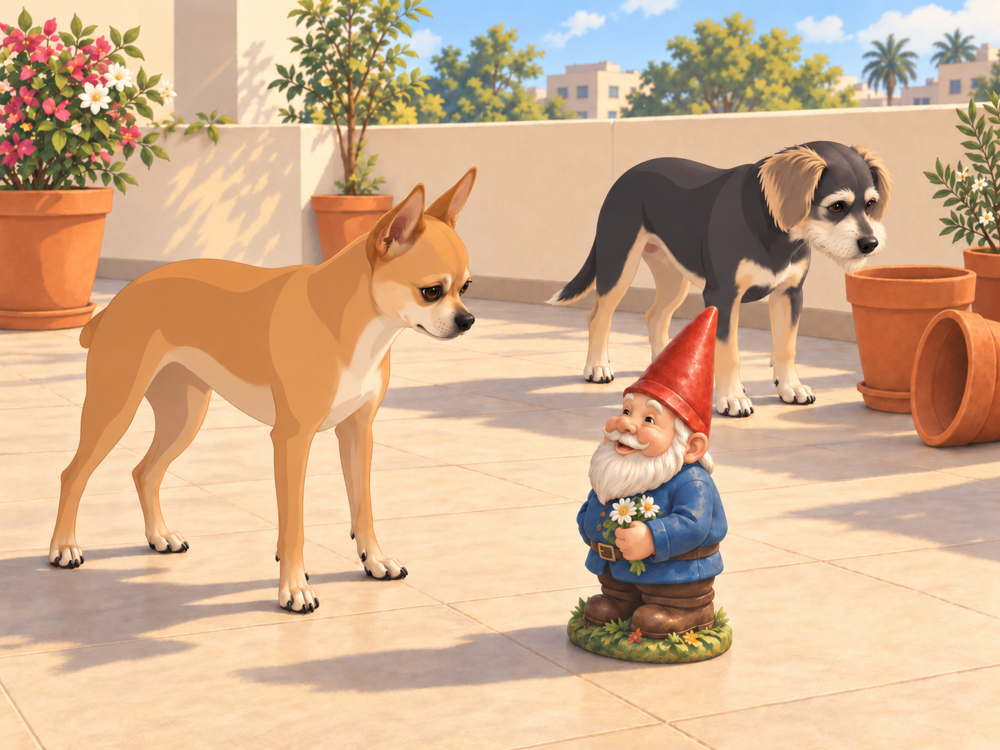
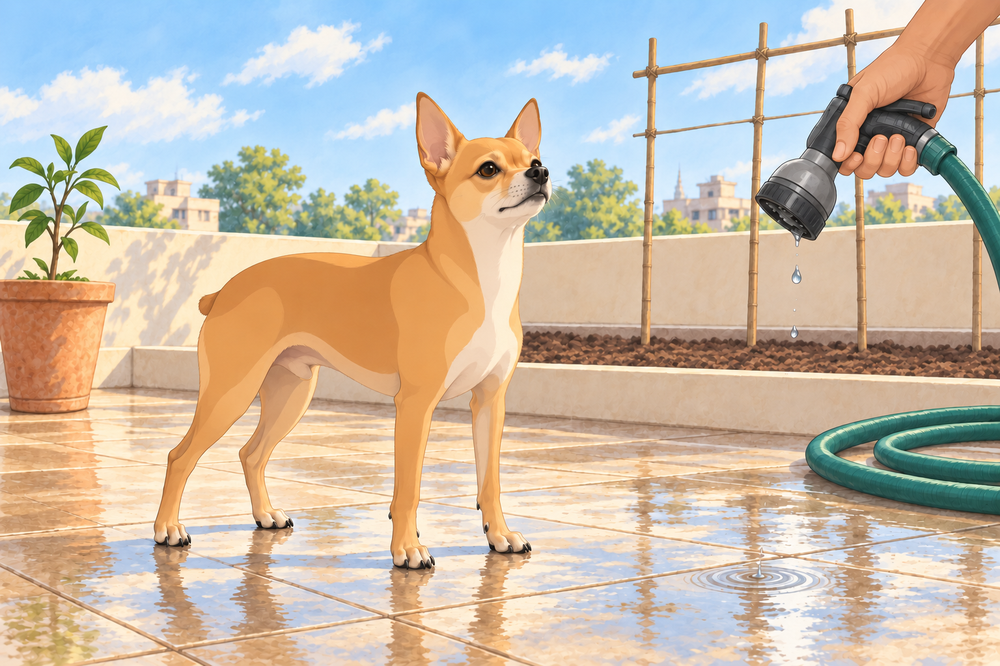

# Garden Rebirth with Chaos

The aftermath of the monkey invasion left Heather’s rooftop garden in ruins, with upturned pots, shredded leaves, and soil scattered across the floor. Despite the chaos, Heather resolved to restore it to its former glory— and perhaps make it even better. With Neet and Buddy by her side, she ventured to the local plant nursery to gather supplies.

Buddy had liked the nursery. Nothing there had asked him to help.

The trio returned with an assortment of pots, bags of soil, and a variety of seeds for vegetables and fruits. Heather, brimming with optimism, rolled up her sleeves. “Alright, team,” she said, looking at Neet and Buddy. “Let’s bring this garden back to life!”

Buddy selected a patch of shade beside the wall. Neet selected a job before Heather could give him one.

His ears perked up at the sound of Heather’s determined voice, mistaking her enthusiasm for a call to action. He darted to the seed packets, grabbing one labeled “Tomatoes” with his tiny teeth and shaking it ferociously.

“Neet! Stop!” Heather yelled, chasing him around the terrace. “Those are seeds, not toys!” Neet flung the packet into the air. The seeds scattered everywhere, landing in the soil beds and even in Heather’s chai cup. Heather groaned while Neet pranced victoriously, his tiny nub twitching.

She lifted the cup and stared into it.

“Lovely. I’m growing lunch in my breakfast.”

Neet leaned forward to inspect his work. Heather set the cup on the stool behind him.

Meanwhile, Buddy had found his own distraction: a curious squirrel that perched on the boundary wall. With his nose twitching and tail wagging, Buddy bolted after it, barking as he skidded through the freshly spread soil. The squirrel easily outmaneuvered him, scurrying up the tree beside the wall. Buddy’s enthusiastic chase left deep paw prints in the newly prepared beds. It had taken him less time to spoil a row than Heather had taken to make it.

The squirrel returned to the wall. Buddy lifted a paw, ready for another attempt.

“Buddy, no! The carrots go there!” Heather exclaimed. Buddy looked down at his raised paw. Beneath it lay the next perfectly smooth stretch of soil.

He turned carefully toward the bare terrace. Heather knelt to smooth out his tracks. Buddy watched her finish, then took the long way round the bed to reach his shade. The squirrel could keep the tree.

Heather placed a garden gnome near the flower pots. She had barely turned her back when Neet noticed the ceramic figure. His Dorito-shaped ears shot up, and he froze, staring at the gnome as if it were a mortal enemy. The gnome smiled back.

Neet moved to the left. The gnome kept smiling. He moved to the right. Same smile.

Buddy came over, sniffed the pointed hat, and lost interest.

“It’s a pot with a face.”

“Then why is it looking at us?”

Buddy glanced at the empty flower pots. He was not starting this with all of them.

Then, with a growl, Neet launched himself at the gnome, barking furiously and clawing at its base.

“Neet, it’s just a gnome!” Heather said, doubling over with laughter.

The gnome did not help her explain.

Neet was unconvinced. He circled the gnome, growling and swiping at it with his tiny paws, convinced he was protecting Heather from an imminent threat. Finally, Heather scooped him up, his legs still flailing. “Okay, hero, the gnome is harmless,” she assured him, setting him down a safe distance away.

Despite the interruptions, Heather managed to make progress. She planted rows of tomato and spinach seeds, potted a lime sapling, and set up a trellis for the climbing beans. Buddy chose a shady corner on the bare terrace and watched the birds pass. Neet, on the other hand, had declared war on the garden hose, leaping and snapping at the water spray as Heather attempted to irrigate the soil.

She shut off the nozzle. Neet landed, planted all four paws, and stared down the last drops.

He had won.

Heather opened it again. Neet’s mouth fell open with fresh outrage. Buddy, still dry beside the wall, tucked his paws farther into the shade.

By evening, the garden was back in shape— albeit with some unplanned creative touches from the dogs. Heather stood back to admire her work. The soil beds were smooth again, the lime sapling upright, and the herbs hanging safely above the dogs. Heather rinsed her cup and set it on a higher shelf. She had learned something about planting, too.

As the golden hues of sunset bathed the rooftop, Neet and Buddy seemed to settle. Heather sat on a bench, pulling them close. “You two might be the most unpredictable helpers,” she said, scratching Neet behind his ears and stroking Buddy’s soft fur. “Tomorrow, you can supervise from here.”

Neet let out a satisfied yap, while Buddy gave a contented sigh, resting his head on Heather’s lap. The trio watched the sky darken, the first stars twinkling above their newly reborn garden. Heather’s eyes fell on the newly chipped gnome. Neet was watching it too. She moved his paw gently back onto the bench.

## Refinement record

Expanded second pass: the nursery’s lack of jobs, lunch growing in breakfast, Buddy’s aborted second chase, the smiling gnome and the hose’s refusal to stay defeated sharpen the existing restoration comedy. See [the complete comparison](../Productions/E008-garden-rebirth-with-chaos/comedy-pass-v002.json). Expanded illustrations remain proposed pending independent visual and complete-reading review.

October 3, 2026: individually refined and compared with the complete pre-refinement text. Creative choices, preserved incidents and pending illustration stages are recorded in [the episode record](../Productions/E008-garden-rebirth-with-chaos/episode.json). Original bytes remain in the external snapshot `/Users/sagar/Documents/ChatGPT/NBC_Archives/NBC-before-refinement-2026-10-03_200659.tar.gz` (member `NBC/Stories/S008-garden-rebirth-with-chaos.md`). This revision establishes no owner approval.

## Provenance and editorial notes

Working selection dated October 3, 2026. Selection and shelf order are editorial; owner approval and event chronology remain unverified.

Original numbering: manuscript Chapter 9.

Archive recovery: use [Studio recovery guidance](../Studio/Recovery.md). The paths below are paths **inside the verified snapshot**, not active navigation. SHA-256 pins identify the exact sources.

- `legacy-ch09` — `02_Story_Library/Legacy_Chapters/09-garden-rebirth-with-chaos.md`; SHA-256 `ba7150d97cf85a703cc6f81120e561af0afffa061d9f555612bab0387553842f`.
