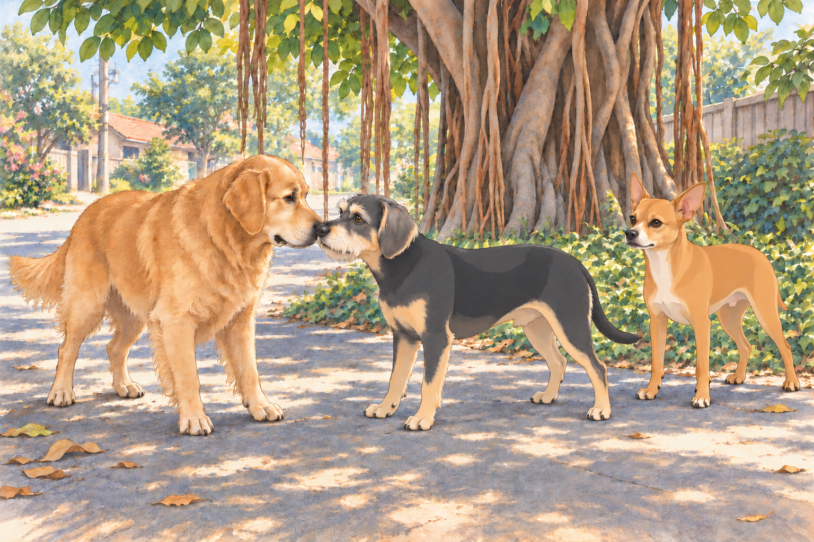

# Neet the General

The streets of Heather’s neighborhood in Ahmedabad were alive with the chatter of street vendors and the hum of auto-rickshaws. For Neet, however, it was a battleground waiting to be conquered. As Heather took Neet and Buddy on their daily walk, Neet’s sharp eyes darted left and right, scanning for threats. Buddy, in contrast, ambled along happily, his nose glued to the ground as he sniffed every new scent with delight. He wanted to reach the banyan shade before Neet discovered a reason they couldn’t.

“Stay close, guys,” Heather said, gripping their leashes. But Neet, always on high alert, suddenly froze. Ahead, a group of local stray dogs lounged in the shade of a banyan tree. There were five of them, ranging from a scrappy terrier to a muscular pariah dog. To Neet, they might as well have been an invading army.

With a sharp bark, Neet puffed out his chest and strained against the leash. “Stand down, intruders! This is my turf!” his posture seemed to scream. Heather sighed. “Neet, they’re just relaxing. Let’s not start a war.”

One of the invaders rolled onto his other side.

But Neet wasn’t listening. His barking intensified, drawing the attention of the stray dogs. The largest of the group, a broad-shouldered black dog with a torn ear, stood up and growled. The others followed suit, their eyes narrowing at the tiny orange chihuahua making all the noise.

Buddy whimpered and hid behind Heather, clearly not ready for a confrontation. Heather tugged at Neet’s leash. “Come on, let’s go.” But Neet was relentless, pulling forward as if determined to meet his “enemies” head-on.

The black dog stepped forward, his growl deepening. “Who’s this tiny loudmouth?” his expression seemed to say. Heather shortened Buddy’s leash. He was looking at the smaller brown dog, whose tail had begun to move.

“Neet, stop it!” Heather pleaded, but just as she was about to pick him up, Neet’s leash slipped from her grip. The fiery chihuahua charged forward, barking ferociously.

What happened next was not the battle Neet envisioned. The black dog, rather than attacking, tilted his head and barked— not a warning, but a laugh. The rest of the gang joined in, their tails wagging as they realized this tiny creature was no threat, just hilariously overconfident.

Neet, undeterred by their laughter, squared up to the black dog. “State your business, stranger! I’m in charge here!” his high-pitched yaps declared.

The black dog sat down, amused. “Relax, buddy,” his body language seemed to say. “We’re locals, not invaders.”

Neet looked past him at the excellent patch of shade. This was an awkward place to have declared a war; he had rather hoped to sit in it.

Buddy waited for the smaller brown dog to come closer, then stepped forward to meet her. They sniffed noses. Neither needed a speech. Heather watched in relief as the tension began to dissolve. She retrieved Neet’s trailing leash and wound its loop securely around her hand.

“Very successful walk,” she murmured. “We’ve crossed the street.”

The black dog— whom Heather decided to name Shadow— nudged Neet playfully. Despite his initial bravado, Neet hesitated, unsure of how to respond. Shadow barked softly, as if inviting him to join their group.

Neet puffed up his chest again. “Fine,” he seemed to say. “You’re lucky I’m feeling generous.”

The gang of dogs quickly warmed up to Neet and Buddy. They led the pair on a tour of their turf, showing them hidden corners of the neighborhood where they could find the best scraps of food and cool spots to rest. Neet, however, saw an opportunity.

“Alright, listen up!” Neet barked, climbing onto a pile of bricks to address the group. “This neighborhood needs order, and I’m just the dog to bring it. From now on, we’re a team. A gang. And our mission is simple: protect this turf from outsiders and secure the best food for all of us!”

Shadow wagged his tail in agreement, clearly entertained by Neet’s fiery leadership. The others barked their approval, forming a loose circle around their new “general.” At the word “food,” the scrappy terrier had opened both eyes.

Neet immediately began issuing commands. “You,” he barked at a lanky white dog, “patrol the north wall. And you,” he pointed at the brown dog Buddy had befriended, “scout the market for scraps. Report back at dusk!”

Buddy watched the brown dog settle down again halfway through her assignment. He lay beside her.

“Report back at dusk,” Neet repeated.

“We’ll be easy to find,” Buddy said.

The lanky white dog walked to the north wall, discovered that its shade had moved, and walked back. Neet watched this first patrol return with impressive speed.

Heather, observing from a distance, couldn’t help but laugh. “Only Neet could turn a casual walk into a military operation,” she muttered.

As the days went by, the gang’s activities became the talk of the neighborhood. Residents began leaving extra scraps for the dogs, amused by their antics. Neet took his role seriously, leading patrols, organizing food runs, and barking orders with the zeal of a true leader. Buddy, content to be the “diplomat,” made sure to keep the peace within the group. His first attempt at arranging a fair food queue ended with everyone politely following him to the same scrap. After that, he waited until the residents had set down several little piles. Peace improved considerably.

One afternoon, the gang faced their first challenge: an unfamiliar dog wandered into their territory. Neet’s ears shot up, and he sprang into action. “Intruder alert!” he barked, rallying the gang. Shadow and the others formed a protective line, with Neet at the front, growling fiercely.

The outsider, a shaggy golden retriever, looked bewildered. Buddy, sensing no threat, approached him with his usual calm demeanor. After a brief sniff, Buddy wagged his tail, signaling that the retriever meant no harm. Neet, though reluctant, stood down, but not without a stern warning bark.

The retriever wagged at him too. Neet held his severe expression a moment longer, in case it was still required.

By sunset, the gang had settled into their usual routine, lounging near the banyan tree. Neet sat on his “command post”— a large rock— surveying his domain with pride. Buddy lay nearby, happily chewing on a stick. Heather watched from the porch, shaking her head in disbelief. “Inspection finished?” she asked Neet. He was still sitting on the rock.

Shadow made room under the banyan tree. Neet descended from his command post to join him. Buddy kept chewing his stick. They had found a place for both kinds of dog.

“Everyone may rest,” Neet announced, lowering himself into the shade.

Nobody had to move.

## Refinement record

October 4, 2026: second comedy pass strengthens the failed patrol, food queue and permission-to-rest callback while preserving the historical Ahmedabad household and the gang’s founding. See [the complete comparison record](../Productions/E009-neet-the-general/comedy-pass-v002.json). Expanded artwork remains proposed pending separate reviews.

October 3, 2026: individually refined and compared with the complete pre-refinement text. Creative choices, preserved incidents and pending illustration stages are recorded in [the episode record](../Productions/E009-neet-the-general/episode.json). Original bytes remain in the external snapshot `/Users/sagar/Documents/ChatGPT/NBC_Archives/NBC-before-refinement-2026-10-03_200659.tar.gz` (member `NBC/Stories/S009-neet-the-general.md`). This revision establishes no owner approval.

## Provenance and editorial notes

Working selection dated October 3, 2026. Selection and shelf order are editorial; owner approval and event chronology remain unverified.

Original numbering: manuscript Chapter 10.

- The trailing reversed Chapter 10 fragment reproduces these same paragraphs in reverse order. Its provenance is reunited here; repeated reverse prose contributes no new narrative and is archived.

Archive recovery: use [Studio recovery guidance](../Studio/Recovery.md). The paths below are paths **inside the verified snapshot**, not active navigation. SHA-256 pins identify the exact sources.

- `legacy-ch10` — `02_Story_Library/Legacy_Chapters/10-neet-the-general.md`; SHA-256 `b2de69ccdee6f4dab70705f99a7714f56b489bea5c1a0d72c02bb43ab5eb90d4`.
- Reversed occurrence: `02_Story_Library/Legacy_Notes/Unassigned-Reversed-Chapter-10-Passage.md`; SHA-256 `d75f6f02f6f102dcebb48310a16e08d904107e4b938a772ce07099d0b90aa2eb`.
