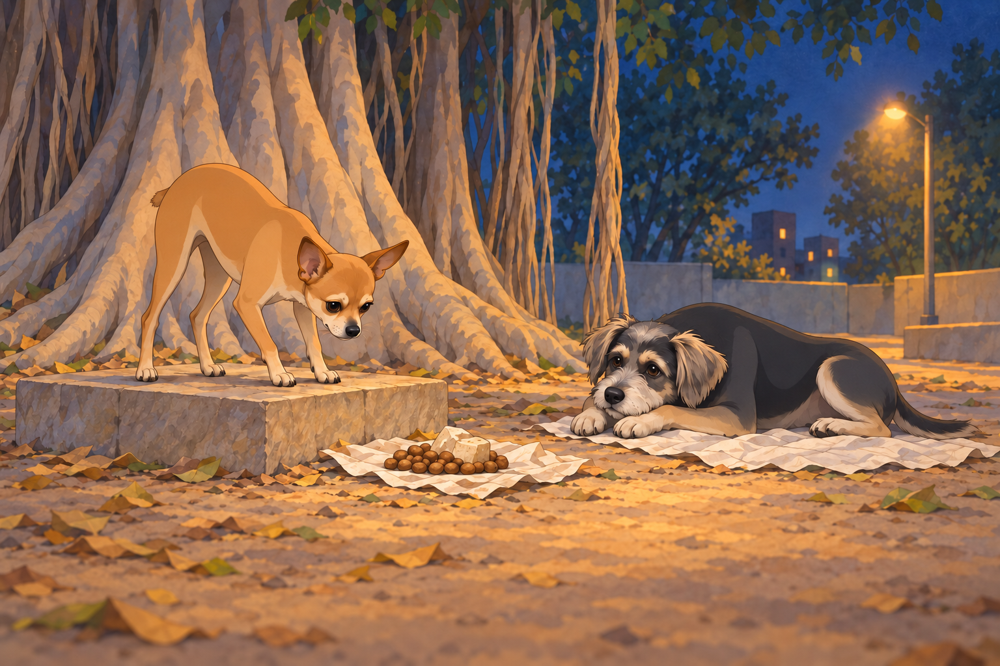
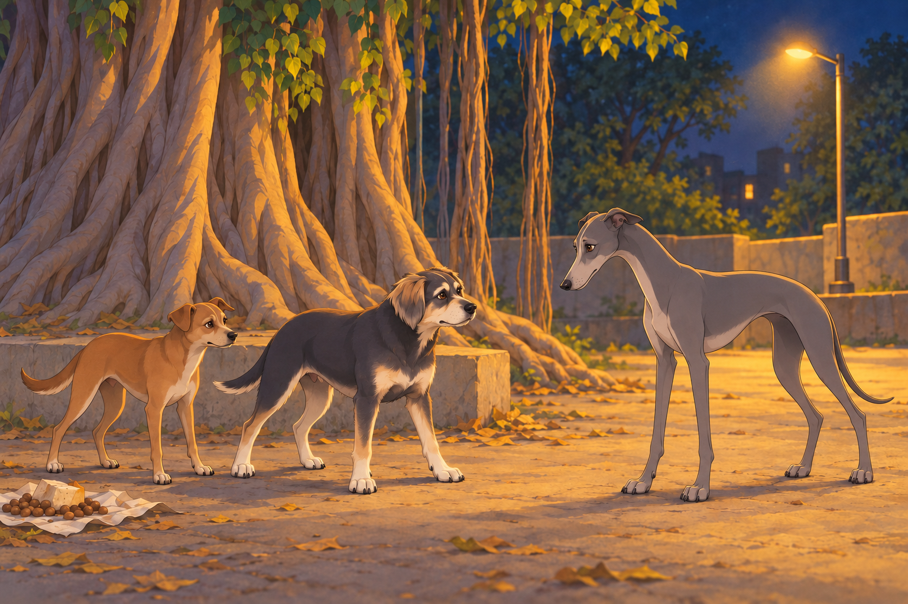
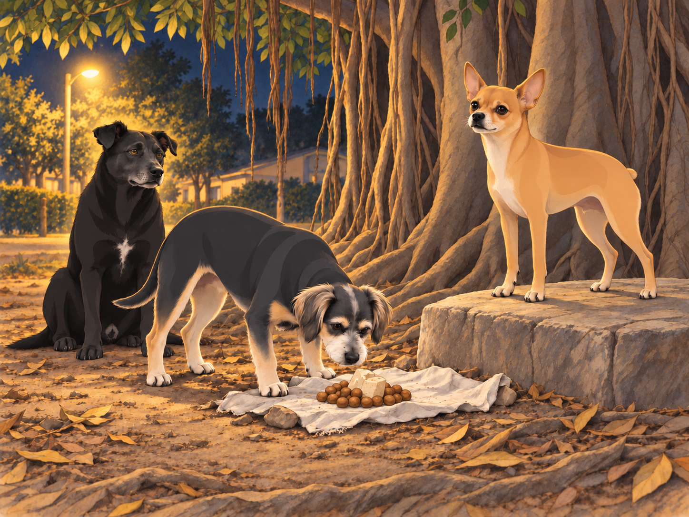

# Neet’s Gang Faces the Night Stalkers

Neet had finished his evening inspection of the food stash and was inspecting it again from his command post, a flat stone under the banyan tree. Buddy had chosen a pile of discarded cloth nearby. Nothing needed doing, which suited him.

“Supplies secure,” Neet announced.

“They were secure the first time,” Buddy said.

Neet leaned forward for another look. Buddy put his chin down. If the food escaped now, it would have to pass three inspections on the way out.

That moonless night, while the gang lounged lazily under the tree, Shadow— the black stray who served as Neet’s second-in-command— suddenly growled low in his throat. The rest of the gang perked up, ears twitching. Buddy, who had been dozing near a pile of discarded cloth, looked up nervously.

“What is it, Shadow?” Neet barked, jumping to his feet. His Dorito-shaped ears were upright, his tiny body tense. “Report!”

Shadow sniffed the air, his tail stiff. “Outsiders. More than one. And they’re close.”

Neet’s eyes narrowed. “Everyone, to your positions!” he barked. The gang scrambled, taking their assigned spots around the banyan tree. Shadow and the others formed a tight perimeter, while Buddy stayed close to Neet, glancing back toward Heather’s porch. He had picked a position with an excellent view of home. Unfortunately, it also had an excellent view of whatever was coming.

The silence was eerie, broken only by the occasional rustle of leaves. Then, from the darkness, a low, menacing growl echoed. A group of dogs emerged from the shadows, their eyes gleaming in the dim light of the streetlamp. These were no ordinary strays; they were larger, scarred, and carried themselves with an air of menace. At the front was a hulking mastiff with a torn ear and a jagged scar across his muzzle.

Neet stepped forward. “Who dares enter my territory without permission?” he barked, his voice sharp and commanding.

The mastiff let out a deep chuckle. “Your territory?” he rumbled. “This patch of dirt belongs to no one, least of all a yapping toy like you.”

The insult made Neet’s fur bristle. “Leave now, or face the consequences!” he snapped.

The mastiff’s gang— a mix of snarling hounds and wiry terriers— laughed mockingly. But the mastiff’s expression hardened. “We’re not here to talk,” he said. “We’re here to take what’s ours.”

With a snarl, the mastiff lunged toward Neet. Shadow intercepted him, colliding with the larger dog in a flurry of teeth and claws. The rest of Neet’s gang sprang into action, meeting the intruders head-on. Buddy, though hesitant, barked loudly to alert Heather, who was nearby in the house.

The fight was chaotic. Neet darted between the larger dogs, biting at their legs and barking commands to his gang. Shadow held his own against the mastiff, while the brown dog, Chikki, managed to trip one of the wiry terriers. Buddy stayed near the tree, keeping the food and the route to Heather’s porch in view. He barked whenever an intruder tried to circle behind the others.

In the middle of the chaos, Neet spotted a lanky greyhound circling toward the food stash the gang had hidden under the banyan tree. “Buddy, stop him!” Neet barked.

Buddy sprang between the greyhound and the stash. His bark came out so deep and sudden that he startled himself. He stayed put anyway.

The greyhound tried a step to the left. Buddy took a step to the left. He tried the right. Buddy did too. This was less like fighting and more like being refused entry to supper.

Chikki arrived at Buddy’s shoulder. The greyhound looked from one to the other, then back at the food.

“No,” Buddy said.

Together, they forced him back toward the fight.

Meanwhile, Neet faced off against a muscular boxer. Despite his small size, Neet’s agility and sheer audacity gave him the upper hand. He darted under the larger dog’s legs, nipping at his ankles and dodging every counterattack.

“You’re not so tough,” Neet barked as the boxer stumbled over a fallen branch. “Stay down, or I’ll really show you what I’m made of!”

The branch stayed exactly where it was. Neet gave it a quick approving glance.

The tide began to turn. Shadow managed to pin the mastiff, his teeth bared dangerously close to the larger dog’s throat. “Yield,” Shadow growled. “Or leave while you still can.”

The mastiff snarled, but the sight of his gang being pushed back by Neet’s organized defense made him hesitate. With a reluctant growl, he barked an order to retreat. The intruders backed away, disappearing into the shadows as quickly as they had come.

The gang regrouped, panting but victorious. Neet climbed back onto his command post, his tail wagging triumphantly. “Excellent work, team!” he barked. “We showed them what happens when you mess with us!”

Buddy flopped onto the ground, exhausted but relieved. Shadow sat beside him, dusty and breathing hard. “Food’s still here,” he said. Buddy got up to check the stash with his nose.

Satisfied, Buddy lay down again.

Neet puffed out his chest. “Of course,” he said. “That’s why I’m in charge. Now, let’s secure the perimeter and check on the food stash.”

As the gang began their post-battle tasks, Heather appeared on the porch, holding a flashlight. “What on earth happened out here?” she asked, looking at the disheveled dogs.

Neet trotted up to her, his tail wagging proudly. He let out a single, confident bark, as if to say, “Just another victory for General Neet.”

Heather shook her head, laughing. “You’re unbelievable,” she said, scratching him behind the ears. “I heard you from inside.”

Neet lifted his chin. At last, someone appreciated the range.

Heather checked the dogs one by one with her flashlight. Buddy stayed against her ankle while she looked him over. Neet returned to his rock, but when Buddy moved back to the cloth, he took the nearer edge of the command post.

“All secure?” he asked quietly.

Buddy checked that Shadow was beside them and Heather was still on the porch. Then he looked at the food.

“Yes.”

Neet opened his mouth.

“Still,” Buddy added, and closed his eyes.

## Refinement record

October 4, 2026: second comedy pass sharpens the repeated inspection, Buddy’s determined food defense, the branch assist and the final secure/still callback. Historical conflict and household remain intact. See [comparison record](../Productions/E010-neets-gang-faces-the-night-stalkers/comedy-pass-v002.json). Expanded illustrations are proposed pending independent reviews.

October 3, 2026: individually refined and compared with the complete pre-refinement text. Creative choices, preserved incidents and pending illustration stages are recorded in [the episode record](../Productions/E010-neets-gang-faces-the-night-stalkers/episode.json). Original bytes remain in the external snapshot `/Users/sagar/Documents/ChatGPT/NBC_Archives/NBC-before-refinement-2026-10-03_200659.tar.gz` (member `NBC/Stories/S010-neets-gang-faces-the-night-stalkers.md`). This revision establishes no owner approval.

## Provenance and editorial notes

Working selection dated October 3, 2026. Selection and shelf order are editorial; owner approval and event chronology remain unverified.

Original numbering: manuscript Chapter 11.

Archive recovery: use [Studio recovery guidance](../Studio/Recovery.md). The paths below are paths **inside the verified snapshot**, not active navigation. SHA-256 pins identify the exact sources.

- `legacy-ch11` — `02_Story_Library/Legacy_Chapters/11-neet-s-gang-faces-the-night-stalkers.md`; SHA-256 `aa9835fa5ec499df23e17ffa7b89a98ba33539aa48beeba1dab34dd5d81adb8d`.
- `elevenlabs-reader-55` — `90_Archive/2026-10-03-elevenlabs-recovery/Raw_Exports/reader-55.txt`; SHA-256 `2c1c281005856cfb484eb7fc49e23a344ffcc2eafea034fe44bc68db21d1c255`.
