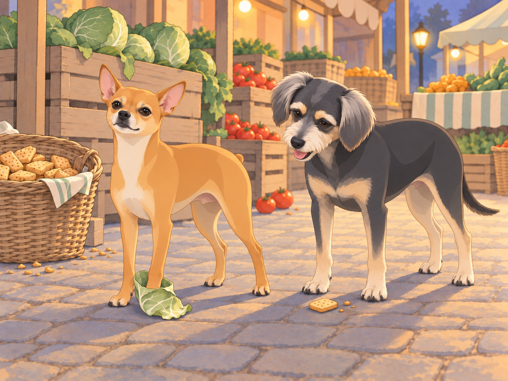

# Neet’s Gang to the Rescue

Buddy had just found a comfortable hollow beneath the banyan tree. He turned twice, moved a stone with his paw and lowered himself into the exact shape of a quiet evening.

A cry came from the market.

Neet was on his feet before the others had raised their heads. Buddy looked at the hollow. He had only just fitted it.

“It’s coming from the market,” Shadow said, his ears swiveling toward the sound. The gang perked up, their eyes scanning the direction of the commotion. Neet jumped onto his “command post” and barked sharply.

“Alright, team, this is it! Time to show the neighborhood what we’re made of. Let’s move out!”

The gang raced through the streets, led by Neet, his tiny legs pumping furiously. Buddy followed, avoiding the loose stones Neet ran straight over. The bustling market came into view, and chaos greeted them. A cart filled with fresh produce had overturned, and a small group of vendors was shouting as a pack of wild monkeys raided their goods.

Heather, who had been shopping nearby, spotted the gang as they arrived. “Oh no, not the monkeys again,” she muttered, recognizing the chaos-makers from their rooftop invasion.

Neet skidded to a halt, surveying the scene. The monkeys were scattering vegetables everywhere, their screeches echoing through the market. One particularly bold monkey was dangling from a signpost, holding a bunch of bananas like a trophy. Neet’s eyes narrowed.

“This is our neighborhood,” Neet barked to the gang. “And we’re not letting these troublemakers ruin it. Let’s go!”

With a high-pitched yap, Neet charged into the fray, heading straight for the banana-wielding monkey. The monkey shrieked in surprise and leapt to another post, but Neet was relentless, jumping and barking until the monkey dropped its loot and fled.

Neet planted himself beside the fallen bananas. He looked up at the empty post, waiting for a surrender that was no longer in the neighborhood.

“Neet!” Heather called. “The bananas are safe!”

He gave the post one final bark. Now they were.

Meanwhile, Shadow and Chikki worked together to corner two smaller monkeys that were raiding a basket of mangoes. Shadow growled low and steady, while Chikki darted around, snapping at their heels. The monkeys, clearly outmatched, scampered up a nearby tree and chattered angrily from the safety of the branches.

Buddy started after Chikki, then stopped beside an older woman crying over her spilled tomatoes. The others could reach the monkeys; she was sitting alone on an overturned crate. He pressed his nose beneath her hand and stayed. She smiled through her tears and patted his head. “Good boy,” she said softly, her distress easing.

A tomato rolled past his paw. Buddy instinctively stopped it with his nose, then looked at the dozens still scattered across the stones. He nudged that one toward her crate and returned to her hand. One thing at a time.

The gang’s coordinated efforts began to turn the tide. The remaining monkeys, seeing their comrades retreat, abandoned their stolen goods and fled into the night. The market erupted in cheers as the vendors rushed to salvage what they could.

Heather knelt beside Neet, who was standing triumphantly on a pile of cabbages. “Neet, you did it!” she said, laughing as she scratched behind his ears. Neet puffed out his chest, barking proudly as if to say, “Of course I did. This is my turf.”

As the vendors began to reorganize, one of them approached the gang with a basket of treats. “For the heroes of the market,” he said, setting down the basket filled with biscuits and scraps of meat. The gang eagerly dug in, their tails wagging in unison.

“You’ve got cabbage on your foot,” Shadow told Neet between bites.

“It’s all about strategy,” Neet replied, his voice dripping with mock seriousness. “And a little bit of flair.”

Buddy looked from the leaf to the basket. “Does the flair come off before we go home?”

Neet took a dignified step. The cabbage came with him.

The tomato seller reached down once more to rub Buddy’s head. He left his biscuit long enough to lean against her knee. As the gang finished their feast and the vendors returned to their stalls, the market regained its usual hum of activity.

Back at the banyan tree, Neet climbed onto his command post to address his team. “Excellent work, everyone,” he said. “Tonight, we’ve proven once again why this neighborhood belongs to us. Let’s keep it that way.”

The gang barked in agreement, their voices ringing out into the night. Heather smiled as she led Neet and Buddy back home, the rest of the gang dispersing to their usual haunts. Buddy returned to his hollow long enough to collect the stick he had left there. Neet waited for him, still wearing the cabbage leaf.

“Leave the vegetable outside,” Heather said at the door.

Buddy carried his stick straight in. Neet looked down at his foot. The market had surrendered more easily.

## Refinement record

October 4, 2026: second comedy pass develops Buddy’s interrupted comfort, Neet’s unnecessary final banana defense, Buddy’s practical one-tomato help and the cabbage’s refusal to obey. All rescue incidents and the historical Heather household remain. See [comparison record](../Productions/E011-neets-gang-to-the-rescue/comedy-pass-v002.json). Expanded art awaits independent review.

October 3, 2026: individually refined and compared with the complete pre-refinement text. Creative choices, preserved incidents and pending illustration stages are recorded in [the episode record](../Productions/E011-neets-gang-to-the-rescue/episode.json). Original bytes remain in the external snapshot `/Users/sagar/Documents/ChatGPT/NBC_Archives/NBC-before-refinement-2026-10-03_200659.tar.gz` (member `NBC/Stories/S011-neets-gang-to-the-rescue.md`). This revision establishes no owner approval.

## Provenance and editorial notes

Working selection dated October 3, 2026. Selection and shelf order are editorial; owner approval and event chronology remain unverified.

Original numbering: manuscript Chapter 12.

Archive recovery: use [Studio recovery guidance](../Studio/Recovery.md). The paths below are paths **inside the verified snapshot**, not active navigation. SHA-256 pins identify the exact sources.

- `legacy-ch12` — `02_Story_Library/Legacy_Chapters/12-neet-s-gang-to-the-rescue.md`; SHA-256 `55353eeb1057036325ad65734227e95b8d3fbb54e3fe66123b86f2c499999bea`.
- `elevenlabs-reader-54` — `90_Archive/2026-10-03-elevenlabs-recovery/Raw_Exports/reader-54.txt`; SHA-256 `d18ff7ab877f56f2158b8ce02ed7c35d731b1afb1a81b635928ca3f9962b90be`.
