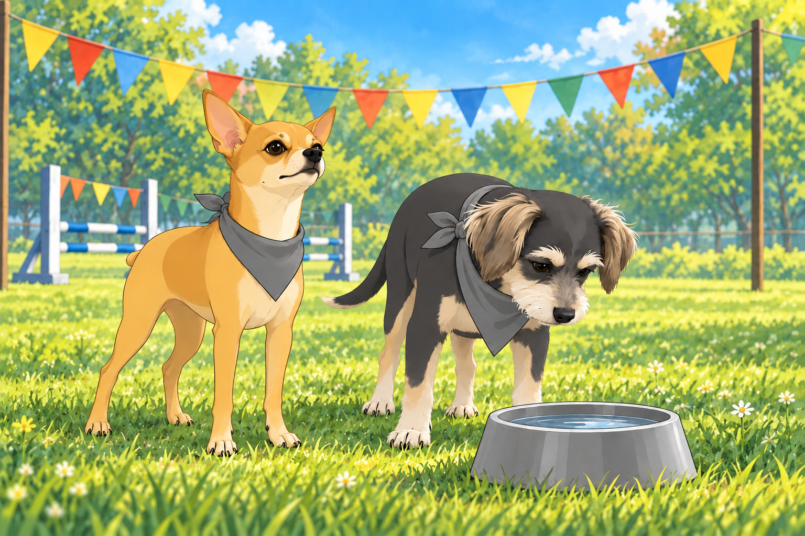
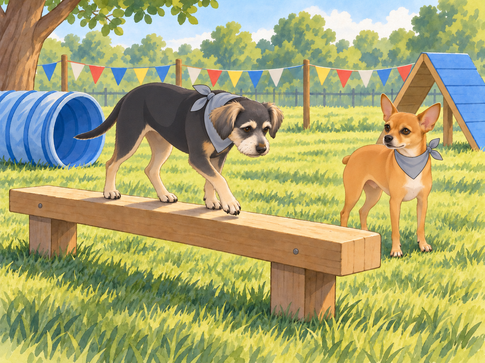
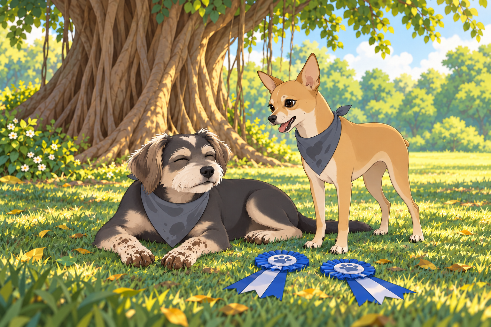

# The Great Neighborhood Dog Games

Neet had learned two things about the annual Neighborhood Dog Games: there would be ribbons, and none of them had his name on them yet.

He considered this a temporary arrangement.

“Listen up, team,” Neet barked, pacing in front of his gang under the banyan tree. His Dorito-shaped ears twitched with excitement. “This is our chance to prove we’re not just protectors of the neighborhood. We’re champions. We’re legends.”

Shadow wagged his tail. “What’s the plan, boss?” he asked.

“Simple,” Neet replied, hopping onto his command post. “We enter every event, dominate the competition, and take home all the ribbons. Buddy, you’re with me for the obstacle course. Shadow, you’ll handle the long jump. Chikki, you’re on fetch duty. Everyone else, be ready for backup.”

Buddy looked toward the park. “Obstacle course?” He would rather have watched from the shade, but he also wanted to finish something without Neet having to explain it for him. “You know I’m not exactly… agile.”

Neet smirked. “Don’t worry, Buddy. Just follow my lead. You’ll be fine.”

“Your lead usually goes under something.”

“Excellent preparation for the tunnel.”

When the day of the games arrived, the neighborhood park was buzzing with excitement. Colorful banners flapped in the breeze, and tables were lined with bowls of water and dog treats. Heather had dressed Neet and Buddy in matching bandanas, much to Neet’s delight and Buddy’s embarrassment. Neet lifted his chin so everyone could see his. Buddy lowered his, hoping the knot might pass for a very small towel.

Heather straightened both bandanas. “There. Now try to bring them home the same color.”

Buddy glanced at a water bowl on the grass. An event he understood.

The first event was the obstacle course. Neet and Buddy stood at the starting line, surveying the course ahead. There were hurdles, tunnels, balance beams, and even a pool of water to cross. Neet’s tail wagged with anticipation.

“Ready, Buddy?” Neet asked, his eyes gleaming.

Buddy gulped. “As ready as I’ll ever be.”

The whistle blew, and they were off. Neet sprinted ahead, clearing the hurdles with ease. Buddy followed, awkwardly hopping over each one but managing to keep up. At the tunnel, Neet darted through like a bullet, while Buddy hesitated at the entrance.

“Come on, Buddy!” Neet barked from the other side. “No time for second thoughts!”

“I’m still using the first one,” Buddy called into the tunnel.

Buddy lowered his head until he could see daylight at the other end, then crouched and wriggled through. He emerged with dirt on his nose. At the balance beam, he placed one paw carefully ahead of the other while Neet waited at the far end.

“Faster!” Neet urged.

Buddy stopped moving altogether.

Neet shut his mouth. Buddy took another step. For the rest of the beam, Neet encouraged him silently, with considerable effort.

When they reached the pool, Buddy froze. “Water? Really?” he whined.

Neet leapt into the shallow water and paddled across. “It’s shorter than the tunnel!” he called back.

Buddy studied the distance. He had already done the tunnel. He stepped in, then splashed the rest of the way while the crowd cheered. They crossed the finish line together, with Neet strutting proudly and Buddy panting heavily. Buddy gave one enormous shake.

Neet shut his eyes. Heather looked at the two darkened bandanas and said, “Well. They still match.”

“You did great out there,” Neet said, giving Buddy a friendly nudge. “Told you you could handle it.”

The next event was the long jump, and Shadow took center stage. With his muscular build and powerful legs, he was a natural. As he lined up for his jump, Neet barked out words of encouragement.

“Show them how it’s done, Shadow!”

Shadow sprinted forward and leapt gracefully, landing farther than any other dog had that day. The crowd erupted in applause as he wagged his tail, clearly proud of his performance. Neet took a step toward the landing mark. Shadow looked at him.

“Just checking,” Neet said, and stepped back. He had already cleared several hurdles. There was no need to become specific about distances.

Meanwhile, Chikki dominated the fetch competition. She zipped across the field like a rocket, retrieving tennis balls faster than the competition could blink. Even Heather joined in the fun, cheering loudly as Chikki brought back ball after ball. Buddy leaned forward each time a tennis ball flew. By the third throw, he was on his feet.

“You have a job already,” Neet reminded him.

“Watching,” Buddy said, moving one paw over the line. Heather gently moved him back. He sat down very close to the line.

The final event was the tug-of-war. Neet and his gang faced off against a team of burly Labradors who looked like they’d been training for months. The rope stretched taut as both sides dug in their paws and pulled with all their might. Neet tried to bark commands around the rope.

“Mmff! Mmm!”

Buddy tightened his grip. At last, instructions he could follow without discussion.

With a mighty heave, the gang gave one final pull, sending the Labradors stumbling forward. The crowd roared as Neet and his team celebrated their hard-fought victory. Neet released the rope and began to explain the winning maneuver. Buddy was still holding it.

“We won,” Neet told him.

Buddy waited until the Labradors had definitely let go. He had worked too hard to lose during the explanation.

By the end of the day, Neet’s gang had collected ribbons in nearly every event. Heather beamed with pride as she knelt beside Neet and Buddy, holding up their awards.

“You guys were amazing,” she said, scratching Neet behind the ears. “The whole neighborhood is talking about you.”

Neet puffed out his chest, his tail wagging. “Of course they are. We’re the best.”

Buddy flopped onto the grass with a tired but happy sigh. “Can we go home now?” he asked.

Heather laughed. “Alright, let’s get you two some rest. You’ve earned it.”

On the way back to the banyan tree, Neet kept looking at their ribbons. Buddy kept looking for the first patch of shade. When he found it, he lay down with his muddy paws stretched neatly in front of him. He had finished. Heather set their ribbons on the grass beside him.

Neet stood beside him, opening his mouth to discuss next year’s training. Buddy closed his eyes.

After a moment, Neet lay down too. The ribbons could remain undefeated until morning.

## Refinement record

October 4, 2026: second comedy pass preserves every event and winner while sharpening Neet’s ribbon ambition, Buddy’s tunnel reply and deliberate silence on the beam, the matching-wet-bandana payoff, fetch temptation and rope-muffled orders. See [comparison record](../Productions/E012-the-great-neighborhood-dog-games/comedy-pass-v002.json). Expanded artwork remains pending independent review.

October 3, 2026: individually refined and compared with the complete pre-refinement text. Creative choices, preserved incidents and pending illustration stages are recorded in [the episode record](../Productions/E012-the-great-neighborhood-dog-games/episode.json). Original bytes remain in the external snapshot `/Users/sagar/Documents/ChatGPT/NBC_Archives/NBC-before-refinement-2026-10-03_200659.tar.gz` (member `NBC/Stories/S012-the-great-neighborhood-dog-games.md`). This revision establishes no owner approval.

## Provenance and editorial notes

Working selection dated October 3, 2026. Selection and shelf order are editorial; owner approval and event chronology remain unverified.

Original numbering: manuscript Chapter 13.

Archive recovery: use [Studio recovery guidance](../Studio/Recovery.md). The paths below are paths **inside the verified snapshot**, not active navigation. SHA-256 pins identify the exact sources.

- `legacy-ch13` — `02_Story_Library/Legacy_Chapters/13-the-great-neighborhood-dog-games.md`; SHA-256 `a38641e8afa60438405c9270dbc42d009871f372e71f447525499689e21ffb97`.
- `elevenlabs-reader-53` — `90_Archive/2026-10-03-elevenlabs-recovery/Raw_Exports/reader-53.txt`; SHA-256 `f0f8f6f93d721c3dff3b04cd5491417c1443c63b7bfcd901f33fdf8bea24ff58`.
