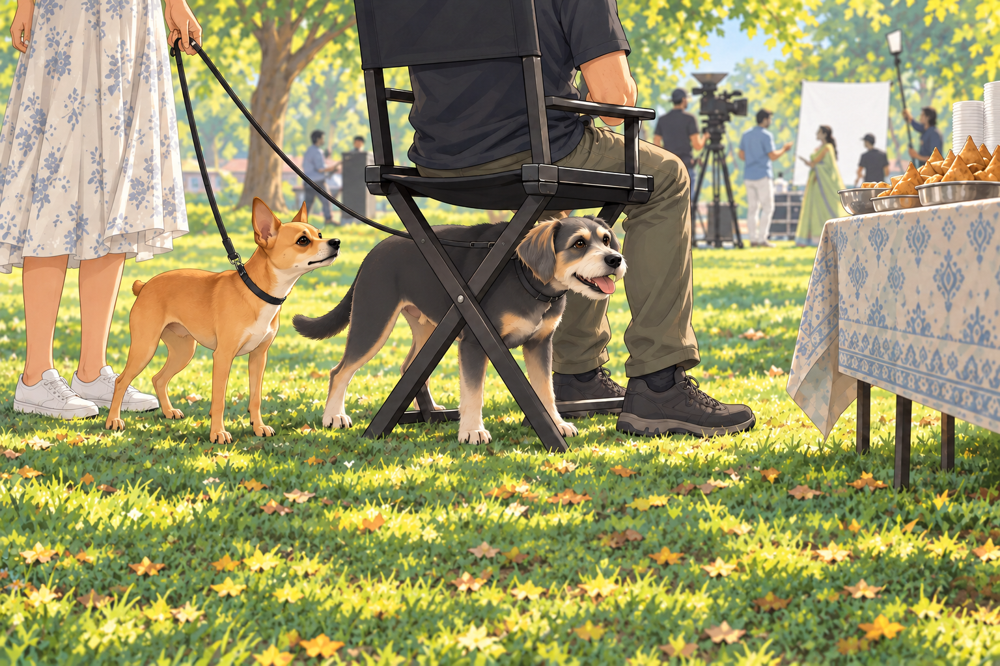
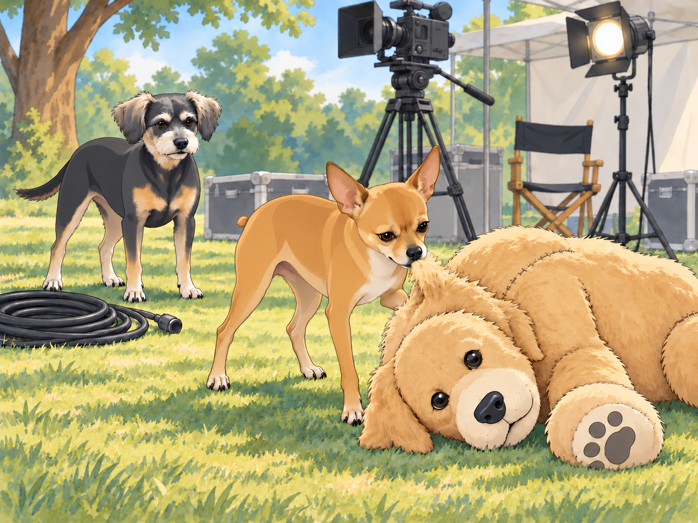
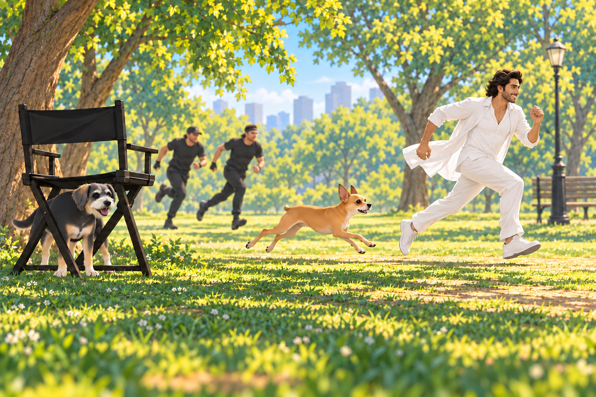

# Lights, Camera, Neet!

The neighborhood was buzzing with excitement— a film crew had arrived to shoot a scene for a big Bollywood movie. The park was transformed into a set with towering cameras, bright lights, and actors in glamorous costumes. Heather, curious about the commotion, decided to take Neet and Buddy to see the spectacle.

“Remember, you two, we’re just here to watch,” Heather said as they approached the set. “No causing trouble.”

Neet’s ears perked up, his eyes sparkling with curiosity. Buddy found a spot beside Heather where a coil of cable would not catch his feet. He could see the actors from there, and he intended to keep it.

A crew member set a folding chair directly in front of him. Buddy moved around it. The crew member moved the chair. Buddy moved again. They finally arrived at an arrangement in which the man had a chair and Buddy had his feet.

From the perimeter of the set, Neet’s nose twitched as he sniffed the air, picking up the scent of fresh samosas from the crew’s snack table. He tugged at his leash, but Heather held firm. “Not now, Neet,” she said. “Behave yourself.”

Buddy sat down beside the chair.

The scene being filmed featured a dramatic chase, with the lead actor sprinting through the park while being pursued by stunt performers. Neet watched intently, his tail wagging faster with each take. The actor ran past. Then he walked back and ran past again.

“He keeps escaping in the wrong direction,” Neet told Buddy.

“He keeps coming back,” Buddy said. “I don’t think he wants to escape.”

As the director called for another rehearsal, Neet let out an excited bark, startling the crew.

“Cut!” the director shouted, turning to glare in their direction. Heather blushed and quickly apologized. “Sorry! We’ll keep quiet.”

But Neet had other plans. As the actors reset for the next take, a prop dog was brought onto the set— a large, plush golden retriever meant to appear in the background. To Neet, however, this was no prop. It was an intruder.

The retriever did not blink.

“Very confident,” Neet muttered.

“Very washable,” said Buddy.

With a fierce growl, Neet slipped out of his collar and bolted onto the set. “Neet, no!” Heather shouted, chasing after him, but it was too late. The fiery chihuahua was already barking furiously at the stuffed dog, circling it as if preparing for battle.

The crew erupted into laughter as Neet launched himself at the plush dog, tugging at its fake fur and growling dramatically. The lead actor, struggling to stay in character, burst out laughing. “Is this part of the scene?” he asked, wiping tears from his eyes.

Heather finally reached Neet and scooped him up beside the toppled prop. “I’m so sorry!” she said, mortified. “He thought it was real.”

The director, a stout man with a thick mustache, approached them with a grin. “Your dog has quite the personality,” he said. “Maybe he’s got star potential.”

Heather blinked. “You mean…?”

She looked down at Neet. “You’ve been here five minutes. I’ve apologized twice.”

“Let’s put him in the scene,” the director said, gesturing to Neet. “A little unscripted chaos could add some charm.”

Heather glanced at the toppled retriever, then agreed. A handler came to collect Neet. The crew quickly improvised a new part of the scene: the lead actor would be chased not only by the stunt performers but also by an overzealous chihuahua. Neet, now unleashed, seemed to relish his moment in the spotlight.

When the cameras rolled, Neet gave it his all. He barked ferociously as he chased the actor through the park, his tiny legs moving like pistons. Buddy rose as the chase came toward his viewing spot. For a moment he considered joining it. Then he saw Heather waiting at the end of the marked route and stayed where he was. Someone ought to let the actor finish.

The folding chair had meanwhile become vacant. Buddy stepped into its shade and planted himself between its legs. At last, the view was entirely his.

“Cut! That was perfect!” the director said, clapping his hands. “Let’s keep it!”

The actor bent over, hands on his knees. Neet waited for him to walk back to the start. When he didn’t, Neet gave one questioning bark.

“No,” Heather said. “He’s caught enough.”

After the shoot wrapped, Neet was showered with praise from the crew. The lead actor knelt down to pet him. “You stole the show, little guy,” he said, scratching behind Neet’s ears.

Heather couldn’t help but smile as she watched Neet bask in the attention. “Well, I guess he’s a natural performer,” she said, shaking her head.

As they walked home that evening, Neet trotted proudly, his tail held high. Buddy nudged him. “You’re a movie star now,” he said with a wag of his tail. “Don’t let it go to your head.”

Neet barked in response. “This is only the beginning,” he seemed to say.

Heather laughed, looking down at her two companions. “Just promise me you’ll remember us when you’re famous,” she said.

As the stars twinkled above, the trio made their way back to the banyan tree, where Shadow and the rest of the gang were waiting. Neet hopped onto his command post and let out a triumphant bark.

“Listen up, team. Today, I became a star. Tomorrow, the world!”

The gang barked their approval. Buddy lay beneath the command post and closed his eyes.

“Start with the part where the big dog falls over,” Shadow said.

Neet drew a breath.

Buddy opened one eye. “It’s a short part. The dog was excellent at staying down.”

Neet began again from the beginning. Buddy tucked his nose between his paws. He knew this performance would have several takes.

## Refinement record

October 4, 2026: second comedy pass sharpens repeated takes, the immovable plush opponent, Buddy’s viewing-place contest and the retelling callback. Expanded artwork and independent reviews remain pending. See [comparison record](../Productions/E013-lights-camera-neet/comedy-pass-v002.json).

October 3, 2026: individually refined and compared with the complete pre-refinement text. Creative choices, preserved incidents and pending illustration stages are recorded in [the episode record](../Productions/E013-lights-camera-neet/episode.json). Original bytes remain in the external snapshot `/Users/sagar/Documents/ChatGPT/NBC_Archives/NBC-before-refinement-2026-10-03_200659.tar.gz` (member `NBC/Stories/S013-lights-camera-neet.md`). This revision establishes no owner approval.

## Provenance and editorial notes

Working selection dated October 3, 2026. Selection and shelf order are editorial; owner approval and event chronology remain unverified.

Original numbering: manuscript Chapter 14.

Archive recovery: use [Studio recovery guidance](../Studio/Recovery.md). The paths below are paths **inside the verified snapshot**, not active navigation. SHA-256 pins identify the exact sources.

- `legacy-ch14` — `02_Story_Library/Legacy_Chapters/14-lights-camera-neet.md`; SHA-256 `9dc7f5b85e6c251cabf0c66ac526a7c91eb8d2091d2581e538e86a8c56a05fda`.
- `elevenlabs-reader-52` — `90_Archive/2026-10-03-elevenlabs-recovery/Raw_Exports/reader-52.txt`; SHA-256 `dfa98410ff1813b6ff92a4f679e4253f6625f41bea112f3d7eeab96bc8025783`.
