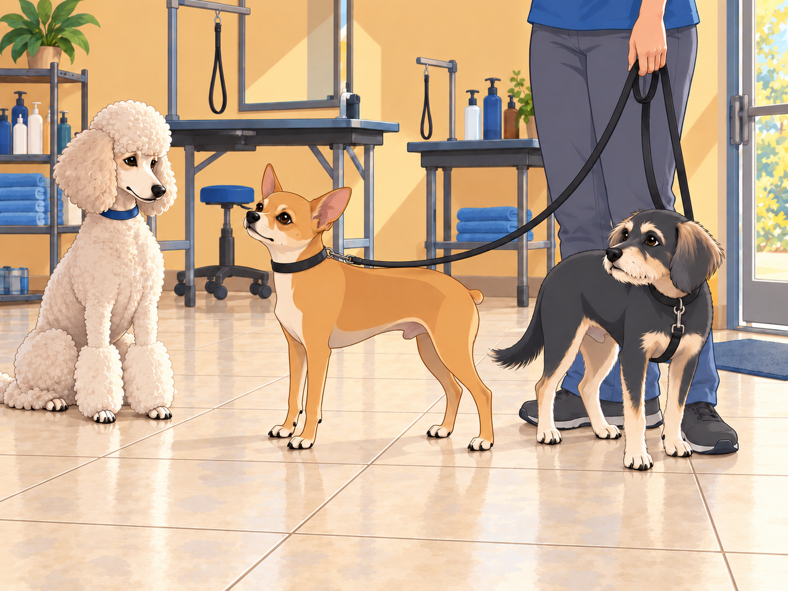
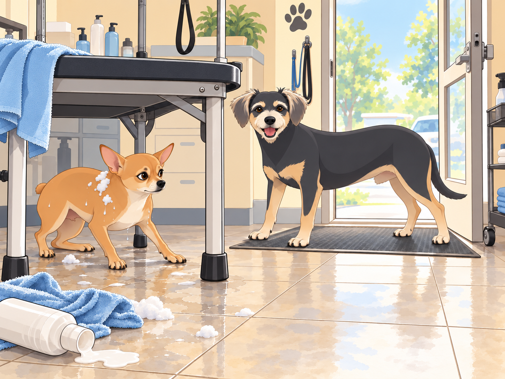
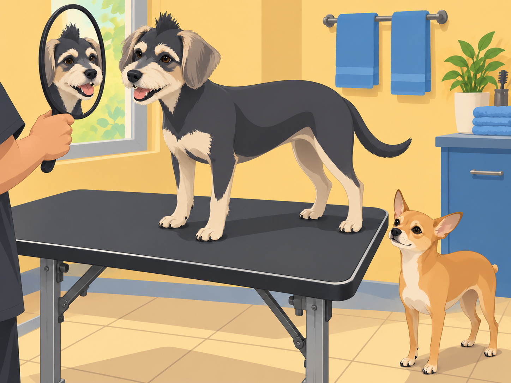

# Neet and Buddy’s Barber Battle

Heather had finally decided it was time— Neet and Buddy were due for a haircut. With summer creeping in, their fur had grown longer than ever, and the heat was making them miserable. So, with a determined grin, Heather announced, “Boys, it’s time for a makeover!”

Neet, perched on his command post— a worn-out cushion on the couch— perked up. “Makeover?” His wide eyes sparkled with excitement. He imagined himself strutting down the street, fur neatly trimmed, admired by all.

Buddy, on the other hand, went pale (as much as a dog could). His floppy ears drooped, and his tail tucked between his legs. “Haircut? No thanks, I’m good,” he seemed to say, slowly backing away.

Before they could protest (or, in Neet’s case, gloat), Heather had them leashed up and marching toward the neighborhood’s finest pet salon: The Dapper Dog Den.

## The Chaos Begins

As soon as they entered the salon, Neet gasped. There were dogs everywhere, getting primped and polished, the air thick with the scent of lavender shampoos and dog-friendly colognes. Buddy, however, clung to Heather’s leg like a terrified child.

A well-groomed poodle eyed them curiously. “First time?” she asked, fluffing her perfect fur.

Neet puffed out his chest. “This is my first official makeover,” he said grandly. “But I was born fabulous.”

Buddy checked the door. He wanted the haircut over with, preferably before anyone started discussing his own fabulousness.

“Can you make me look finished?” he asked.

Neet turned his good side toward the poodle. Then, unwilling to waste the other one, turned again.

## Neet’s Supreme Confidence… Gone Wrong

The groomer, a cheerful man named Raj, greeted them warmly. “Who’s first?”

Neet immediately leapt onto the grooming table. “Let’s do this!” he barked, tail wagging with excitement.

Raj chuckled and got to work. First, the shampoo— Neet loved it. “Yes, yes, work the lather!” he sighed dramatically, enjoying the luxurious foam.

Heather folded her arms. “So this is the same dog who won’t put one paw in a puddle.”

Then came the trim.

Neet’s confidence lasted until Raj turned on the electric clippers.

Bzzzzzzzzzzzz!

Neet’s ears shot up. His eyes widened. “WHAT IN THE NAME OF TREATS IS THAT?” he yelped.

He twisted, leaped, and bolted— mid-trim. Suddenly, Neet was a blur of wet fur, shampoo suds flying everywhere as he ran across the salon. He knocked over a bottle of conditioner, skidded across the tile floor, and barely dodged a blow dryer in his escape.

Heather and Raj scrambled to catch him. “Neet, stop!” Heather yelled, ducking as a towel went flying.

“NEVER!” Neet barked, dodging a hairbrush.

The poodle lifted one freshly finished paw out of his path and held it there.

Neet leaped over an unsuspecting dachshund and dived under a grooming station. Buddy moved to the exit and planted himself across it. The sooner Neet stopped running, the sooner they could both go home.

“Move,” Neet whispered.

Buddy glanced at the table. “If I let you out, we have to come back.”

Neet looked at the door. Then at Raj. He had not considered a second appointment.

Neet huffed, giving his best you win this round glare before letting Raj finish the trim.

## Buddy’s Turn: The Unexpected Betrayal

With Neet now sporting an (accidentally) stylish asymmetrical cut, it was Buddy’s turn.

Raj gently lifted Buddy onto the table. Buddy held his paws close together. “It’s okay, Buddy,” Heather reassured him.

Buddy whimpered. But as soon as the warm water hit his fur, he relaxed. “Huh,” he thought, “this isn’t so bad.”

Then came the clippers.

The instant the buzzing started, Buddy went full statue-mode. He didn’t move, didn’t breathe, just stood there, eyes wide in absolute terror.

Raj laughed. “Well, this is a first.”

Heather retrieved the towel from the floor. “I like this technique.”

Neet, now dry and observing, grinned. “Hey Buddy, you okay there, pal? You look like you saw a ghost.”

Buddy whimpered.

“Blink if you need help,” Neet said.

Buddy blinked.

Neet glanced toward the clippers. “Moral help.”

Neet eyed the strip of hair Raj had left along Buddy’s head. “A mohawk,” he said. “Keep that.”

Raj held up the mirror to Heather. “What do you think?”

She hesitated, then laughed. “It rather suits him.”

Buddy stayed very still while Raj finished the sides. He had endured the clippers; he wanted to see what he had earned.

When he finally looked in the mirror, Buddy blinked. Then his tail wagged. “I look tough.”

Neet examined him from both sides. “You do look tough.” He glanced at his own uneven trim in the mirror. “Mine is more subtle.”

## The Grand Reveal

When they returned home, the entire neighborhood turned to stare.

Neet, with his slightly uneven but undeniably stylish trim, strutted like a runway model. Buddy, rocking his unexpected mohawk, walked with newfound confidence.

Heather sighed, shaking her head. “Well, at least no one can say you two aren’t memorable.”

As they paraded through the streets, a group of dogs from Neet’s gang barked in approval.

Shadow whistled. “Lookin’ sharp, boss.”

Neet grinned. “Always.”

And Buddy? He just smiled, his mohawk catching the wind, as he realized he kinda liked being a little wild for once.

Buddy slowed beside a shop window for one more look.

Neet waited. For once, he was the one ready to go home.

“Finished?” he asked.

Buddy turned his good side toward the glass. Then tried the other one.

## Refinement record

October 4, 2026: second comedy pass sharpens the rival salon priorities, the second-appointment surrender and Buddy’s earned vanity callback. See [comparison record](../Productions/E014-neet-and-buddys-barber-battle/comedy-pass-v002.json). New artwork remains proposed pending independent visual and complete-reading reviews.

October 3, 2026: individually refined and compared with the complete pre-refinement text. Creative choices, preserved incidents and pending illustration stages are recorded in [the episode record](../Productions/E014-neet-and-buddys-barber-battle/episode.json). Original bytes remain in the external snapshot `/Users/sagar/Documents/ChatGPT/NBC_Archives/NBC-before-refinement-2026-10-03_200659.tar.gz` (member `NBC/Stories/S014-neet-and-buddys-barber-battle.md`). This revision establishes no owner approval.

## Provenance and editorial notes

Working selection dated October 3, 2026. Selection and shelf order are editorial; owner approval and event chronology remain unverified.

Original numbering: manuscript Chapter 15.

- The long-fur haircut premise conflicts with Neet’s photographed short smooth coat; preserved as draft prose, not anatomy guidance.

Archive recovery: use [Studio recovery guidance](../Studio/Recovery.md). The paths below are paths **inside the verified snapshot**, not active navigation. SHA-256 pins identify the exact sources.

- `legacy-ch15` — `02_Story_Library/Legacy_Chapters/15-neet-and-buddy-s-barber-battle.md`; SHA-256 `8f2ca230ae09346687d3d21833487612979ff3586b31ddb1dc9300bfcfcb502d`.
