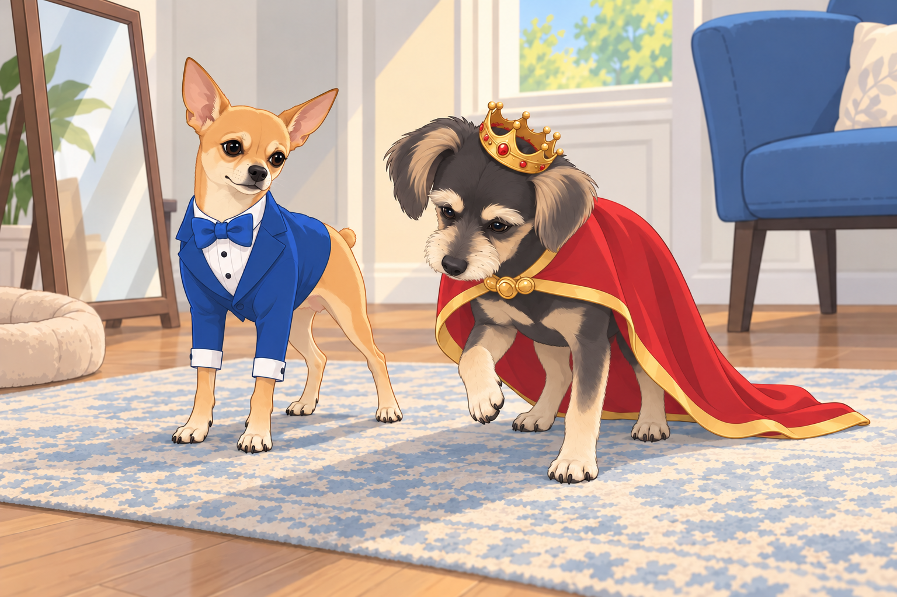
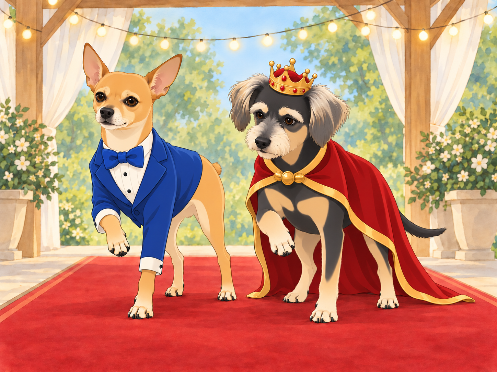
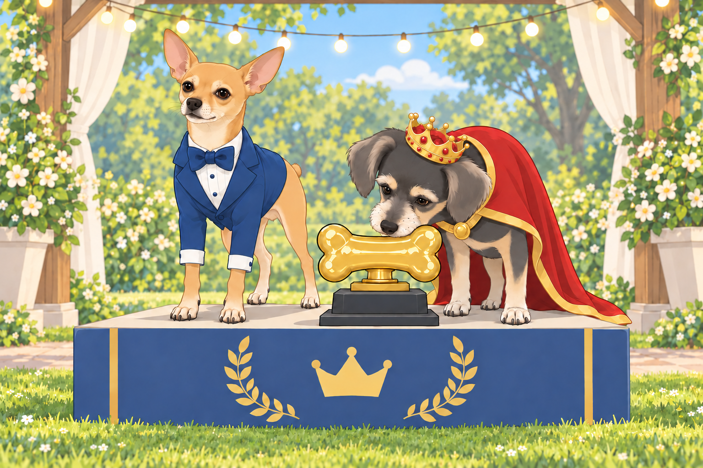

# The Dazzling Dog Fashion Show

The neighborhood had never seen such excitement— the annual Dazzling Dog Fashion Show was about to begin! Flyers had been posted everywhere, announcing a grand evening where the most stylish pooches would strut their paws down a glittering runway.

Heather grinned as she fastened Neet’s custom-made outfit— a tiny, royal blue tuxedo with a matching satin bow tie. “Neet, you were born for this,” she declared, adjusting the fabric so his Dorito-shaped ears remained on full display.

Neet looked at himself in the mirror and smirked. “Obviously.” He posed, one paw slightly lifted, oozing confidence.

Buddy sat stiffly in a gold-trimmed cape, testing whether he could turn around without stepping on it. The matching crown slid over one brow. “Do I have to wear this?” he whined, shaking his head slightly so the crown wobbled.

Heather ruffled his ears. “You look like a king, Buddy. Own it.”

Buddy stood and took one careful step. The cape stayed where it belonged. He tried another.

“Excellent,” Neet said. “Now look effortless.”

“I’m counting.”

Heather straightened the crown. “There. Now you can see what you’re ruling.”

As they arrived at the venue— a lavishly decorated park pavilion with fairy lights and a plush red carpet— Neet took in the competition. The place was packed with fashionable canines, each more extravagant than the last.

## The Competitors Take the Stage

First up was Lady Puddington, a regal Afghan Hound with flowing golden locks. She wore an elegant pearl necklace and a soft pink silk robe that trailed behind her like a royal gown. As she glided down the runway, the crowd gasped in admiration.

Neet rolled his eyes. “Too predictable,” he muttered.

He moved half a step forward for a better look.

Next, a French Bulldog named Pierre made his entrance, rocking a tiny leather jacket, stylish sunglasses, and a beret tilted at just the right angle. He gave a smug look before striking a dramatic pose.

Buddy tilted his head. “He looks like he belongs in a café in Paris.”

Then came Bruno the Bulldog, a stocky fellow in a shimmering gold tracksuit and diamond-studded collar. He gave the audience a slow, deliberate wink before strutting off-stage.

“Respect,” Neet said, nodding in approval.

A Pomeranian named Trixie twirled onto the runway in a dazzling tutu made of rainbow-colored tulle. She spun on her tiny paws, glitter trailing behind her like fairy dust.

“She’s got flair,” Buddy admitted.

The crowd roared when Maximus, a massive Great Dane, made his appearance in a black cape with silver embroidery. His owner had styled his fur into sleek waves, making him look like a medieval knight on a grand quest.

“I wouldn’t mess with that guy,” Neet muttered under his breath.

Buddy watched the Great Dane turn without treading on his cape. At last, something useful. He tried the same wide turn behind the curtain.

Neet glanced over. “Are you rehearsing?”

“No. I’m arranging my feet.”

## Neet and Buddy’s Grand Entrance

Finally, it was their turn.

Neet strutted onto the stage with his signature confidence, his tiny tuxedo gleaming under the spotlights. He stopped at the center, turned to the audience, and struck a pose— one paw raised, tail curled dramatically, his eyes practically sparkling. The audience ate it up.

Then it was Buddy’s turn. He chose a slow walk so the cape would stay behind his feet. Halfway along, he realized the crowd was watching quietly. He lifted his head. The crown stayed put.

Neet, sensing an opportunity, ran up beside Buddy and whispered, “Lift your paw slightly— trust me.”

Buddy shifted his weight before lifting a paw. Neet held his pose beside him. The applause began while Buddy was still deciding what to do with the paw, so he left it there.

A judge, an elderly woman in a sequined blazer, nodded approvingly. “Magnificent,” she whispered.

“Can I put it down now?” Buddy murmured.

“Not while they’re clapping.”

Buddy looked at the audience. Several people began clapping harder.

Heather lowered her camera. “You can put your foot down, darling.”

Buddy did. Neet waited a fraction longer.

## The Results

After all the contestants had walked, the judges deliberated. The crowd held its breath as the host took the stage, microphone in hand.

“The winner of this year’s Dazzling Dog Fashion Show is… Neet and Buddy!”

The crowd erupted in cheers! Neet gave an exaggerated bow, while Buddy’s tail wagged furiously as Heather lifted him onto the winner’s podium. A giant golden bone trophy was placed in front of them, and photographers snapped away.

Buddy leaned toward the golden bone and sniffed. Nothing. He tried the other end. Still nothing.

Neet whispered to Buddy, “See? Told you we’d steal the show.”

Buddy chuckled. “Okay, okay, you were right.” He looked back at the trophy. “They’ve made a bone you can’t eat.”

Heather caught his hopeful glance and opened the treat pouch. Both fashion icons immediately forgot the photographers.

As they left the event, Neet strutted confidently while Buddy beamed with pride. Heather grinned, ruffling both their heads. “Who knew you two would become fashion icons?”

Neet smirked. “This is only the beginning.”

Heather carried the trophy home. Buddy carried his crown until the pavement became interesting, then let her carry that too. Neet kept the bow tie on.

## Refinement record

October 4, 2026: second comedy pass gives Buddy a practical cape rehearsal, builds the held-paw applause trap and adds the inedible-trophy reversal. See [comparison record](../Productions/E015-the-dazzling-dog-fashion-show/comedy-pass-v002.json). Expanded artwork awaits independent visual and complete-reading reviews.

October 3, 2026: individually refined and compared with the complete pre-refinement text. Creative choices, preserved incidents and pending illustration stages are recorded in [the episode record](../Productions/E015-the-dazzling-dog-fashion-show/episode.json). Original bytes remain in the external snapshot `/Users/sagar/Documents/ChatGPT/NBC_Archives/NBC-before-refinement-2026-10-03_200659.tar.gz` (member `NBC/Stories/S015-the-dazzling-dog-fashion-show.md`). This revision establishes no owner approval.

## Provenance and editorial notes

Working selection dated October 3, 2026. Selection and shelf order are editorial; owner approval and event chronology remain unverified.

Original numbering: manuscript Chapter 16.

Archive recovery: use [Studio recovery guidance](../Studio/Recovery.md). The paths below are paths **inside the verified snapshot**, not active navigation. SHA-256 pins identify the exact sources.

- `legacy-ch16` — `02_Story_Library/Legacy_Chapters/16-the-dazzling-dog-fashion-show.md`; SHA-256 `45059bff35a50ffe91ec9aaa4bcd24e9450cf5b3639a1f4d716cbc2adb695b77`.
