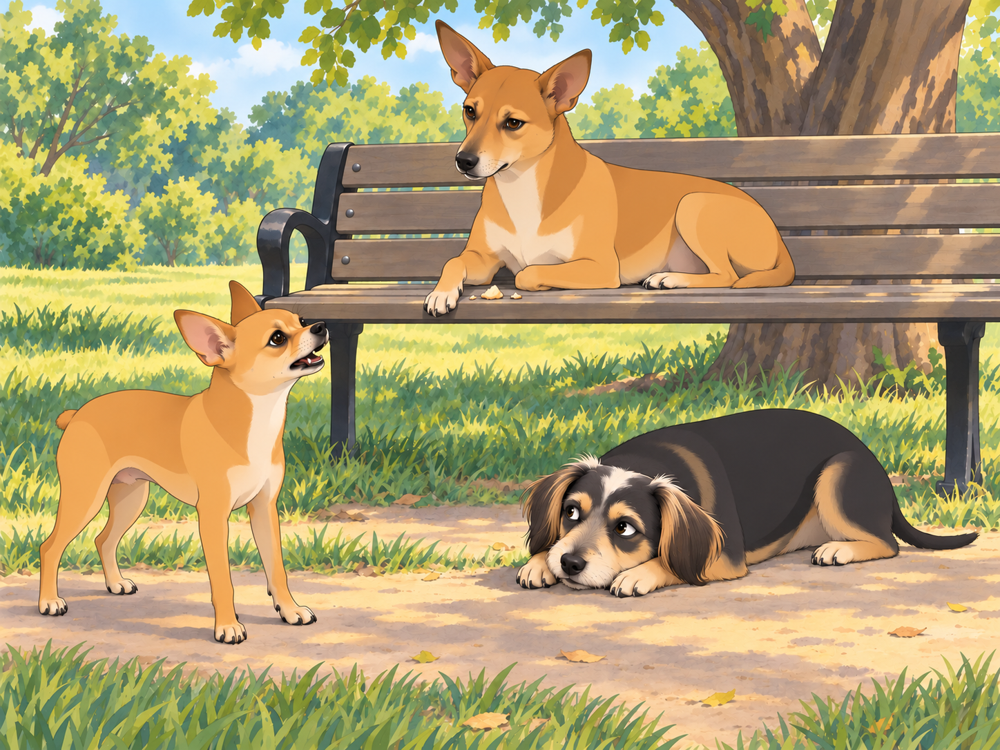
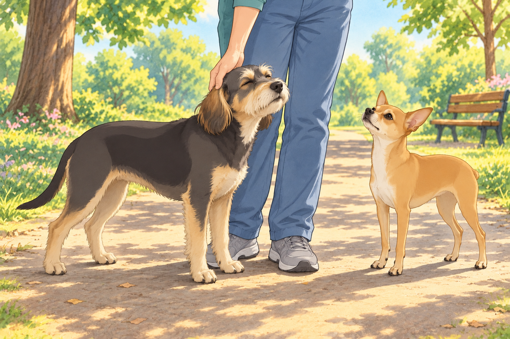

# Neet and Buddy Learn Gujarati

The excitement of winning the Dazzling Dog Fashion Show had barely faded when Heather had another idea.

“Boys, it’s time to learn some Gujarati!” she announced one morning.

Neet tilted his head. “What now?” he barked, giving Buddy a sideways glance.

Buddy, who had just finished a deep stretch, yawned. “Sounds difficult. Can we not?”

But Heather had already signed them up for a special “Gujarati for Dogs” session at the park, hosted by none other than Chirag, a street-smart pariah dog who had mastered several languages, mostly in his pursuit of food.

## The First Lesson: Confusion Begins

When they arrived at the class, several neighborhood dogs were already gathered around Chirag, who was lazily sprawled on a bench, licking the last bits of a samosa off his paw.

“Alright, students,” Chirag said with a dignified air. “Gujarati is a beautiful language. Let’s start with the basics. First phrase—‘Kem cho?’ It means ‘How are you?’ Now, repeat after me.”

The group obediently tried. Neet watched the paw that had held the samosa. This teacher clearly knew how to get results.

“Kem cheeese?” Neet barked.

Chirag squinted at him. “No, no. It’s ‘Kem cho.’ Try again.”

“Kimchi?” Neet tried, wagging his tail proudly.

Buddy snorted. “Neet, that’s fermented cabbage.” He tried the greeting himself, slowly. “Kem cho?” He wanted to get one phrase right before lunch entered the discussion.

Chirag put his freshly licked paw down. “Let’s move on before my brain melts.”

## The Food-Driven Motivation

“Now, a very important phrase,” Chirag continued. “If you ever want to ask for food, say ‘Mane khorak joie chhe.’ It means ‘I want food.’ Try it.”

Neet’s ears perked up. He took one careful step nearer the bench. At last, the advanced material.

“Mango ko rock joy chair!” he yelped enthusiastically.

The other dogs burst out laughing.

“Did you just ask for a mango to sit on a chair?” Buddy asked, wiping away tears of laughter.

Neet frowned. “I don’t know, but I want food, and this language is too complicated.”

Chirag sighed. “Alright, let’s move on to something simple—‘Bahu saras!’ It means ‘Very nice!’”

Neet took a deep breath. “Babu Sharif!”

Chirag shook his head. “Who is Babu Sharif? Are you inventing people now?”

Buddy lowered his head between his paws until he could trust himself to speak. “Try it without imagining the menu.”

## A Surprise Test

To test their knowledge, Chirag staged a mock conversation. “I will pretend to be a human. Neet, you respond in Gujarati.”

Chirag cleared his throat. “Kem cho?”

Neet wagged his tail. “Cheese toast!”

Buddy stood for his turn, planted his paws, and looked directly at Chirag. Unfortunately, the crumbs were directly below Chirag.

“Chee—” Buddy stopped. Neet’s ears rose.

Buddy shut his eyes for a moment, then tried again. He managed the greeting, and Chirag gave a grateful nod.

Neet leaned toward him. “You were going to say it.”

“I recovered.”

Chirag turned back to Neet. “And you can practice the greeting again tomorrow.”

By the end of the lesson, Buddy could manage the greeting. Neet could make the entire class hungry.

As they walked home, Heather looked down at them. “So, what did you learn today?”

Neet puffed out his chest. “Cheese toast!”

Buddy shook his head, laughing. “We have a lot of work to do.”

Heather sighed but couldn’t help smiling. “Well, at least you tried.” She stopped to scratch behind Buddy’s ears. He leaned into her hand; one usable greeting and a scratch seemed a respectable morning’s work.

Neet tried the food phrase once more on the way home. Buddy listened carefully. He had heard a mango in there again.

“Smaller mango,” Neet said before Buddy could speak. “I’m improving.”

## Refinement record

October 4, 2026: second comedy pass preserves every food-word mistake, builds the samosa-crumb distraction into Buddy’s near-slip, and gives Neet a determined final callback. [Comparison and source pins](../Productions/E016-neet-and-buddy-learn-gujarati/comedy-pass-v002.json). Expanded illustrations await independent reviews.

October 3, 2026: individually refined and compared with the complete pre-refinement text. Creative choices, preserved incidents and pending illustration stages are recorded in [the episode record](../Productions/E016-neet-and-buddy-learn-gujarati/episode.json). Original bytes remain in the external snapshot `/Users/sagar/Documents/ChatGPT/NBC_Archives/NBC-before-refinement-2026-10-03_200659.tar.gz` (member `NBC/Stories/S016-neet-and-buddy-learn-gujarati.md`). This revision establishes no owner approval.

## Provenance and editorial notes

Working selection dated October 3, 2026. Selection and shelf order are editorial; owner approval and event chronology remain unverified.

Original numbering: manuscript Chapter 17.

Archive recovery: use [Studio recovery guidance](../Studio/Recovery.md). The paths below are paths **inside the verified snapshot**, not active navigation. SHA-256 pins identify the exact sources.

- `legacy-ch17` — `02_Story_Library/Legacy_Chapters/17-neet-and-buddy-learn-gujarati.md`; SHA-256 `c53115db8952b42effb34fcca033f70c8e29799a6673cd08d17dd6db83a292db`.
