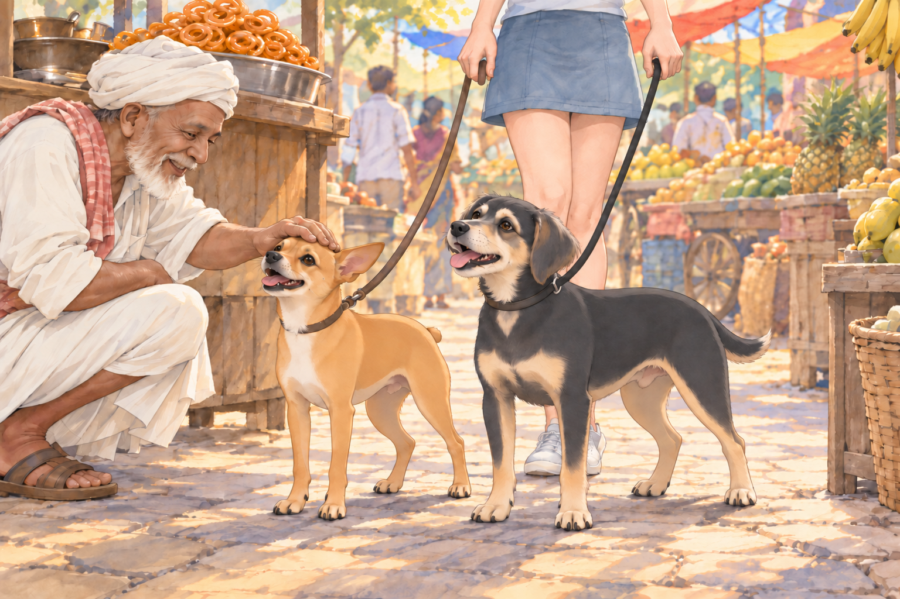
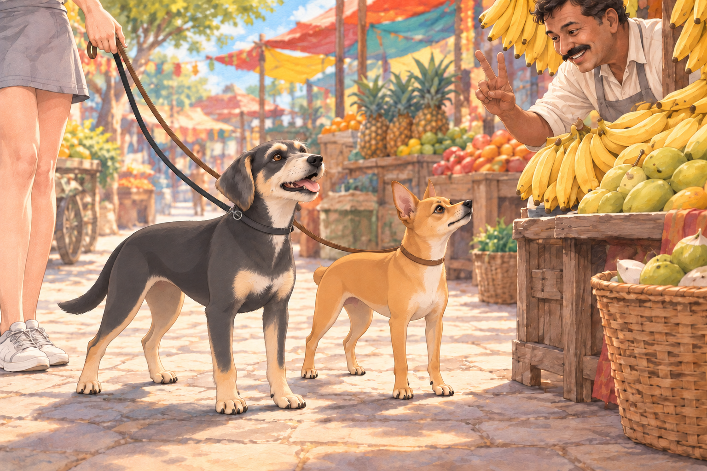
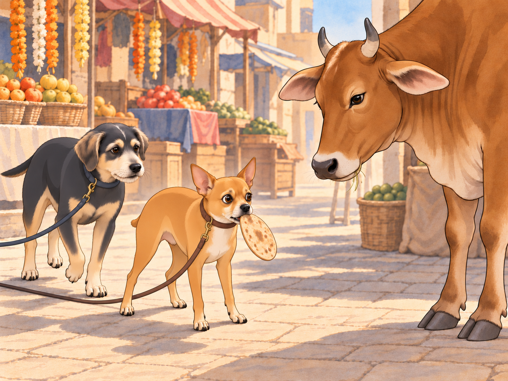

# Bazaar Madness - A Practical Gujarati Lesson

After Neet and Buddy’s “successful” Gujarati lesson, Chirag decided it was time to take things up a notch. “Alright, class,” he announced one morning, perched on a wall in the park, tail swishing confidently. “Today, we’re taking a field trip.”

Neet’s ears perked up. “Field trip?” he barked. “Like an adventure?”

Chirag nodded. “We’re going to the bazaar.”

Buddy gulped. “That place is chaos.” He wanted to ask one sensible question, understand the answer, and leave with everybody he had arrived with. Already this sounded ambitious.

Chirag grinned. “Exactly. And the best way to learn a language is to dive right in. If you can survive the bazaar, you can survive anywhere.”

Heather, who had agreed to supervise, clipped their leashes on. “Alright, boys, let’s go practice some Gujarati in the wild.”

## Welcome to the Jungle

As soon as they arrived at the bustling bazaar, Neet’s senses went into overdrive. The air was thick with the scent of sizzling samosas, fresh coriander, and spices so strong they made Buddy sneeze. Vendors shouted over one another, bargaining furiously.

Chirag turned to his students. “Lesson one: If you want to buy something, you say, ‘Ketla paisa?’— which means ‘How much?’”

Neet nodded. “Got it. Ketla paisa. Easy.”

Chirag smirked. “Go ahead, try it.”

Neet, seeing an elderly vendor frying jalebis, puffed out his chest and strutted forward. “Cheeseburger paisa?” he barked.

The vendor blinked. “Soo?”

Buddy snorted. “Neet, that’s not even close.”

The vendor, laughing, reached down and patted Neet’s head. “Aa kutro to majedar che!” (This dog is hilarious!)

Neet turned to Chirag. “See? They love me.”

Chirag facepawed. “Let’s try again.”

Neet held his head beneath the vendor’s hand for one last pat. “Same question?”

“Different words.”

## Bargaining Gone Wrong

As they moved deeper into the bazaar, Chirag decided it was time for them to try bargaining. “Lesson two: If something is too expensive, you say, ‘Bahuj mahengoo chhe!’— which means ‘That’s too expensive!’”

Neet grinned. “I love haggling.” He marched up to a fruit vendor selling bananas and confidently barked, “Bahuj mango chhe!”

The fruit seller raised an eyebrow. “Tamne aamli joiye che?” (You want tamarind?)

Neet turned to Chirag. “What did I say?”

Chirag sighed. “You just yelled ‘very mango’ at him.”

Buddy laughed, then tried the price question himself. The vendor held up two fingers. It was the first answer all morning that had involved an actual price.

Buddy looked at Chirag. Chirag nodded. Buddy stood a little straighter. No fruit had been insulted.

The vendor, clearly amused, tossed Neet a banana. “Aa lo, king of mangoes.”

Neet happily chomped on it. “I think I’m getting the hang of this.”

Buddy looked from his correct answer to Neet’s banana.

“I got the price,” he said.

Neet finished chewing. “I got the banana.”

Heather peeled back the rest of the skin before Neet could include it in his victory. “Your tutor deserves a raise.” Chirag looked hopeful until she added, “Or a lie-down.”

## The Chase

Everything was going well— until Neet spotted a giant heap of freshly baked chapatis cooling on a cart. His stomach rumbled. “Chirag, what’s the word for ‘I want that’?”

Chirag, distracted by a vendor calling him cute, absentmindedly replied, “Mane joie chhe.”

Neet nodded and marched up to the chapati stall. But instead of politely asking, he lunged forward, barking, “Mane JOIE CHHEEEE!” and grabbed a chapati off the pile.

The vendor shrieked. “CHOR KUTRO!” (THIEF DOG!)

The entire bazaar turned to look as Neet, chapati flapping from his mouth, bolted. His leash pulled free of Heather’s startled hand. “Neet, no!”

Buddy ran after him, barking for him to stop. He wanted to bring Neet back before the lesson became a search party. Chirag groaned, “I knew this would happen.”

“Then teach him STOP!” Buddy called back.

The chase was on. Vendors waved rolling pins, customers clutched their groceries, and Heather struggled to keep up. “I should’ve never let you learn words!” she wailed as she ran.

Finally, Neet skidded to a halt— right in front of a towering cow chewing cud lazily in the middle of the road. The cow stared at Neet. Neet stared at the cow. The chapati slowly slid from his mouth.

The cow took another slow chew. Buddy stopped behind Neet and waited. For once, he had no improvements to suggest.

The cow snorted.

Neet, humbled by the encounter, dropped the chapati and backed away.

Chirag trotted up, panting. “Lesson three: Never challenge a cow.”

## Wrapping Up

Heather caught up at the cow, apologized to the vendor and paid for the stolen chapati along with a fresh stack. The group sat on a bench to catch their breath.

Chirag shook his head. “You two have a long way to go.”

Neet, still catching his breath, wagged his tail. “I think I did great.”

Buddy stretched his forelegs under the bench. “I asked a price. You started a procession.”

“Very popular,” Neet said.

Heather checked both leash loops around her wrist. “We noticed.”

Heather sighed. “Maybe next time, we’ll just practice at home.”

Buddy stayed beside Heather until the chapatis were safely in her bag. Neet watched the cow move off. It had ended the lesson without learning a single word.

“Perhaps she could teach tomorrow,” Buddy said.

Neet tucked himself closer to Heather. “I prefer our current staff.”

## Refinement record

October 4, 2026: expanded comedy pass preserves the food-word mistakes and cow reversal, strengthens Buddy’s successful price inquiry and its unfair banana consequence, clarifies the dropped leash, and adds the teacher callback. See [comparison record](../Productions/E017-bazaar-madness-a-practical-gujarati-lesson/comedy-pass-v002.json). Proposed illustrations await independent review.

October 3, 2026: individually refined and compared with the complete pre-refinement text. Creative choices, preserved incidents and pending illustration stages are recorded in [the episode record](../Productions/E017-bazaar-madness-a-practical-gujarati-lesson/episode.json). Original bytes remain in the external snapshot `/Users/sagar/Documents/ChatGPT/NBC_Archives/NBC-before-refinement-2026-10-03_200659.tar.gz` (member `NBC/Stories/S017-bazaar-madness-a-practical-gujarati-lesson.md`). This revision establishes no owner approval.

## Provenance and editorial notes

Working selection dated October 3, 2026. Selection and shelf order are editorial; owner approval and event chronology remain unverified.

Original numbering: manuscript Chapter 18.

Archive recovery: use [Studio recovery guidance](../Studio/Recovery.md). The paths below are paths **inside the verified snapshot**, not active navigation. SHA-256 pins identify the exact sources.

- `legacy-ch18` — `02_Story_Library/Legacy_Chapters/18-bazaar-madness-a-practical-gujarati-lesson.md`; SHA-256 `bdf3b5a360d3ac687427257df7c119499e9452e1e262419a89a7764b463c191d`.
