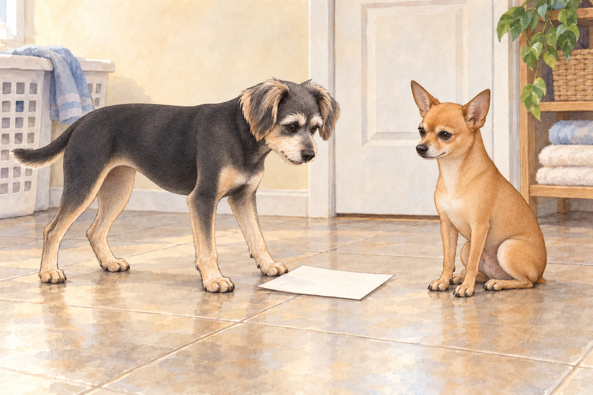
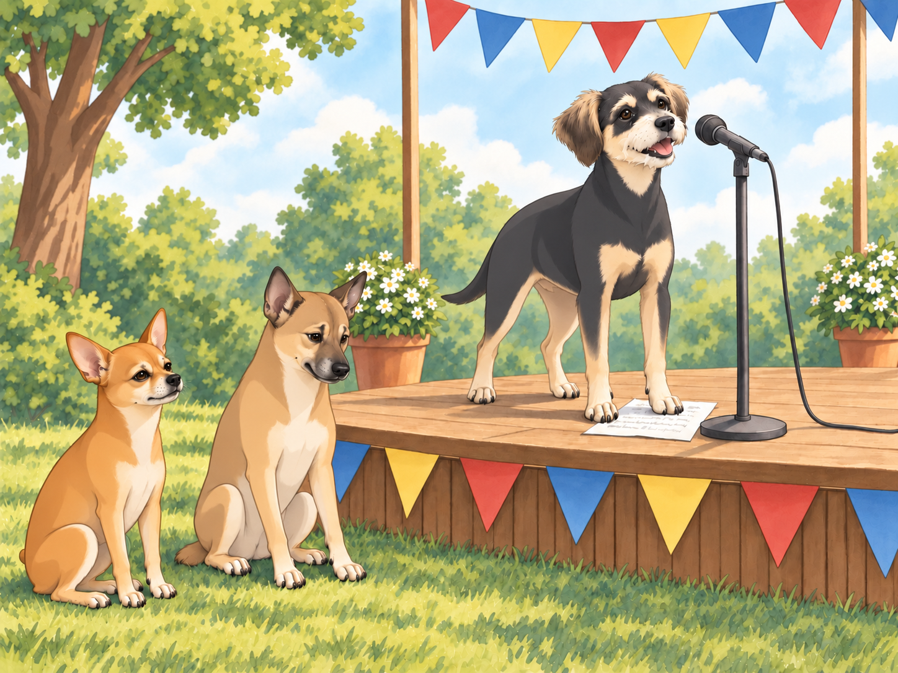
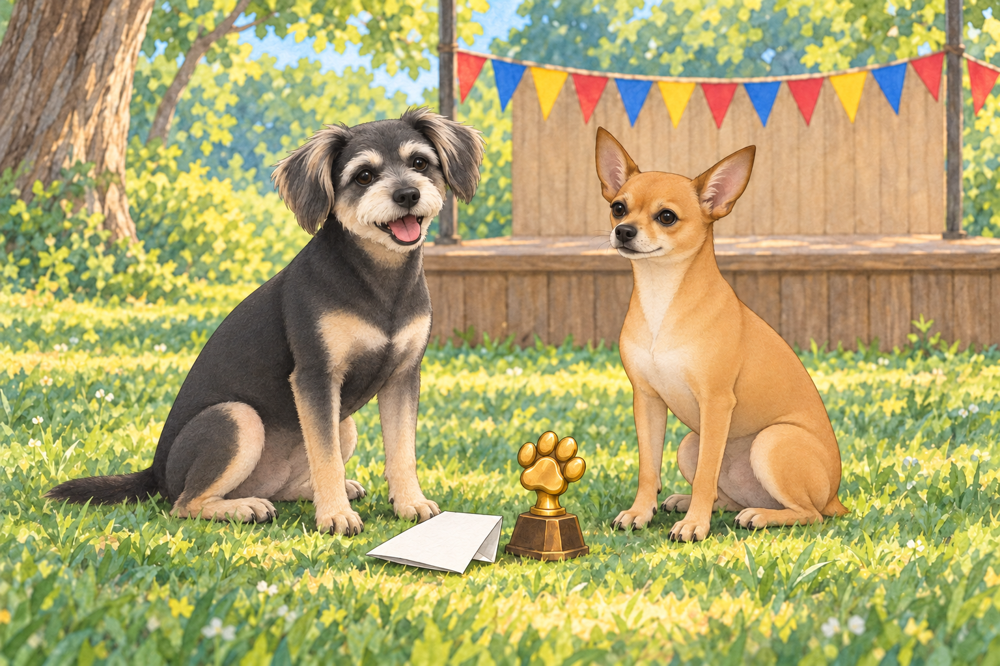

# Buddy’s Big Elocution Debacle

After the wild bazaar adventure, Chirag had another brilliant idea.

“Buddy, you’ve come a long way in learning Gujarati,” he said, wagging his tail. “It’s time to put those skills to the test.”

Buddy’s ears perked up, though his stomach twisted in nervous anticipation. “What kind of test?” he asked, suspiciously.

Chirag grinned. “An elocution competition.”

Buddy blinked. “A what now?”

“Public speaking.”

“Could I start with private speaking? To someone asleep?”

Heather clapped excitedly. “Oh, this is perfect! The annual Gujarati Elocution Championship for Neighborhood Pets is happening this weekend. It’ll be a great chance for you to show off your skills!”

Neet snickered from his command post (a particularly regal-looking pile of laundry). “Oh, this is going to be amazing.”

Buddy looked away from Neet. He had laughed through enough of his brother’s mistakes. He wanted to find out whether he could do better when it was his turn.

## The Preparation

The next few days were a blur of preparation. Chirag insisted on rigorous practice, drilling Buddy with common phrases and refining his pronunciation.

“Say, ‘Aaje tapman ochhu chhe.’” (Today the temperature is low.)

Buddy cleared his throat. “Aaaahje top man ochu chhe.”

Chirag sighed. “No, no, tap-man, not top man. You’re not discussing superhero rankings.”

“I’d watch a movie called Top Man Ochu Chhe,” Neet said. Buddy waited for him to finish, then tried the phrase again.

Neet opened his mouth to offer another review. Buddy calmly turned his practice page around so its blank back faced him.

“The audience,” Buddy said, “is having a silent rehearsal.”

Neet sat taller. He could be magnificent at silence. For nearly four seconds, he was.

Despite the struggles, Buddy gave it his best. By the time competition day arrived, he had memorized a short but solid speech about Gujarati food and its cultural significance.

He was ready. Well… mostly.

## The Elocution Championship

The event was set in a small park, complete with a raised platform, colorful banners, and a microphone that stood just a little too tall for Buddy.

Neet and Chirag sat in the front row, wagging their tails expectantly. Heather patted Buddy’s back. “You got this!”

The competition began with a parrot named Mithu reciting a flawless Gujarati poem about mangoes. The audience oohed and aahed at his diction. Buddy quietly crossed mangoes off the list of subjects he hoped nobody else would mention.

Next, a Persian cat named Rani delivered a dramatic monologue on the beauty of the Gujarati monsoon, complete with exaggerated paw gestures.

Rani left the stage at the speed of someone expecting an encore.

Then it was Buddy’s turn. Nobody had lowered the microphone for courage.

## The Speech (Disaster)

Buddy climbed onto the podium, adjusted the microphone, and took a deep breath.

“Namaste, mara mitro!” (Hello, my friends!)

The audience clapped encouragingly.

Buddy smiled nervously and continued. “Gujarati khorak… tamaru swagat kare chhe.” (Gujarati food… welcomes you?)

Chirag smacked his forehead.

Buddy swallowed and tried again. “Dhokla… ek saro… motor cycle chhe.” (Dhokla is a good… motorcycle?)

Neet had to bite his paw to keep from howling in laughter.

The audience exchanged puzzled looks, but Buddy bravely pushed forward.

“Sev tamari saathe… prem kare chhe.” (Sev loves you.)

Chirag groaned. “Oh no.”

Buddy looked down at his page. He knew all these words. They had simply stopped standing next to the right neighbors.

Neet was in tears.

Realizing he was losing control, Buddy blurted out the first thing that came to mind.

“Mango ras bahu shakti shali chhe!” (Mango juice is very powerful!)

That, for some reason, got a huge round of applause.

A few people laughed, but they kept applauding. Buddy looked at the page he could no longer follow. He could stop there, or finish. He raised his head.

Buddy, now extremely confused, wagged his tail and gave a polite bow. “Uh… Jai Gujarat?”

## The Aftermath

Backstage, Neet tried to repeat “motorcycle dhokla” and had to stop laughing long enough to breathe. Buddy waited, holding the edge of his speech beneath one paw.

Chirag shook his head. “That was… something.”

Buddy sighed, tail drooping. “I completely butchered it.”

Heather, wiping away tears of laughter, hugged him. “You were amazing! I mean, I have no idea what you said, but you owned that stage.”

To Buddy’s astonishment, the judges awarded him the ‘Most Enthusiastic Speaker’ prize!

As he proudly accepted his small golden paw-shaped trophy, Neet leaned over and whispered, “So, should we start working on your speech for next year?”

Buddy groaned. “Absolutely not.”

Neet studied the trophy. “What did you say to win that?”

“For once,” Buddy said, “you were listening. You tell me.”

Neet opened his mouth. Closed it.

Heather lowered a congratulatory hand onto Buddy’s head. “There. Two prizes.”

He set the little trophy beside his folded speech. The words had gone astray, but he had stayed at the microphone until the end.

Neet sat beside him without offering a single suggestion. Buddy left the trophy where they could both see it.

## Refinement record

October 4, 2026: second comedy pass adds the silent-rehearsal reversal, nervous competitor reactions, and a quiet trophy callback. Three contextual illustrations are proposed for independent visual and complete-reading review; no owner approval is implied. See [expanded comedy record](../Productions/E018-buddys-big-elocution-debacle/comedy-pass-v002.json).

October 3, 2026: individually refined and compared with the complete pre-refinement text. Creative choices, preserved incidents and pending illustration stages are recorded in [the episode record](../Productions/E018-buddys-big-elocution-debacle/episode.json). Original bytes remain in the external snapshot `/Users/sagar/Documents/ChatGPT/NBC_Archives/NBC-before-refinement-2026-10-03_200659.tar.gz` (member `NBC/Stories/S018-buddys-big-elocution-debacle.md`). This revision establishes no owner approval.

## Provenance and editorial notes

Working selection dated October 3, 2026. Selection and shelf order are editorial; owner approval and event chronology remain unverified.

Original numbering: manuscript Chapter 19.

Archive recovery: use [Studio recovery guidance](../Studio/Recovery.md). The paths below are paths **inside the verified snapshot**, not active navigation. SHA-256 pins identify the exact sources.

- `legacy-ch19` — `02_Story_Library/Legacy_Chapters/19-buddy-s-big-elocution-debacle.md`; SHA-256 `aac995cb25faa63b5dedeccc58ddfae1612553d88682f7ac4b74d41285ca54ae`.
