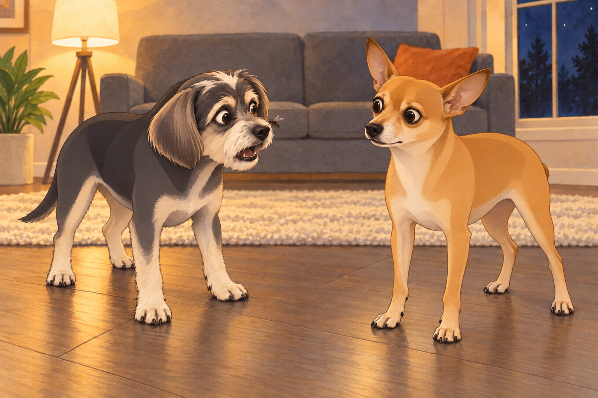

# The Great Mosquito War

It all started with a single, high-pitched buzz.

Heather had just settled on the couch with a book, Neet curled up beside her, and Buddy sprawled lazily on the cool tile floor. The night was peaceful— until Neet’s ears twitched.

“Did you hear that?” he barked, jumping to his feet.

Buddy lazily flicked his tail. “It’s probably just the wind.”

Then came the second buzz. And the third.

Heather swatted at the air and groaned. “Oh no. The mosquitoes are back.”

Neet’s eyes widened. “Not again.”

## Phase One: The Swarm Arrives

The first attack was swift. One moment, the living room was quiet; the next, it was a battlefield. A rogue mosquito dive-bombed Heather’s arm, forcing her to smack herself in a desperate attempt to eliminate the enemy.

Neet leapt into action, barking at the tiny invaders. “You shall not pass!”

Buddy, attempting to remain calm, swatted at a mosquito with his paw. “Maybe if we just stay still, they won’t notice us.”

A mosquito landed directly on his nose.

Buddy screamed.

Neet stared at him.

“I was staying still,” Buddy said, backing away. “It cheated.”

## Phase Two: The Counterattack

“Alright, this is war,” Heather declared, grabbing the electric mosquito racket. With a dramatic swing, she zapped one of the invaders, sending it spiraling to the ground in a puff of tiny sparks.

Neet was in awe. “She has lightning powers!”

Determined to contribute, Neet launched himself into battle, snapping at the mosquitoes mid-air. He spun, twisted, and lunged, yapping furiously. He managed to bite the air about a hundred times— and absolutely nothing else.

Buddy, meanwhile, opted for a more defensive strategy: hiding under a blanket. He dragged one corner down from the couch, crawled beneath it, then backed out to collect the paw he had left sticking into enemy territory.

Heather turned to him. “Really, Buddy?”

A muffled voice from beneath the blanket responded. “You handle this. I’m too pretty to be bitten.”

## Phase Three: The Unexpected Setback

Just as Heather was about to deliver another electrifying blow, the racket fizzled out.

“Battery’s dead,” she whispered, horror-struck.

She pressed the button again. Both dogs waited for the lightning.

The little plastic click was not reassuring.

Neet gasped. “We’re doomed.”

A mosquito landed on Heather’s forehead. She swatted. She missed. The mosquito, now emboldened, buzzed in victory.

“That’s it,” Heather growled. “Plan B.”

She grabbed a bottle of mosquito repellent. Neet sprang up just as she pressed the nozzle and caught the spray in his face.

“AHHH! I’M UNDER ATTACK!” Neet howled, shaking his head wildly and sprinting in frantic circles.

Buddy pushed his blanket aside as Heather put down the bottle and wiped Neet’s face with a damp cloth. “There’s room under here,” he offered. Neet shook his head. He still had a war to finish.

## Phase Four: The Ultimate Showdown

With the repellent now properly aimed at the mosquitoes (and not Neet), Heather managed to push them back. But one mosquito, larger and bolder than the rest, refused to retreat.

It hovered menacingly in the air, staring Heather down.

“This one’s the leader,” Neet whispered. “We have to take it down.”

After a pause to charge the racket, Heather returned beneath the light. Neet crouched low, preparing to pounce. Buddy drew the blanket around himself again, leaving the corner open for Neet.

The mosquito dove straight at Heather. She swung. Missed.

Neet leapt. Missed.

Buddy sneezed under his blanket.

And then, in an act of sheer luck, the mosquito veered too close to the ceiling fan. With one dramatic whirrrrr, it was sucked into the abyss and vanished forever.

Silence.

Then Neet, panting, collapsed onto the floor. “We did it.”

Buddy peeked out. “Did we win?”

Heather wiped sweat from her forehead. “I don’t know if we won, but we survived.”

Neet stood, his face still damp from Heather’s cloth. “We defended our home.” He looked up at the fan. “With air support.”

Buddy yawned. “You’re really milking this, huh?”

He looked up at the fan, then shuffled his blanket directly underneath it.

Neet followed him. “I’m inspecting our defenses.”

“From in here?”

“Closely.”

Buddy lifted the corner. This time, Neet went in.

Heather shook her head and collapsed onto the couch. “Next time, we’re getting a mosquito net.”

And so, the Great Mosquito War came to an end… at least until the next summer night.

## Refinement record

October 4, 2026: second comedy pass sharpens failed stillness, blanket logistics, the dead-racket pause and Neet’s eventual acceptance of shelter. Proposed expanded artwork remains pending independent review. See [comedy record](../Productions/E019-the-great-mosquito-war/comedy-pass-v002.json).

October 3, 2026: individually refined and compared with the complete pre-refinement text. Creative choices, preserved incidents and pending illustration stages are recorded in [the episode record](../Productions/E019-the-great-mosquito-war/episode.json). Original bytes remain in the external snapshot `/Users/sagar/Documents/ChatGPT/NBC_Archives/NBC-before-refinement-2026-10-03_200659.tar.gz` (member `NBC/Stories/S019-the-great-mosquito-war.md`). This revision establishes no owner approval.

## Provenance and editorial notes

Working selection dated October 3, 2026. Selection and shelf order are editorial; owner approval and event chronology remain unverified.

Original numbering: manuscript Chapter 20.

Archive recovery: use [Studio recovery guidance](../Studio/Recovery.md). The paths below are paths **inside the verified snapshot**, not active navigation. SHA-256 pins identify the exact sources.

- `legacy-ch20` — `02_Story_Library/Legacy_Chapters/20-the-great-mosquito-war.md`; SHA-256 `ea8024da93aa1e68e8355f349c0fd57c3143c264605de22e694f3ac3b3c29552`.
- `elevenlabs-reader-51` — `90_Archive/2026-10-03-elevenlabs-recovery/Raw_Exports/reader-51.txt`; SHA-256 `b1c589b8d4cd7f8e540662cb11903dfc08dca3e0910d4816899b423a19981b1b`.
