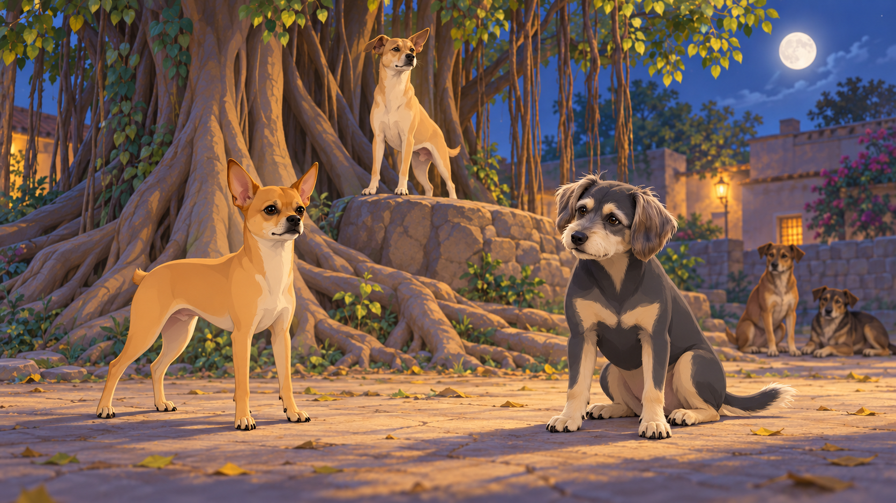
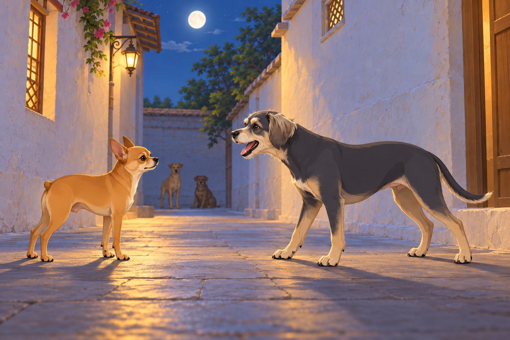
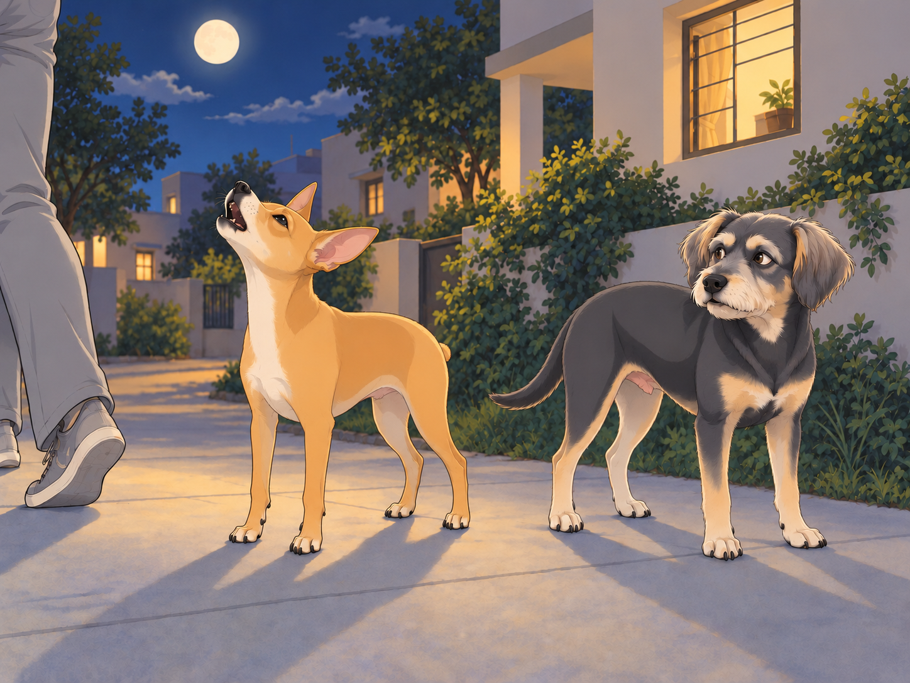

# The Great Nighttime Bark-Off

It all started with a single bark.

One quiet evening, as Heather relaxed on the porch with Neet and Buddy, a distant woof echoed through the night. It came from the banyan tree where Chirag’s gang usually hung out.

Neet’s ears shot up. “Did you hear that?”

Buddy yawned. “It’s just someone saying goodnight.”

Then, another bark came from the opposite direction. A deep, throaty woof— probably from Bruno the Bulldog.

Neet squinted. “That wasn’t just a goodnight. That was a challenge.”

Neet hopped off the porch and sprinted toward the sound. Buddy wanted to stay, but he knew who would have to fetch Neet later. He followed. Heather looked up from her phone and put it away.

## The Gathering

By the time they reached the banyan tree, a group of dogs had already assembled. Chirag sat in the middle, his tail swishing with authority.

“What’s going on?” Buddy asked, settling down next to Chikki.

“The Great Nighttime Bark-Off,” she whispered, eyes sparkling. “It’s an unofficial contest to see who has the most powerful, ridiculous, or artistic bark.”

Neet’s tail wagged. “Finally, a competition worthy of my talent.”

Chirag stood on a raised rock and addressed the crowd. “Alright, you all know the rules. No growling, no biting, just pure, unfiltered barking. There will be three categories: Volume, Creativity, and Echo Potential. The winner earns bragging rights for the whole week.”

The crowd erupted in howls of excitement.

Buddy waited for them to finish. “Is there a Quiet category?”

“No,” said Chirag.

Buddy had been ready to win that one.

## Round One: Volume

Bruno the Bulldog was first. He stepped forward, took a deep breath, and let out a thunderous “WOOOOF!”

The sheer force of it rattled nearby leaves and startled a pigeon off a wire. The audience gasped in appreciation.

Neet narrowed his eyes. “Alright, big guy. Let me show you how it’s done.”

He strutted forward, squared his tiny body, and—

“YAPYAPYAPYAPYAPYAPYAPYAPYAPYAPYAP!”

The sound was so fast and high-pitched, it sounded like a malfunctioning alarm system. Dogs covered their ears. Buddy cringed. Bruno blinked in shock.

Chirag coughed. “Impressive. A little… excessive, but impressive.”

Buddy moved behind the banyan trunk. It helped until Neet turned to check whether he was listening.

The round ended with a vote, and Bruno took the Volume Trophy by a single bark.

Neet huffed. “Fine. Just warming up.”

## Round Two: Creativity

Shadow stepped forward, took a deep breath, and let out a deep, dramatic “Awoooooooooo” that sent chills down every spine. It was haunting, poetic, and full of meaning.

Neet scoffed. “Too serious.”

Pierre the French Bulldog then delivered a three-part theatrical bark, complete with pauses and exaggerated head movements:

“Wouf.”

A pause.

“Wouf-wouf.”

A longer pause.

Buddy mistook Pierre’s second pause for the end and gave an approving woof.

Pierre slowly turned his head toward him.

“WOOOOOOOOOUF!”

Buddy received the finale at close range.

The audience clapped their paws in admiration. Buddy inspected the ground.

Then came Neet’s turn.

He thought for a moment, then grinned.

First, he started with a tiny “yip.”

Then, a medium “arf.”

And then, out of nowhere, he jumped in the air and unleashed “RAWWWRWOOFROOOWF!”

Dogs gasped. Chirag clutched his heart.

Neet landed gracefully. “I call it: The Symphony of Chaos.”

The vote was unanimous. Neet won Creativity.

Neet bowed dramatically. “As expected.”

## Round Three: Echo Potential

For the final round, they needed an open spot where their barks could travel. The gang moved to an alleyway between two buildings, where echoes bounced perfectly.

Bruno went first. His deep, resonating “WOOOOOOF” rebounded three times before fading.

Shadow howled again, and it bounced four times, sending shivers through the crowd.

Then Neet stepped up.

He smirked, took a deep breath, and squeaked out the tiniest, sharpest bark ever.

“Yip!”

It was so sharp, so piercing, that it bounced six times, reverberating like a dog whistle across the alley.

Buddy had promised himself he would not get involved. By the fourth echo, he was leaning forward. By the fifth, his mouth was open.

“Six!” he announced, louder than the original yip.

His own voice came back at him.

Buddy closed his mouth. That one did not count.

For a moment, there was silence.

Then, the audience erupted into cheers.

Neet had won Echo Potential.

## The Final Verdict

Chirag tallied the results. “Bruno takes Volume. Neet takes Creativity and Echo Potential. By the power vested in me as the Judge of Barks, the winner of this year’s Great Nighttime Bark-Off is… Neet!”

Neet puffed up. “A whole week of bragging rights.” He seemed to be calculating how much bragging would fit.

Buddy had counted all six echoes. He gave Neet one approving wag, then turned toward the porch. “That’s enough winning for tonight.”

Chikki laughed. “You have to admit, he earned it.”

Bruno gave Neet a respectful nod. “You’re small, but you got lungs, kid.”

Heather, who had followed them from the porch and watched the contest, stepped forward. “Okay, Neet, Buddy— time to go home before someone calls animal control.”

As they left, Neet howled dramatically at the moon one last time. His voice echoed across the neighborhood, carrying his victory into the night.

Somewhere, a human groaned and shouted, “WHOSE DOG IS THAT?!”

Buddy sighed. “I’m pretending I don’t know him.”

Heather just laughed. “Come on, ‘Champion of Barks.’ Let’s get you some celebratory treats.”

Neet grinned. “Now that’s music to my ears.”

Buddy reached the porch first. He had finally found a part of the evening that required no commentary.

## Refinement record

October 4, 2026: second comedy pass gives Buddy a failed bid for quiet, premature applause and accidental participation in the echo round; preserves every competitor, result and the affectionate treat ending. Expanded pictures remain proposed pending independent review. See [comedy record](../Productions/E020-the-great-nighttime-bark-off/comedy-pass-v002.json).

October 3, 2026: individually refined and compared with the complete pre-refinement text. Creative choices, preserved incidents and pending illustration stages are recorded in [the episode record](../Productions/E020-the-great-nighttime-bark-off/episode.json). Original bytes remain in the external snapshot `/Users/sagar/Documents/ChatGPT/NBC_Archives/NBC-before-refinement-2026-10-03_200659.tar.gz` (member `NBC/Stories/S020-the-great-nighttime-bark-off.md`). This revision establishes no owner approval.

## Provenance and editorial notes

Working selection dated October 3, 2026. Selection and shelf order are editorial; owner approval and event chronology remain unverified.

Original numbering: manuscript Chapter 21.

Archive recovery: use [Studio recovery guidance](../Studio/Recovery.md). The paths below are paths **inside the verified snapshot**, not active navigation. SHA-256 pins identify the exact sources.

- `legacy-ch21` — `02_Story_Library/Legacy_Chapters/21-the-great-nighttime-bark-off.md`; SHA-256 `4f80677c99ece6f44e50ef9868cff0b92c3f6281339f24da861d7ae2ea5eba92`.
- `elevenlabs-reader-50` — `90_Archive/2026-10-03-elevenlabs-recovery/Raw_Exports/reader-50.txt`; SHA-256 `b9af0a6e2452e13475b7f9679a4cb4916d314a031eca17bf965a9fd0c90354a1`.
