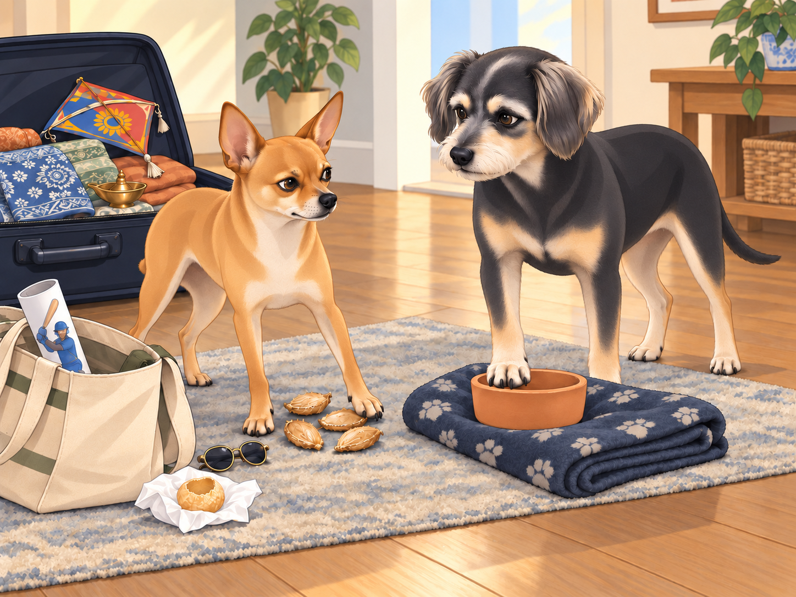
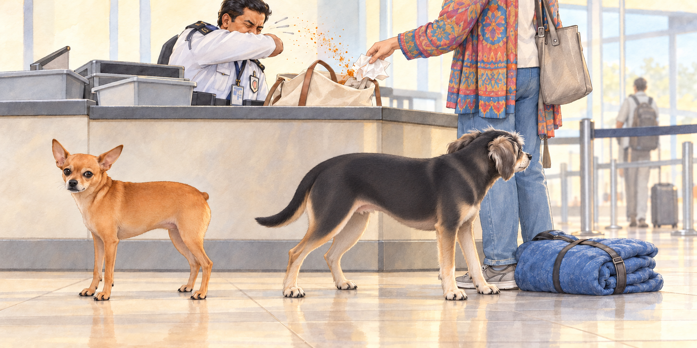
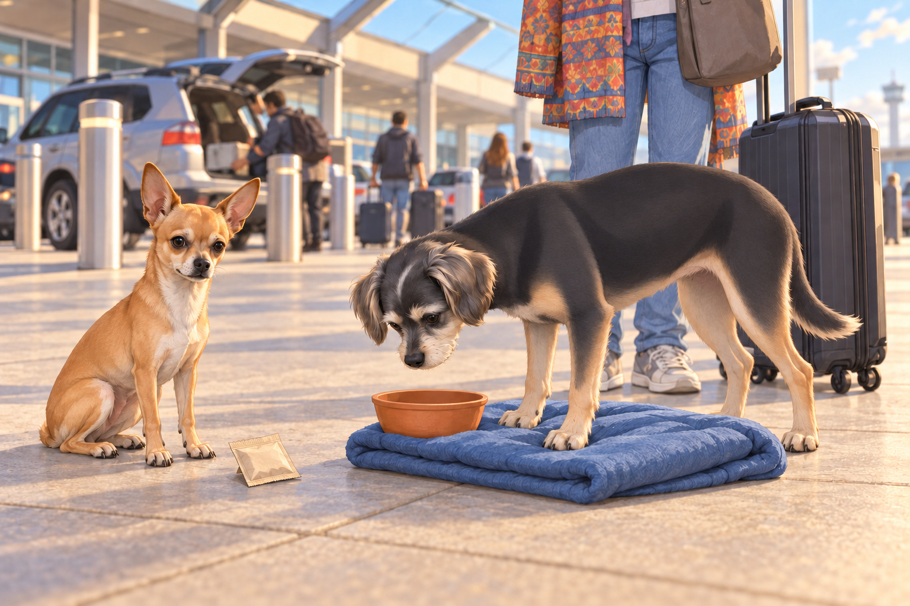

# The Bittersweet Goodbye

The time had come. After months of adventures, friendships, and countless meals stolen from unsuspecting street vendors, Neet, Buddy, and Heather were finally packing their bags to return to the U.S.

Neet stood atop an open suitcase, surveying the chaotic packing situation. "This is betrayal," he declared dramatically. "We belong here now. I have a gang. I am legendary."

Buddy sighed, folding one of Heather’s scarves with his paws. "Neet, you’ve had a good run. But do you really think airport security is going to let you smuggle an entire bag of street samosas in your fur?"

Neet scoffed. "It’s not smuggling if you call it ‘emotional support snacks.’"

Heather chuckled as she tried to zip up her suitcase, which was now half full of spice packets, handmade trinkets, and the occasional dog-sized embroidered kurta. "Come on, boys. I know it’s hard, but we’ll always carry India with us in our hearts."

Neet sat down stubbornly. "I want to carry it in my stomach."

## Packing the Essentials (and the Ridiculous)

Packing had been an ordeal. Heather had carefully chosen souvenirs— brass diyas, a beautifully painted kite from Uttarayan, and even a small carved idol from a temple visit.

Neet, however, had his own ideas. His personal "carry-on bag" (a repurposed tote bag Heather had abandoned) included:

Four chewed-up mango pits (“For scientific study,” he insisted.)

A tiny pair of sunglasses he stole from a street vendor’s stall (“Because Bollywood, duh.”)

A rolled-up poster of a famous cricket player (“I am now a sports enthusiast,” he declared.)

A single pani puri shell wrapped in a napkin (Buddy refused to touch it.)

Buddy put a neatly folded blanket from Chirag’s gang beside a small clay bowl from the elderly chaiwala who always saved him an extra biscuit. When Neet tried to add a mango pit to the blanket, Buddy moved the bowl on top. These were coming home intact.

Neet tried the other side of the blanket. Buddy moved the bowl again.

“Your bowl’s following me.”

“Yes,” said Buddy.

Heather tried to reason with them. "Guys, we cannot take half of India back home."

Neet clutched his bag. "Watch me."

Heather lifted it. The cricket poster slid out and unrolled across her foot.

“I am watching,” she said. “So is this man.”

## The Final Walk Through the Neighborhood

Their last walk through the streets was bittersweet. The bazaar that once overwhelmed Buddy now felt like home, with vendors calling out, "Neet, Buddy, ek cup chai leva na?" (One last cup of tea?)

Chirag and his gang met them at the banyan tree. "So, this is it, huh?" Chirag said, trying to sound nonchalant but failing.

Neet puffed out his chest. "I expect my legacy to live on in my absence."

Chikki nuzzled Buddy. "You’ll visit again, right?"

Buddy wagged his tail. "Of course. But if Neet tries to smuggle himself back into India, I am not involved."

Chirag smirked. "This isn’t goodbye. This is ‘until next time.’"

Neet’s tail lowered. For once, he was silent.

## The Airport Chaos

Their departure from the house was emotional. Heather wiped away tears as she locked the door behind her. The tuk-tuk ride to the airport felt quieter than usual, despite Neet’s occasional complaints about his “tragic” exile.

But if they thought they could leave smoothly, they were wrong.

At the airport security line, a customs officer raised an eyebrow at Neet’s suspiciously lumpy tote bag.

"Sir, what’s in this?"

Heather groaned. "I don’t even want to know."

Neet beamed. "Just some minor essentials. A few snacks. Some historical documents." (The cricket poster.)

Buddy shook his head. "Just open the bag before they deport us."

He nudged his blanket bundle behind Heather’s ankle. He had checked the bowl three times since leaving the house. A fourth check could wait until the authorities finished with Neet’s research.

As soon as the officer unzipped it, the pani puri shell— forgotten at the bottom— crumbled into dust, sending a small cloud of masala into the air. The officer sneezed violently.

Heather caught the collapsing napkin and apologized to the sneezing officer. "We haven’t even reached the gate."

Buddy muttered, "We never left India. India left us."

## The Lounge Misadventures

After surviving security, Heather decided they needed a breather in the airport lounge. Buddy sighed in relief at the plush chairs, while Neet immediately zeroed in on the buffet.

"Unlimited food?" Neet gasped, eyes shining.

"Neet, no—"

It was too late. He had launched himself onto the table like a furry missile, skidding across plates of samosas and landing directly in a bowl of dal. The horrified chef stared as Neet struggled out, dripping turmeric-scented soup onto the floor.

Buddy pretended not to know him. "I swear, I was adopted separately."

He turned his chairward gaze a little farther away. Then the dal began to drip toward his blanket. Buddy abandoned the performance and dragged the bundle clear.

Heather scooped Neet up before he could dive back in. "We are leaving. Now."

Neet licked a stray bit of dal off his paw. "Worth it."

## Touchdown in the U.S.

After a long flight (where Neet dramatically stared out the window for hours, sighing about how he could see the spirit of Gujarat in the clouds), they finally landed back home.

As soon as they stepped out of the airport, the difference was stark. No buzzing street vendors, no distant sound of temple bells, no smell of freshly fried pakoras.

Neet sat down on the sidewalk. "Take me back."

Heather scratched his ears. "We’ll go back one day, buddy. Until then… we’ve got memories, stories, and—"

Neet pulled out a tiny bag of secret masala mix he’d hidden in his fur. "And flavor."

Buddy sighed. "This is going to be an interesting adjustment."

He sniffed the packet, then looked at his empty clay bowl.

“Not in there,” Heather said.

Buddy looked away. He had only been considering it.

Heather led them toward home. Buddy checked that the clay bowl was still cushioned in his blanket. Neet walked beside him with the secret masala. They had each brought back what they could.

## Meaningful alternative

A shorter version removes **The Lounge Misadventures** entirely. Read directly from **The Airport Chaos** to **Touchdown in the U.S.**; the surrounding prose and ending remain the same. This is an abridgement, not a new chapter. Its original capture is identified in the provenance below.

## Refinement record

October 4, 2026: second comedy pass sharpens Buddy’s protective keepsake mission, Heather’s cricket-poster response and the final temptation to use the bowl. The gang farewell stays quiet; all original incidents and the lounge-omission alternative remain distinct. Expanded artwork is proposed pending independent review. See [comedy record](../Productions/E021-the-bittersweet-goodbye/comedy-pass-v002.json).

October 3, 2026: individually refined and compared with the complete pre-refinement text. Creative choices, preserved incidents and pending illustration stages are recorded in [the episode record](../Productions/E021-the-bittersweet-goodbye/episode.json). Original bytes remain in the external snapshot `/Users/sagar/Documents/ChatGPT/NBC_Archives/NBC-before-refinement-2026-10-03_200659.tar.gz` (member `NBC/Stories/S021-the-bittersweet-goodbye.md`). This revision establishes no owner approval.

## Provenance and editorial notes

Working selection dated October 3, 2026. Selection and shelf order are editorial; owner approval and event chronology remain unverified.

Original numbering: manuscript Chapter 22.

- The source already returns home, while the following lounge, flight and immigration chapters return to that journey. The contradiction is preserved; shelf order is not a repaired timeline.

Archive recovery: use [Studio recovery guidance](../Studio/Recovery.md). The paths below are paths **inside the verified snapshot**, not active navigation. SHA-256 pins identify the exact sources.

- `legacy-ch22` — `02_Story_Library/Legacy_Chapters/22-the-bittersweet-goodbye.md`; SHA-256 `282452c2446b5eec36fb4348c3c783dbcc034858cde01d43c97de9f4e0b7d3ba`.
- `elevenlabs-reader-48` — `02_Story_Library/ElevenLabs_Imports/reader-48-the-bittersweet-goodbye.txt`; SHA-256 `8292ce44c37f1d7ad3cd52ccc77525c70fd6a7a20e16711c69e559f3593add8a`.
- `elevenlabs-reader-49` — `90_Archive/2026-10-03-elevenlabs-recovery/Raw_Exports/reader-49.txt`; SHA-256 `c0da291fdbef30cf4dc29da6d2e90126b7fea26b7c3bdc76925a11da07849155`.
