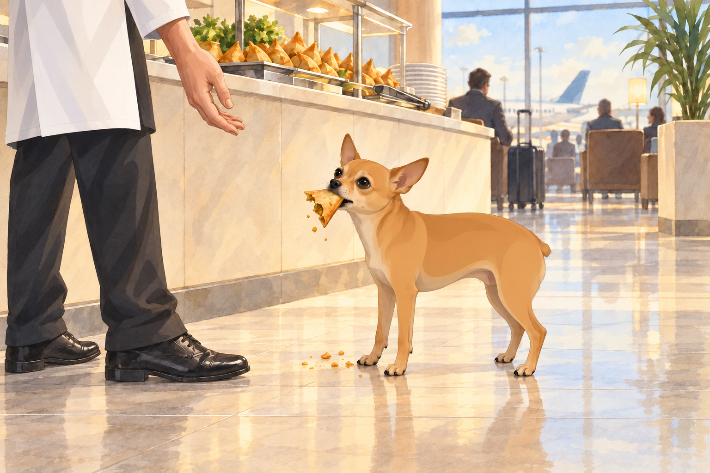
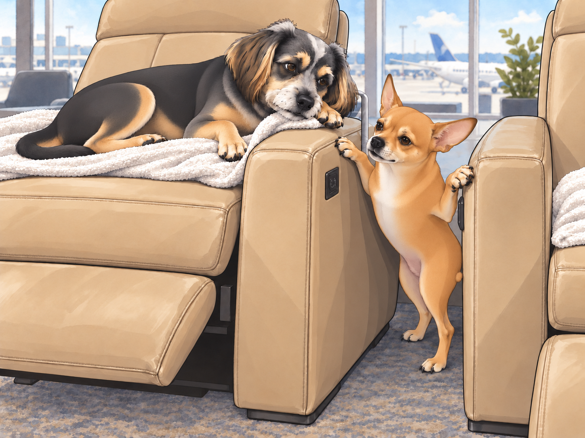
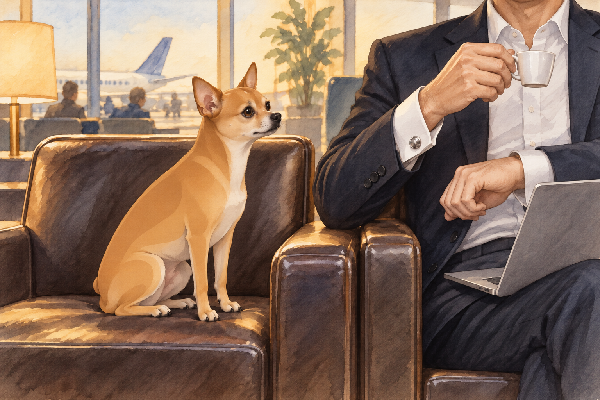

# The Lounge and Airport Madness

After barely surviving security, Heather, Neet, and Buddy made their way to the airport lounge, looking for a moment of peace.

Neet, however, had other plans.

"Look at this place!" Neet barked, his eyes darting across the fancy leather chairs, complimentary food stations, and well-dressed travelers lounging with their steaming cups of chai. "It's paradise!"

Buddy chose a plush seat facing the departure display. He could rest and keep an eye on the flight without moving. "Wake me up when it's time to board."

Buddy tucked his paws under him. From here, the departure display was visible and the buffet was not. He considered this excellent planning.

Neet had already locked onto his next mission: The Unlimited Buffet.

## The Buffet Heist

Heather was busy finding a seat when Neet spotted his first target— a steaming platter of freshly fried samosas. He licked his lips.

"Just one," he whispered to himself.

Neet darted under tables and chairs, maneuvering past passengers with military precision. He approached the buffet, eyes gleaming as he prepared for the Greatest Snack Heist in Lounge History.

Just as he bit into a samosa, a waiter appeared. Neet froze mid-chew.

"Is this one with you?" the waiter asked Heather. Neet stood beside the buffet with a half-eaten samosa dangling from his mouth.

Heather groaned. "Neet, drop it."

Neet chomped down. "I can't. It's part of me now."

Buddy lifted his head from his seat. "We’ve been here for five minutes."

The waiter looked at the empty corner of the platter, then at Neet. Neet moved half a step sideways. The samosa came with him.

## The Recliner Debacle

After narrowly avoiding lounge expulsion, Neet returned, still munching on crumbs, while Buddy happily sprawled across an automated recliner.

"This chair moves!" Buddy barked excitedly, accidentally pressing the recline button with his paw. The chair tilted back abruptly, and Buddy yelped as he slid backward into full relaxation mode.

Buddy stayed rigid until the motor stopped. Then he lowered his chin.

"I meant to do that."

"Oh wow, that actually looks nice," Heather said, taking a seat beside him.

Buddy carefully moved his paw away from the buttons. One improvement was enough.

Neet, jealous, attempted to jump onto a recliner of his own— but miscalculated. Instead of landing gracefully, he slid off the slippery leather and got wedged between two chairs.

"Traitors!" Neet howled, his legs flailing against the leather.

Buddy leaned over the edge of his recliner. "Heather. He’s between the chairs." Then he settled back, unable to suppress a quiet snort.

A passing flight attendant suppressed a giggle while Heather sighed, pulling Neet free before security had to be involved again.

## The Unexpected Announcement

Just as Heather managed to regain control, an announcement blared over the airport intercom.

"Attention passengers: Flight AI-317 to New York has been delayed by two hours."

Heather groaned. "Seriously?"

Neet, however, perked up. "Two more hours? That means—"

"No, Neet," Heather interrupted. "No more buffet raids."

Neet squinted. "Define ‘raid.’"

Buddy glanced at the departure display, then settled his chin back down. Two hours. At last, a schedule he could work with.

Neet was already standing up.

"This is going to be a long delay," Buddy said.

## Lounge Showdown: Neet vs. The Fancy Businessman

Bored and looking for entertainment, Neet decided to people-watch. That’s when he spotted a very fancy businessman in a sleek suit, sipping espresso while scrolling through his laptop.

Neet squinted. "That guy thinks he's so cool."

Buddy barely lifted his head. "Please don’t."

Neet puffed out his chest. "I must assert dominance."

In a single, calculated move, Neet hopped onto the chair right next to the businessman and stared at him intensely.

The man looked up, startled. "Uh… hello?"

Neet didn’t blink. He held eye contact as if challenging the man to a silent battle.

The businessman, clearly uncomfortable, shifted in his seat. "Can I… help you?"

Neet finally blinked and barked. "Your watch is too shiny."

The businessman drew his cuff over it. Neet sat taller.

Then the man lifted his espresso cup with the other hand. Neet discovered the cufflinks.

Buddy groaned. "Heather, can we board the plane early just to escape this embarrassment?"

Heather laughed but gently pulled Neet away before he started offering unsolicited business advice.

## Final Boarding Call

After two long hours of chaos, lounging, and stolen snacks, their boarding call finally came.

Heather grabbed her bags, Buddy stretched lazily, and Neet, still holding onto a stolen breadstick, strutted toward the gate like he owned the entire airport.

As they approached the plane, Neet glanced back at the lounge and sighed. "I’ll miss this place."

Buddy rolled his eyes. "The lounge won’t miss you."

At the aircraft door, Heather took the breadstick from Neet. "Let’s give the next buffet a chance."

Neet grinned. "Worth it."

Buddy looked past them at the seats. He had two hours of lost sleep to recover.

This time, he would choose one facing Neet.

## Refinement record

October 4, 2026: second comedy pass preserves the samosa excuse, moving recliner, chair trap, delay, businessman confrontation and breadstick exit. Buddy’s careful nap planning acquires a final reversal; the businessman’s cuff supplies a small visual escalation. Historical household and transit chronology remain unresolved. Expanded illustrations are proposed pending independent review; see [comedy record](../Productions/E022-the-lounge-and-airport-madness/comedy-pass-v002.json).

October 3, 2026: individually refined and compared with the complete pre-refinement text. Creative choices, preserved incidents and pending illustration stages are recorded in [the episode record](../Productions/E022-the-lounge-and-airport-madness/episode.json). Original bytes remain in the external snapshot `/Users/sagar/Documents/ChatGPT/NBC_Archives/NBC-before-refinement-2026-10-03_200659.tar.gz` (member `NBC/Stories/S022-the-lounge-and-airport-madness.md`). This revision establishes no owner approval.

## Provenance and editorial notes

Working selection dated October 3, 2026. Selection and shelf order are editorial; owner approval and event chronology remain unverified.

Original numbering: manuscript Chapter 23.

Archive recovery: use [Studio recovery guidance](../Studio/Recovery.md). The paths below are paths **inside the verified snapshot**, not active navigation. SHA-256 pins identify the exact sources.

- `legacy-ch23` — `02_Story_Library/Legacy_Chapters/23-the-lounge-and-airport-madness.md`; SHA-256 `399d4c0ae926ddfd2980b95f5cd6204855dd1e92b37ef6f91686ea2b45c6a01e`.
- `elevenlabs-reader-47` — `90_Archive/2026-10-03-elevenlabs-recovery/Raw_Exports/reader-47.txt`; SHA-256 `2507a2e0e883958707cb9ed2225c9e2aab23b4debba1eb698c2a7aad4c9a63a1`.
