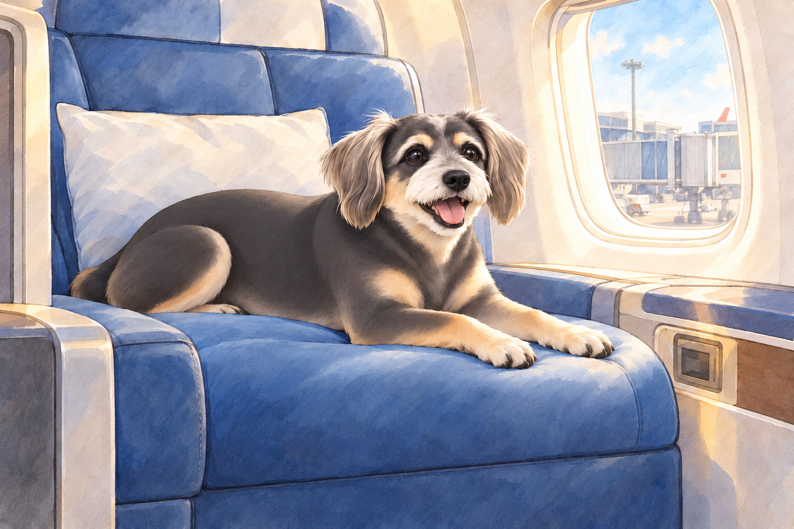
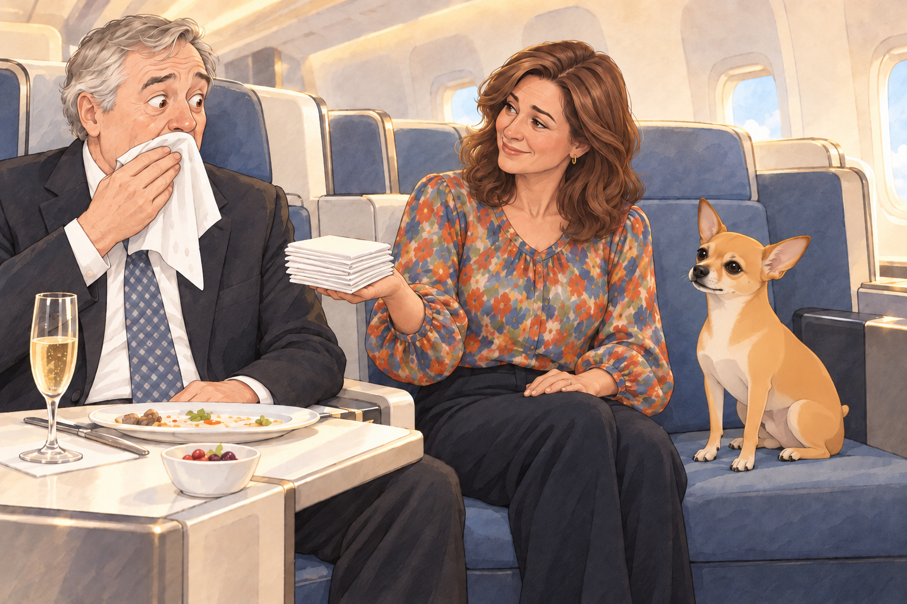
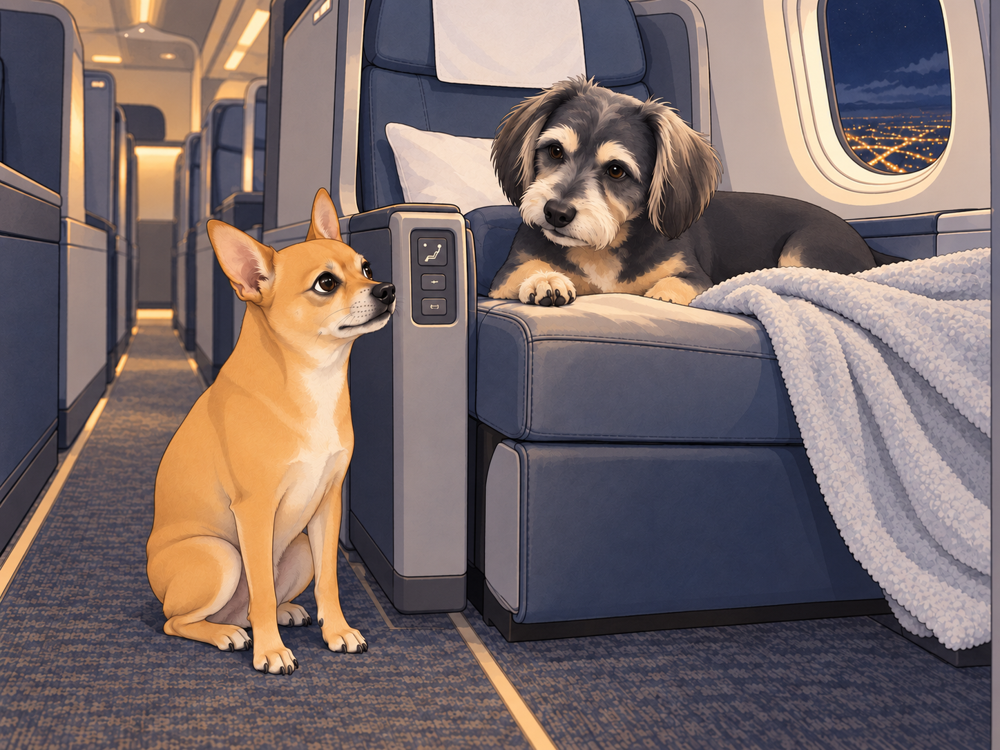

# The Business Class Upgrade Disaster

After the unforgettable airport lounge experience, Heather, Neet, and Buddy finally approached the boarding gate. They were fully expecting a long, cramped flight home— until an unexpected announcement changed everything.

“Passengers Heather Richmond, Neet, and Buddy, please approach the desk for a seating update.”

Heather blinked. "Did we do something wrong?"

Neet grinned. "Maybe they finally realized I’m royalty."

Buddy yawned. "Or security flagged your samosa crimes."

As they approached the gate agent, she smiled brightly. "Congratulations! Due to an overbooked economy section, you’ve been upgraded to business class."

Neet gasped dramatically. "You mean… like, the fancy seats? With the legroom?!"

Buddy’s ears perked up. "Wait, actual space to stretch?"

Heather was still processing the miracle. "Wait… seriously?"

The agent nodded. "Enjoy your flight!"

## The Seats Are Too Nice

The moment they stepped into business class, Neet’s jaw dropped. The seats were massive, reclining beds, and each had a built-in entertainment screen the size of a small television.

Neet ran up to one of the seats and jumped in. "Oh. My. Dog. Is this memory foam?!"

Buddy climbed into his seat cautiously, testing its softness. "It’s so… plush."

He stretched one foreleg, then the other. Neither reached the edge. He checked again.

Heather plopped down into hers, sighing in bliss. "Okay, this is definitely not how I expected this flight to go."

Neet started pressing random buttons on the seat’s control panel. "Look, it moves! I am ascending!"

Buddy had worked out which button lowered the footrest and which one laid the seat flat. He wanted to remember them and then leave them alone. "Neet, don’t touch every—"

Suddenly, Neet’s seat fully flattened, sending him flipping backward. His paws flailed as he landed upside down, legs in the air.

A passing flight attendant stopped and stared. "Sir, are you… okay?"

Neet, still upside down, nodded. "Just… testing the luxury."

Buddy took his paw off his own controls. He had found the setting called Enough.

## The Gourmet Meal Incident

Soon after takeoff, the flight attendants began serving meals, and Neet's eyes widened when he saw the menu.

"This isn’t… plane food. This is… fine dining." He sniffed the air. "Is that… grilled salmon?!"

A tuxedoed attendant arrived, placing silver trays in front of them. Buddy marveled at his dish. "This steak looks real."

Heather picked up her neatly arranged dessert. "Is this… handmade tiramisu?" She took a bite and nearly cried. "I don’t ever want to fly economy again."

Meanwhile, Neet had abandoned all civility and was stuffing his face with everything in reach. "We eat like kings now!"

That was until he got his paws on the champagne glass.

"Neet, no," Buddy warned. "That’s not for dogs."

Neet sniffed it. "It smells expensive. I must try it."

Before Heather could stop him, Neet took a delicate sip… and immediately sneezed it all over the next passenger— a distinguished older gentleman wearing a tailored suit.

The man wiped his face slowly and looked down at Neet, who grinned sheepishly.

Heather offered him a napkin. Then she looked at his lapel and offered him the rest of the stack.

"Uh… cheers?" Neet offered.

Heather buried her face in her hands. "We’re going to get downgraded mid-flight."

## The Nap Chaos

After the meal, the cabin lights dimmed, signaling quiet time. Heather stretched. "Finally, we can sleep properly on a plane."

Buddy was already curled up in his perfectly-sized seat, sighing in pure bliss. "I could stay here forever."

He tucked one corner of his blanket under a paw. No drafts. No visible buffet. Nothing left to improve.

Neet, however, had different ideas.

"Wait. We have a BED on a PLANE," he whispered excitedly.

Heather sighed. "Neet, just go to sleep."

Neet flopped down and wriggled around. "But I can sleep any way. I can sleep sideways. Or upside down. Or diagonally!"

After about twenty seconds of stillness, he suddenly sat up. "Wait, what if I try sleeping like this—"

And with that, he rolled directly off the seat onto the aisle.

A passing flight attendant nearly tripped over him. "Sir, please remain in your seat."

Buddy pushed his blanket aside and looked down at Neet in the aisle. "Heather. Floor again."

Heather leaned over and lifted Neet back into his seat. Buddy reclaimed the blanket before either of them could sit on it.

## The Final Disaster

Just as they were beginning their descent, the flight attendant came by to collect any remaining items. Heather handed over her neatly folded blanket. Buddy stretched and yawned, still in awe of the luxury.

Neet, however, had disappeared.

"Where did he—"

Suddenly, a voice came from the cockpit area.

"Attention passengers, this is your captain speaking. We have clear skies and a smooth landing ahead… and also, there’s a small dog attempting to push buttons."

Heather gasped. "Neet?!"

Neet came sprinting back down the aisle, tail wagging. "GUYS. I ALMOST FLEW THE PLANE."

Buddy covered his face with his paws. "We are never getting upgraded again."

As they landed and taxied to the gate, Neet leaned back in his business-class seat, sighing in satisfaction.

"Best flight ever."

Heather checked that Neet was still beside her. "Next time, we leave the buttons alone."

Neet grinned. "Totally worth it."

Buddy laid a paw over his own seat controls. They had reached the ground. He meant to stay in the chair.

## Refinement record

October 4, 2026: second comedy pass adds Buddy’s careful comfort tests, the napkin-stack reaction and a final button callback while preserving every central incident. Expanded art remains proposed pending independent review. See [comedy record](../Productions/E023-the-business-class-upgrade-disaster/comedy-pass-v002.json).

October 3, 2026: individually refined and compared with the complete pre-refinement text. Creative choices, preserved incidents and pending illustration stages are recorded in [the episode record](../Productions/E023-the-business-class-upgrade-disaster/episode.json). Original bytes remain in the external snapshot `/Users/sagar/Documents/ChatGPT/NBC_Archives/NBC-before-refinement-2026-10-03_200659.tar.gz` (member `NBC/Stories/S023-the-business-class-upgrade-disaster.md`). This revision establishes no owner approval.

## Provenance and editorial notes

Working selection dated October 3, 2026. Selection and shelf order are editorial; owner approval and event chronology remain unverified.

Original numbering: manuscript Chapter 24.

Archive recovery: use [Studio recovery guidance](../Studio/Recovery.md). The paths below are paths **inside the verified snapshot**, not active navigation. SHA-256 pins identify the exact sources.

- `legacy-ch24` — `02_Story_Library/Legacy_Chapters/24-the-business-class-upgrade-disaster.md`; SHA-256 `f3ec7535d76a030009d6602def5f81731bc21c4366a5e982cec0199c08a0e54e`.
- `elevenlabs-reader-46` — `90_Archive/2026-10-03-elevenlabs-recovery/Raw_Exports/reader-46.txt`; SHA-256 `2b40073ac8d9215574c1c407b6f1838acdb145c6fee2b47738159d8afc0a7d66`.
