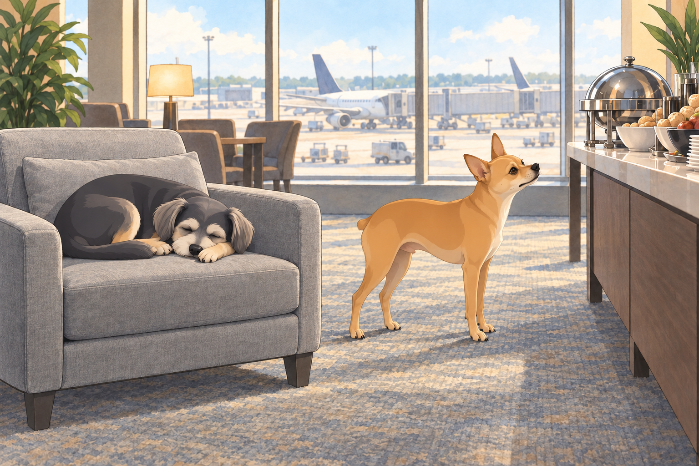
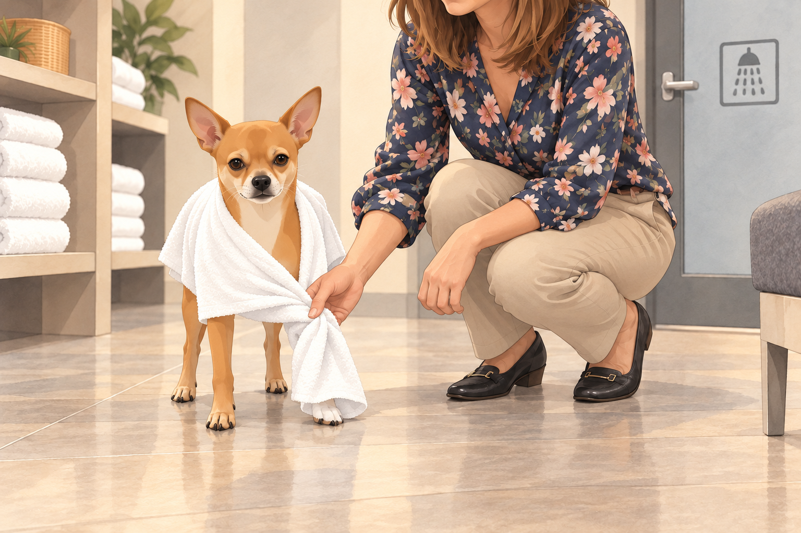
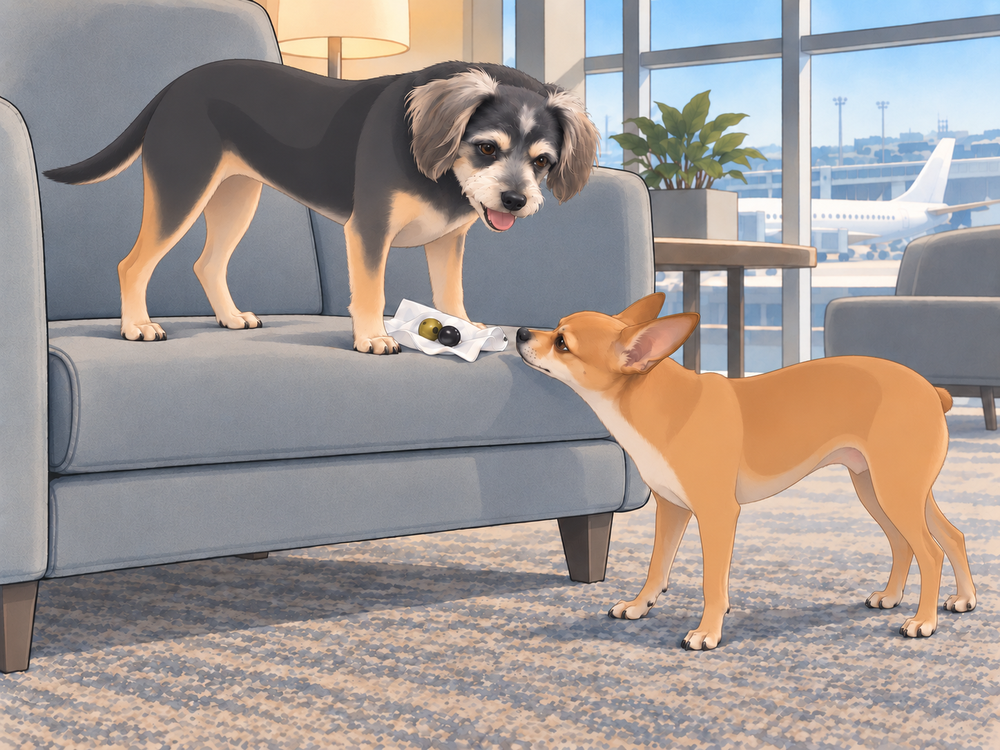

# The Istanbul Layover Debacle

The business class experience had barely worn off when the trio touched down in Istanbul for their layover. The airport was enormous, bustling with travelers from all over the world. The air smelled of strong Turkish coffee and sizzling kebabs, and the chatter around them was a mix of languages that neither Heather nor Buddy understood.

Neet, of course, was unfazed. "Alright, team. We have five hours in this city. Time to dominate."

Buddy sighed. "Neet, let’s just eat something and nap in the lounge."

Neet scoffed. "Where’s your sense of adventure? This place is teeming with opportunity."

"Mine has a footrest," Buddy said.

## Lost in Translation

Heather approached an airport information desk where a stern-looking Turkish man stood behind the counter. She attempted a polite inquiry.

"Hi! Do you know where the transfer lounge is?"

The man frowned. "Lounge? No."

Heather blinked. "Umm... transfer? Rest area?"

The man shook his head. "No English."

Before Heather could even try again, Neet jumped onto the counter and barked confidently. "LOUNGE. FOOD. NAP. NOW."

The man looked from Neet to Heather. She gathered Neet off the counter before he could repeat himself.

"Sorry," she said. "He thinks volume is a language."

Another airport employee walked past and overheard the commotion. He turned and simply pointed in a direction, muttering something in rapid Turkish.

Neet grinned. "See? You just gotta speak their language."

Buddy muttered under his breath, "I think he was just sick of you barking."

## Turkish Lounge: The Land of Indulgence

Once inside the Istanbul Airport Lounge, it was clear that this was no ordinary airport pit stop. There were buffet stations overflowing with fresh food, showers, and even a sleeping area with cozy recliners.

Neet’s eyes gleamed. "This is heaven."

Buddy immediately headed for a recliner, curling up before Neet could rope him into more chaos. He chose the one facing away from the buffet. If he could not see a new idea forming, perhaps it would leave him alone.

Neet stood beside the chair, nose aimed toward the food. Buddy lowered his own nose between his paws.

Heather, meanwhile, decided to freshen up. "I’m going to take a shower. You two behave."

## The Shower Fiasco

Heather walked into one of the private shower rooms, sighing as she turned on the warm water. However, as she reached for the soap, she noticed something was… off.

The shower door was clear glass. The room itself was private, but Neet had followed her in and was inspecting it with unnerving interest. She put him outside the shower room and closed its outer door.

She had just stepped back under the water when a loud scratching began at the outer door.

"HEATHER!" Neet's voice echoed. "HOW DOES THE WATER PRESSURE FEEL?"

"NEET, GO AWAY!"

"ARE THERE BUTTONS?!"

Buddy lifted his head from the recliner. "Neet. She closed the door." He stayed awake until Neet backed away; he wanted Heather to finish so they could all rest.

"You can inspect the chair," Buddy offered.

Neet looked toward him.

"Silently. From the other chair."

Heather, now red with embarrassment, scrambled to finish her shower and threw her clothes back on. She stepped out, only to find Neet standing at the counter with a stolen towel wrapped around his tiny body.

Heather groaned. "What… what are you doing?"

Neet smirked. "Embracing the luxury life."

He lifted his chin. The towel slid over one front paw. He lowered his chin and stood very still.

Heather crouched to free the paw. "Luxury has got you."

She returned the towel before luxury could get the other one.

## The Olive Heist

After their chaotic lounge experience, they moved to the dining section where an entire counter was dedicated to olives. Green, black, stuffed, spiced— every kind imaginable.

Neet took one bite and gasped. "We must take these home."

Heather gave him a warning look. "Neet, we’re not smuggling food."

Buddy found a padded seat near their table and settled down to recover the nap he had lost.

Neet ignored her, already devising a plan. He grabbed a napkin, carefully wrapped up a handful of olives, and shoved them under Buddy’s sleeping body.

Buddy, half-conscious, grumbled. "Mmm. Why does my stomach feel… lumpy?"

Neet hushed him. "You're an accomplice now."

Buddy opened one eye. "I applied to be a pillow."

The boarding announcement came while Heather was gathering their bags. Buddy stood, revealing the napkin.

Neet scooped it into his little bag and strutted toward the gate before Heather saw it.

Buddy yawned. "If I get detained for smuggling produce, I will haunt you."

Heather sighed. "I don’t know how we made it this far without being permanently banned from international travel."

Neet grinned, popping one last olive into his mouth. "Talent."

## Refinement record

October 4, 2026: second comedy pass sharpens Buddy’s attempts to protect his nap, Heather’s response to Neet’s alleged language skills, and the stolen towel’s quiet physical reversal. The olive handoff and later travel consequences remain intact. Three proposed illustrations cover conflicting priorities, towel aftermath and olive reveal. See [comedy record](../Productions/E024-the-istanbul-layover-debacle/comedy-pass-v002.json).

October 3, 2026: individually refined and compared with the complete pre-refinement text. Creative choices, preserved incidents and pending illustration stages are recorded in [the episode record](../Productions/E024-the-istanbul-layover-debacle/episode.json). Original bytes remain in the external snapshot `/Users/sagar/Documents/ChatGPT/NBC_Archives/NBC-before-refinement-2026-10-03_200659.tar.gz` (member `NBC/Stories/S024-the-istanbul-layover-debacle.md`). This revision establishes no owner approval.

## Provenance and editorial notes

Working selection dated October 3, 2026. Selection and shelf order are editorial; owner approval and event chronology remain unverified.

Original numbering: manuscript Chapter 25.

Archive recovery: use [Studio recovery guidance](../Studio/Recovery.md). The paths below are paths **inside the verified snapshot**, not active navigation. SHA-256 pins identify the exact sources.

- `legacy-ch25` — `02_Story_Library/Legacy_Chapters/25-the-istanbul-layover-debacle.md`; SHA-256 `4307bb10d3d1752380c3b45f6c49214000971679ed33790e87f576716c5e3d57`.
