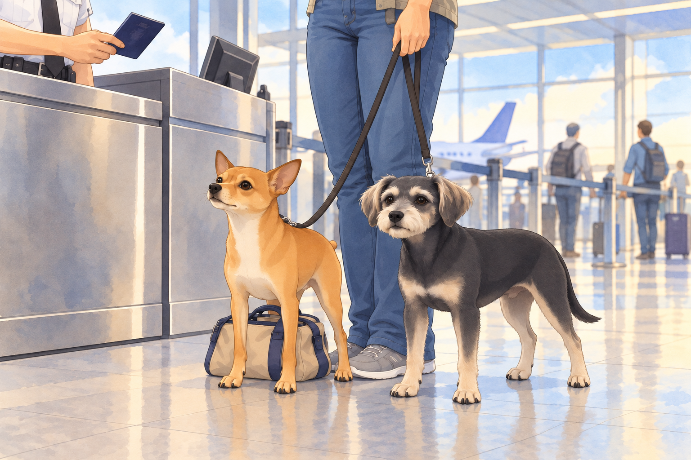
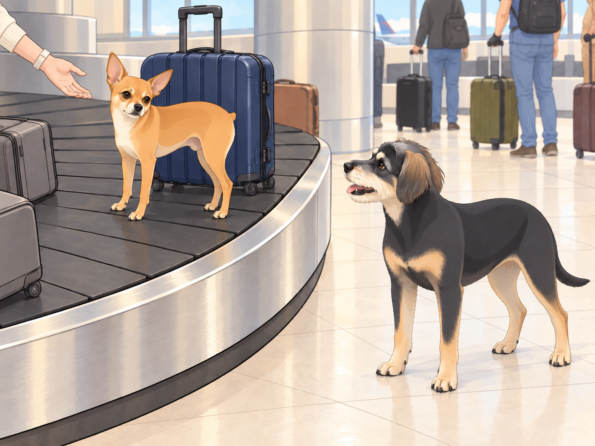
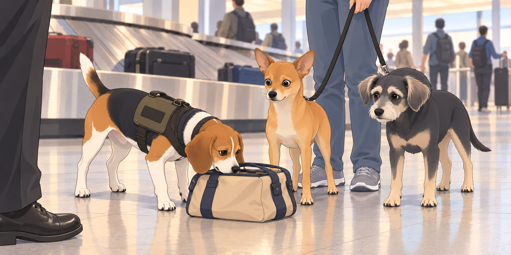

# The Return to the U.S. - Immigration Madness

After the Istanbul layover chaos (and Neet’s infamous olive heist), the trio finally landed in the U.S., exhausted but victorious. However, the final and most unpredictable hurdle awaited them— immigration.

As they walked toward the Customs and Border Protection checkpoint, Neet whispered, "Alright, stay cool. Act natural."

Buddy groaned. "That’s literally the worst advice for you."

He wanted to get home, lie down, and remain in the same country for the entire nap. He moved close to Heather’s ankle. Neet immediately copied him, then edged half a paw ahead. Even behaving had become a competition.

Heather took a deep breath as she approached the immigration officer, a tall, expressionless man who looked like he hadn’t smiled in years.

"Purpose of travel?" he asked, glancing at Heather’s passport.

"Returning home from vacation," Heather replied cheerfully.

The officer nodded, looking down at the two dogs at her feet. "And these are...?"

"My emotional support animals," Heather said quickly.

Neet grinned. "Yes. I emotionally support chaos."

Buddy covered his face with a paw. "We’re gonna get deported."

The officer squinted. "Any food or agricultural products you’re bringing in?"

Neet froze.

Heather paled.

Neet pressed his little bag behind his forelegs. Buddy looked straight ahead with the fierce concentration of a dog who had never met an olive.

Buddy whispered, "The olives."

Neet cleared his throat. "Define food."

Heather put a hand on Neet’s collar. "No! No food!"

The officer stared at them for an uncomfortably long time before finally stamping Heather’s passport. "Welcome back."

As they hurried past, Neet whispered, "See? Cool and natural."

Buddy sighed. "You barely survived."

## The Baggage Claim Conundrum

At baggage claim, the same red suitcase went past three times. Buddy was beginning to feel he should greet it.

He watched for Heather’s bag. Retrieve it, find the door, go home. Three steps. None required international negotiation.

Heather scanned the carousel. "Okay, our bags should be—"

Before she could finish, a blur of tan fur bolted past her.

Neet had climbed onto the baggage belt.

"NEET!" Heather shrieked as horrified travelers gasped.

"I’M PART OF THE LUGGAGE NOW!" Neet howled, spinning in circles as the conveyor belt carried him forward.

Then he planted his paws and lifted his chin. The red suitcase passed beside him. Finally, a traveler with the correct attitude.

Buddy followed along the stationary edge as Neet rotated like a rotisserie chicken. He stopped at the next clear gap and barked. If Neet insisted on being luggage, someone had to be there to collect him.

Heather hurried to the gap.

Buddy barked once more. He had found their missing item. Unfortunately, it had opinions.

A TSA officer with a beagle approached them, raising an eyebrow. "Ma’am, is that your dog?"

"I was hoping you wouldn’t ask," Heather said, reaching for him.

"I WAS COMING BACK AROUND!"

The beagle, wearing a ‘Detector Dog’ vest, stared at Neet with suspicion as he finally jumped off the belt.

"You smell… illegal," the beagle said, narrowing his eyes.

Neet gulped. "Define illegal."

The beagle sniffed his bag. "Do I detect… olives?"

Buddy gasped. "They found the stash!"

He took one careful step away from the bag, then stopped. What if leaving looked suspicious? The beagle kept sniffing. Buddy stayed exactly where he was.

Heather panicked. "I— wait, is that actually a crime?"

The beagle officer stepped forward dramatically. "Ma’am, you are aware that undeclared foreign produce is against regulations, correct?"

Neet, realizing the gravity of the situation, did the only logical thing.

He ate the olives.

One by one. Whole.

Buddy watched each olive disappear. So did the beagle. For once, Neet had secured an attentive audience without barking.

The beagle officer’s jaw dropped. The TSA human sighed. "Well. That solves that."

Heather kept one hand firmly on Neet’s collar and covered her eyes with the other. "You couldn’t have waited for breakfast?"

Neet licked his lips. "You can’t confiscate what no longer exists."

Buddy groaned. "Let’s just get our bags before we end up on a watchlist."

The beagle gave Neet one final glare. Buddy waited beside the bags until Heather had them all in hand, then headed for the exit. When Neet glanced back at the carousel, Buddy quietly stepped into his path.

"You’ve been collected."

Heather shortened her hold on Neet’s collar. He came along. Even luggage had to go home eventually.

"Welcome back to America," Heather muttered. "We’re probably banned from two airports now."

Neet, licking olive juice off his paws, grinned. "And yet, totally worth it."

## Refinement record

October 4, 2026: second comedy pass preserves the olive interrogation and luggage declaration, sharpens Buddy’s determined route home, and adds a collected-luggage payoff. Source dialogue and deliberately absurd checkpoint outcome remain fiction, not current procedural guidance. See [comedy pass](../Productions/E025-the-return-to-the-u-s-immigration-madness/comedy-pass-v002.json).

October 3, 2026: individually refined and compared with the complete pre-refinement text. Creative choices, preserved incidents and pending illustration stages are recorded in [the episode record](../Productions/E025-the-return-to-the-u-s-immigration-madness/episode.json). Original bytes remain in the external snapshot `/Users/sagar/Documents/ChatGPT/NBC_Archives/NBC-before-refinement-2026-10-03_200659.tar.gz` (member `NBC/Stories/S025-the-return-to-the-u-s-immigration-madness.md`). This revision establishes no owner approval.

## Provenance and editorial notes

Working selection dated October 3, 2026. Selection and shelf order are editorial; owner approval and event chronology remain unverified.

Original numbering: manuscript Chapter 26.

Archive recovery: use [Studio recovery guidance](../Studio/Recovery.md). The paths below are paths **inside the verified snapshot**, not active navigation. SHA-256 pins identify the exact sources.

- `legacy-ch26` — `02_Story_Library/Legacy_Chapters/26-the-return-to-the-u-s-immigration-madness.md`; SHA-256 `1a14ca0bd7ebc29818a19dcf186bef53d659454571b7009e183d660e7a56daa4`.
- `elevenlabs-reader-44` — `90_Archive/2026-10-03-elevenlabs-recovery/Raw_Exports/reader-44.txt`; SHA-256 `fdbf386d5d1aa6d0dc5551babde4e0e9aeff33c3bf10cdcf98f22c5449726feb`.
- `elevenlabs-reader-45` — `90_Archive/2026-10-03-elevenlabs-recovery/Raw_Exports/reader-45.txt`; SHA-256 `f38dbe7128cc6d819834c176e64674186bf56ec25f9ec8aaabd7177c72e43878`.
