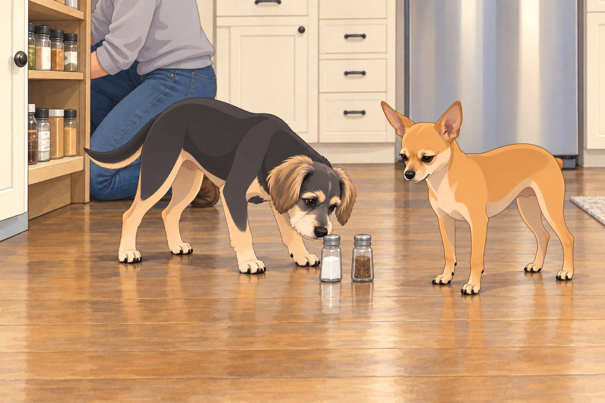
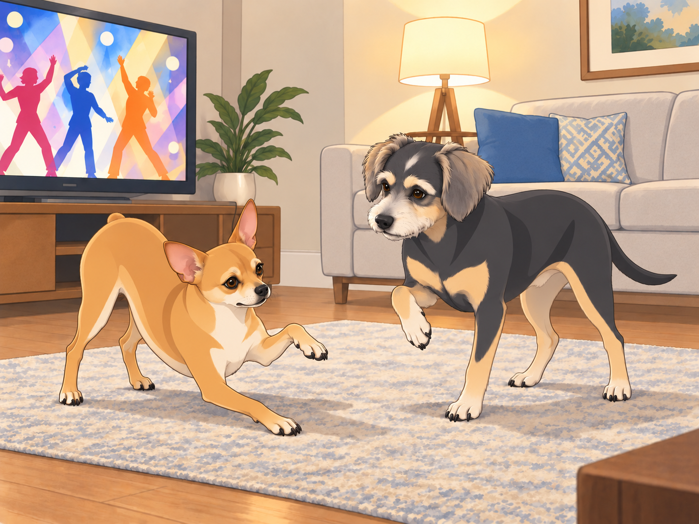
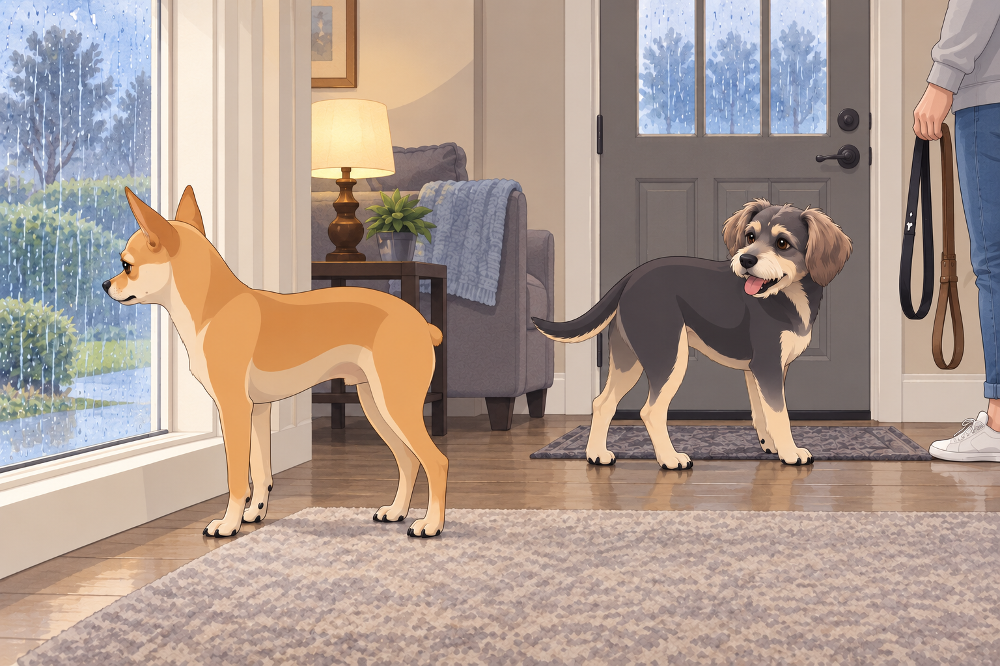

# The Homecoming Blues

After their whirlwind adventures abroad, Heather, Neet, and Buddy finally settled back into their cozy suburban home. The familiar sights and sounds of the U.S. surrounded them, but something felt... off.

Neet sprawled dramatically across the couch, sighing loudly. "It's so... quiet here."

Buddy glanced up from his spot on the rug. "Isn't that a good thing?"

"No honking, no street vendors, no spontaneous cow parades," Neet continued, ignoring Buddy. "I miss the chaos!"

Heather chuckled as she unpacked their suitcases. "I never thought I'd hear you say that."

Buddy closed his eyes. The refrigerator hummed. A bird chirped.

Neet sighed again, louder.

"The quiet's putting up a fight," Buddy said.

## The Great Spice Crisis

One evening, Heather decided to cook dinner. She reached into the spice cabinet and frowned. "Where's the garam masala?"

Neet perked up. "Probably still in India, where the real flavor is."

Buddy nodded. "Remember the street food? The samosas, the chaat..."

Neet's eyes glazed over. "The pani puri... Oh, the glorious pani puri..."

Heather sighed. "I guess we'll have to make do with what we have."

Neet gasped. "Make do? With these bland spices? This is culinary blasphemy!"

Buddy sniffed the open cabinet. "We could start by finding the salt and pepper." He missed the food too, but dinner still had to happen here.

Heather set the two little shakers on the floor beside the cabinet while she searched the back shelf. Buddy nosed the salt toward Neet, offering what help he could. Neet stared at the pair.

"That's the entire rescue party?"

"They came together," Buddy said.

Heather found the cumin behind the cinnamon. Both dogs immediately abandoned the salt.

## The Auto Rickshaw Withdrawal

A few days later, Heather suggested a walk to the park. As they strolled through the quiet neighborhood, Neet looked around wistfully.

"Remember the auto rickshaws? The thrill of weaving through traffic, the wind in my fur..."

Buddy raised an eyebrow. "You mean the terror of near-death experiences?"

Neet sighed. "It was exhilarating."

Heather laughed. "Well, here we have... minivans."

Neet groaned. "It's just not the same."

A minivan stopped at the crossing. The driver waved them through. Buddy hurried gratefully across; Neet paused to study this failure of nerve.

"It's letting us win."

Heather gave his leash a gentle tug. "Accept graciously."

## The Bollywood Dance-Off

One night, Heather found Neet in front of the TV, attempting to dance.

"What are you doing?" she asked.

"Trying to recreate the magic of Bollywood," Neet replied, striking a dramatic pose.

Buddy watched him miss the same step twice. "Is that the bit the actor did, or your contribution?"

Neet huffed. "You just don't appreciate art."

Heather smiled. "Maybe we can find a local dance class?"

Neet's eyes lit up. "Do you think they have Bollywood dance classes here?"

Buddy got up and tried one careful step beside him. Neet stopped dancing to correct it, immediately less homesick.

Buddy put the paw down, then lifted the other one.

"No, the first one."

"It was wrong a second ago."

Heather sat down to watch. For the first time all week, nobody compared the living room unfavorably with another continent.

## The Chai Conundrum

Heather decided to surprise the boys with some homemade chai. She handed them each a cup.

Neet took a sip and immediately spat it out. "What is this?"

"Chai," Heather said, taken aback.

"This is not chai," Neet declared. "This is an insult to chai."

Buddy took a cautious sip. "It's... different."

Neet shook his head. "We need to find a proper chaiwala. Immediately."

Heather laughed. "I'll see what I can do."

Buddy pushed his cup gently away, determined not to offend her. It bumped Neet's.

"Are you giving me yours?"

"I was hoping we could share a complaint."

Heather collected both cups. "Wonderful. Less washing up."

## The Melodramatic Monsoon

One afternoon, it started to rain. Neet pressed his nose against the window, watching the drizzle.

"It's not the same," he murmured.

Buddy looked up. "What isn't?"

"The monsoons," Neet said. "In India, the rain was... alive. Here, it's just wet."

Heather patted his head. "Maybe we can visit during monsoon season next year."

Neet sighed. "It's not just the rain. It's the spirit of it all."

Buddy nudged him. "Come on. We can miss it and still go for a walk."

Neet managed a small smile. "I suppose you're right."

Buddy waited beside the door while Heather found the leashes.

Neet gave the rain one more doubtful look, then joined him. It was still only wet. But there might be something worth smelling in it.

Outside, Buddy plunged his nose into the damp grass. Neet tried the next patch.

"Anything?" Buddy asked.

Neet sniffed again, thoroughly. "Too early to condemn it."

Heather let them take their time.

## Refinement record

October 4, 2026: second comedy pass and three proposed contextual illustrations. Full source comparison, variant assessment and pending independent reviews are recorded in [comedy pass v002](../Productions/E026-the-homecoming-blues/comedy-pass-v002.json) and the episode record. Style and human likeness remain provisional.

October 3, 2026: individually refined and compared with the complete pre-refinement text. Creative choices, preserved incidents and pending illustration stages are recorded in [the episode record](../Productions/E026-the-homecoming-blues/episode.json). Original bytes remain in the external snapshot `/Users/sagar/Documents/ChatGPT/NBC_Archives/NBC-before-refinement-2026-10-03_200659.tar.gz` (member `NBC/Stories/S026-the-homecoming-blues.md`). This revision establishes no owner approval.

## Provenance and editorial notes

Working selection dated October 3, 2026. Selection and shelf order are editorial; owner approval and event chronology remain unverified.

Original numbering: manuscript Chapter 27.

Archive recovery: use [Studio recovery guidance](../Studio/Recovery.md). The paths below are paths **inside the verified snapshot**, not active navigation. SHA-256 pins identify the exact sources.

- `legacy-ch27` — `02_Story_Library/Legacy_Chapters/27-the-homecoming-blues.md`; SHA-256 `ff79829f6e58ec47c2c0e02f5a0bfc98d85908746663395ec167c191d6b430b7`.
- `elevenlabs-reader-43` — `90_Archive/2026-10-03-elevenlabs-recovery/Raw_Exports/reader-43.txt`; SHA-256 `cf86b32090f2751cf096b90bcbb93f22c55f7c2de7a6cf0075be00c88139f823`.
