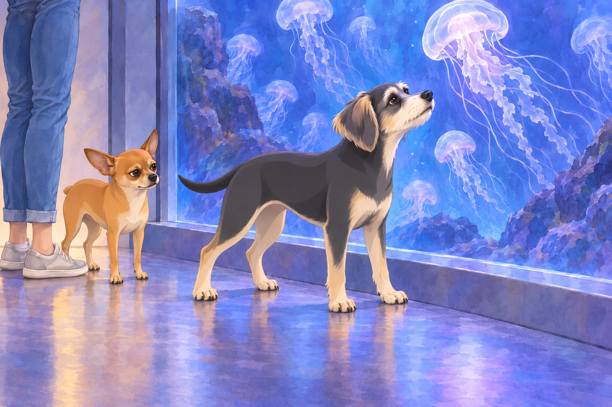
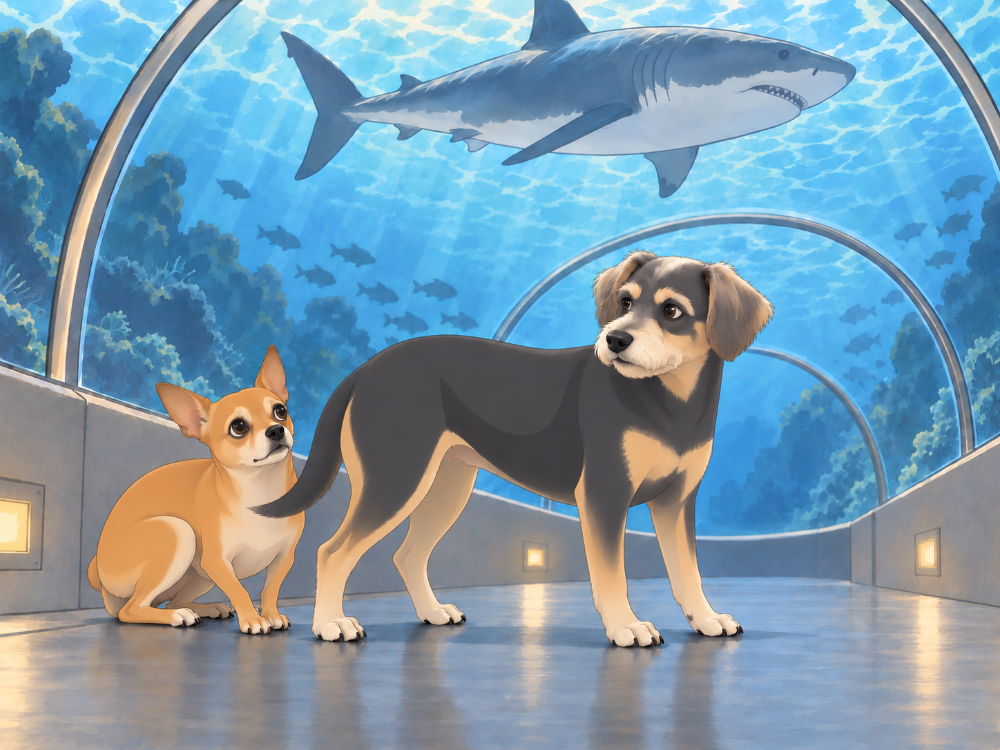
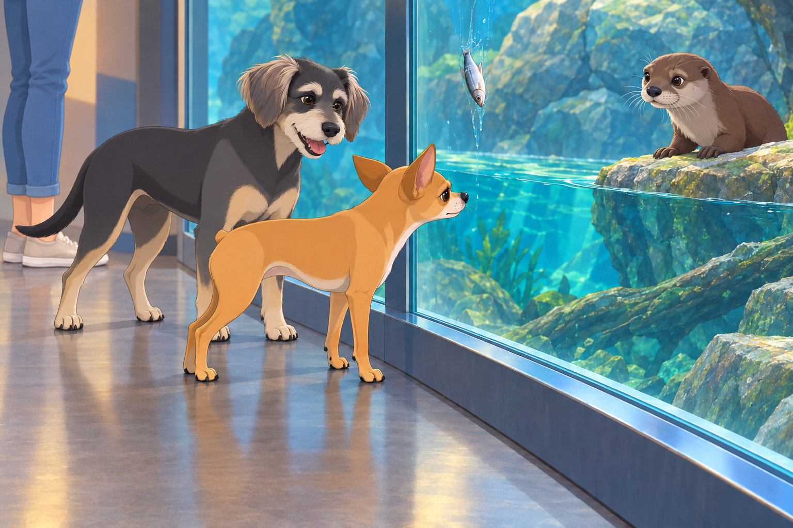

# Heather’s Birthday and the Aquarium Chaos

Heather’s birthday was fast approaching, and while she hadn’t made any grand plans, Neet and Buddy had their own ideas.

“We should throw her a surprise party,” Buddy suggested.

Neet scoffed. “Too basic. We need something spectacular. Something memorable.”

Buddy tilted his head. “Like what?”

Neet grinned mischievously. “A trip to the aquarium.”

Buddy frowned. “Neet, do you even know what an aquarium is?”

Neet nodded confidently. “Of course. It’s like a giant underwater dog park.”

Buddy considered it. Heather liked watching things swim. “All right. But it’s her birthday. We let her choose what to look at.”

“Obviously,” said Neet. “She can choose any of the things I find.”

## The Grand Arrival

The morning of Heather’s birthday, Neet and Buddy woke her up with excessive tail wagging and chaotic barking.

“Surprise! We’re taking you somewhere special!” Neet announced.

Heather blinked sleepily. “Is it a spa day?”

“Better!” Neet chirped. “The aquarium!”

Heather groaned. “This can only end badly.”

Despite her concerns, she loaded the boys into the car and drove to the city’s largest aquarium. The moment they arrived, Neet’s excitement went into overdrive.

“LOOK AT ALL THIS WATER!” he howled. “I WANT TO SWIM WITH THE FISHES!”

Buddy pulled him back. “That’s not how aquariums work.”

Heather sighed as she collected their tickets. “Guys, please don’t cause a scene.”

Neet snorted. “Since when have we ever caused a scene?”

Buddy drew breath.

“Not on her birthday,” Neet said quickly.

## Meeting the Residents

Their first stop was the jellyfish exhibit. Buddy admired their graceful movements, while Neet was immediately suspicious.

“They’re floating menaces,” he muttered. “I can feel it.”

Heather chuckled. “Neet, they’re harmless behind the glass.”

Neet narrowed his eyes. “That’s what they want you to think.”

Buddy moved closer to the glass. A jellyfish rose. He lifted his chin with it. It sank. His chin sank.

Heather stood beside him for a whole quiet minute.

Neet watched them both. “It’s got you doing it now.”

Things only escalated at the shark tunnel.

“HEATHER, IT’S COMING FOR US!” Neet shrieked, hiding behind Buddy.

Buddy stayed where he was so Neet could shelter behind him. “Look. It went over us. There’s glass.”

Neet huffed. “You don’t know that. I’ve seen movies. The glass always breaks.”

Heather sighed. “Maybe we should move on.”

Then they reached the penguin enclosure, where Neet pressed his face against the glass, mesmerized. "Are these birds broken? Why aren’t they flying?"

Buddy rolled his eyes. "They swim instead."

Neet gasped. "Aquatic birds? This changes everything. I need one."

Heather pulled him away. "We are not adopting a penguin."

Neet looked back. The penguin turned and waddled off without him.

“That was mutual,” Buddy said.

## The Touch Tank Fiasco

Heather leaned over to gently pet a stingray.

Neet, however, took this as an invitation for chaos.

“I MUST TOUCH THE SEA CREATURES!” he howled, lunging forward.

Before Buddy could stop him, Neet was on the edge of the tank, stretching his little paws toward an unsuspecting horseshoe crab.

The staff rushed over. “Ma’am, please keep your dog away from the—”

SPLASH!

Neet, true to form, fell in.

Chaos erupted. The stingrays scattered. Heather gasped. Buddy facepawed.

“I’M IN THE OCEAN NOW!” Neet yelped, paddling in place. “I HAVE JOINED THE SEA CREATURES!”

A nearby toddler clapped excitedly. "Look, Mommy! A dogfish!"

The staff managed to fish him out, wrapping him in a towel while Heather apologized profusely.

Buddy stayed beside Heather. She had barely seen the tank. He nudged her hand back toward the water, then planted himself between Neet and the edge.

Heather gave the passing stingray one last gentle touch.

“Birthday girl gets a turn,” Buddy told the towel.

Neet shivered dramatically. “I was one with the water.”

Heather rubbed her temples. “We need to leave before we get banned.”

## The Otter Incident

While Neet was drying off, Buddy wandered over to the otter exhibit and was instantly captivated by their playful antics.

"They look like water weasels!" Buddy barked in excitement.

An otter slid off a rock. Buddy rushed to the other end of the window to meet it. It doubled back. Buddy doubled back.

“Who’s taking whom somewhere special?” Heather asked.

Buddy stopped, one paw still raised. “I’m showing you the whole exhibit.”

Neet peered over. "They remind me of me. Small, mischievous, and always up to something."

As if on cue, an otter locked eyes with Neet, grabbed a fish from its trainer, and threw it straight at the glass where Neet stood.

Buddy wheezed. "You’ve been challenged."

The fish slid slowly down the far side of the glass. Neet followed it with his eyes without moving his head.

Neet’s eyes narrowed. "This means war."

Heather dragged them away before Neet could return fire with a stolen bread roll from the cafeteria.

## The Birthday Dinner Surprise

After drying off, they decided to end the day with dinner at a seafood restaurant.

Neet, now fully dry and still unapologetic, sat at the table with a smug grin.

Heather looked at her menu. “What are you guys getting?”

Buddy sighed. “Anything not from the aquarium.”

Neet gasped. “You mean some of those fish were from the aquarium?!”

Heather rolled her eyes. “No, Neet.”

Neet exhaled in relief. “Good. Because I made connections in there.”

Buddy groaned. “You made a mess.”

Heather laughed. “Well, this was definitely a memorable birthday.”

Neet wagged his tail. “Only the best for you, Heather!”

Heather lifted her glass; the dogs nudged their water bowls toward her. Buddy watched her laugh, then returned to his menu.

“Next year,” he said, “I’m throwing the surprise party.”

Neet leaned closer. “With a pool?”

Buddy folded the menu over his nose. Heather laughed again.

## Meaningful alternative

The shorter aquarium version removes the penguin exchange, the toddler’s “dogfish” remark and **The Otter Incident**. After Heather’s “Maybe we should move on,” it uses this bridge before **The Touch Tank Fiasco**:

> The real trouble, however, started at the touch tank.

The birthday dinner, final toast and next-year surprise-party callback remain. The jellyfish and shark pictures depict shared incidents; the otter picture is omitted with **The Otter Incident**. The primary keeps the complete aquarium incidents; the archived shortened capture is identified below.

## Refinement record

October 4, 2026: second comedy pass preserves the full aquarium itinerary and separate abridgement route. Buddy now secures Heather’s turn at the touch tank and becomes comically caught up in the otters himself. Expanded illustration and comparison evidence live in the episode folder; independent review remains pending.

October 3, 2026: individually refined and compared with the complete pre-refinement text. Creative choices, preserved incidents and pending illustration stages are recorded in [the episode record](../Productions/E027-heathers-birthday-and-the-aquarium-chaos/episode.json). Original bytes remain in the external snapshot `/Users/sagar/Documents/ChatGPT/NBC_Archives/NBC-before-refinement-2026-10-03_200659.tar.gz` (member `NBC/Stories/S027-heathers-birthday-and-the-aquarium-chaos.md`). This revision establishes no owner approval.

## Provenance and editorial notes

Working selection dated October 3, 2026. Selection and shelf order are editorial; owner approval and event chronology remain unverified.

Original numbering: manuscript Chapter 28.

Archive recovery: use [Studio recovery guidance](../Studio/Recovery.md). The paths below are paths **inside the verified snapshot**, not active navigation. SHA-256 pins identify the exact sources.

- `legacy-ch28` — `02_Story_Library/Legacy_Chapters/28-heather-s-birthday-and-the-aquarium-chaos.md`; SHA-256 `8e1d0d2bfc1ccd496fb13e07cf9c2f5174db3027e40f5e61518053889081b960`.
- `elevenlabs-reader-42` — `02_Story_Library/ElevenLabs_Imports/reader-42-heathers-birthday-and-the-aquarium-chaos.txt`; SHA-256 `f054a3d8437a6acc7b00c34ccf444553f9be09a5fb4c10ccd73482693b6c0a4b`.
- `elevenlabs-reader-41` — `90_Archive/2026-10-03-elevenlabs-recovery/Raw_Exports/reader-41.txt`; SHA-256 `ab81efbecb8de41506d3a78d4c8312ebc73f06b35d34ef9392270150ee6b20dc`.
