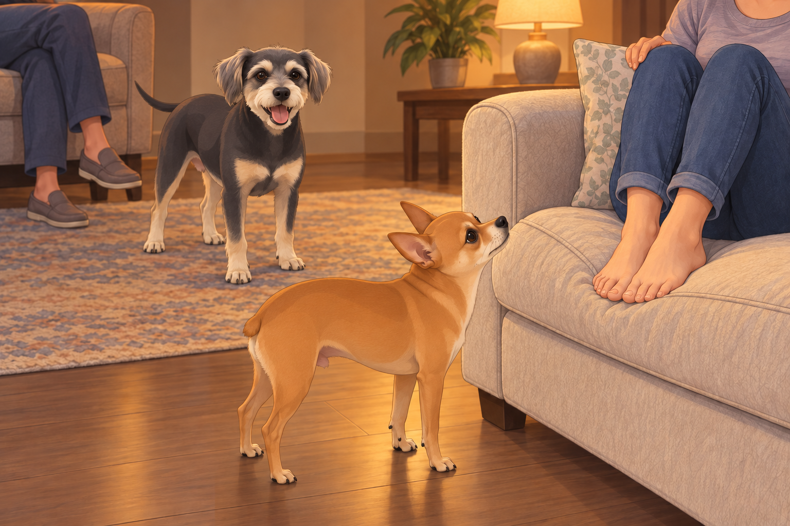
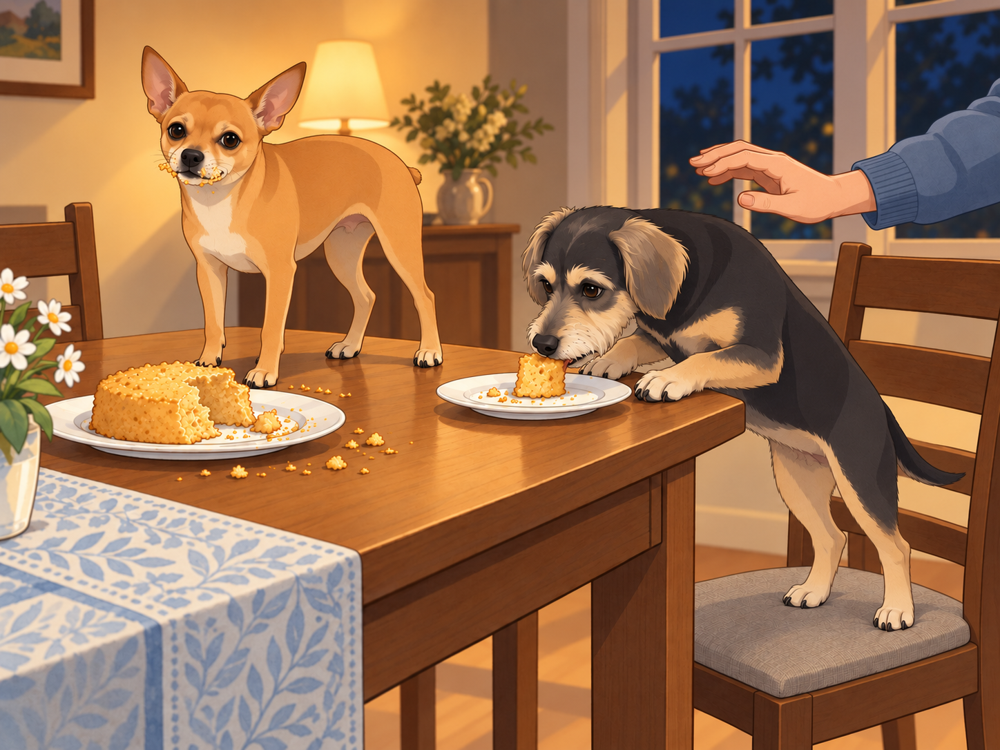

# The Birthday Get-Together and the Sheera Cake Saga

After the chaotic yet unforgettable aquarium adventure, Heather’s birthday celebrations weren’t over yet. That evening, she had invited a few close friends over for a small get-together at her house. There was just one small problem.

Some of her friends were scared of dogs.

Neet gasped dramatically when Heather broke the news. "Scared? Of me?! But I am a delight!"

Buddy sighed. "I mean, to be fair, you did jump into an aquarium today. That can be a lot for some people."

Heather knelt beside them. "Guys, I promise I’ll introduce you properly, but for now, you have to stay in the guest room while everyone settles in."

Neet squinted. "So what you’re saying is… we have to be in quarantine?"

Heather groaned. "It’s not quarantine. It’s just—"

Neet threw himself on the floor. "I refuse to be silenced!"

Buddy stood in the guest-room doorway and waited. "Come on, Shakespeare. She said she’d come back." Neet followed, still complaining.

## Operation: Meet the Humans

Once all of Heather’s friends arrived, the party was lively with laughter, music, and the mouthwatering smell of food. Meanwhile, in the guest room, Neet was plotting.

"Alright, we need a strategy to make them love us," Neet whispered to Buddy. "Step one: Charm offensive. Step two: Selective whining. Step three: Dessert heist."

Buddy wanted a place beside somebody who would scratch his ears. He had a simpler plan: sit down, stay still, look available.

"You always end with a heist," he said.

Neet wagged his tail. "Because it works."

After a while, Heather peeked into the room. "Alright, guys. Time to meet everyone. Please— please behave."

Neet grinned. "I am the embodiment of good behavior."

Buddy moved one pace away from him. He wanted his own introduction.

Heather didn’t buy it but sighed and opened the door.

The guests all turned as Neet and Buddy walked in.

Neet struck a majestic pose. "Hello, humans!"

Buddy rolled his eyes. "You’re not a wizard."

One of Heather’s friends, Priya, immediately stepped back. "Um… they don’t bite, right?"

Neet gasped. "I only bite when necessary."

Heather laughed nervously. "They’re super friendly. Just, um, let them come to you."

Buddy stopped a little way from one of the nervous guests and sat. He wanted a pat, but he let her choose the distance. When she held out a hand, he went the last step. Her shoulders dropped. Buddy leaned into the offered scratch, just enough to suggest that this could be a long-term arrangement.

Neet watched for a moment. Apparently Buddy’s entire performance was sitting. He could improve on that.

He darted from person to person, sniffing their feet, jumping onto the couch, and— when Priya least expected it— licked her ankle.

Priya shrieked. "IT TOUCHED ME!"

Neet looked up. "That’s called friendship."

Priya lifted both feet onto the couch. Neet took this as room being made for him.

Heather, mortified, scooped Neet up. "Neet!"

Neet wagged his tail. "She screamed. That means we’ve bonded."

## The Sheera Cake Revelation

After the initial introductions (and mild panic), the party settled into a comfortable rhythm. Then came the highlight of the evening: the Sheera Cake.

One of Heather’s friends, Arjun, had made a traditional Indian Sheera cake, a rich and fragrant dessert made with semolina, ghee, and cardamom. As soon as the smell filled the air, Neet and Buddy’s heads snapped toward the kitchen.

Neet drooled. "I need it."

Buddy whispered, "Stay cool." He kept his seat beneath the scratching hand. His nose, however, had already left the conversation.

Heather cut the first slice, and the moment it hit her tongue, she gasped. "Oh my gosh. This is incredible."

Everyone grabbed a slice, and within moments, they were raving about the cake.

Neet couldn’t take it anymore.

In a move that could only be described as part desperation, part acrobatics, Neet leaped onto the dining chair, then onto the table, and grabbed an entire chunk of cake before Heather could stop him.

"NEET!"

Too late.

Neet chomped into the Sheera cake with the enthusiasm of someone who had just discovered the meaning of life.

His eyes widened.

"Oh… my… DOG."

Buddy looked from the cake to the guest who had been stroking him. She was looking at Neet.

He had worked hard to become the trustworthy one.

He climbed onto the dining chair, planted his forepaws on the table edge, and took a piece from a plate. He did it quietly, as though volume were the objection.

Everyone at the table stared in shock.

Arjun shook his head. "I mean… I should be mad, but honestly? I respect it."

Heather covered her eyes. Neet licked the crumbs off his nose. "I regret nothing."

Buddy swallowed. "That was… divine."

Heather sighed but couldn’t help laughing. "Fine. Happy birthday to me, I guess."

Arjun moved the rest of the cake to the counter. Buddy sat beside his new friend again, carefully licking the last crumb from his beard. She looked at him. He sat a little straighter.

"Oh, you too," she said, and scratched his ears.

Neet was still trying to look as though this had been the planned introduction.

"Step three," he whispered.

Buddy closed his eyes beneath the hand. "I’m staying on step one."

## Refinement record

October 4, 2026: second comedy pass strengthens Buddy’s independent bid for affection, Neet’s misreading of the ankle-lick reception, and Buddy’s quiet abandonment of respectability for cake. The final callback gives both dogs different versions of success. Original incidents and historical household remain; no distinct narrative alternative was found in the two complete source witnesses. Expanded production and pending independent reviews are recorded in the episode folder.

October 3, 2026: individually refined and compared with the complete pre-refinement text. Creative choices, preserved incidents and pending illustration stages are recorded in [the episode record](../Productions/E028-the-birthday-get-together-and-the-sheera-cake-saga/episode.json). Original bytes remain in the external snapshot `/Users/sagar/Documents/ChatGPT/NBC_Archives/NBC-before-refinement-2026-10-03_200659.tar.gz` (member `NBC/Stories/S028-the-birthday-get-together-and-the-sheera-cake-saga.md`). This revision establishes no owner approval.

## Provenance and editorial notes

Working selection dated October 3, 2026. Selection and shelf order are editorial; owner approval and event chronology remain unverified.

Original numbering: manuscript Chapter 29.

Archive recovery: use [Studio recovery guidance](../Studio/Recovery.md). The paths below are paths **inside the verified snapshot**, not active navigation. SHA-256 pins identify the exact sources.

- `legacy-ch29` — `02_Story_Library/Legacy_Chapters/29-the-birthday-get-together-and-the-sheera-cake-saga.md`; SHA-256 `4baf1da22488f93c215d4c71b8fa8b95047f223b8d39b457d5e02e7a50cd4634`.
- `elevenlabs-reader-40` — `90_Archive/2026-10-03-elevenlabs-recovery/Raw_Exports/reader-40.txt`; SHA-256 `8a74b696ee78cf2973e24562c6e1c3e027033a32873d91e6122298f166875043`.
