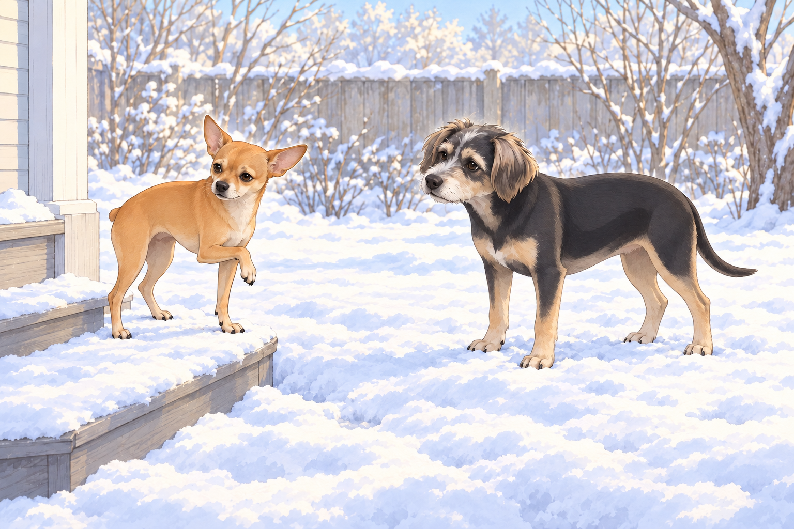
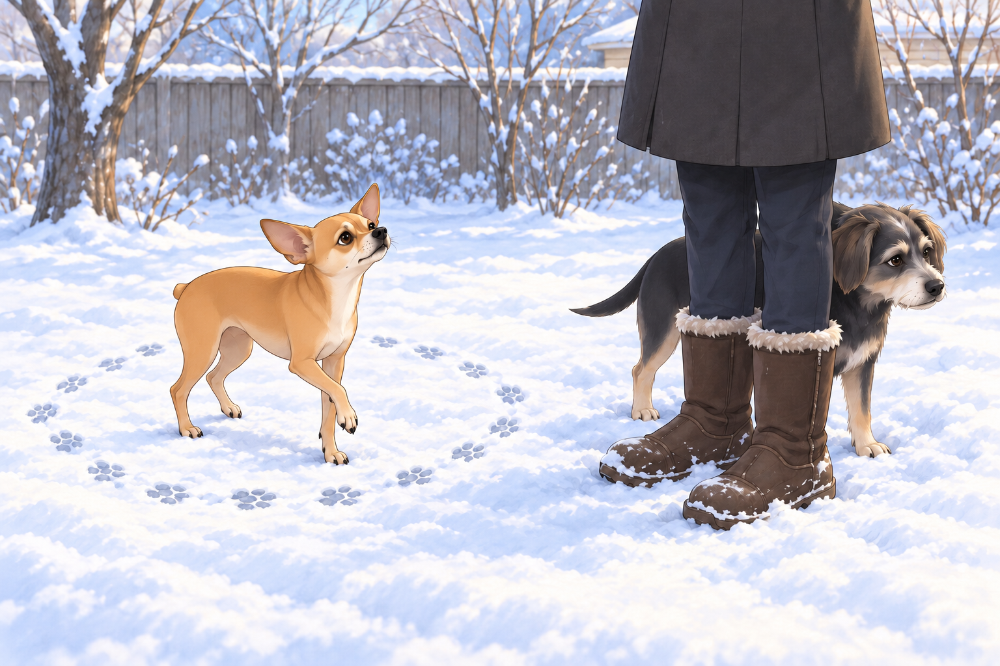
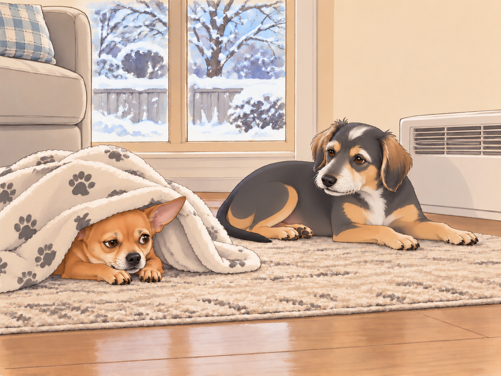

# Winter Woes and the Battle of the Backyard

Winter had arrived, and with it came icy winds, frigid mornings, and Neet’s absolute refusal to cooperate.

Heather groaned as her alarm buzzed at 6:30 AM. She bundled herself up in multiple layers before trudging towards the door where Buddy and Neet waited— one eager, the other on the verge of staging a full-scale protest.

“I am not going out there,” Neet declared, dramatically flopping onto the floor.

Buddy rolled his eyes. “Neet, it’s just for a few minutes. We do this every morning.”

Heather sighed, pulling on her gloves. “Neet, unless you’ve learned how to use the toilet indoors, you have to go outside.”

Neet scoffed. “I can hold it until spring.”

Buddy put his nose against the door. His plan was to be back by the heater before the warm spot forgot him.

“Spring can come. I’m going now.”

## The Great Outdoor Stand-Off

Heather coaxed Neet over the threshold. The icy wind did not help her case.

Neet yelped. "THIS IS INHUMANE!"

Buddy, already trotting toward the designated bathroom spot, sighed. “Just get it over with, Neet.”

Neet, still clinging to the porch, narrowed his eyes. "You go first. I need to assess the dangers."

Buddy picked his spot and got down to business. Heather watched as he finished, shook the snow off his paws, and trotted back victoriously.

“See? Not so bad,” Buddy said. “Now your turn.”

He stood beside the door, ready for it to open. It didn’t. He looked at Heather, then at Neet, then at the door again.

Neet peered at the snow-covered ground like it was lava. "I’ll sink! The snow will eat me!"

Heather pinched the bridge of her nose. "Neet, you weigh five pounds. You’re not going to sink."

Neet’s ears flattened. "I can’t feel my tail already. This is the end for me."

Buddy nudged Neet toward the patch he had already tested. “Here. Less snow.” He wanted them both indoors before his paws went cold again. He had completed his morning and somehow been assigned another one.

Neet finally relented, stepping delicately into the snow. His paws touched the frost, and he froze (metaphorically and literally). His face contorted in absolute betrayal. He lifted one front paw, put it down to lift the other, then looked offended by the available number of legs.

"I HATE THIS! I HATE EVERYTHING!" he howled dramatically.

## The Reluctant Poop

After what felt like an eternity, Neet finally found the perfect spot.

Heather, already shivering, encouraged him. "Come on, Neet, just finish up so we can go inside."

Neet turned in seventeen circles. Buddy followed the first two, thinking they were looking for somewhere better. On the third he stopped.

“Same spot,” he said as Neet passed him again.

Heather pulled her sleeves over her gloves. By the seventeenth circle, Buddy had tucked himself behind her boots to borrow the windbreak.

Neet checked the wind and inspected the sky for predator drones.

A gust of wind blew directly in his face.

Neet yelped and sprinted back to the porch. "NOPE! Nature is against me! I’m canceling this mission!"

Heather groaned. “NEET!”

Buddy emerged from behind her boots. All that inspection, and Neet had chosen the porch.

Buddy sighed. “You know this means you’ll have to go back outside later, right?”

Neet scoffed. “I will train my body to absorb waste before I step into that hellscape again.”

Heather shook her head. "Fine. But if you have an emergency inside, you’re explaining it to the carpet cleaner."

Neet gulped. "Noted."

## The Indoor Victory Lap

The moment they stepped back inside, Neet immediately came back to life.

"Oh wow, home is so nice. I love our house. So warm. So cozy." He stretched dramatically before diving into his blanket cocoon.

Buddy went straight to the heater and lowered himself into the warm spot. He put both front paws in it before Neet could propose sharing.

“You’re so dramatic,” he muttered.

Heather collapsed onto the couch. "Tomorrow, we’re starting earlier. No negotiations."

Neet peeked out from his blanket fortress. "We’ll see."

Buddy stretched his paws toward the heater. Neet tucked his nose beneath the blanket.

“If I need to go later—” Neet began.

“You know the route,” said Buddy, and closed his eyes.

## Refinement record

October 4, 2026: second comedy pass gives Buddy a warm spot to regain, an unsuccessful attempt to help with the circling, and a final refusal to repeat the expedition. Preserved the seventeen circles, failed bathroom mission, historical Heather household, and unresolved source weight claim. Both original witnesses have the same narrative; no separate alternative scene is implied. Expanded production remains pending independent visual and full-reading review.

October 3, 2026: individually refined and compared with the complete pre-refinement text. Creative choices, preserved incidents and pending illustration stages are recorded in [the episode record](../Productions/E029-winter-woes-and-the-battle-of-the-backyard/episode.json). Original bytes remain in the external snapshot `/Users/sagar/Documents/ChatGPT/NBC_Archives/NBC-before-refinement-2026-10-03_200659.tar.gz` (member `NBC/Stories/S029-winter-woes-and-the-battle-of-the-backyard.md`). This revision establishes no owner approval.

## Provenance and editorial notes

Working selection dated October 3, 2026. Selection and shelf order are editorial; owner approval and event chronology remain unverified.

Original numbering: manuscript Chapter 30.

Archive recovery: use [Studio recovery guidance](../Studio/Recovery.md). The paths below are paths **inside the verified snapshot**, not active navigation. SHA-256 pins identify the exact sources.

- `legacy-ch30` — `02_Story_Library/Legacy_Chapters/30-winter-woes-and-the-battle-of-the-backyard.md`; SHA-256 `cb5c9b1b1c5f338552e4cbc27730fbd186f1a036ef947b410b995a4302f793a0`.
- `elevenlabs-reader-39` — `02_Story_Library/ElevenLabs_Imports/reader-39-winter-woes-and-the-battle-of-the-backyard.txt`; SHA-256 `5e46210822723b41548d2df380b4753157c975e4f9865483759508e6c2dceb51`.
