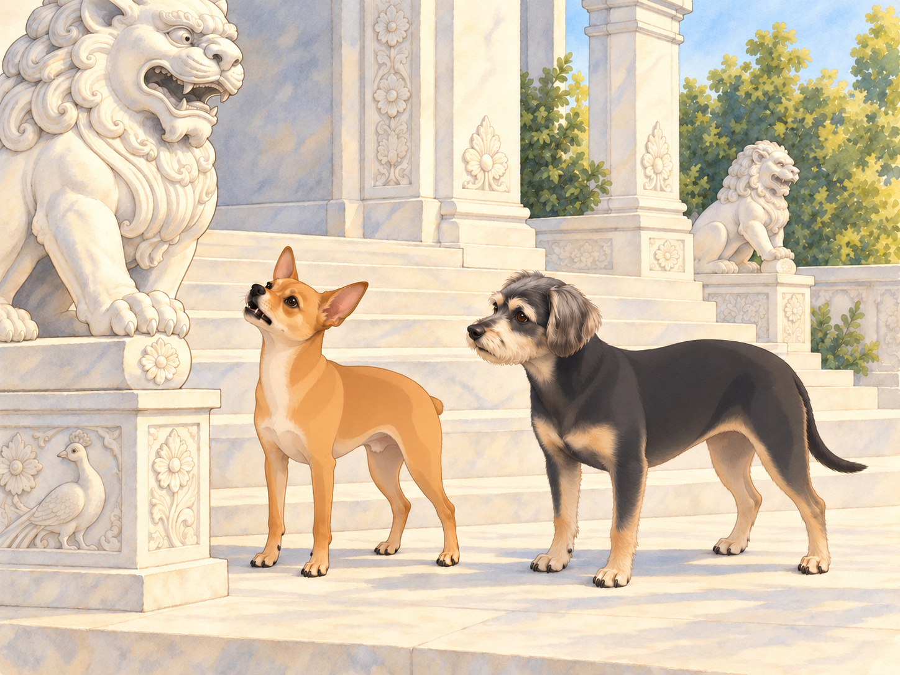
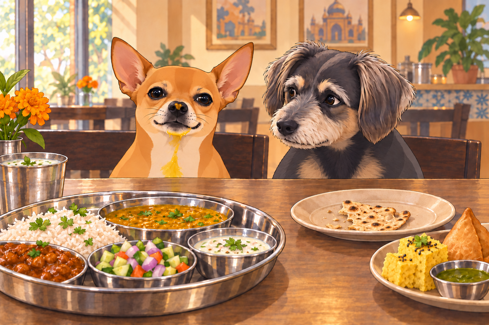
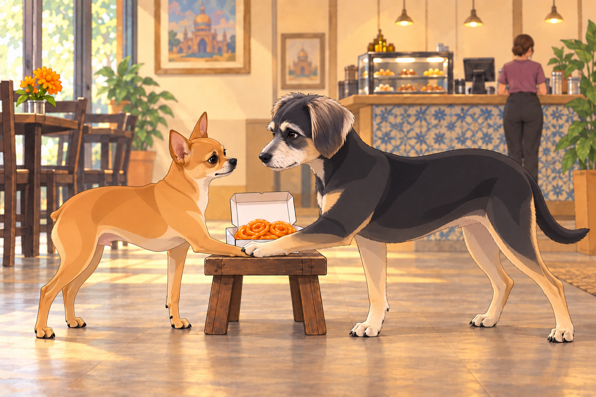

# The Temple Visit and the Great Gujarati Thali Feast

It was a crisp Sunday morning when Heather decided to take Neet and Buddy on a spiritual and culinary adventure. They were going to the white-marble Indian temple. Heather wanted to see the carvings. The dogs had heard the word café.

Neet, who had no concept of spirituality but a deep appreciation for food, was already wagging his tail. "A place dedicated to food and peace? This is genius!"

Buddy wanted a quiet visit and something from the café afterward. He had a plan: behave so beautifully that Heather would offer seconds without being asked. He looked at Neet. "Let’s just make sure we behave."

Heather sighed. "Neet, that means no barking at statues and no begging for extra food."

Neet smirked. "I can’t make any promises."

## The Marvelous Architecture (and Neet’s Interpretation of It)

As they approached the temple, Heather was awestruck by its intricate carvings, delicate domes, and grand staircases leading to the main sanctum.

Neet, however, had other observations.

"WHY ARE THERE SO MANY LIONS?" he barked, pointing a paw at the carved stone figures.

Buddy sighed. "They’re guardians, Neet. Symbolic protection."

Neet gasped. "Symbolic?! I thought this was a warning! Like beware, real lions ahead!"

The lion did not answer. Neet checked the other lion in case it was in charge.

Heather shushed him. "Neet, stop yelling ‘lions’ in a place of worship."

After a few more dramatic exclamations about "the unnecessarily large amount of peacocks" in the carvings, they finally entered the temple, where Neet almost tripped over his own paws upon seeing the main idol.

"Heather, that is a gigantic statue. I feel underdressed."

Buddy looked down at his own bare paws, then stood a little straighter. "You are underdressed. You’re a dog."

## The Café of Dreams

After a brief and mostly peaceful tour, they finally arrived at the temple café, a paradise of Indian snacks and sweets.

Neet’s nose twitched. "Do you smell that? That’s the smell of destiny."

Buddy wagged his tail. "It’s the smell of Gujarati Thali."

Heather ordered a full Gujarati thali, and soon, their table was overflowing with food:

Rotli (thin flatbread)

Dal (lentil soup)

Shaak (vegetable curries)

Kadhi (yogurt-based curry)

Dhokla (savory steamed cakes)

Samosas

Aamras (mango purée)

Chaas (buttermilk)

Neet’s eyes widened. "I have never been this happy."

Heather handed Buddy a small piece of roti. "Buddy, go easy on the dal. It’s spiced differently."

Buddy took a polite bite and wagged his tail. "It’s delicious!" He swallowed, sat straight on the café bench, and looked at Heather without looking at the remaining roti. This required looking at it several times to check where not to look.

Neet, on the other hand, dove in headfirst.

Within seconds, dal was on his nose, aamras in his fur, and he was slurping chaas like it was his life’s mission.

Heather sighed. "Neet, slow down!"

Neet shook his head. "I can’t. I am becoming one with the thali."

Buddy edged his roti out of the splash zone. "You’re wearing more food than you’re eating."

As Neet tried to simultaneously chew a dhokla and a samosa, he suddenly paused. His eyes widened.

"SPICY! SPICY! SPICY!" he yelped, fanning his tongue.

Heather calmly handed him a glass of chaas. "This is why we pace ourselves."

Neet gulped it down, then exhaled dramatically. "That was a close call. But totally worth it."

Heather wiped his nose with a napkin. Buddy sat even straighter.

"And you’ve been very patient," she told Buddy, giving him another piece of roti.

Buddy accepted it with dignity, then ate it before Neet finished being wiped.

## The Snack Heist

After thoroughly embarrassing themselves at the café, it was time to leave. But before heading out, Heather decided to grab some snacks to go— a decision that immediately reawakened Neet’s chaotic tendencies.

Heather picked up:

Jalebi (crispy sugar spirals)

Fafda (crispy gram flour sticks)

Khandvi (gram flour rolls)

Gulab Jamun (syrupy dumplings)

Neet, mesmerized, whispered, "I will be taking some of those back home."

Heather set the open snack box on a low stool beside her while she paid at the counter. Neet ever so casually attempted to swipe a piece of jalebi. He moved one paw at a time, as though this made the rest of him innocent.

Buddy put his paw across Neet’s before it reached the jalebi. "She’s paying. Wait." He was not losing his own snack because Neet couldn’t manage ten seconds.

Neet grumbled. "Okay, but what if it—"

Buddy kept his paw where it was. He looked at the jalebi himself. Waiting was becoming considerably harder now that he was responsible for it.

Neet sighed. "Fine, fine. We do this legally."

Heather, noticing Neet’s desperation, handed him one small piece of fafda.

Neet held it like it was the holy grail. "This is the best day of my life."

## The Ride Home (and the Aftermath)

On the way home, Neet sat smugly with his bag of snacks, his stomach full, and his spirit enlightened (mostly by food).

"I have ascended today," Neet declared. "Spiritually and gastronomically."

Buddy rolled his eyes. "You have farsan crumbs in your fur."

Heather chuckled. "So, would you guys come back here again?"

Buddy wagged his tail. "Absolutely."

Neet gasped. "We’re allowed to come back?! After all that?!"

Heather smirked. "Shockingly, yes."

Neet grinned. "In that case… I think we need another thali next week."

Buddy sighed. "Let’s recover from this one first."

Buddy settled with his nose near the closed snack bag. Neet eyed it once, then lay down too.

"Symbolic protection?" he asked.

Buddy rested his chin beside the bag. "Try me."

For the rest of the ride, the jalebi traveled undisturbed.

## Refinement record

October 4, 2026: second comedy pass develops Buddy’s quiet campaign for seconds, adds the silent second lion and the snack-guardian callback, and retains the historical Heather household, all named dishes, spice incident, stopped jalebi reach and fafda reward. The two full original witnesses differ in formatting rather than narrative; no independent alternative scene exists. Expanded artwork and reading remain pending independent review.

October 3, 2026: individually refined and compared with the complete pre-refinement text. Creative choices, preserved incidents and pending illustration stages are recorded in [the episode record](../Productions/E030-the-temple-visit-and-the-great-gujarati-thali-feast/episode.json). Original bytes remain in the external snapshot `/Users/sagar/Documents/ChatGPT/NBC_Archives/NBC-before-refinement-2026-10-03_200659.tar.gz` (member `NBC/Stories/S030-the-temple-visit-and-the-great-gujarati-thali-feast.md`). This revision establishes no owner approval.

## Provenance and editorial notes

Working selection dated October 3, 2026. Selection and shelf order are editorial; owner approval and event chronology remain unverified.

Original numbering: manuscript Chapter 31.

Archive recovery: use [Studio recovery guidance](../Studio/Recovery.md). The paths below are paths **inside the verified snapshot**, not active navigation. SHA-256 pins identify the exact sources.

- `legacy-ch31` — `02_Story_Library/Legacy_Chapters/31-the-temple-visit-and-the-great-gujarati-thali-feast.md`; SHA-256 `0a1d99bf805c7bf7756b2b26244f2a1623308ee8b42c0a23263e51810c95d304`.
- `elevenlabs-reader-38` — `02_Story_Library/ElevenLabs_Imports/reader-38-the-temple-visit-and-the-great-gujarati-thali-feast.txt`; SHA-256 `ff80c883aa952c590d2a88c1cb9c482c1df6b3a05e20a114aa7ceca2ef7de15b`.
