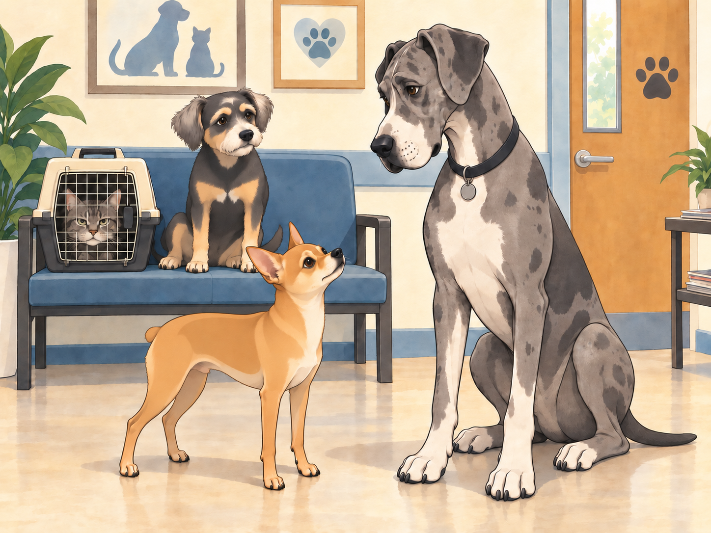
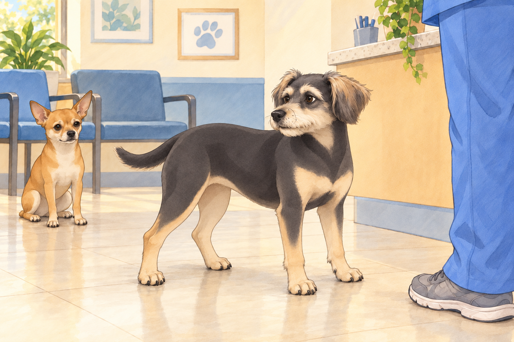
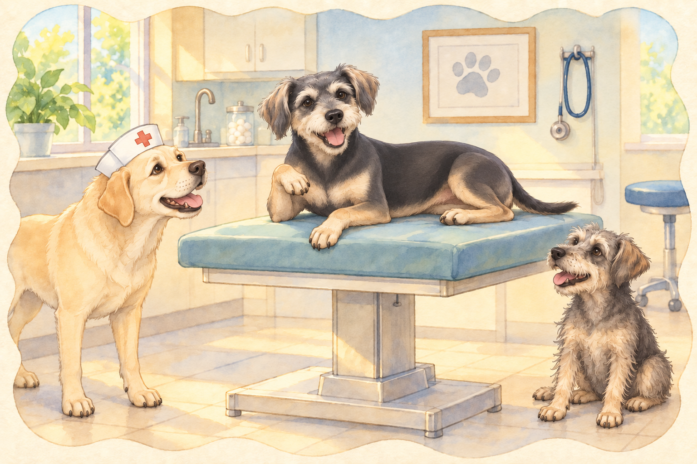

# Buddy’s Big Dental Adventure (Part 1)

It all started with a single toothache.

Buddy had been feeling a little off lately— chewing slower, avoiding his favorite crunchy treats, and giving Heather a concerned look whenever he tried to gnaw on his chew toy. Neet attempted an inspection, sticking his face far too close. “OH WOW, IT’S GROSS IN HERE!” Buddy closed his mouth and took his sore jaw to Heather. She put down his uneaten treat and called the vet.

## The Waiting Room Chronicles

As they arrived at the vet’s office, Buddy let out a long sigh. "This is going to be a long day."

Buddy tucked himself beside Heather’s knees. If he kept very still, perhaps they could wait without anything happening.

Neet, however, was thrilled. "So many smells! So many pets! We should make friends!"

Heather checked them in while Buddy found a seat next to a grumpy-looking tabby cat in a carrier. The cat squinted at him. "What’s your deal?"

Buddy sighed. "Dental surgery."

The cat shuddered. "Been there. Lost a tooth once. My human called me ‘Gappy’ for six months."

Buddy shifted to the far end of the seat. He had wanted reassurance. He now had a possible nickname.

Neet, already nose-deep in someone else’s business, trotted over to a gigantic Great Dane. "What’s wrong with you?"

The Great Dane blinked slowly. "I swallowed a sock."

Neet gasped. "A WHOLE SOCK?! You’re a legend!"

The Dane sighed. "It was not on purpose."

“Was it at least a clean—”

“Neet,” Buddy said. “Let him have a private sock.”

The Dane gave Buddy a grateful look. Then the vet tech called Buddy’s name. So much for keeping still.

## The Betrayal (Aka, Heather Leaves)

Buddy gulped as Heather patted his head. "Be a good boy, Bud. I’ll be back soon."

He watched in horror as she walked out the door.

"SHE LEFT ME!" Buddy yelped. "I’VE BEEN ABANDONED!"

Neet, still standing in the lobby, waved dramatically. "DON’T WORRY! I’LL INHERIT YOUR CHEW TOYS!"

Buddy stopped protesting long enough to turn around. “The blue one is still mine.”

Neet lowered his waving paw and sat down.

That settled, Buddy took one reluctant step toward the vet tech. She waited for him to look back one last time, then guided him inside. "All right, big guy. Let’s get that tooth sorted."

## The Land of Anesthesia and Strange Conversations

Buddy was placed on the exam table while the vet checked his chart.

"Alright, looks like we’ve got one tooth causing trouble. We’ll remove it and get you feeling better in no time."

Buddy swallowed. "Will I survive?"

The vet rested a hand on his shoulder. "We’ll look after you." Buddy leaned against the hand. It wasn’t Heather’s, but it would do for now.

Then came the anesthesia.

As the sedative kicked in, the room around Buddy started to shift. The lights got brighter. The walls stretched. And suddenly…

The vet dogs started talking.

A Labrador in a nurse’s cap leaned in. "How you feelin’, champ?"

Buddy squinted. "Like I’m floating… in a gravy boat."

A scruffy terrier from the corner barked, "OH BOY, IT’S HITTIN’ HIM!"

Buddy waved his paw lazily. "Wait… am I still a dog?"

The Labrador nodded. "Mhm. But right now? You’re a cool dog."

Buddy grinned dopily. "I am cool."

The terrier howled. "SOMEONE GET THIS GUY A GOLD TOOTH!"

Buddy tried to tell them that he had only come about the sore tooth. He also meant to ask whether Heather would know where to collect a gravy boat.

“Not too far,” he murmured.

The gravy boat was already carrying him away.

## Refinement record

October 4, 2026: a second comedy pass adds Buddy’s quiet-waiting strategy, protection of the Dane’s privacy, toy-ownership reversal and Heather-centered dream concern. Three complementary proposed images follow exact narrative states. See [expanded comedy comparison](../Productions/E031-buddys-big-dental-adventure-part-1/comedy-pass-v002.json). Independent expanded reviews remain separate from owner approval.

October 3, 2026: individually refined and compared with the complete pre-refinement text. Creative choices, preserved incidents and pending illustration stages are recorded in [the episode record](../Productions/E031-buddys-big-dental-adventure-part-1/episode.json). Original bytes remain in the external snapshot `/Users/sagar/Documents/ChatGPT/NBC_Archives/NBC-before-refinement-2026-10-03_200659.tar.gz` (member `NBC/Stories/S031-buddys-big-dental-adventure-part-1.md`). This revision establishes no owner approval.

## Provenance and editorial notes

Working selection dated October 3, 2026. Selection and shelf order are editorial; owner approval and event chronology remain unverified.

Original numbering: manuscript Chapter 32.

Archive recovery: use [Studio recovery guidance](../Studio/Recovery.md). The paths below are paths **inside the verified snapshot**, not active navigation. SHA-256 pins identify the exact sources.

- `legacy-ch32` — `02_Story_Library/Legacy_Chapters/32-buddy-s-big-dental-adventure-part-1.md`; SHA-256 `3e9fb3651a60c3c7abf69107242470bac9ef034b73e765452d1d0655a9e16940`.
