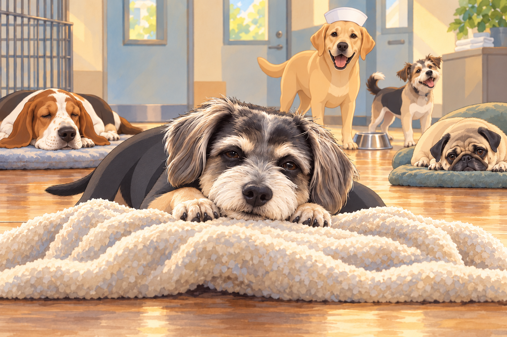
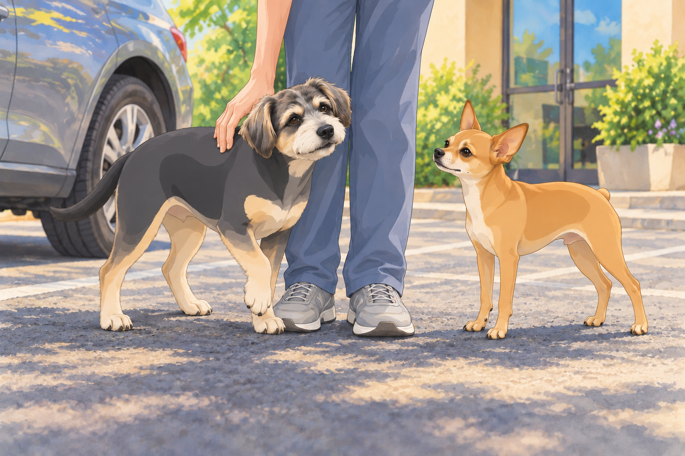
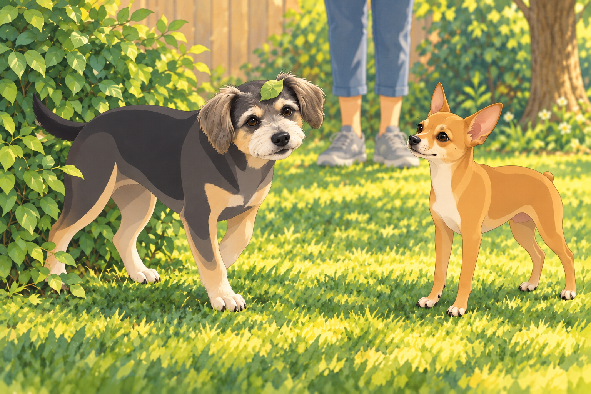
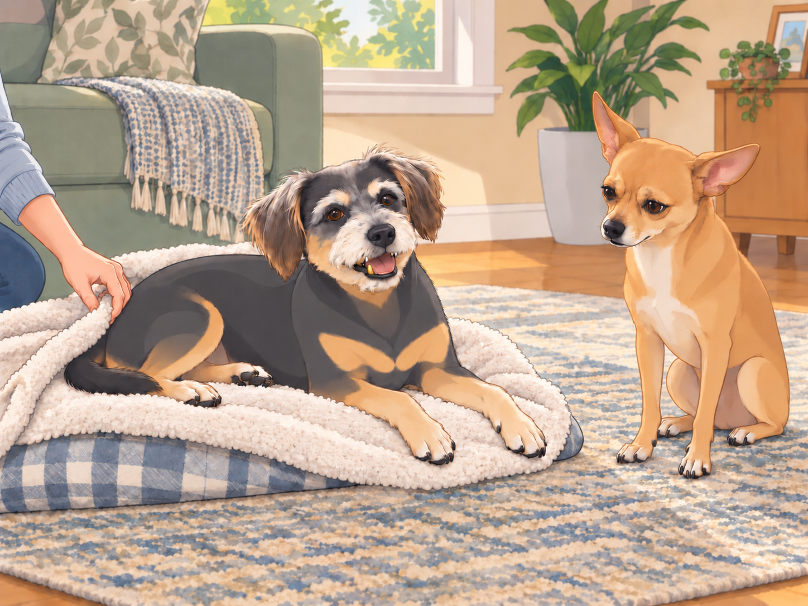

# Buddy’s Big Dental Adventure (Part 2)

Buddy slowly blinked awake. The world felt soft, warm, and incredibly weird.

His mouth was numb. His tongue felt three times its size. He tried to move but realized his legs were made of spaghetti.

“Whoa…” he murmured. “I think I’m levitating.”

Across the room, a sleepy basset hound snorted. "Dude, you are very much on the ground."

Buddy turned his head— or at least, he thought he did. Everything wobbled. "I just had… surgery? Am I… a wizard now?"

The Labrador nurse from earlier trotted over, chuckling. "Not quite, champ. But you do have a gold tooth now."

Buddy gasped. "I’M RICH?!"

A scruffy terrier from the far end of the room howled with laughter. "WE GOT A FANCY ONE, BOYS!"

Buddy, still processing his new golden status, turned to a pug lying next to him. "How do I look? Be honest."

The pug squinted. "You look… important. Like you should be in a rap video."

Buddy grinned drowsily. "I knew it."

He tried to sit a little more importantly. His chin sank back onto the blanket.

"A lying-down sort of important," the basset said.

Buddy decided that was the best sort.

## The Pickup and the Post-Surgery Struggle

Eventually, Heather arrived to pick up Buddy, who was still wobbling like a marshmallow on stilts.

“Hey, Bud,” she cooed, kneeling down. "How’re you feeling?"

Buddy, still loopy, tilted his head. "Heather… I have become elite."

Heather blinked. "Oh boy."

The vet tech chuckled. "He’s feeling good. He might be a little goofy for the next few hours."

Neet, who had been waiting in the car, watched Buddy wobble toward him.

“Why are you walking sideways?”

Buddy paused beside Neet. "Neet… I can see sound."

Neet tilted his head. "Can you hear me, then?" Buddy leaned against Heather’s leg instead of answering.

Heather steadied Buddy. "Slowly, Bud."

Buddy planted one paw, considered it, and put the next beside it. Heather waited. Neet opened his mouth to offer instructions.

"One of you at a time," Buddy told the two Neets.

The single Neet closed his mouth.

## The Bathroom Fiasco

Once they got home, Heather took Buddy and Neet outside for their usual bathroom break.

Buddy walked directly into a bush.

Neet peered into the leaves. "Buddy? Wrong entrance."

Buddy groggily backed out of the bush. A leaf rode out on his eyebrow. "Where… where’s the ground?"

Neet wheezed. "Buddy, you’re standing on it."

After regaining some composure, Buddy finally got into position to relieve himself— except nothing happened.

He blinked. "Why… why is it not working?"

Neet began to laugh, then stopped when Buddy looked back at him.

Buddy looked panicked. "What if I never pee again?! This is how it ends!"

Heather sighed, pinching the bridge of her nose. "You will pee again, Buddy. Just give it time."

Neet sat a little way off while Heather steadied Buddy. For once, there was nothing useful he could announce.

Buddy sighed dramatically. "I am… a shadow of my former self."

Then he leaned into Heather’s hand and chose the door. Neet followed, walking around the bush with unusual care.

## The Big Realization

After an hour of resting, with a few unsteady attempts to get comfortable, Buddy started feeling more like himself. He licked his lips, still getting used to the weird sensation in his mouth.

Then, he caught a glimpse of himself in the mirror.

The light hit his shiny golden tooth.

His eyes widened.

“Wait a minute…” Buddy whispered. “I HAVE A GOLD TOOTH.”

Neet, who had begun recounting the bush incident, stopped halfway through it.

Buddy turned toward him slowly. "Neet. Did you know about this?"

Neet blinked. "Uh…"

Buddy shifted until the light caught the tooth again. "That is rather good." He turned the same smile on Neet. "You were saying something about the bush?"

Neet’s ears flattened. "Oh no."

Buddy trotted up to him smugly. "And you? You are a commoner now."

Neet gasped. "NO!"

Buddy flicked his tail. "Bow before my golden tooth."

Neet lowered his head a fraction, caught himself, and began sniffing the floor very busily.

"Dropped something," he said.

"Your rank?" Buddy asked.

Neet growled. "I’LL GET ONE TOO!"

Buddy settled onto his blanket with the shining side of his mouth toward Neet. "Good luck."

Heather, watching the whole exchange, groaned. "I have created a monster."

Heather tucked the blanket around him.

Buddy closed his eyes, still smiling just enough to leave the gold showing. Neet moved to the other side of the room. The light was no better there.

## Refinement record

October 4, 2026: second comedy pass strengthens Buddy’s sleepy self-importance, his attempt to coordinate two apparent Neets, his choice to go inside, and Neet’s involuntary bow. Four picture opportunities cover the recovery-room ensemble, supported pickup, shrub mishap and warm gold-tooth payoff. See [expanded comparison](../Productions/E032-buddys-big-dental-adventure-part-2/comedy-pass-v002.json).

October 3, 2026: individually refined and compared with the complete pre-refinement text. Creative choices, preserved incidents and pending illustration stages are recorded in [the episode record](../Productions/E032-buddys-big-dental-adventure-part-2/episode.json). Original bytes remain in the external snapshot `/Users/sagar/Documents/ChatGPT/NBC_Archives/NBC-before-refinement-2026-10-03_200659.tar.gz` (member `NBC/Stories/S032-buddys-big-dental-adventure-part-2.md`). This revision establishes no owner approval.

## Provenance and editorial notes

Working selection dated October 3, 2026. Selection and shelf order are editorial; owner approval and event chronology remain unverified.

Original numbering: manuscript Chapter 33.

Archive recovery: use [Studio recovery guidance](../Studio/Recovery.md). The paths below are paths **inside the verified snapshot**, not active navigation. SHA-256 pins identify the exact sources.

- `legacy-ch33` — `02_Story_Library/Legacy_Chapters/33-buddy-s-big-dental-adventure-part-2.md`; SHA-256 `19845e82ed08bf97e87602e7a35f5ba36cd1fe705ba20d86e7c2513973862657`.
