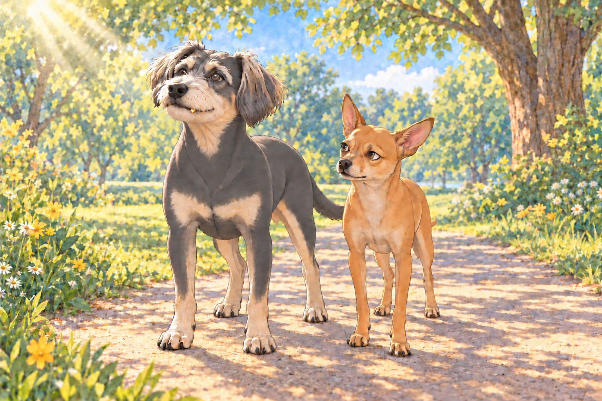
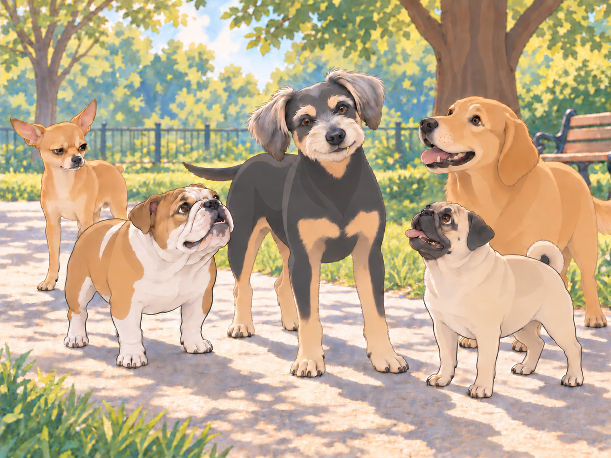
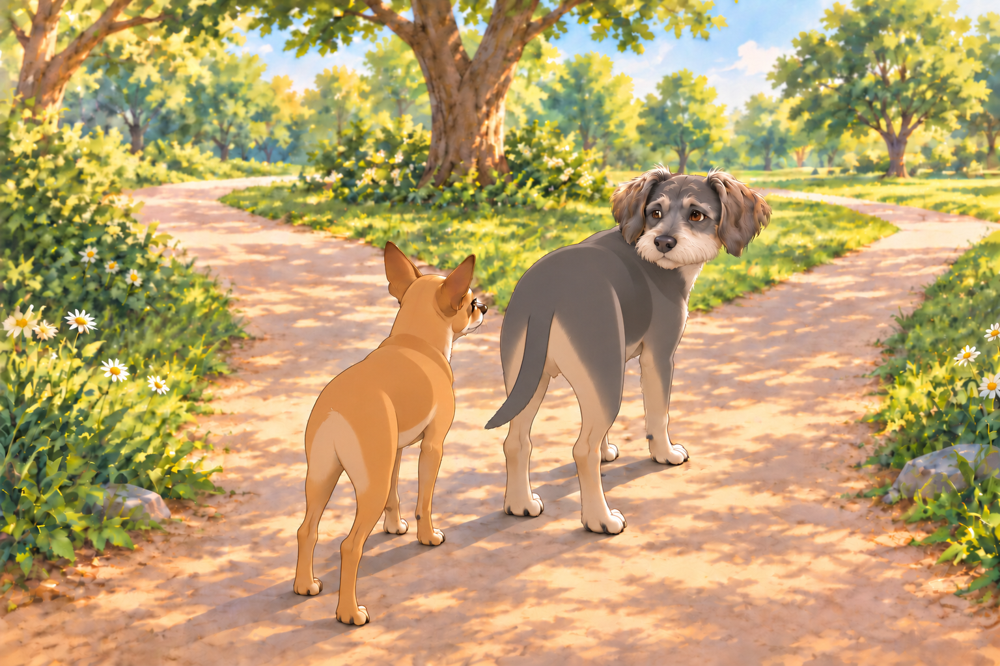

# Buddy and the Golden Glory

The weekend had arrived, and as was tradition, Heather took Neet and Buddy for their weekly park stroll. But this was no ordinary outing— this was Buddy’s first official public appearance with his golden tooth.

Buddy strutted down the park path with an air of pure confidence. The sunlight gleamed off his shiny tooth, catching the eyes of dogs and humans alike.

Neet, who was already annoyed, trotted beside him, grumbling. "Oh look at me, I have a fancy gold tooth, bow before my greatness— PFFT. Whatever."

Buddy adjusted his head to catch the sunlight. "I didn’t say anything."

That was the part Neet found most irritating. He had prepared an argument. Buddy was apparently going to win it by standing there.

## The Crowd Gathers

The first group to notice Buddy’s glow-up was a pack of golden retrievers, always known for their friendly (but slightly nosy) nature.

"Whoa, dude!" one of them barked. "Is that… a gold tooth?"

Buddy flashed his tooth. "Oh, this old thing? Just a little upgrade."

Another retriever wagged his tail. "That’s so baller."

A pug waddled over, squinting. "I thought gold teeth were just for pirates."

Buddy grinned wider, making sure the light hit just right. "I am kinda like a pirate. But instead of sailing the seas, I conquer snack bowls."

The group erupted in admiration.

Neet, standing awkwardly beside him, scowled. "Oh, come on! You guys are acting like he won an award or something."

The pug kept looking at Buddy. "Does it make a special noise when you chew?"

The pug waited for a chewing noise. Buddy held his smile. Neither seemed prepared to end the demonstration first.

Neet gasped. "EXCUSE ME?!"

A bulldog edged past Neet for a better look. "Move a little? You’re in his light."

Neet’s ears flattened. "His light?!"

Buddy held the pose. For once, he did not have to move aside for his brother.

## The Walk of Shame

As they continued their walk, more and more dogs (and even some humans) took notice of Buddy’s blinged-out tooth.

A poodle gasped. "Such elegance!"

A husky howled. "This guy’s got status now!"

A dachshund barked. "We should call him Sir Buddy!"

Buddy paused at the title. Heather took another step; he hurried to catch up, looking briefly less knightly.

Neet groaned. "Oh, this is unbearable."

Heather patted Neet’s head. "Let Buddy have his turn."

Neet squinted at her. "You’re enjoying this way too much."

## The Ultimate Humiliation

The final straw came when they ran into a Chihuahua gang— a notorious crew of tiny but fierce dogs who roamed the park like a biker gang on tiny paws.

Their leader, a scruffy tan Chihuahua named Tito, stopped beside Neet. "Is that Buddy with the gold tooth? Can you introduce us?"

Neet drew himself up. At last. A fellow professional.

Then the question finished reaching him. He had been reduced to arranging appointments.

"He’s busy," Neet said.

"I’m free," said Buddy.

Buddy turned toward Tito. "This side catches the sun better."

Tito and the others gathered around Buddy. Neet could no longer see the tooth, only the backs of the dogs admiring it.

Neet, officially done, turned to Heather. "I need a gold tooth. Immediately."

Heather sighed. "Neet, I am not putting you through unnecessary dental surgery just to win an ego battle."

Neet huffed. "Fine. But I demand another kind of upgrade. A diamond collar. A royal cape. SOMETHING."

Heather laughed. "Let’s see if you behave first."

Neet muttered under his breath. "I hate everything."

Buddy trotted ahead, then waited where the path forked. Being admired was pleasant. He still wanted to finish the walk with his brother.

Neet caught up and selected the shady path.

"Scenic route," he said.

Buddy looked at the solid roof of leaves. "Of course."

And for once in his life, Neet realized something truly terrifying:

Buddy had won.

And it was unbearable.

## Refinement record

October 4, 2026: second comedy pass adds the stalled tooth demonstration, Buddy forgetting to keep walking, Neet attempting to control appointments, and a shady-route callback. Historical encounters and affectionate competitive ending remain. See [comparison record](../Productions/E033-buddy-and-the-golden-glory/comedy-pass-v002.json).

October 3, 2026: individually refined and compared with the complete pre-refinement text. Creative choices, preserved incidents and pending illustration stages are recorded in [the episode record](../Productions/E033-buddy-and-the-golden-glory/episode.json). Original bytes remain in the external snapshot `/Users/sagar/Documents/ChatGPT/NBC_Archives/NBC-before-refinement-2026-10-03_200659.tar.gz` (member `NBC/Stories/S033-buddy-and-the-golden-glory.md`). This revision establishes no owner approval.

## Provenance and editorial notes

Working selection dated October 3, 2026. Selection and shelf order are editorial; owner approval and event chronology remain unverified.

Original numbering: manuscript Chapter 34.

- The second manuscript occurrence repeats this body exactly. Kept once in the working library.

Archive recovery: use [Studio recovery guidance](../Studio/Recovery.md). The paths below are paths **inside the verified snapshot**, not active navigation. SHA-256 pins identify the exact sources.

- `legacy-ch34` — `02_Story_Library/Legacy_Chapters/34-buddy-and-the-golden-glory.md`; SHA-256 `366c0e4ef4f944fcaeb7663fe1cdb03dadb48ae9f704c417a3eb53c76e466eb4`.
- Repeated occurrence: `02_Story_Library/Legacy_Notes/Chapter-34-Duplicate-Occurrence.md`; SHA-256 `3f4f2c4d0e9bb86b909134ddb579f9553bcbc8c505826604486456ebd6efab75`.
