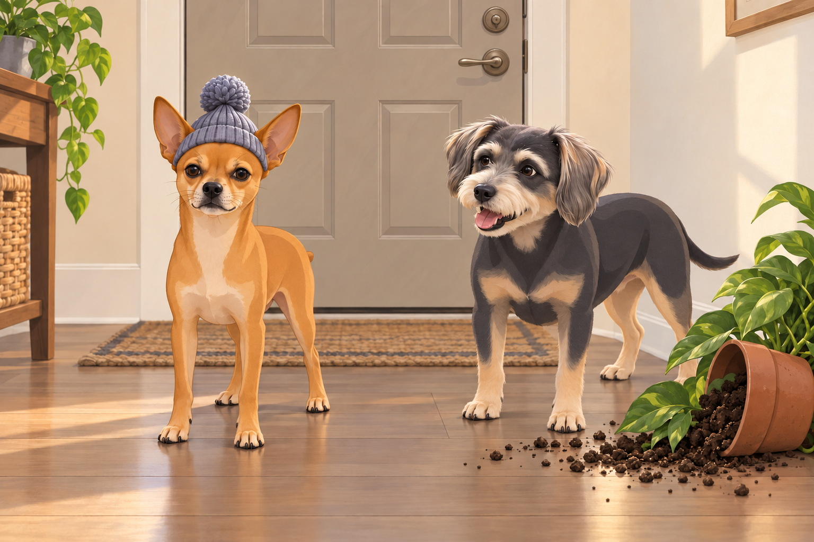
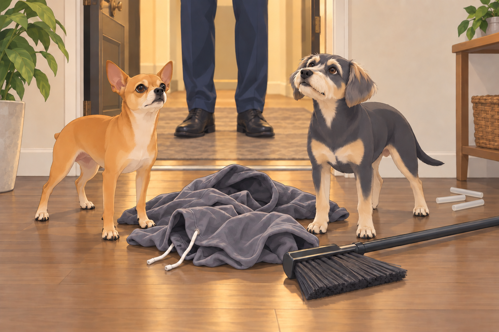
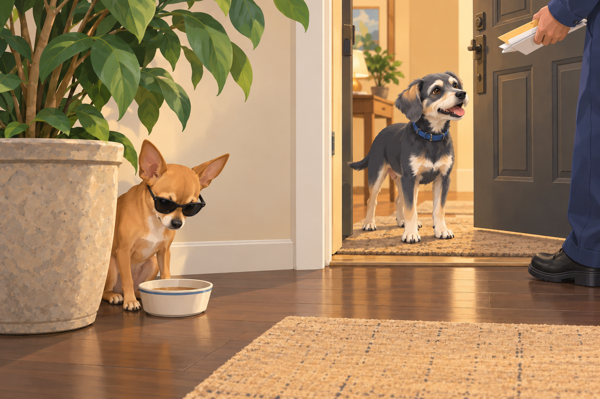
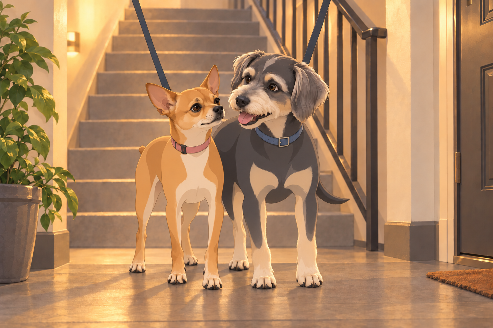
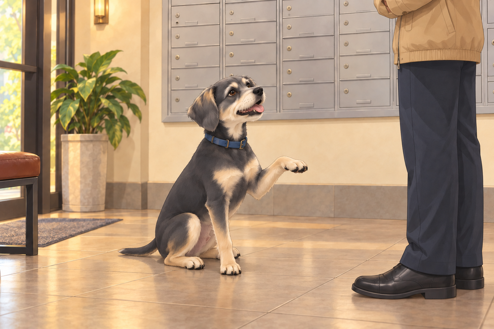
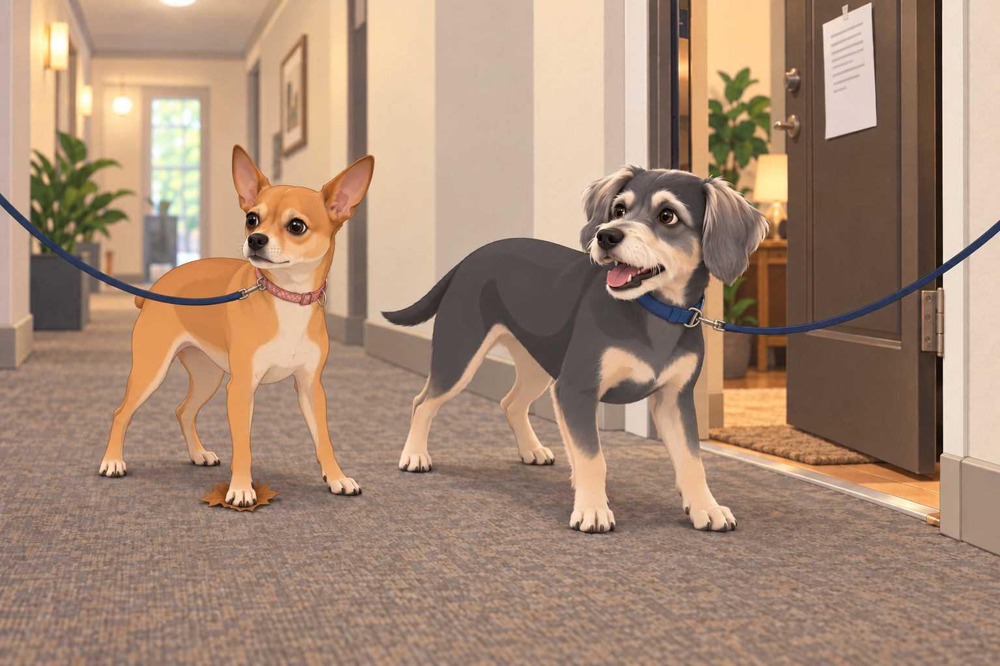

# The Stealth Games Begin

## The Weekend Routine: Patrol, Bark, Bathe, Repeat

It was another classic weekend morning. Neet, the cunning commander with ears like satellite dishes, paced in front of the door. Buddy, his best friend, a golden goofball with the heart of a lion, was circling his leash. He wanted the park before Neet found another reason to inspect the door.

“Perimeter check,” Neet announced solemnly. “We move at dawn.”

“It’s 9:42,” Buddy barked, already halfway tangled in his leash.

Neet inspected the bottom of the door again. Buddy stopped circling. The leash kept one final, regrettable appointment with his ankle.

They exited with their human, Neet checking each doorway while Buddy pulled toward the park. This wasn’t just any park. It was Green Zone Alpha in Neet’s operational logs. For Buddy, it was “The Happy Pee Grass Place.”

The walk began like it always did:

- Bark at the squirrels.

- Bark at the birds.

- Bark at the wind.

- Bark at an inflatable duck on someone’s balcony (Neet insists it’s spying for the manager).

As they approached the far fence of the park, Buddy spotted a labradoodle in a bow tie.

“INTRUDER!” he screamed and bolted.

Neet followed, because dignity be damned, if Buddy’s charging into chaos, he wasn’t missing out.

---

## The Bath and Betrayal

After their patrol came the dark hour: The Shower Ritual.

Neet hated it. Not because of the water— but because it was undignified. He’d spent all morning asserting dominance over lampposts and now he smelled like oatmeal shampoo?

Buddy, on the other hand, believed every bath was a test of faith. He’d whimper, yodel, and attempt to fake his own death. The water barely touched his back and he collapsed like a Victorian maiden struck by scandal.

Nail trims? Neet growled in Morse code. Buddy sat on the clippers. Their human held out a hand. Buddy looked helpfully around the bathroom for the missing object.

But the real betrayal came when they were wrapped in towels like canine burritos and told “You look so cute!”

“We are warriors,” Neet muttered. “Not cuddle muffins.”

---

## Enter: The Manager

That evening, clean and still offended, they followed their human into the lobby. Neet was recovering his usual stride when he saw the manager.

The Manager.

A man so square he could be legally classified as a geometry lesson. Name tag: Grubbs. Attitude: “If it wiggles and wags, it violates policy.”

He froze, mid-conversation with Mrs. Glenda (unit 5B, smells like hard candy). His eyes narrowed. Then they widened.

“There’s two of them,” he said. “This building only allows one dog per apartment.”

The words hit like a thunderclap. Buddy gasped audibly. Neet stopped mid-pee.

“Our lease said nothing of this,” Neet growled (silently, because barking would be counterproductive).

“You’ll be getting a notice,” Grubbs said, and vanished into the stairwell like a low-budget villain.

---

## Operation: Shadow Dog

The next morning, everything changed.

Neet went dark.

He refused to be seen in the hallways during business hours. If Buddy went for a walk, Neet waited— five minutes later, he’d sneak out using Staircase Route Bravo, ducking past the vending machine like he was on a stealth mission in “Call of Doody: Park Ops.”

He even wore a hat once. It was a baby-sized beanie, and it didn’t help. But it made Buddy laugh so hard he knocked over a houseplant.

Neet looked at the pot, the spilled soil, and Buddy.

“You’ve compromised my position.”

“Your position has a pom-pom.”

Neet’s entire behavior shifted. No more barking in the hallway. No more window surveillance. He even refused to chase the neighbor’s cat, Mr. Pickles, on Mondays.

“Too risky,” he whispered. “Pickles has ties to management.”

---

## Buddy’s Alternate Plan

Buddy, meanwhile, had other ideas.

“If we’re gonna be just one dog,” he reasoned, “we have to become one dog.”

So, he constructed a costume using an old hoodie, a broom, and three hot glue sticks. The plan? Neet rides on his back while Buddy walks on two legs. “We’ll be a tall spaniel mix named Todd.”

“Why Todd?”

“Grubbs will be counting dogs. He won’t be expecting Todd.”

Neet considered this long enough for it to become the plan.

They got as far as the front door before Neet fell off and Buddy panicked, screaming “ABORT TODD! ABORT!”

The manager, returning from a suspiciously timed mailbox check, spotted them mid-crash.

The hoodie settled between two very separate dogs.

“I’m watching you,” he said.

They both peed.

Todd had lasted four seconds and required two cleanups.

---

## Neet’s Descent into Paranoia

Over the next week, Neet devolved into full espionage mode.

He began carrying small items in his mouth— a rolled-up napkin (“classified documents”), a sock (“disguise kit”), and once, Buddy’s chew bone (“insurance”).

Buddy followed the insurance from room to room. At least now he always knew where the secret agent was.

If someone knocked at the door, Neet flattened under the couch like a pancake. If he heard the elevator ding, he would roll silently into the laundry basket. One time, he chewed a hole into a grocery bag and sat inside it for twenty minutes, just in case Grubbs walked by.

---

## The Grand Counter-Offensive

Eventually, their human had enough.

He submitted a firm letter to the board, complete with photos, Neet’s medical documents and a diagram showing how both dogs together weighed less than Mr. Jenkins’ single bulldog, Larry. Buddy sat beside the desk while he worked. Neet watched the hall. When the printer woke up, Neet abandoned the hall. Buddy stayed; the appeal needed at least one dog in attendance.

But while the paperwork made its way through bureaucracy, Neet remained underground. Buddy became the face of the operation— greeting neighbors, wagging extra hard, even licking the mailman.

Neet monitored it all from behind a ficus, wearing sunglasses and sipping beef broth like it was whiskey.

---

## To Be Continued…

No eviction notice had come. Yet.

Grubbs still lurks.

Neet still hides.

Buddy still believes they can merge into a “MegaDog” through synchronized tail wagging.

And every evening, at 7:05pm sharp, the stairwell echoes with the sound of paws. Silent, stealthy, ridiculous.

At the bottom, Buddy waits for Neet.

“Same time tomorrow, Todd?” he whispers.

Neet bumps his shoulder and leads the way. Two dogs go to the park together, however many the building prefers to count.

## Meaningful alternative

### Stealthy shower and one-dog dilemma — complete alternative

This alternative uses female pronouns for Neet and includes a delivered violation notice, a shoe incident, a stakeout and a leaf escape. These differences remain source choices.

Read the complete alternative

### Saturday: The Park Patrol Ritual

It was an ordinary weekend morning, the kind where Neet and Buddy, the dynamic doggy duo, emerged from their apartment like clockwork. The scent of bacon in the hallways (from Apartment 4C, always teasing) was their cue. With leashes clipped and tails wagging, they trotted down the hall for their Ritual of Supreme Importance: the Perimeter Check™ of Greenwood Park.

Buddy, the self-appointed park marshal, took the lead, ears perked, nose twitching. Neet followed with her signature sashay— elegant but alert, because you never know when a rogue squirrel might try something sneaky.

As usual, the park was teeming with potential threats: Labradoodles wearing vests that said “Anxiety Dog,” retirees speed-walking like there was an Olympic event for it, and, worst of all, a golden retriever named Riley who had the nerve— the audacity— to exist near their bench.

BARK. BARK. WOOF. Grrr.

Neet and Buddy unleashed their full-volume commentary on the situation, while their human frantically tried to reel them in. Children giggled. Joggers gave them wide berths. All was right in the world.

---

### Operation: Spa Day

Post-park chaos led directly to the most dreaded part of the weekend: the Shower of Shame™.

Neet braced herself against the tiled walls of the bathroom as if she were in a crime noir film. Meanwhile, Buddy howled like a banshee during his nail trim, convinced the clippers were part of a government plot.

“BATH TIME IS A LIE,” Buddy barked between shrieks.

“You can’t cleanse what is already clean!” Neet yelped.

Eventually, they emerged, fluffy and furious, smelling like lavender oatmeal and betrayal.

---

### Sunday: The Manager Strikes Back

The next evening, fresh from a squirrel chase and reeking of self-confidence, Neet and Buddy strutted into the building lobby— only to come face-to-face with The Manager.

Mr. Grubbs. Beige windbreaker. Clip-on tie. The sort of man who could make a noticeboard look underdressed.

He narrowed his eyes at them like a border patrol agent at a suspiciously fluffy suitcase.

“You,” he said, pointing to Neet. “And you.” He jabbed toward Buddy. “There are two of you. This building has a strict one-dog-per-apartment policy.”

Their human tried to explain: “They’re small. Compact. Spiritually one dog.”

Grubbs was not moved. “Expect a notice.”

And he stormed off, muttering something about bylaws and chaos.

---

### Neet Goes Underground

From that day forward, Neet became a fugitive. A shadow. A whisper.

When it was time for walks, Buddy would stroll out proudly, like the king of the world, while Neet clung to the shadows like she was in a Mission: Impossible movie. She refused the elevator. Too risky. She preferred the stairs— even if it meant dragging her leash up five flights like she was scaling Everest.

Buddy would wait at the bottom, staring blankly at the elevator doors.

“She’s doing the thing again,” he’d sigh.

The elevator opened. Empty. Buddy looked up the stairs and settled in for the slower dog-delivery service.

Neet even developed a full-on evasion routine. She’d peek around corners before walking. If she heard footsteps in the hall, she’d drop like a soldier under sniper fire and belly-crawl back inside. One time, she dove into a laundry basket on wheels and stayed there for fifteen minutes while the manager chatted with Mrs. Fernstein in the lobby.

---

### Buddy’s Attempt at Diplomacy

Buddy wanted to get back to taking walks together. He decided to try the greeting that worked on nearly everyone else: diplomacy.

He intercepted Mr. Grubbs one afternoon near the mailboxes and executed a flawless sit-paw-smile combo.

Grubbs scowled. “Nice try, mutt.”

Buddy peed on his shoe.

He kept the smile for a moment. Then, recognizing that the meeting had changed direction, he lowered his paw.

---

### The Letter of Doom

A week later, the official Notice arrived: “Violation of Pet Policy – Immediate Compliance Required.”

It was affixed to their door like a scarlet letter. Neet stared at it for three minutes straight, then began plotting.

She tried wearing sunglasses. “Maybe if he thinks I’m a different dog,” she whispered.

Buddy tried fitting Neet into his backpack. “We’ll say I’m a service dog. And you’re emotional support luggage.”

They even attempted synchronized walking— side by side, pretending to be a single, unusually wiggly dog— but this only drew more attention.

---

### The Great Stakeout

That Saturday, Neet orchestrated a full surveillance operation. She perched by the peephole for hours, logging every movement in the hallway.

“Grubbs passed at 2:17pm. Holding envelope. Eyes darting. Possibly hunting. Confirm pattern.”

Buddy, wearing his “I’m Just Visiting” bandana, offered distractions. Barking at random walls. Knocking over plant pots in the hallway. Drawing suspicion to himself so Neet could sneak out unnoticed.

“I am the bait,” he whispered solemnly, tail wagging.

From cover, Neet watched him knock over a second pot.

“You can be less convincing.”

---

### The Final Straw (That Was Actually a Leaf)

One afternoon, as they snuck back inside after a walk, Neet stepped on a crunchy leaf in the hallway. CRRRUNCH. Grubbs popped out of nowhere like a B-grade horror villain.

“Hey!”

Neet froze mid-step, eyes wide.

Buddy barked: “RUN!”

They took off, leash flying, tail fur on fire, careening down the hall and into their apartment. Their human got both dogs inside, shut the door and worked through all four bolts. Buddy stayed clear of the leash while Neet listened for footsteps.

They sat in silence. Panting. Eyes wide.

“Okay,” Neet said. “New plan.”

Buddy looked toward the door. “Does it involve sweeping?”

---

### Operation: Legal Loophole

By Monday, their human had contacted the building’s HOA with a polite but firm email: “Technically, they share a food bowl. Emotionally, they’re one dog.”

Pending review.

Until then, Neet remains on high alert. The towels for Spa Day have been hidden under the couch. The staircase route is now marked with escape plans. And Buddy?

He’s been practicing his innocent face. Just in case.

He holds the expression while Neet tests the hiding place beneath the couch. She has left just enough room for the towels.

Their human reaches down for one. A paw draws it farther into the darkness.

Buddy makes his face even more innocent.

## Refinement record

October 4, 2026: second comedy pass sharpened the leash delay, concealment failures, Todd logic and callback, insurance pursuit, printer retreat, and the alternative’s failed diplomacy, bait and towel payoff. Both complete versions were reread against the prior working copy and recovered originals; pronouns, notice outcomes and unnamed historical human remain separate. Records: [comedy pass](../Productions/E034-the-stealth-games-begin/comedy-pass-v002.json).

October 3, 2026: individually refined and compared with the complete pre-refinement text. Creative choices, preserved incidents and pending illustration stages are recorded in [the episode record](../Productions/E034-the-stealth-games-begin/episode.json). Original bytes remain in the external snapshot `/Users/sagar/Documents/ChatGPT/NBC_Archives/NBC-before-refinement-2026-10-03_200659.tar.gz` (member `NBC/Stories/S034-the-stealth-games-begin.md`). This revision establishes no owner approval.

## Provenance and editorial notes

Working selection dated October 3, 2026. Selection and shelf order are editorial; owner approval and event chronology remain unverified.

Original numbering: independent captured sequence Chapter 7.

- Working primary selected for its compact arc and consistent male Neet. The complete alternative changes pronouns, notice status and diplomacy; it remains below.

- Proper-name spelling “Neat” normalized to “Neet.” Source pronouns, dialogue, events and rank claims remain.

Archive recovery: use [Studio recovery guidance](../Studio/Recovery.md). The paths below are paths **inside the verified snapshot**, not active navigation. SHA-256 pins identify the exact sources.

- `elevenlabs-reader-27` — `02_Story_Library/ElevenLabs_Imports/reader-27-the-stealth-games-begin.txt`; SHA-256 `9beca4bd6f1cd616dd973c468db8bffa6f156d83301f528b352a23e226456086`.
- `elevenlabs-reader-28` — `02_Story_Library/ElevenLabs_Imports/reader-28-the-stealthy-shower-and-the-one-dog-dilemma.txt`; SHA-256 `774076d6a5deb3cad5071c9cb32d2451e9d4bcb61e55eb907e55c0c6b77c3744`.
- `elevenlabs-reader-29` — `90_Archive/2026-10-03-elevenlabs-recovery/Raw_Exports/reader-29.txt`; SHA-256 `774076d6a5deb3cad5071c9cb32d2451e9d4bcb61e55eb907e55c0c6b77c3744`.
