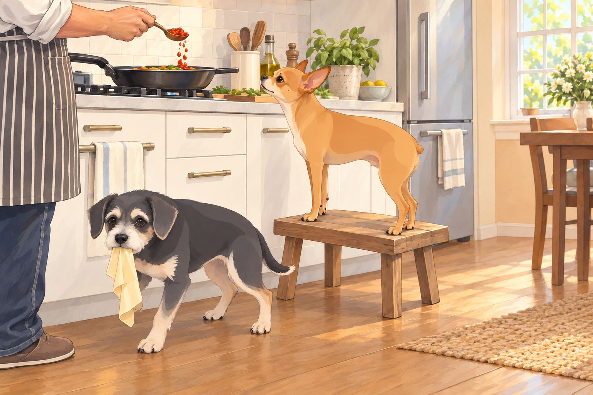
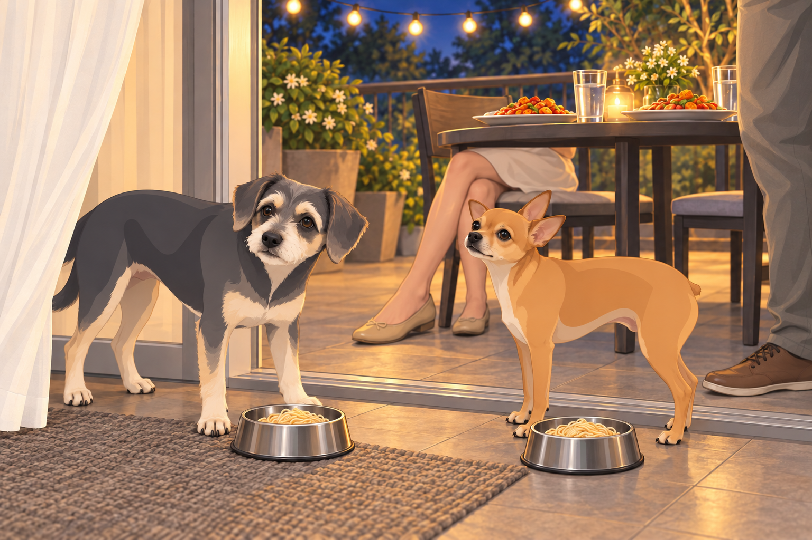
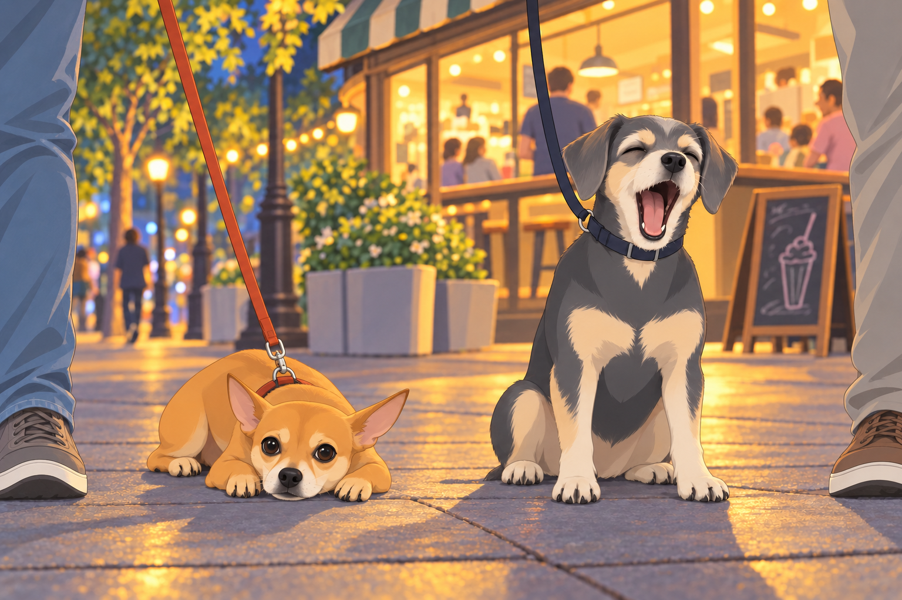
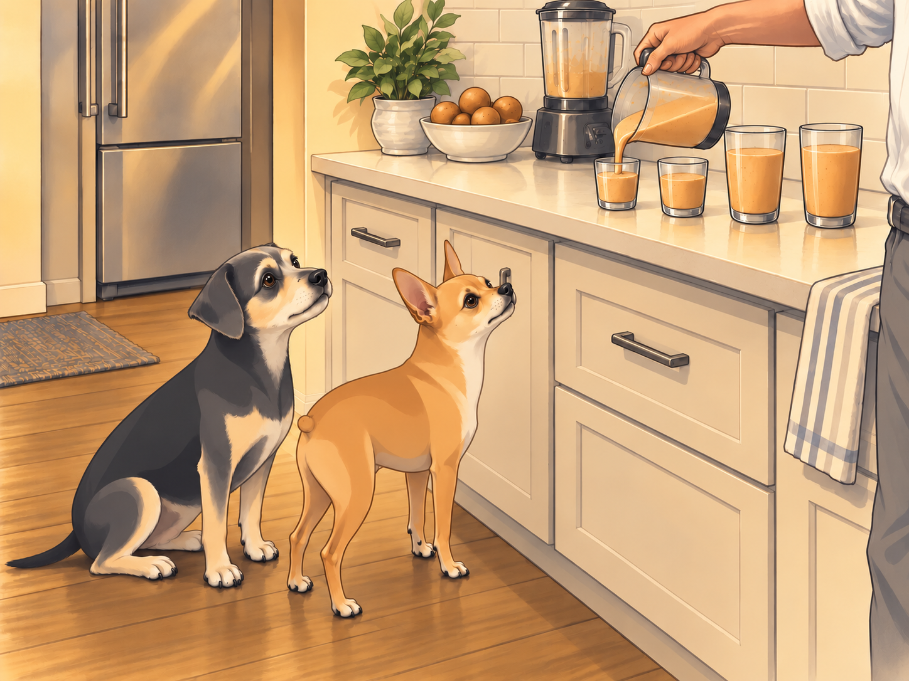
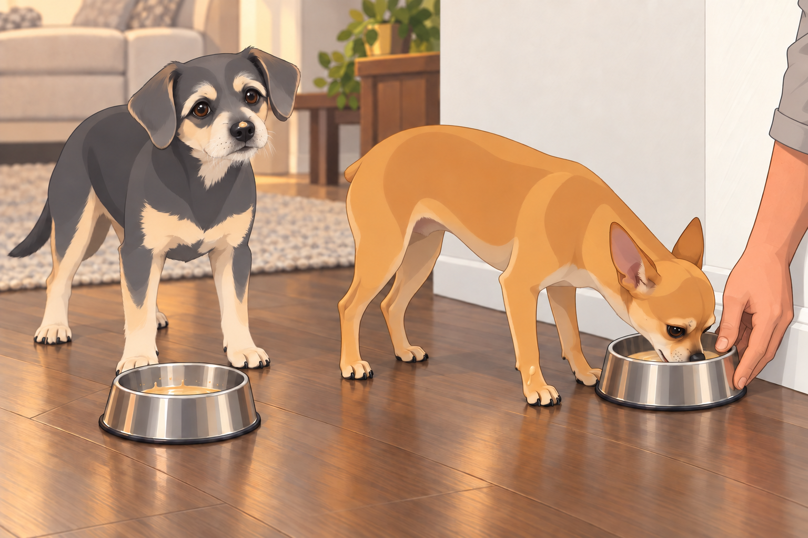

# The Great Fire Noodles & Chiku Shake Meltdown

## Part I: Ambition Brews in the Kitchen

It was a perfectly peaceful Saturday. The kind of Saturday where the world felt like it was made of soft hoodies, sunlit balconies, and promises of snacks. Neet and Buddy lay flopped over each other like a decorative pile of dog fur in the living room, while Sagar sat scrolling through YouTube on the couch.

That’s when he found it:

“Authentic Restaurant-Style Indo-Chinese Chili Paneer & Hakka Noodles |EASY RECIPE!”

He sat up and replayed the part where the noodles left the pan. He did not replay the part where the chef measured anything.

“Heather,” he said, turning with intensity, “today is the day.”

Heather looked up from her book slowly, cautiously. “…The day for what?”

“Chili paneer and noodles,” Sagar said, already standing. “I think I can do that.”

Heather blinked. “Is this because you watched that Korean street food guy again?”

Sagar didn’t respond. He was already tying on his apron.

Buddy perked up, sensing a food-based escalation. He leaped off the couch and skidded across the floor, stopping right in front of the fridge. “Is it happening? Food? Danger? Opportunity?”

Neet followed, more composed, his gait like that of a head chef inspecting the kitchen brigade. He hopped up onto the little stool by the counter— his designated observation post— and gave Sagar a silent nod. Proceed.

---

## Part II: The Great Miscalculation

The kitchen quickly devolved into organized chaos. Onions were chopped, garlic was flying, soy sauce drizzled, and Neet caught a rogue green pepper mid-air like a ninja. Buddy licked the inside of a noodle wrapper until it collapsed like a wet sock.

Sagar tried to keep track of the pan and both dogs:

- “Neet, mind the stove!”

- “Buddy, no licking the chili paste! That’s concentrated death!”

- “Heather, trust me. This is going to be epic.”

Heather leaned against the doorway with her arms crossed. “You said that last time when you made ‘experimental ramen’ with sriracha and miso in orange juice.”

“Creative innovation requires sacrifice,” Sagar replied, dramatically tossing paneer cubes into cornstarch.

Neet watched from his stool. Every time Sagar set an ingredient down, he leaned forward to inspect it. Buddy kept the noodle wrapper pinned beneath one paw. Neet was inspecting quality. Buddy was checking whether there was any quantity left.

Then came The Pour.

Sagar, filled with misplaced confidence, added three heaping tablespoons of homemade chili paste. Neet’s ears shot up. Buddy barked once and backed away like the air had changed color. He went back for the wrapper, then resumed his retreat.

Heather leaned in and muttered, “That’s not chili. That’s self-immolation in a jar.”

“I believe in balance,” Sagar replied.

“Your concept of balance involves scoville levels known only to NASA.”

---

## Part III: Dinner is Served – May God Help Us All

The balcony was set like a scene from a magazine. String lights twinkled. Two steaming plates of food were set out. Napkins. Water glasses. And two small metal bowls on the floor for Neet and Buddy with boiled unseasoned noodles.

Sagar sat. Heather sat.

They smiled.

Then they took the first bite.

And everything…

exploded.

Heather immediately dropped her fork and started fanning her mouth. “OH. MY. GOD. WHAT HAVE YOU DONE?!”

Sagar’s eyes bulged. He was blinking rapidly like a man whose corneas had just been pickled. “I think… I think I saw my ancestors… and they’re filing a lawsuit.”

“It’s like my taste buds are being evicted!”

Heather tried water, then pushed the glass away and went for the yogurt. Sagar stood up and walked in a small circle, unable to decide whether sitting had made it worse.

Heather turned his phone face-down. The chef was still smiling.

Buddy left his plain noodles to sniff the paneer and sneezed himself backward into the curtain. He untangled his nose, looked at the human plates, and returned to his own bowl. He placed one paw beside it. Apparently the best dish in the house needed guarding.

Neet cautiously approached the edge of Sagar’s plate, took a microscopic nibble, then backed up slowly, one paw at a time, like the food had asked him to join a cult.

---

## Part IV: Emergency Evacuation Walk

Twenty minutes later, the humans were sprawled across the balcony chairs like wounded warriors. Heather was rubbing yogurt directly on her tongue. Sagar had eaten three ice cubes and was now chewing the fourth like it owed him rent.

“I can’t feel my lips,” Heather muttered.

“I think I’ve gone deaf in one eye,” Sagar replied.

Buddy barked from the hallway. “WALK?”

Neet stood by the door with his leash already in his mouth.

“Fine,” Sagar groaned. “We walk off the spice. Come on.”

As they walked under the pale glow of streetlights, the cool night air helped slightly. Their breathing normalized. Their skin stopped sizzling.

But then…

The Chiku Shack came into view.

Neet stopped. Buddy stopped. The wind shifted.

Buddy barked once. Neet stood still, statue-like, staring at the glowing sign like it was the gates of heaven.

Heather shook her head. “No. Absolutely not. We just ate.”

Buddy whimpered softly.

Neet’s eyes widened.

Sagar hesitated. “A little chiku shake wouldn’t hurt…”

“We don’t need it,” Heather said.

Then came Neet’s Performance of the Year™.

He lay down slowly on the sidewalk like he’d just received news of a tragic inheritance. He rolled onto his side. Looked at the Chiku Shack. Looked back at Sagar. Raised one paw and waited.

Then he sighed.

Deep. Heavy. Resigned.

Buddy sat beside him and gave the most pitiful yawn imaginable. When Heather looked toward Sagar, he held his mouth open a little longer. No sense wasting it.

Heather stared at them. “You two are ridiculous.”

Neet crawled— crawled!— two inches forward, chin dragging across the pavement like a soldier in a war film.

Sagar folded. At the shack, they bought chiku pulp to take home. Buddy walked close to the bag all the way back; he had no further interest in the scenery.

---

## Part V: The Madness of Chiku

Back home, the blender roared.

Neet and Buddy stood completely still. No barking. No sniffing. Just wide-eyed, vertical, hypnotized silence.

Sagar poured the thick golden chiku shake into four cups: two small, two regular.

Neet watched the stream of shake, following the jug from cup to cup. Buddy sat very still except for his tail. This was going into four cups. He had counted.

Then— ceremony.

Each dog got their own bowl. Neet didn’t touch his at first. He stared. Then slowly, reverently, took a sip.

He blinked. Once. Twice.

Then he snorted and began slurping with the ferocity of a jackhammer.

Buddy dove face-first into his bowl. Slipped. Got shake on his nose. Didn’t care. He burped halfway through, noticed a splash on Neet’s paw and licked that clean too. Neet drew the paw beneath his chest. Buddy checked the other one.

Neet backed away to find a better angle on the last of his shake, then chased his bowl with his tongue until it struck the wall.

When Sagar reached for it, Neet gave a small, possessive growl. Sagar held the bowl still. Neet discovered this was much more convenient. He allowed Sagar to continue assisting.

Heather sipped hers, chuckling. “You two are some lucky dogs.”

Neet, pupils pinpricks, looked up with a chiku mustache and nodded like a mafia boss after a good espresso.

“Blessings,” he whispered in dog tongue.

---

## Part VI: Aftermath

Neet passed out on the cool tiles, tongue out, eyes slightly open like he was watching distant galaxies.

Buddy lay on his back, four paws in the air, snoring like a tiny tractor.

Sagar and Heather sat on the couch, sweaty, exhausted, and mildly traumatized.

“Next time,” Heather said, “I’m cooking.”

“Next time,” Sagar said, “I’m measuring the chili.”

Buddy snorted from the corner. “Next time… more chiku.”

Neet twitched and whispered in his sleep, “Tofu is pain. But chiku… is peace.”

Heather looked at the abandoned chili paneer, then at the two empty little bowls. She put the lid on the chili paste. Sagar checked that it was tight. Then he put a measuring spoon on top.

## Refinement record

October 4, 2026: second comedy pass sharpened the skipped measurement setup, Buddy’s wrapper rescue and noodle defense, the interrupted recipe video, held yawn, paw inspection and measuring-spoon callback. Historical incidents and the dream’s tofu/paneer mismatch remain. Expanded illustration and comparison evidence: [comedy pass](../Productions/E035-the-great-fire-noodles-chiku-shake-meltdown/comedy-pass-v002.json).

October 3, 2026: individually refined and compared with the complete pre-refinement text. Creative choices, preserved incidents and pending illustration stages are recorded in [the episode record](../Productions/E035-the-great-fire-noodles-chiku-shake-meltdown/episode.json). Original bytes remain in the external snapshot `/Users/sagar/Documents/ChatGPT/NBC_Archives/NBC-before-refinement-2026-10-03_200659.tar.gz` (member `NBC/Stories/S035-the-great-fire-noodles-chiku-shake-meltdown.md`). This revision establishes no owner approval.

## Provenance and editorial notes

Working selection dated October 3, 2026. Selection and shelf order are editorial; owner approval and event chronology remain unverified.

Original numbering: independent captured sequence Chapter 8.

- Proper-name spelling “Neat” normalized to “Neet.” Source pronouns, dialogue, events and rank claims remain.

Archive recovery: use [Studio recovery guidance](../Studio/Recovery.md). The paths below are paths **inside the verified snapshot**, not active navigation. SHA-256 pins identify the exact sources.

- `elevenlabs-reader-26` — `02_Story_Library/ElevenLabs_Imports/reader-26-the-great-fire-noodles-chiku-shake-meltdown-extended-unhinged-edition.txt`; SHA-256 `395a6112f208e32109dd9f2cf31d6627e3d68d1941b9880e781a1f3e3cb6bd17`.
