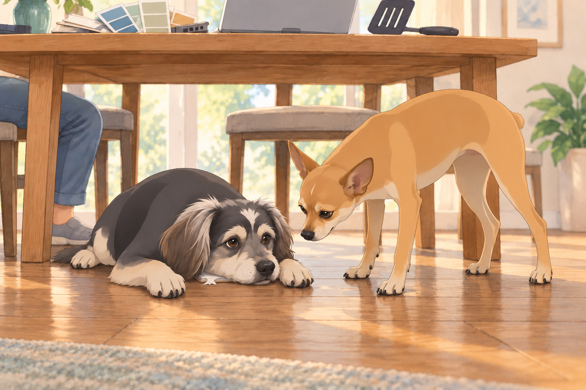
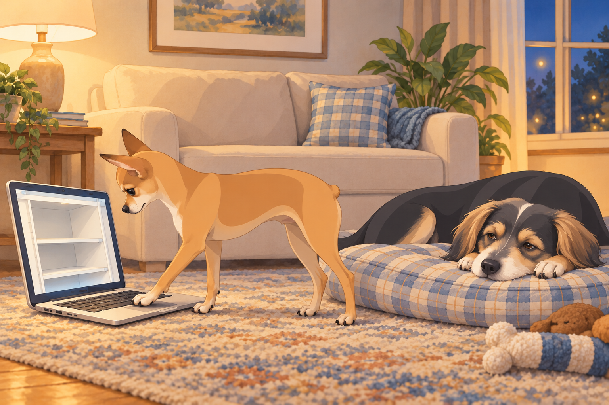
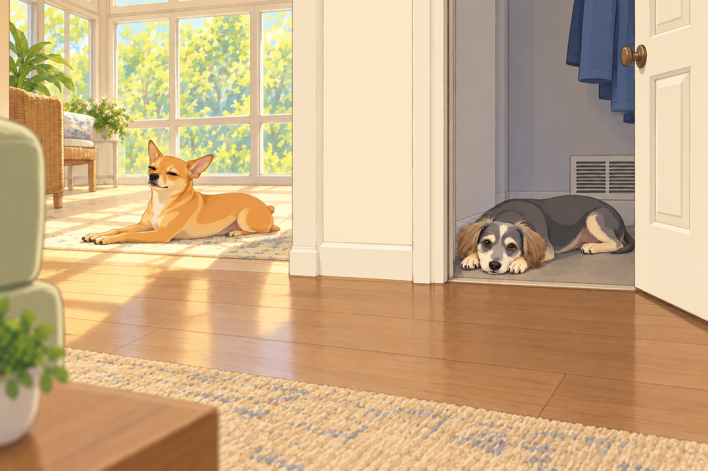
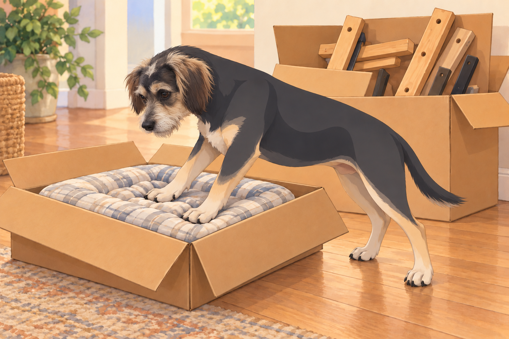
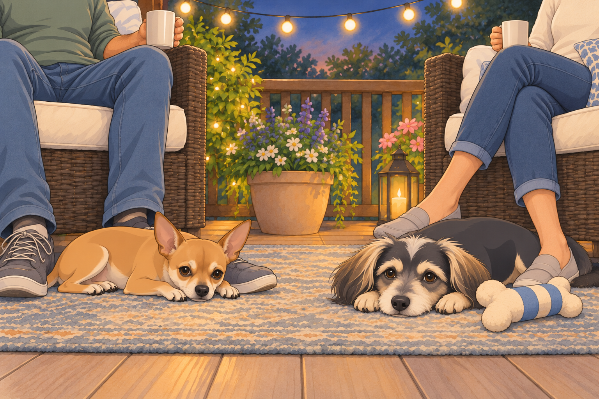

# The Royal House Hunt and the Negotiation of Dreams

## I. Prologue: Royal Decree of Relocation

Sagar stood by the living room window, trying to picture their next house. Neet occupied the only patch of sun, which already ruled out anything with fewer windows.

On the dining table, the laptop was open to a page of property listings.

Heather brought him his favorite mug and looked over his shoulder. “Still thinking about moving?”

Neet lifted his head. Buddy slept at the edge of the sunbeam with one paw across Neet’s blanket.

Sagar turned to face his gathered court.

“I think it’s time we started looking properly,” he said.

“Then I’m making a list.” Heather set down the mug.

Neet’s ears snapped up. A new house meant new windows, new patrol routes, and the possibility of getting his blanket back.

Buddy, startled awake, blinked. “Is this about the neighbor’s yappy chihuahua again? Because I could win that fight.”

Sagar smiled at the newly awake Buddy. “You’ll get a vote too.”

---

## II. The Royal Wishlists: Negotiations Begin

They gathered at the great dining table— a surface that, for once, was not covered in half-built LEGO models or half-chewed plushies. There were documents, laptops, tablets, color swatches, and, inexplicably, a spatula.

A. Sagar’s Edict

Sagar, as always, was calm and deliberate. He tapped his requirements into his tablet:

- “Light. I require sunlight from dawn to dusk— windows everywhere. My mornings are nothing without the gentle touch of sunlight for reflection and strategic thinking.”

- “A room worthy of a ping pong table. Not just any room, but a space with high ceilings and good acoustics. For the game of kings.”

- “Solid construction. No creaking floors. My thoughts must not be disturbed.”

- “A large kitchen, for shared meals and grand experiments.”

Heather glanced at his screen. “You’ve given the ping pong table more space than the kitchen.”

B. Heather’s List: Queenly Comforts

Heather, always practical but enchanted by beauty, unfurled her own parchment— decorated with floral doodles and bullet points.

- “A backyard, full and open, where I can garden, sip morning coffee, and hang string lights for magical evenings.”

- “French doors. There is nothing like welcoming the sun with open glass.”

- “Room for a hammock. Preferably two— one for me, one for reading.”

- “Space for friends, laughter, and outdoor dinners beneath the stars.”

- “A cozy nook for journaling, close to the kitchen. And maybe a swing? Is that asking too much?”

Sagar added “hammock space” to the spreadsheet.

“Two hammocks?”

“One for me, one for reading.”

“You’ll be in both.”

“Not at the same time.” Heather waited until he entered two.

C. Neet’s Demands: The Sunbeam Manifesto

Neet, never one to be overlooked, trotted over to the table with a sheet of paw-stamped requests.

- “A room of my own, labeled ‘Sir Neet’s Quarters’. With velvet pillows. And at least two windows— preferably east and south facing, for optimal napping rotation.”

- “A private window perch, to surveil my new kingdom and warn of all incoming postmen, squirrels, and existential threats.”

- “No proximity to laundry. The demon machine makes the floor vibrate.”

- “Access to Sagar at all times— preferably with secret passageways or at least a ‘summon bell’.”

- “Automatic treat dispenser. I will allow one for Buddy, too. I am generous.”

Heather stifled a giggle.

D. Buddy’s List: Simplicity and Solitude

Buddy approached, tail wagging, with a notepad chewed at one corner.

- “A room. Not shared with Neet.”

- “A door that closes. Firmly.”

- “Soft beds. Several.”

- “A direct line to the refrigerator.”

- “No responsibility. No Neet. Did I mention no Neet?”

He scratched at the notepad with his paw, as if emphasizing his point. Neet leaned over to inspect it. Buddy slid the notepad under his chest.

“The room begins here,” he said.

---

## III. Online Crusade: The Great Hunt

By the third evening, everyone could recognize a wide-angle property photograph.

“That sofa is longer than our car,” Heather said.

Sagar clicked the next view. The sofa became a chair.

Every evening, the living room was transformed into the War Room. Sagar at the helm, Heather by his side, Neet and Buddy each on their own cushions, all eyes glued to the flickering images of distant homes.

A. Listing #1: The Glass Fortress

“Look at this,” Sagar announced, pulling up a modern architectural masterpiece with floor-to-ceiling windows on every side.

Heather’s eyes widened. “You could get a sunburn in December.”

Neet jumped up, tail stiff with excitement. “I accept this palace. I will become a cat. It is decided.”

Buddy frowned. “Are those… stairs?”

Sagar clicked through the photos. “No yard, though.”

Heather sighed. “Where would I put my roses?”

Rejected. Next.

B. Listing #2: The Outdoor Oasis

Heather swooned. “It’s perfect! There’s a sprawling backyard, a porch swing, even raised garden beds.”

Neet sniffed. “One window. One! How am I to bask? How am I to monitor the perimeter?”

Buddy nodded in agreement, perhaps more out of spite. “No Neet zone, please.”

Sagar scrolled. “No extra rooms for ping pong, either. We must keep searching.”

---

## IV. The Alliance Splinters: House Hunt Shenanigans

After days of viewing, alliances began to form and dissolve at breakneck speed.

A. The Sunroom Scandal

Neet found a listing with a built-in sunroom and immediately declared himself prince regent of that property.

Buddy protested. “It’s not fair! Why does Neet get a sunroom? What if I want a ‘Chill Bunker’?”

Neet rolled his eyes. “You wouldn’t appreciate the nuances of the sun.”

Heather intervened. “Let’s compromise. One sunroom, one chill bunker.”

Buddy was appeased, especially after Sagar promised his room would have a view of the refrigerator.

B. The Backyard Brawl

Heather and Buddy joined forces for a brief period, united by the promise of grass.

Neet, ever the strategist, sabotaged this alliance by subtly hinting that the backyard was full of “strange wild creatures and possibly one haunted gnome.” Heather was undeterred, but Buddy retreated to Team Indoors.

“Is the gnome in the photographs?” Buddy asked.

“Not all threats agree to be photographed.”

Heather enlarged the garden picture. The alleged haunting was holding a watering can.

Buddy leaned closer, then backed away again. “It has equipment.”

Sagar, holding court with a Google Sheet and three color-coded highlighters, maintained order. “We must weight these priorities. Light for Sagar. Grass for Heather. Solitude for Buddy. Sun for Neet.”

C. The Tour of Despair

They watched virtual tours with increasing incredulity.

- “Why is there a bathtub in the kitchen?”

- “That room is a triangle. Who sleeps in a triangle?”

- “Why is the realtor dressed as a mime?”

Buddy kept falling asleep mid-tour, while Neet kept pausing to “inspect” the pantry situation (code for looking for treats).

He put a paw on the space bar. The tour stopped on an empty shelf.

“Advance,” he said.

Sagar pressed play. Neet stopped it on the same shelf from the other direction.

Buddy opened one eye. “Still empty.”

“We haven’t seen behind it.”

Sagar moved the laptop beyond paw range.

---

## V. Compromise or Catastrophe: The Royal Negotiation

Sagar called for a council meeting, where all grievances were aired with great ceremony.

Heather: “If you get a ping pong room, I get French doors and a hammock.”

Sagar: “Fair enough.”

Neet: “I demand veto power over flooring decisions.”

Buddy: “I just want one room. With a bed. Without Neet’s butt in my face.”

They debated deep into the night, voices rising and falling, treats being offered as bribes, until at last, Sagar stood and pronounced:

“No house gets a yes until there’s somewhere for all of us.”

Buddy put his paw on the notepad. The closed door was still underlined twice.

---

## VI. Discovery: The Perfect Palace

And then, one fortuitous morning, Heather found it.

- Sunlight streaming through windows on more than one side, with room to follow it through the day.

- A backyard so lush and inviting, it practically begged for picnics, badminton, and stargazing.

- An extra room, easily divided into Neet’s sunroom and Buddy’s Chill Bunker (complete with thick doors).

- French doors to a string-lit patio.

- A large rec room perfect for Sagar’s ping pong dreams.

- The kitchen? A chef’s paradise— roomy, modern, and begging for experiments.

For once, nobody asked to skip to the next listing.

They toured it virtually, then in person. Heather brought the list; Sagar brought a tape measure.

Heather already saw herself on the porch, a mug of tea in hand, string lights twinkling above.

Sagar paced the rec room, arms crossed, envisioning legendary ping pong matches and epic family game nights.

Neet leapt onto the window sills, tested the sunlight at every angle, and promptly claimed the sunroom by rolling on the floor and declaring, “It is mine. All mine.”

Buddy explored every corner until he found a cool, quiet closet near the kitchen vent. “This’ll do. Put my name on the door.”

---

## VII. Epilogue: The Great Migration

Moving day arrived in a flurry of boxes, laughter, and barely controlled chaos.

Heather directed the movers while Sagar checked the boxes against their room labels. Buddy followed the box marked BED until someone opened it. It contained Sagar’s bed frame.

Buddy looked at the wood. Then at Sagar.

Heather found the other box and folded back its flaps. Buddy put both front paws on the soft dog bed inside before anyone could carry it farther.

“Delivery complete,” he said.

Neet oversaw the arrangement of his chamber with the sternness of a general, then sprawled in the first available sunbeam with a look of ultimate contentment.

Buddy, thrilled with his new solitude bunker, spent the first hour rolling on every surface, testing for maximum softness.

By evening, the string lights were up. Neet left his sunroom to settle at Sagar’s feet on the patio. Buddy emerged from his private bunker carrying a soft toy and lay beside Heather.

“All that negotiation,” she said, “and they’re both out here.”

Buddy shut his eyes. The important thing was that he could close his door later.

Inside, Neet’s blanket lay entirely unoccupied. He had finally got it back. He stayed at Sagar’s feet.

---

To be continued…

## Provenance and editorial notes

Working selection dated October 3, 2026. Selection and shelf order are editorial; owner approval and event chronology remain unverified.

Original numbering: independent captured sequence Chapter 9.

- Proper-name spelling “Neat” normalized to “Neet.” Source pronouns, dialogue, events and rank claims remain.

Archive recovery: use [Studio recovery guidance](../Studio/Recovery.md). The paths below are paths **inside the verified snapshot**, not active navigation. SHA-256 pins identify the exact sources.

- `elevenlabs-reader-25` — `02_Story_Library/ElevenLabs_Imports/reader-25-the-royal-house-hunt-and-the-negotiation-of-dreams.txt`; SHA-256 `6ac319a140b40cc8f9a570904d6cc4fb4d00e9374f8b4eb6b45996ab66e690c2`.

## Refinement record

October 4, 2026: expanded comedy pass adds the private-notepad boundary, hammock negotiation, distorted listing, equipped gnome, empty-pantry inspection, wrong bed box and blanket callback. Five contextual artwork proposals span the progression; independent visual and full illustrated reading reviews remain pending. See [expanded pass](../Productions/E036-the-royal-house-hunt-and-the-negotiation-of-dreams/comedy-pass-v002.json) and [artwork record](../Productions/E036-the-royal-house-hunt-and-the-negotiation-of-dreams/artwork-generation-v002.json).

Refined October 3, 2026; [episode record](../Productions/E036-the-royal-house-hunt-and-the-negotiation-of-dreams/episode.json) documents the reading comparison and illustration work. The pre-refinement text is preserved in the [dated recovery snapshot](/Users/sagar/Documents/ChatGPT/NBC_Archives/NBC-before-refinement-2026-10-03_200659.tar.gz) at `NBC/Stories/S036-the-royal-house-hunt-and-the-negotiation-of-dreams.md`. Historical provenance above remains unchanged.
