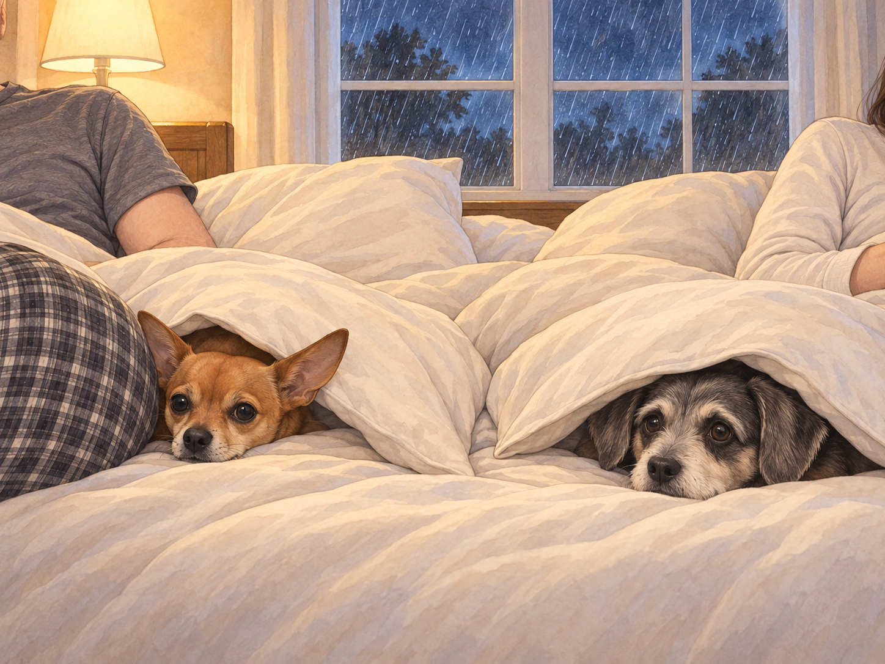
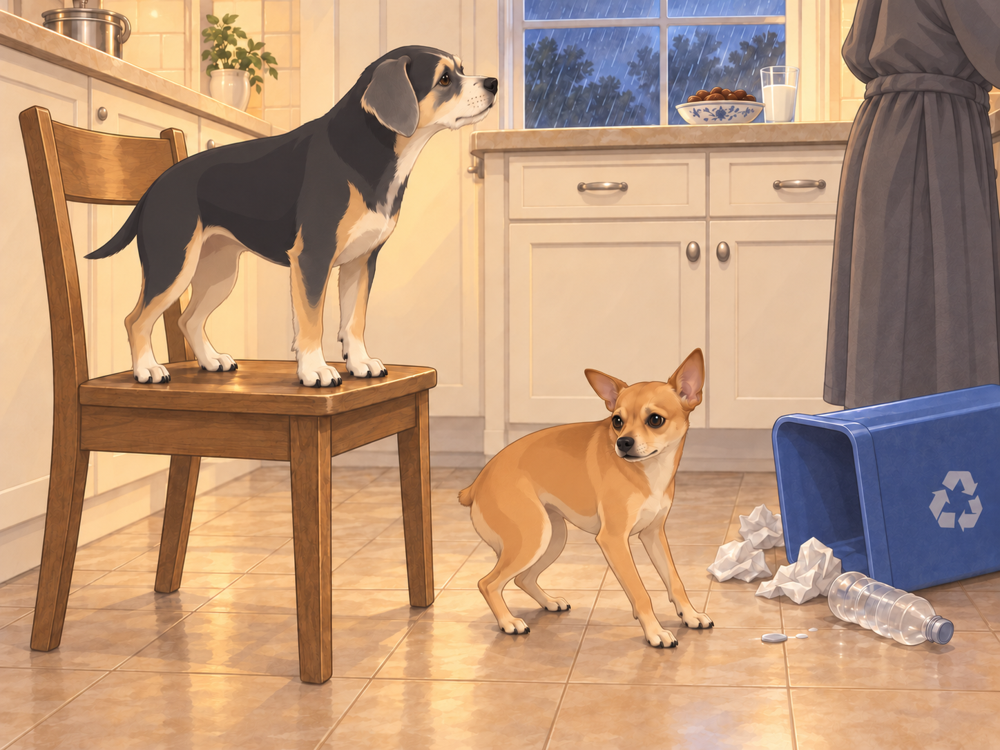
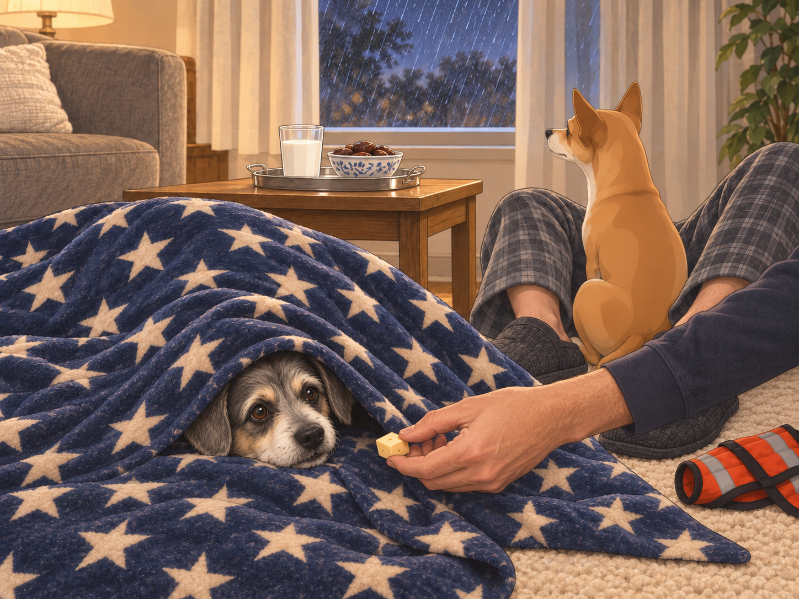
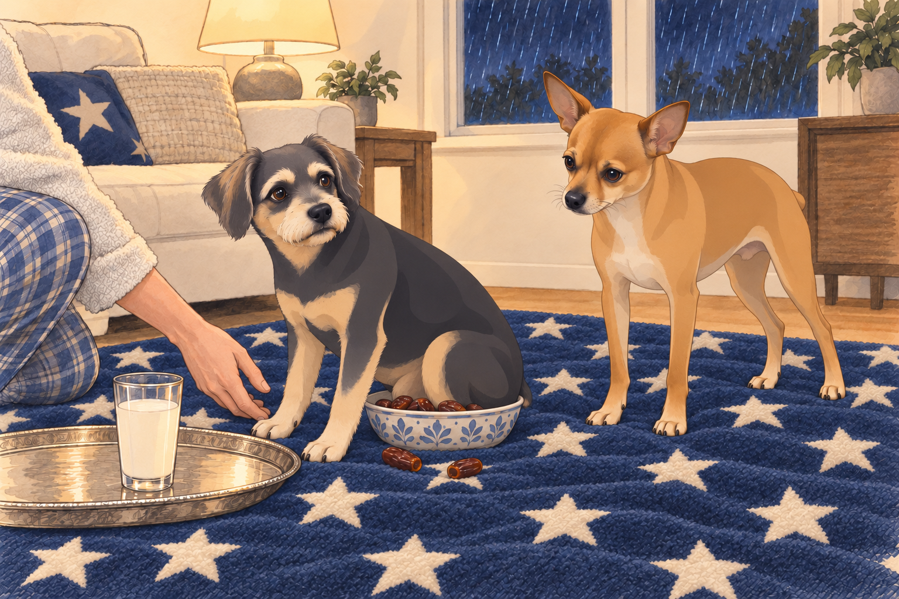
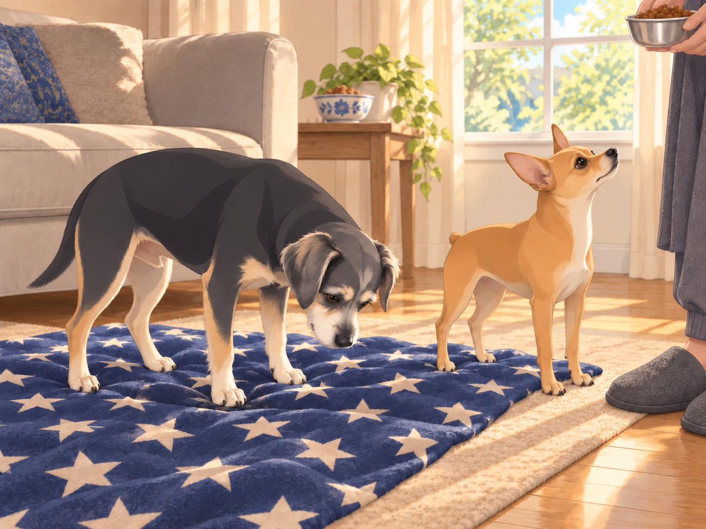

# The Midnight Storm and The Royal Snack Emergency

## I. The Calm Before the Tempest

It was one of those nights when everything was, for a fleeting moment, perfectly still. The new house— now broken in, every nook infused with memories and dog hair— hummed with the quiet of four occupants finally settling into rest.

Heather was finally, blissfully, drifting toward sleep after several rough nights. She’d fluffed her pillow just so, her hair fanned out like a halo. Sagar arranged the covers and wondered if it was too late for a snack. Neet and Buddy, curled at the foot of the bed, were a tangle of paws and dreams.

Somewhere, far off, thunder rumbled. Neet opened one eye, found that Buddy had not moved, and closed it again. If the sky required a response, Buddy could take the first shift.

---

## II. The Storm Erupts: Pandemonium Strikes

The peace shattered in a single blinding flash.

CRACK-BOOM!

A bolt of lightning split the sky. The entire house seemed to jump. Buddy shot upright, staring toward the window. Neet went rigid, then immediately dove under the covers, convinced the apocalypse had begun.

Heather’s eyes fluttered open. “No, no, no. Not tonight…”

Sagar, who was up on one elbow in a heartbeat, surveyed his domain. “Steady, everyone. It’s just a little atmospheric disturbance.”

Another BOOM!— even louder. Buddy whimpered, crawling across Heather’s stomach and trying to burrow into her pajama top. Neet, meanwhile, executed a full tactical retreat, wedging himself under Sagar’s knees and refusing to move.

Sagar looked from the dogs to Heather and said, “The only thing that can restore peace is… warm milk and dates.”

Heather groaned, but with a smile. “Your Majesty, must you?”

Buddy, from under a pillow: “If he’s going, bring me cheese.”

Neet, muffled from the sheets: “Bring me silence!”

Sagar moved one knee. Neet moved with it.

“May I have my legs?”

Neet pressed closer. Apparently not.

---

## III. The Royal Snack Mission

Sagar donned his “King of Midnight” robe (a bathrobe with the house crest, as decreed by Neet) and strode out of the bedroom, thunder still rolling through the house. He left the door open behind him. Two sets of paws followed before he reached the kitchen.

Lightning flickered through the kitchen window. The refrigerator cast a ghostly glow.

At the fridge, Buddy and Neet pressed closer, tails low. Every new thunderclap was met with a fresh round of trembling. Buddy stuck so close to Sagar’s legs he nearly tripped him, while Neet tried to wedge himself into a cabinet for protection.

Buddy tried changing sides when Sagar turned toward the counter. Sagar changed sides too. For three careful steps they made no progress at all.

Sagar poured the milk with the solemnity of a ritual. He dropped a handful of dates into a bowl, their glossy surfaces shining like jewels.

Suddenly— another thunderclap! Buddy leapt into the air, landing on a kitchen chair with the grace of a walrus. Neet, eyes wide, knocked over the recycling bin in an effort to find a smaller, safer place to hide. An empty bottle rolled across the tiles. He backed away from that noise too.

Buddy stood very still on the chair. Getting down now would mean admitting the floor was available.

Sagar paused. “Gentlemen. Control yourselves. You are in the presence of snacks.”

Buddy peeked around the cereal box on the counter beside his chair. “Only because you’re here.”

Neet muttered, “Why does the sky hate us?”

---

## IV. The Great Living Room Retreat

Sagar, snacks in hand, led the shaky troops to the living room. He set up their usual midnight snuggle zone:

- Heather’s thickest blanket (with stars)

- Neet’s emergency thunder vest

- Buddy’s “Chill Bunker” cushion

- A glass of milk and a bowl of dates— centered, of course, on a silver tray

Heather wandered out, bleary-eyed, hair pointing in all directions. “Are we… picnicking in the living room now?”

Sagar patted the blanket. “The storm cannot breach this fortress.”

Neet squeezed between Sagar’s ankles, his eyes fixed on the window as if preparing a counterattack. Buddy dove headfirst under the blanket, only to pop his nose out to beg for cheese. Sagar moved the cheese to his other hand. The nose disappeared and emerged from the other end of the blanket.

A particularly close lightning strike set off car alarms down the street. Neet leapt straight up and clung to Sagar’s arm like a furry limpet. Buddy yowled so dramatically it could have summoned the neighbors.

Heather drew the blanket around both dogs. “We’re right here. Nobody’s going anywhere.” Buddy stopped looking at the window long enough to lean against her.

The storm raged, but there, huddled together, the royal family found a new rhythm:

- Buddy gnawed at a piece of cheese

- Neet nibbled a date (then spat it out, because “who eats fruit at a time like this?”)

- Sagar sipped milk like a philosopher king

---

## V. Midnight Delivery

Sagar set the silver tray on the blanket and moved the date bowl beside it to make room for his glass.

Just as peace began to settle, the house was hit by the King of All Thunderclaps. The lights flickered. Neet’s ears shot out at impossible angles. Buddy tried to jump into Sagar’s lap but misjudged the distance, landing with his rear end squarely in the date bowl.

Sagar lifted the bowl clear, then held up the date he had retrieved from under Buddy’s tail. Heather pushed the empty napkin toward him.

Heather laughed so hard she snorted. “Midnight date delivery, coming through.”

Buddy glanced at the bowl, then selected a landing spot on the blanket. He tested it with one front paw before committing the rest of himself.

“Excellent,” Neet said. “You’ve checked for bowls.”

Buddy sat on the empty napkin.

Neet, feeling safe between his people, began to relax. He even took a deep breath and glared out the window at the storm. “You want a piece of me?”

Buddy, emboldened by Sagar’s calm and a belly full of cheese, tried to “bark back” at the thunder. What came out was a noise somewhere between a hiccup and a squeak.

Neet looked at him.

“That was a warning,” Buddy said.

They waited. When the next rumble came from farther away, neither dog disputed the result.

Heather kissed Sagar’s cheek. “King of calm. Savior of snack time.”

Sagar, in his element, grinned. “This is nothing compared to last week’s chili paneer.”

---

## VI. Return to Slumber

Gradually, the thunder moved on. The lightning faded, replaced by the soft hiss of rain. Heather settled back on the blanket, with Buddy curled in her arms. Neet, ever the guardian, lay across Sagar’s legs, still watching the window but no longer trembling.

Sagar finished his milk, savoring the last, sweet sip. “See? The kingdom stands. The storm is gone.”

Heather nodded, eyelids heavy. “And so is my insomnia.”

Buddy snored, legs twitching in dreams of cheese.

Neet, at last, let his guard down— head on Sagar’s feet, sighing a deep, contented sigh.

---

## VII. Epilogue: Peace Restored

The next morning, the world was washed clean. Sunlight broke through the clouds, glinting off every window in their kingdom.

Heather slept late on the living room blanket. Sagar made tea. Neet and Buddy woke together, stretching in the soft light and checking whether his tea came with breakfast.

When Heather finally woke, she caught Sagar’s hand. “Thank you for keeping us company, love.”

Neet licked his fingers. Buddy rolled into Heather’s waiting hand, with the date bowl safely out of range. When Sagar brought breakfast, Buddy checked beneath himself before sitting down.

The chronicles continue…

## Provenance and editorial notes

Working selection dated October 3, 2026. Selection and shelf order are editorial; owner approval and event chronology remain unverified.

Original numbering: independent captured sequence Chapter 10.

- Proper-name spelling “Neat” normalized to “Neet.” Source pronouns, dialogue, events and rank claims remain.

Archive recovery: use [Studio recovery guidance](../Studio/Recovery.md). The paths below are paths **inside the verified snapshot**, not active navigation. SHA-256 pins identify the exact sources.

- `elevenlabs-reader-24` — `02_Story_Library/ElevenLabs_Imports/reader-24-the-midnight-storm-and-the-royal-snack-emergency.txt`; SHA-256 `51ff6771a56c885d9188025ff02ffeff86489def4e7217f8a8ea343c03816816`.

## Refinement record

October 4, 2026: the second comedy pass sharpens the kitchen footwork, Buddy’s chair refusal and blanket cheese pursuit, and the landing-check callback. Five proposed illustrations follow distinct narrative states; the bowl composition is retained with corrected body finish. Expanded independent reviews remain pending in the [episode record](../Productions/E037-the-midnight-storm-and-the-royal-snack-emergency/episode.json).

Refined October 3, 2026; [episode record](../Productions/E037-the-midnight-storm-and-the-royal-snack-emergency/episode.json) documents the reading comparison and illustration work. The pre-refinement text is preserved in the [dated recovery snapshot](/Users/sagar/Documents/ChatGPT/NBC_Archives/NBC-before-refinement-2026-10-03_200659.tar.gz) at `NBC/Stories/S037-the-midnight-storm-and-the-royal-snack-emergency.md`. Historical provenance above remains unchanged.
