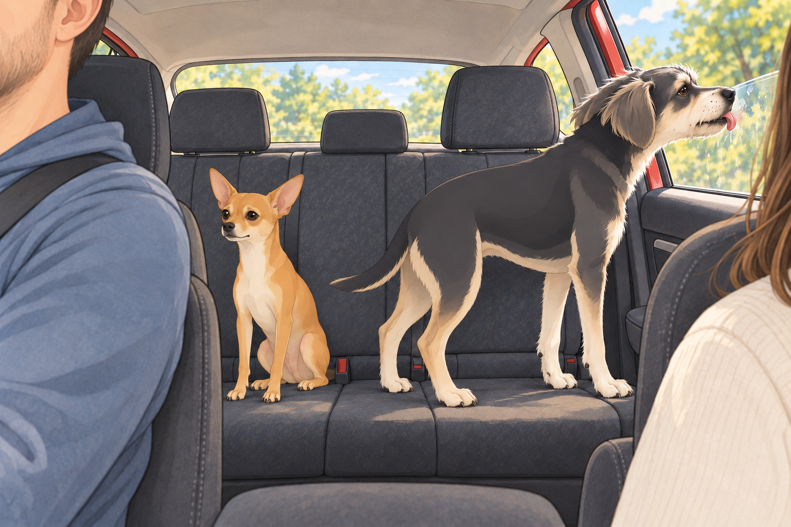
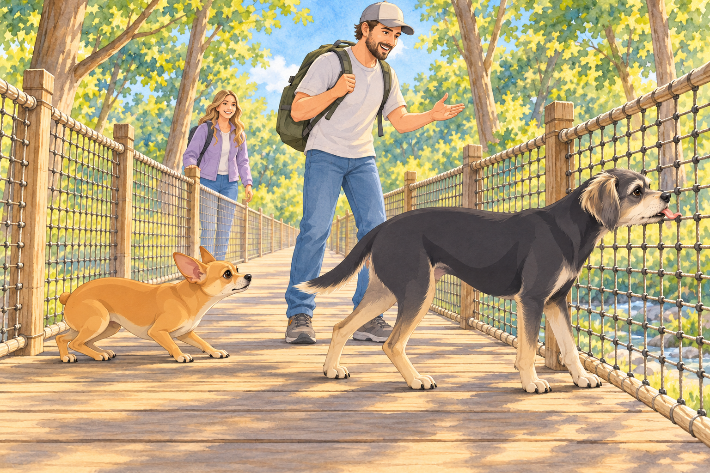
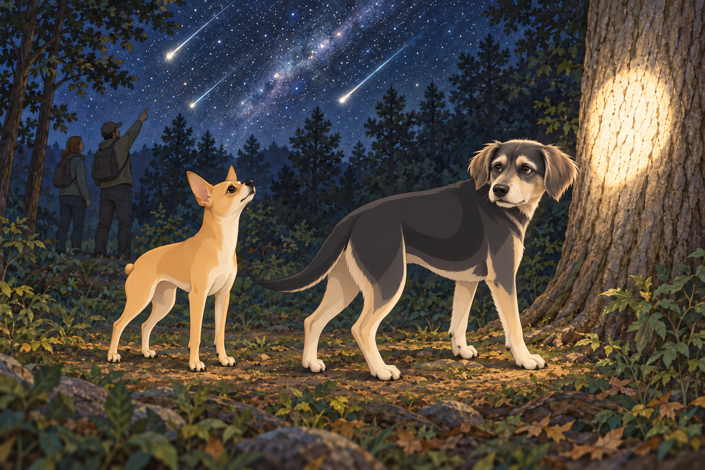
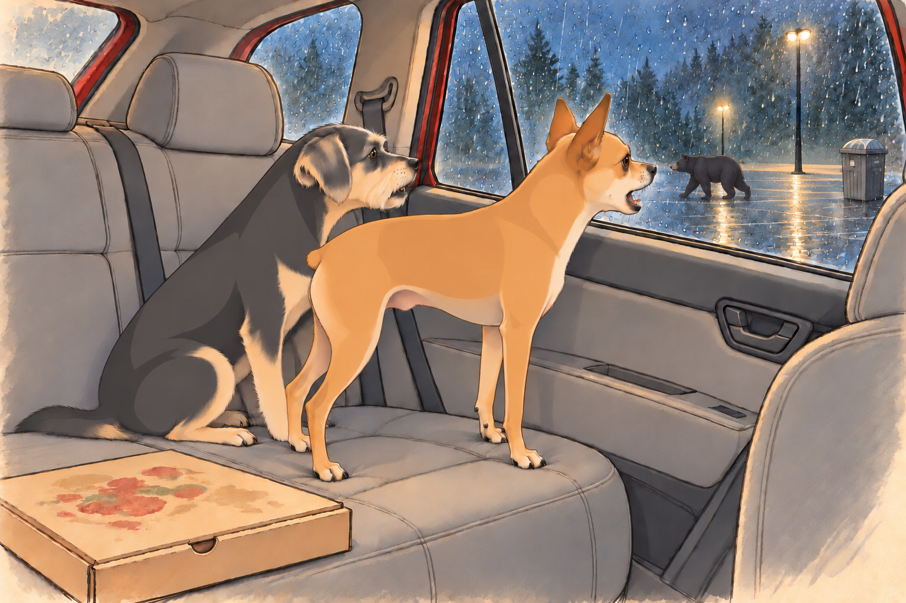
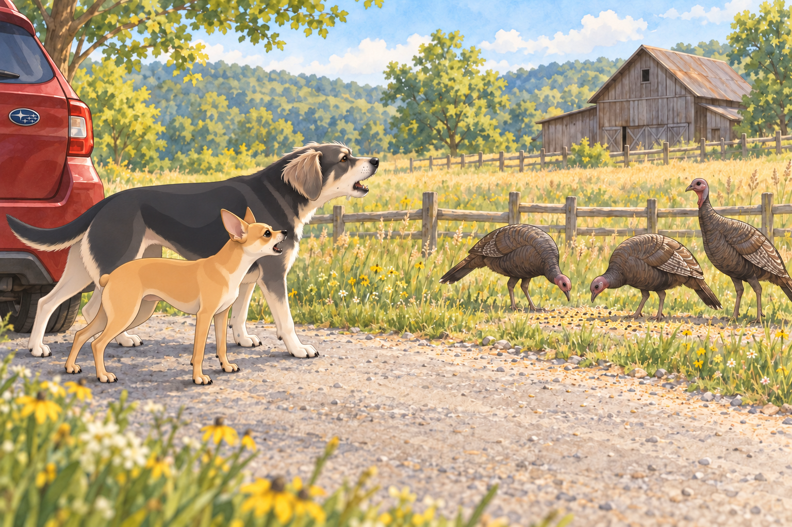
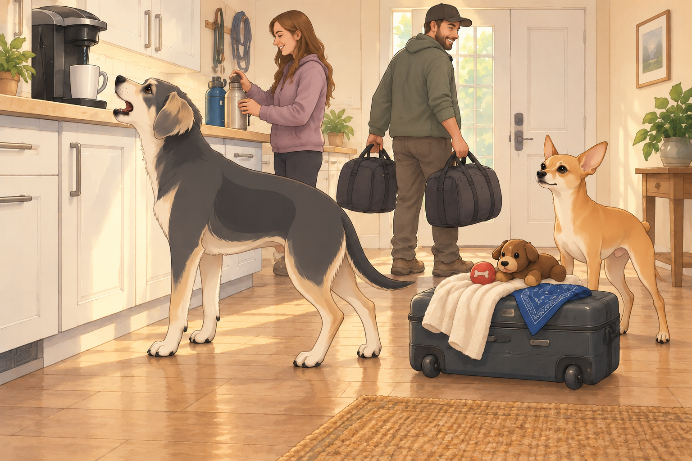
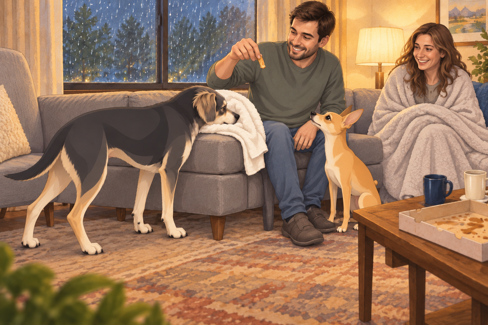

# The Smoky Mountain Escapade

## I. The Great Departure

The royal chariot— otherwise known as a red Subaru Outback— purred down I-75, windows rolled down, mountain air whipping Buddy’s ears into a frenzy and flattening Neet’s fur into what could only be called “fashion-forward panic.” Sagar followed the GPS. Heather had her sunglasses, her playlist, and a hand ready to turn the music down whenever Neet began another road report.

Neet, ever the anxious soul, sat rigidly between the back seats, already suspicious of mountain roads, large pine cones, and Tennessee’s “unpredictable rural internet.” Buddy, on the other hand, was licking the window and taking in the smells of Adventure, Car Snacks, and Imminent Chaos. Every time Heather turned the music back up, Neet found another pine cone to report.

---

## II. The Rise to Anakista: Chondola Challenge

After conquering Gatlinburg’s notorious traffic and parking lot minotaurs, the family found themselves staring up at the mountain, at the base of the Anakista theme park.

Sagar beamed. “We’re going up in a Chondola. An open-air chairlift. The views will be epic!”

Heather and Neet eyed the dangling seats suspiciously.

Buddy tried to sniff the cable. “What is this? Is this a food ride?”

Heather, placing her faith in Sagar’s calm, followed him through the turnstile. Neet muttered, “What is OSHA? Why aren’t there walls?”

The four of them settled onto the Chondola. With a gentle lurch, it took off. Sagar, a vision of serenity, pointed out distant peaks. “Look, Heather! That’s Mount LeConte. Neet, Buddy, see that river snaking through the valley?”

Heather gripped the bar. “Uh huh. Mhm. Beautiful. Wow. Yep.” She smiled with her lips, not her eyes.

Buddy barked, “How high are we?! Is that a squirrel or a person? Are we flying?!” Neet, meanwhile, had his paws locked in a death grip around Heather’s arm and Sagar’s jacket, looking like a dog who’d just seen his ancestors at the Rainbow Bridge.

Halfway up, another Chondola passed the other direction. Buddy barked at the other passengers, as if to say, “What are you doing here? This is our story!”

Sagar reassured them all. “You’re safe. I’ve done this before. Just trust me and don’t look down.”

Heather fixed her eyes on Sagar. Neet squeezed his shut. “Don’t look down,” he repeated. Buddy looked down for both of them, then decided to watch the next chair instead.

---

## III. The Tree Bridge Tango

At the summit, still slightly jelly-legged, they moved on to the Tree Bridge Walk. The “bridge” consisted of thick ropes and wooden planks that swayed like a drunk uncle at a wedding.

Sagar strode out first, leading with kingly swagger.

Heather took a few tentative steps, then called out, “Neet, Buddy— come on! It’s perfectly safe!”

Buddy, emboldened by the scent of popcorn and squirrel, sprinted ahead. The bridge bounced.

Neet, torn between his role as Sagar’s shadow and his fear of heights, inched forward, tail tucked, belly nearly skimming the planks. Heather cheered him on. Buddy just barked and tried to lick the safety netting. It tasted of rope. He tried a second square before accepting the result.

Sagar, in the middle, began narrating the scene like a BBC nature documentary. “Here, we observe the rare Neet, whose trust in his human overrides even his primal terror of bouncy rope infrastructure…”

Heather giggled so hard she almost lost her footing, then made it to the other side, triumphant. Neet followed, convinced he deserved a medal, or at least three treats.

---

## IV. The Hellbender Roller Coaster: Screaming Royalty

The next stop: The Hellbender. A mountain coaster— each car accommodating all four family members, with Sagar at the front and, crucially, in charge of the brakes.

Heather eyed the cart. “Are there… seatbelts?”

Neet, eyeing the track, whimpered, “Is this legal? Is this wise?”

Buddy leaped in and started pawing at the brake lever. Sagar moved his hand over it. Buddy placed his paw on top, volunteering for management.

They buckled in, and Sagar, with a mischievous twinkle in his eye, gave everyone his best “trust me” smile.

At the first curve, Heather called out, “Sagar Patel! Brakes, brakes, brakes!”

Sagar loosened the brakes a little. Buddy screamed— pure joy, pure fear, impossible to tell. Neet, gripping the sides, made a sound that rhymed with “helicopter.”

Halfway down, Sagar let the brakes go. The cart picked up speed.

Heather, now in full roller-coaster mode, went from pleading to howling. “SAGAR PATEL!! YOU’RE CRAZY! SAAAAGAAARRR!”

Buddy howled in unison, howling louder than the wind. Neet, eyes wild, tail standing at attention, added to the cacophony. The cart whipped through hairpin turns, everyone yelling, shrieking, and laughing until their faces hurt.

At the finish line, Sagar, smiling and victorious, asked, “Again?”

Heather collapsed, hair flying, voice hoarse. “You— are— impossible.”

Neet stared into the middle distance. “I’ve seen things.”

Buddy licked Sagar’s hand. “Best. Day. Ever.”

---

## V. Night Falls: The Astralumina Debacle

After catching their breath, it was time for the Astralumina night show— a glowing walk through stars, cosmic moons, and mystical lights. Heather was enchanted. Neet was convinced the lights were communicating with him. Buddy tried to chase a shooting star (it was a flashlight). The bright spot climbed a tree. Buddy stopped at the trunk and looked back, offended by this change in the rules.

But halfway through, thunder rumbled and wind swept through the trees.

A voice boomed over the PA: “Due to approaching weather, please make your way to the exit.”

Cue: Royal Family Panic.

Sagar took charge. “Stick together! We move as one!”

Heather, holding Neet under one arm, Buddy under the other, ran alongside Sagar as rain began to pelt them. They just made the shuttle bus— wet but mostly laughing.

Neet, huddled in Heather’s lap, panted. “At least we’re not on the Chondola.”

---

## VI. Pizza, Bears, and Parking Lot Drama

By the time the bus rolled into the parking lot, rain was coming down in sheets. Sagar dashed into the pizza shop, emerging moments later with a steaming box— hot pizza, the food of gods and exhausted families.

En route to their hotel, Heather gasped. “Look!”

A big black bear ambled across a parking lot, sniffing a trash can.

They pulled over and watched through the window.

Buddy barked— three quick yaps, then ducked.

Neet, emboldened by the safety of the car, pressed his nose to the glass and began shouting:

“No loitering! No trespassing! I’m calling the authorities!”

The bear, unfazed, gave them a look that said “Get a life” and wandered off.

Buddy, proud of his contribution, sat tall. “That’s right. We protected the pizza.”

---

## VII. Day Two: The Kate’s Cove Safari

After a much-needed night’s sleep (with Sagar kingly distributing leftover pizza and pets), they set out for Kate’s Cove— famed for wildlife and beauty.

The winding road revealed scenes straight out of a storybook: rolling fields, grazing deer, ancient barns, and herds of wild horses.

Neet, riding shotgun, was on patrol:

“Horses at 3 o’clock!”

“Crow in a tree!”

“Deer— intruder alert!”

Buddy had discovered a peanut butter cracker in the seat, but occasionally chimed in with “Moo!” (at cows), “Gobble!” (at wild turkeys), and “Arrrooo!” (at nothing at all).

At one pull-off, a flock of wild turkeys strutted by. Neet, never one to back down, barked at them as if reciting the U.S. Constitution.

The turkeys ignored him.

Buddy joined in, barking “You tell ‘em, Neet! This is a democracy!”

One turkey stopped to peck the ground. Neet started again, louder. The turkey found another seed.

At another stop, they spotted deer in the woods. Heather gasped, snapping photos. Sagar lowered his own camera. “One wildlife photograph without our dogs commenting. That’s all I ask.”

---

## VIII. Chattanooga: Memory Lane

On their way back, they detoured to Chattanooga, Heather’s old stomping ground. She took Sagar and the dogs to the park she used to visit, her voice soft with nostalgia.

Heather: “That’s where Buddy fell into a duck pond. That’s where Neet tried to catch a frisbee and took out three children and a bench.”

Sagar listened, smiling, as Heather painted stories of their past, the dogs sniffing the grass with recognition and excitement.

Neet found the old oak he’d once claimed as his “Royal Throne.” Buddy rolled in the dirt, happy to be home, even just for a moment. When Heather mentioned the duck pond again, he stopped rolling long enough to check which way it was.

They sat together on the park bench, the whole world feeling, just for that moment, perfectly in place.

---

## IX. The Triumphant Return

The sun dipped low as they finally drove back to Atlanta, car full of stories, pizza crumbs, muddy paw prints, and laughter echoing in every mile.

Heather leaned against Sagar. “Best trip ever.”

Buddy and Neet, finally exhausted, snuggled together, dreaming of turkeys, pizza, and the thrill of a roller coaster called life with the ones they love.

Buddy stirred once on the drive back, checked that the pizza box was still there, and went back to sleep.

## The Chronicles Continue…

## Meaningful alternative

### Regal road-trip draft — complete alternative

Same trip, substantially rewritten dialogue and transitions; the return city is unnamed.

Read the complete alternative

### Act I: Setting Out – The Regal Road Trip Begins

No one in the kingdom of Sagar ever leaves for a road trip on time. Sagar stood at the door with a duffel bag in each hand, waiting for Heather’s third water-bottle check to finish.

Heather, radiant even with sleep in her eyes, checked lists, zipped coats, and did three rounds of “Does everyone have a water bottle?” Neet paced in anxious circles, suitcase already packed with his favorite blanket, two squeaky toys, and his official “I’m With Sagar” bandana. Buddy, sensing excitement, barked at the luggage, the door, his own tail, and then at the Keurig for good measure. The Keurig gurgled back. Buddy planted himself in front of it. Apparently there was time for one more argument.

As Sagar loaded the royal chariot— his Subaru— Neet leaped in and claimed the window seat. Buddy insisted on sitting in the middle, his head resting on Sagar’s armrest, breathing heavily like a pug in a sauna.

Ten minutes down the road, Neet asked the existential question: “Are we there yet?”

Sagar, imperious as always, replied, “This is but the beginning, Sir Neet. Only the bravest reach the Smokies.”

Buddy farted loudly, and the journey was underway. Heather lowered her window. Neet lowered his opinion of the middle seat.

---

### Act II: Arrival in Gatlinburg – Of Chairlifts and Crises

After navigating the labyrinth of Gatlinburg traffic— where tourists take left turns at the speed of evolution— they arrived at Anakista, the famed mountaintop park. Sagar, with a flourish, presented their golden ticket: The Chondola.

“An open-air chairlift!” Sagar announced. “We ascend to glory!”

Heather smiled, then blinked as she saw the “chair” in “chairlift.” There was nothing between her and the mountain except faith, a metal bar, and Sagar’s assurance.

Neet was quietly Googling “Chondola accidents” on Heather’s phone.

Buddy ran straight for the entrance, nearly toppling a sign that read, “Remain Seated At All Times.”

When their turn came, the attendant gestured to the swaying chair. Sagar stepped on, kingly and unflappable. Heather followed, keeping a firm grip on Sagar’s sleeve. Neet leaped up, fur standing on end, eyes wide, and nearly took Buddy’s ear off in his scramble.

As the Chondola lurched into the sky, Sagar pointed with command, “See, Heather, the endless Smoky peaks! Look, Buddy, a river! Neet, that’s the Appalachian Trail!”

Heather nodded mechanically. “Wow, honey, so pretty. So high up. So…open. When is the next station?”

Buddy, stuck in the middle, howled, “Sagar, what if I drop my toy? What if I drop myself?!”

Neet, pawing at Sagar’s knee, whispered, “I will never trust gravity again.”

The Chondola creaked, swayed, and Sagar, a picture of composure, simply patted each companion’s shoulder. “Trust in me. We’re flying, together.”

For the rest of the ride, Sagar narrated points of interest while Heather stared at him, smile frozen, and Neet practiced breathing exercises. Buddy, realizing the air was full of squirrels and fresh possibilities, attempted to bark at clouds.

When they finally reached the top, Heather kissed Sagar’s hand in relief. “You’re my hero.” Neet collapsed onto the platform, face first, for dramatic effect. Buddy just shook and peed on the nearest trash can.

---

### Act III: Tree Bridge Walk – The Highwire Family

Next up: The legendary tree bridge walk— a 40-foot-high series of rope and plank bridges strung between ancient oaks. Sagar, with noble stride, led the way. Buddy rushed ahead and immediately began bouncing the bridge, convinced he was on a bouncy castle.

Neet inched forward, side-eyeing every knot. “This is not up to code,” he muttered. Heather gripped the rope with white knuckles and followed Sagar one plank at a time.

Halfway across, the bridge rocked violently as a child sprinted by. Neet froze mid-plank. “Go on without me,” he gasped.

Buddy barked encouragement. “Come on, Neet! Pretend there’s pizza on the other side!”

Neet lifted one paw. “Is there?”

Buddy looked toward the far platform. He had meant to help. Now he wanted to know too.

Sagar knelt, met Neet’s gaze, and gently said, “Look, there’s a sunbeam over there just for you. You’re safe. With me.”

With a shuddering sigh and full faith in his king, Neet completed the bridge, then strutted for the camera like he’d summited Everest. Heather, once across, hugged Sagar and whispered, “You make everything less scary.”

---

### Act IV: The Hellbender – Brakes Are For Mortals

Lunch was a blur— turkey sandwiches for the humans, chicken snacks for the canines. Then: the Hellbender mountain coaster.

Four to a cart, Sagar up front. The operator eyed Sagar. “Sir, the brakes are in your hands.”

Sagar smiled. “I was born ready.”

Heather, climbing in, gripped Sagar’s shoulder and said, “If you value our marriage, remember: brakes exist for a reason.”

Neet wedged in behind Heather, eyes closed, mumbling a quiet prayer. Buddy bounced in, vibrating like a phone in a blender.

The ride began. Sagar tested the brakes— a little. Then less. Then not at all.

The cart launched down the mountain, zig-zagging through trees and whooshing over dips. Heather shouted, “Sagar Patel! Brake! Brake! BRAKE!!”

But soon, her shrieks turned to laughter and shrieking joy.

“SAGAR PATEL! FASTER! OKAY, MAYBE SLOWER! NO, FASTER!”

Neet howled along, ears back, wild with terror and exhilaration.

Buddy, tail a blur, screamed, “WHEEEEEEEEEE!”

By the time they rolled into the station, all four had hair standing on end. Heather’s mascara was halfway down her cheeks. She turned and kissed Sagar. “That was insane. I’d do it again— after my legs work.”

Neet staggered out, legs wobbly, collapsed in Sagar’s lap, and licked his face, certain Sagar had saved them all.

---

### Act V: Astralumina & Storm – Chaos in the Cosmos

As dusk fell, the family entered Astralumina: a forested path of glowing cosmic lights, projection shows, and swirling music.

Buddy tried to chase a projected comet and nearly ran into a group of schoolchildren. Heather and Sagar held hands, marveling at the twinkling stars and drifting planets overhead. Neet kept looking for a place to hide— cosmic beauty was nice, but not when your last nerves were already fried.

Suddenly, the wind picked up. Thunder rumbled. A PA system announced, “A storm is approaching. Please evacuate the park.”

Sagar seized command. “Team! This way! Follow me— run!”

Buddy and Neet sprinted, Sagar in the lead, Heather close behind. Lightning flashed as they dove onto the shuttle bus, rain splattering the windows the instant the doors closed. All four collapsed onto a seat, panting and laughing.

Heather panted, “We made it. And we are taking this bus down.”

Neet stared at Sagar in awe. “If you asked, I’d climb another Chondola.”

---

### Act VI: Pizza, Bears, and Buddy’s Parking Lot Showdown

Rain still pouring, Sagar pulled the car up to a pizza shop. He dashed through puddles, returned with a piping hot pizza. Heather claimed shotgun, shivering with Buddy wrapped in a towel. Neet sat in the back, sniffing the air, already recovering his royal composure.

On the drive back to the hotel, headlights caught a shadow in a nearby parking lot— a black bear, lumbering near a dumpster. Sagar slowed. Heather gasped. Buddy pressed his nose to the glass.

Neet— suddenly bold with glass between him and the bear— began barking:

“No loitering! No trespassing! Get a job!”

The bear glanced at the car, rolled his eyes, and went back to the dumpster.

Buddy barked in solidarity: “Yeah, you heard the man!”

Pizza was devoured in the hotel, slices disappearing faster than Neet could count. Buddy tried to stash a crust for later but Sagar gently reclaimed it with a smile. Buddy kept his nose pressed to the empty hiding place for another moment.

Then he checked Sagar’s hand, in case the crust had merely been relocated. Heather, wrapped in a blanket, whispered, “Is this happiness? I think this is happiness.”

Neet curled at Sagar’s feet, Buddy at Heather’s. The rain drummed gently, and the world felt invincible.

---

### Act VII: Kate’s Cove and the Wildlife Opera

The next morning, with coffee and dog biscuits in hand, they set out for Kate’s Cove. The winding road shimmered with dew and promise.

Neet pressed his face to the window, scanning for bears. Buddy looked for squirrels. Sagar narrated, “Here is where the Cherokee once roamed. There, wild horses still run free.”

In the cove, horses grazed on distant hills. Buddy barked, “They’re just big dogs!” Neet corrected him: “They’re horses, you uncultured twit.”

Buddy watched one crop a mouthful of grass. “Very big dogs.”

A flock of turkeys strutted across the road. Neet began a high-pitched barking tirade that sent the turkeys scattering. Buddy joined in, woofing at deer in the meadows, at crows on fenceposts, and at clouds that looked vaguely suspicious.

At every overlook, Heather took photos, Sagar recited mountain facts, and Neet and Buddy staged barking competitions.

At a scenic pull-off, Sagar tried to take a photograph of Heather. Neet and Buddy supplied the soundtrack by barking at a passing cyclist.

---

### Act VIII: Chattanooga— Memory Lane

On the way home, Sagar surprised everyone with a stop in Chattanooga. Heather led the family on a tour of her old haunts— the park, the path by the river, the bakery where she bought Neet’s first treat.

Neet sniffed at an old oak and circled it, then lay down with a sigh, remembering simpler days. Buddy rolled in the grass, delighted at every familiar smell. At the mention of the bakery, Neet rose at once. His nostalgia had opening hours.

Heather told Sagar stories: of long walks, thunderstorm cuddles, and of Buddy’s failed attempt to become friends with ducks. Sagar listened, hand in Heather’s, and Neet’s heart swelled with nostalgia.

---

### Act IX: The Royal Return

As dusk settled, the Subaru headed home, every seat filled with exhaustion and contentment. Buddy and Neet slept, bellies full, dreams loud and wild.

Heather leaned into Sagar. “You always make it an adventure.”

Sagar smiled, kissed her hair, and turned for home— where new stories, and new chaos, always awaited.

And so the greatest trip yet passed into legend, and the Chronicles continued…

## Provenance and editorial notes

Working selection dated October 3, 2026. Selection and shelf order are editorial; owner approval and event chronology remain unverified.

Original numbering: independent captured sequence Chapter 11.

- Working primary has a clear title and complete nine-part excursion. The complete alternative rewrites dialogue and transitions and does not name the return city.

- Proper-name spelling “Neat” normalized to “Neet.” Source pronouns, dialogue, events and rank claims remain.

Archive recovery: use [Studio recovery guidance](../Studio/Recovery.md). The paths below are paths **inside the verified snapshot**, not active navigation. SHA-256 pins identify the exact sources.

- `elevenlabs-reader-22` — `02_Story_Library/ElevenLabs_Imports/reader-22-act-i-setting-out-the-regal-road-trip-begins.txt`; SHA-256 `0b1e80dab634732998ac685606d27891e979c587cb7ee7ffa8ed2296351cc9b3`.
- `elevenlabs-reader-23` — `02_Story_Library/ElevenLabs_Imports/reader-23-the-smoky-mountain-escapade.txt`; SHA-256 `c6a18981974ef75241e7601531e51d24d11c4aa28e7f57ad697104eed01c7f53`.

## Refinement record

October 4, 2026: second comedy pass preserves both complete nine-part versions and their distinct bridge, storm, wildlife and return outcomes. Five primary and two alternative-specific proposed illustrations remain pending expanded independent visual review and fresh complete rendered reading.

Refined October 3, 2026; [episode record](../Productions/E038-the-smoky-mountain-escapade/episode.json) documents the reading comparison and illustration work. The pre-refinement text is preserved in the [dated recovery snapshot](/Users/sagar/Documents/ChatGPT/NBC_Archives/NBC-before-refinement-2026-10-03_200659.tar.gz) at `NBC/Stories/S038-the-smoky-mountain-escapade.md`. Historical provenance above remains unchanged.
