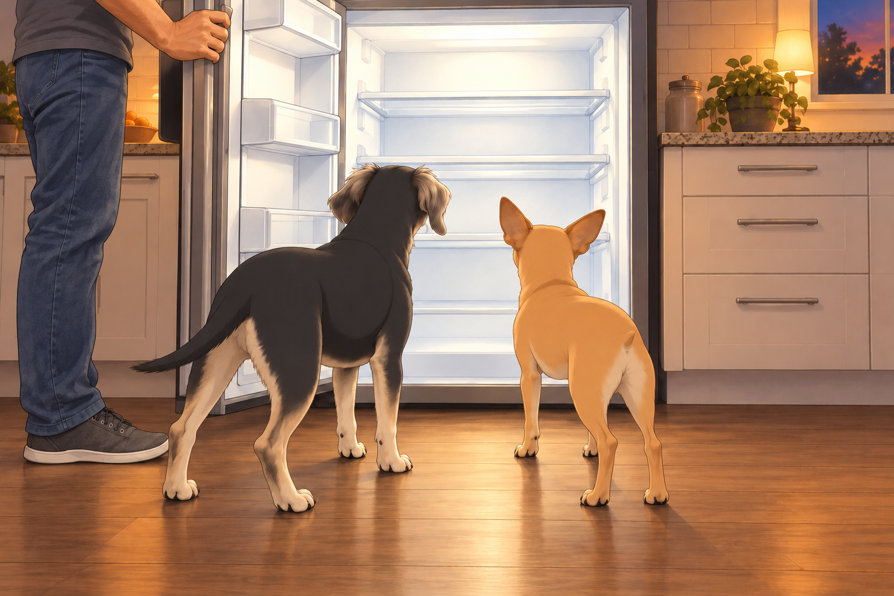
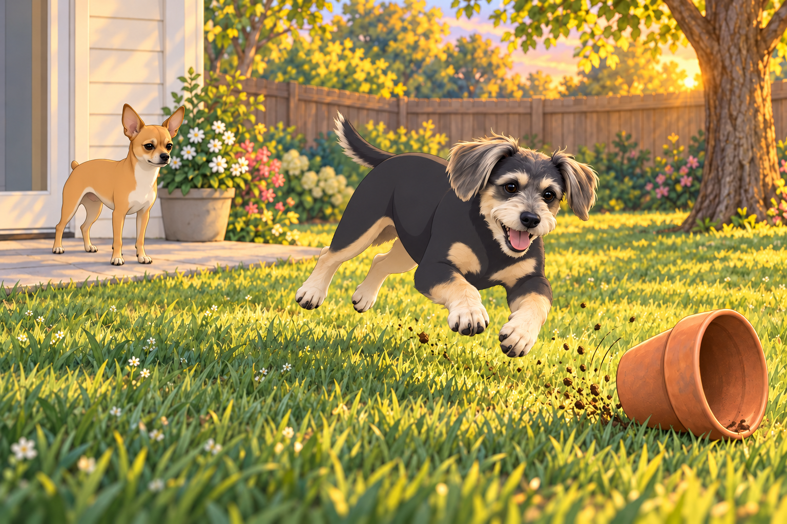
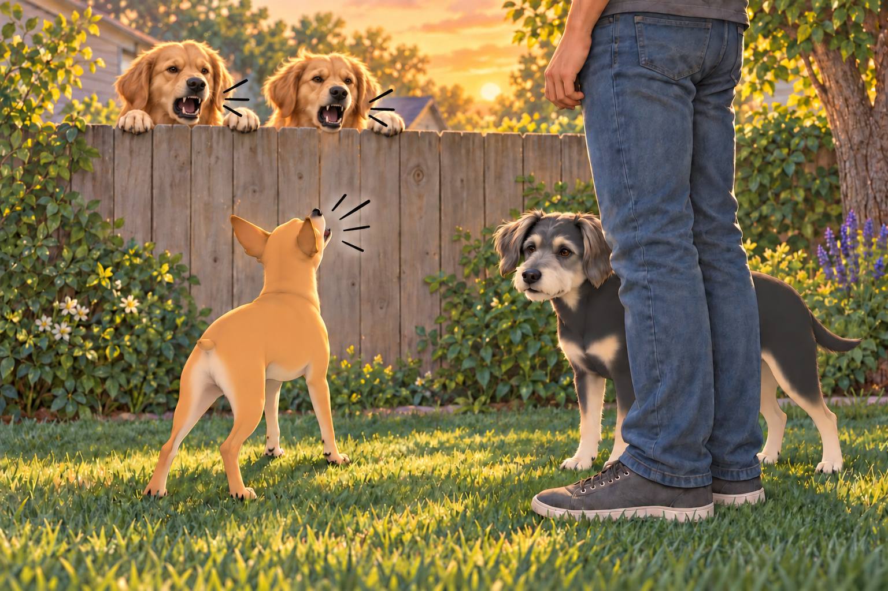
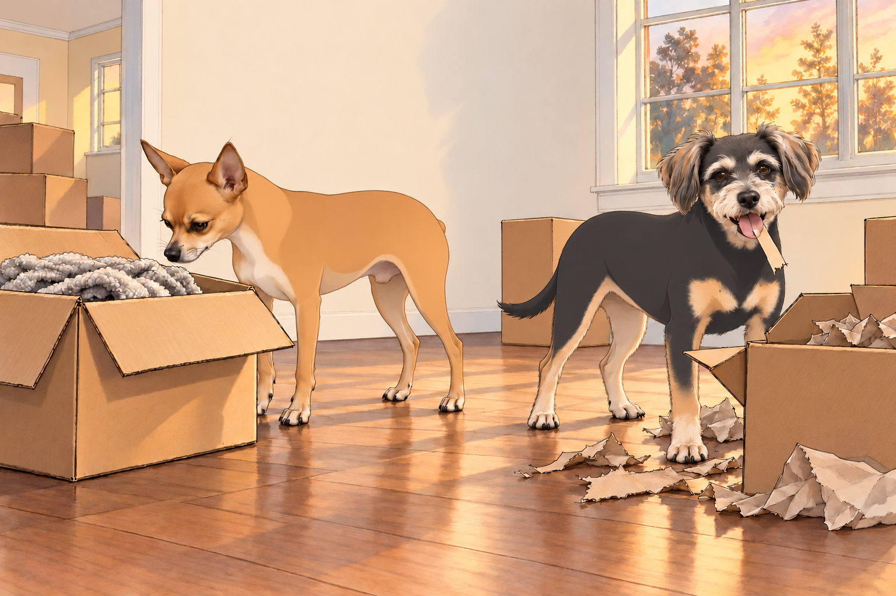
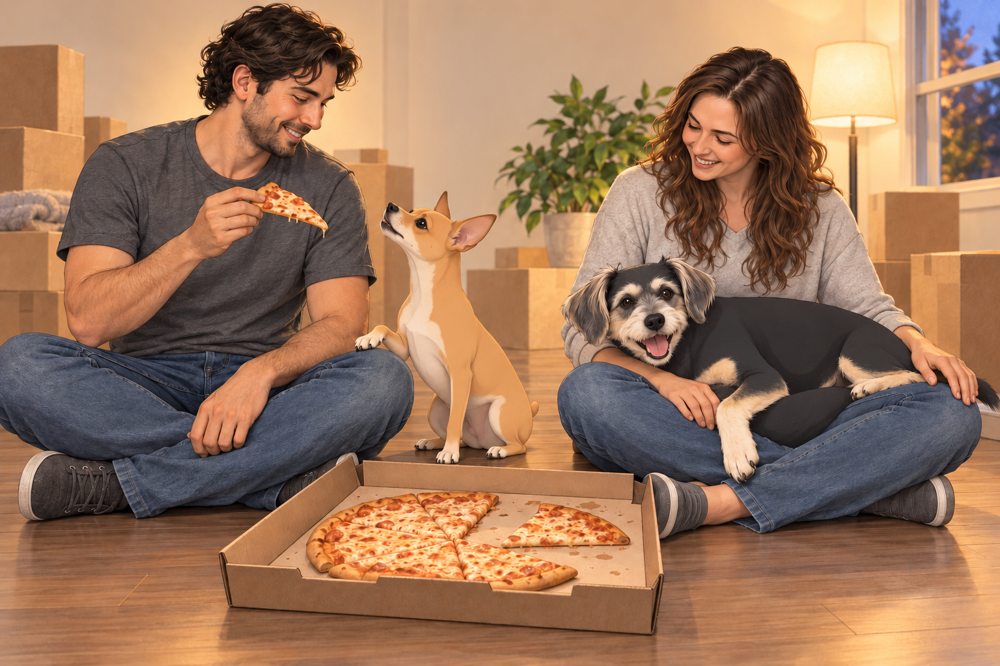

# Welcome to Austin—The Great Inspection

## Act I: Arrival— Euphoria Meets Exhaustion

After three grueling days of driving, snack stops, gas station bathroom dramas, and heated debates over playlists, the royal Subaru finally rolled into a quiet neighborhood on the outskirts of Austin, Texas. The golden sun was just setting, casting long shadows and bathing their new home in a warm, welcoming glow.

Sagar, despite his exhaustion, stepped out of the car with his usual calm and authority, surveying his new territory. Heather pushed her windblown hair out of her eyes and smiled at the front door. At last, somewhere to put the bags down.

Neet and Buddy burst from the car like furry rockets released from captivity. Buddy immediately tried to run in three directions at once, nose twitching frantically.

“Smells like adventure!” he barked excitedly.

Heather opened the trunk. A bag immediately fell against her knee.

“Smells like somebody packed the heavy things on top,” she said.

Sagar took the bag. “We agreed to stop reviewing the packing in Tennessee.”

Neet, tail high and ears perked like radar dishes, stood by Sagar’s side, sniffing the air with suspicion and determination. “New lands must first pass my rigorous inspection,” he declared, dramatically raising a paw.

---

## Act II: The Unofficial Inspector General

As Sagar finally turned the unfamiliar key and opened the front door, Neet raced ahead, self-appointed as the official House Inspector General.

“Step aside, civilians!” he barked, bustling importantly into the foyer. “Security clearance required.”

Buddy bounced in circles behind him. “Do we live here now? Is this ours? Can I pee here?”

“Outside,” Sagar said, catching the last question.

Buddy looked disappointed. Ownership apparently came with conditions.

Neet began his thorough inspection, methodically sniffing each corner:

- Living Room: “Mmm. Hardwood floors, acceptable. Slight dust smell— approved!”

- Kitchen: He meticulously checked each cabinet, “Drawer action a little sticky. Refrigerator smells empty— needs immediate provisioning. Provision with treats and chicken ASAP!”

Sagar opened the refrigerator. Neet stared into it. Buddy joined him.

For the first time in three days, neither dog had anything to say.

Sagar closed it.

“Even the light had nothing,” Buddy said.

In the hallway, Neet stopped over a creaking floorboard. “A suspicious creak detected. Needs investigation— marked for repairs!”

Heather smiled, snapping pictures of Neet’s serious inspection ritual. Buddy meanwhile wandered into every closet, bouncing out seconds later shouting, “Empty! I call dibs!”

When Neet reached the bedroom, he sniffed the carpet deeply, dramatically sneezing afterward. “Faint traces of previous occupancy. Recommend immediate vacuuming! Also, I sense a cat once lived here— unacceptable!”

Heather laughed and whispered to Sagar, “Our inspector general is tough today.”

---

## Act III: Backyard Bliss & Buddy’s Zoomie Mania

After thoroughly inspecting the interiors, Neet stepped out onto the patio, paws clicking with regal precision. As he surveyed the expansive, grassy backyard, his critical gaze softened just a bit.

“Backyard secured,” he declared, before Buddy charged past him, barking ecstatically, running manic loops around the lawn.

“Oh my god, grass! I love grass!” Buddy yelped joyously, crashing dramatically into a flowerpot, sending it rolling across the yard.

Neet raised an eyebrow. “You’ve just lowered the property value by five percent.”

Buddy shrugged. “Property shmoperty. This is heaven!”

He chased the rolling pot, overtook it, and then had to chase it in the other direction. Neet waited for the property value to stop moving.

Neet shook his head, muttering, “Civilians.”

Then he began his official perimeter security check— sniffing fences, inspecting the soil quality, and marking his favorite spots with the seriousness of a trained military operative.

“East side secure— approved!”

“West fence slightly crooked— needs minor adjustments!”

“Southern perimeter requires reinforcements against possible squirrel invasion!”

---

## Act IV: Neighborly Rivalry— Enter Martha and Sally

Just as Neet was about to declare the yard fully secure, an ear-splitting barking erupted from the other side of the fence. Two enormous fluffy heads appeared— Martha and Sally, the neighbor’s large, fierce-looking golden retrievers.

They barked relentlessly, “Intruders! New dogs alert!”

Neet spun around, eyes blazing, tail stiff as a flagpole. He approached the fence like a seasoned general. “State your business! I’m Inspector General Neet. This is sovereign territory!”

Martha growled, “This is OUR neighborhood, small fry!”

Sally barked aggressively, “Trespassers will be barked at repeatedly!”

“We live here!” Buddy called.

“Then repeatedly!” said Sally.

Buddy wanted his new lawn back. He tried one bark from beside Neet, then moved behind Sagar’s legs. “Yeah! What Neet said! Probably!”

Neet, refusing to back down, retorted, “I demand immediate silence or I shall be forced to escalate the situation! I warn you— I’m a 4.75-star general!”

Martha and Sally continued their noisy assault. Neet braced for combat, his bark rising to operatic volume. Sagar, seeing tensions escalate to hilariously serious proportions, intervened, stepping forward and calmly patting Neet’s head.

“Neet, my brave general,” he said calmly, “they’re neighbors, not enemies. Let’s grant them mercy today, shall we?”

Neet grudgingly stepped back, shouting through the fence, “Consider yourselves lucky! Next time, General Neet shows no mercy!”

Buddy peeked out from behind Sagar’s legs, whispering, “Yeah, and… and neither do I!”

He waited until Sagar turned toward the house, then walked between his feet, maintaining the arrangement.

---

## Act V: Settling In— The Chaos of Unpacking

Inside the house, the unpacking began in earnest. Boxes littered every room. Sagar and Heather began organizing, but quickly realized Neet had other ideas, inspecting every box, item by item:

- “This blanket has lost 12% fluffiness— send it for fluffing!”

- “These books smell intellectual— approved!”

- “Who packed kitchen utensils without labeling clearly? This is chaos!”

Buddy, meanwhile, merrily tore into packing materials, creating piles of shredded cardboard. Heather laughed helplessly, “Buddy, you’re not helping!”

“I’m supervising recycling!” he announced proudly, cardboard stuck to his tongue.

Sagar held the next box out of Buddy’s reach. Buddy followed it, the strip of cardboard still stuck to his tongue.

Heather peeled it off. Buddy accepted the assistance with the dignity of a department head whose printer had jammed.

Neet sniffed the newly opened box.

“More kitchen utensils. We have been infiltrated by spoons.”

“They’re the same spoons,” Sagar said. “You followed the box.”

---

## Act VI: Pizza and Promises

Too exhausted to cook, the family sat on their new living room floor, a large cheese pizza open in front of them, surrounded by empty boxes and shredded packing materials. Neet sat formally next to Sagar, eyeing the pizza as if conducting a final inspection. Buddy lay sprawled on Heather’s lap, nibbling on crusts lovingly passed to him.

Sagar lifted a slice. “Here’s to new beginnings!”

Heather leaned against him warmly. “And to the adventures ahead.”

Neet, mouth full of pizza crust, raised his paw solemnly. “And to firm enforcement of neighborhood security.”

Buddy barked happily, “And lots of pizza!”

Neet finished his crust and looked pointedly at Sagar’s slice.

“Inspection complete?” Heather asked.

Neet raised the paw again. There were follow-up questions.

---

## Act VII: First Night— All is Well

As moonlight poured into their new bedroom later that night, Heather sighed contentedly, nestled close to Sagar. Neet took his place at Sagar’s feet, vigilant as ever, mumbling softly, “Must reinforce the eastern wall tomorrow. Martha and Sally are threats to national security.”

Buddy, curled against Heather’s side, whispered sleepily, “Can I have my own fridge tomorrow?”

Heather laughed softly, eyes fluttering closed. “You’re all impossible.”

Sagar smiled, gently stroking Neet’s fur. “Yes, but we’re family.”

Neet’s ears turned toward the fence once more, then relaxed.

The refrigerator was still mostly empty. He would address that in the morning.

## Provenance and editorial notes

Working selection dated October 3, 2026. Selection and shelf order are editorial; owner approval and event chronology remain unverified.

Original numbering: independent captured sequence Chapter 12.

- Proper-name spelling “Neat” normalized to “Neet.” Source pronouns, dialogue, events and rank claims remain.

Archive recovery: use [Studio recovery guidance](../Studio/Recovery.md). The paths below are paths **inside the verified snapshot**, not active navigation. SHA-256 pins identify the exact sources.

- `elevenlabs-reader-21` — `02_Story_Library/ElevenLabs_Imports/reader-21-welcome-to-austinthe-great-inspection.txt`; SHA-256 `1ac2dc5ffae8fcde1758d4c3e60f34ba60b11de5bf12e3008f7507413abe4c6a`.

## Refinement record

Refined October 3, 2026; [episode record](../Productions/E039-welcome-to-austin-the-great-inspection/episode.json) documents the reading comparison and illustration work. The pre-refinement text is preserved in the [dated recovery snapshot](/Users/sagar/Documents/ChatGPT/NBC_Archives/NBC-before-refinement-2026-10-03_200659.tar.gz) at `NBC/Stories/S039-welcome-to-austin-the-great-inspection.md`. Historical provenance above remains unchanged.
