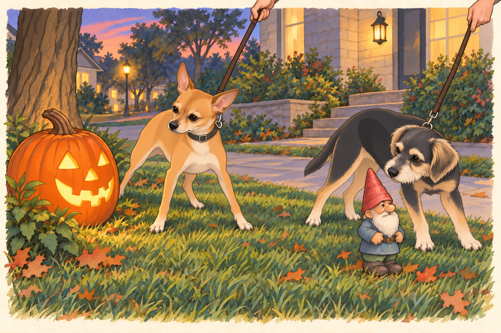
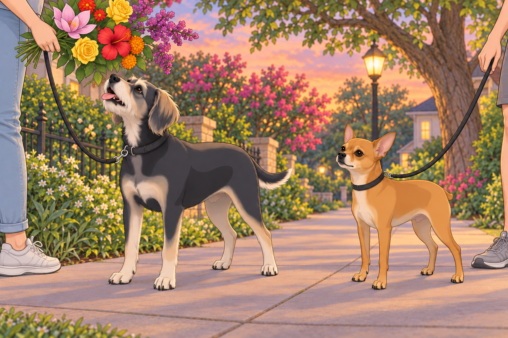
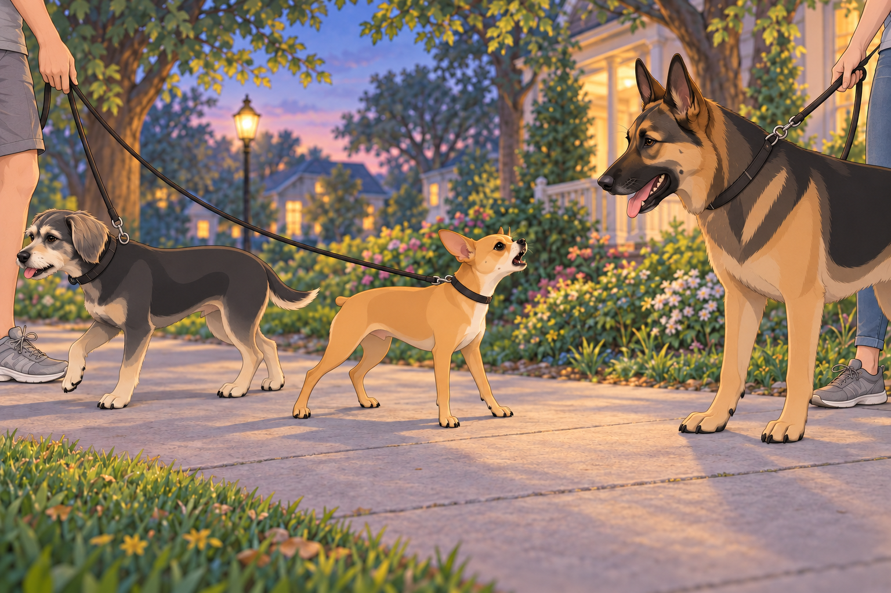
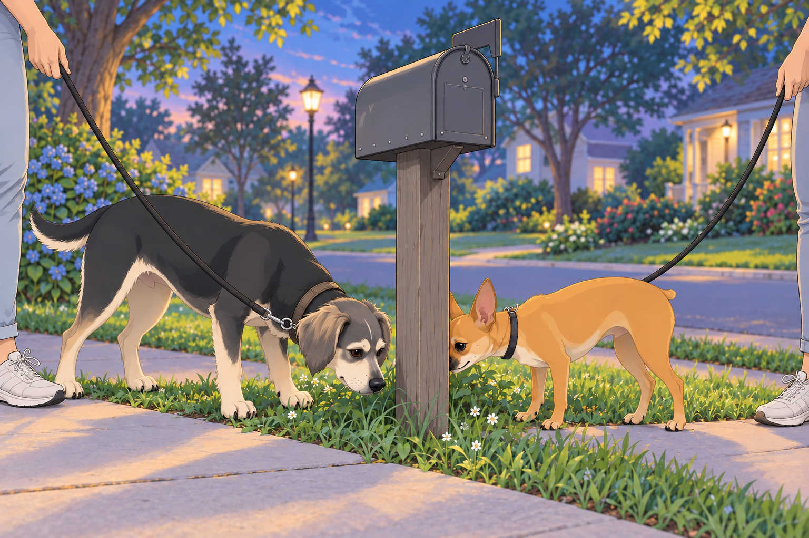
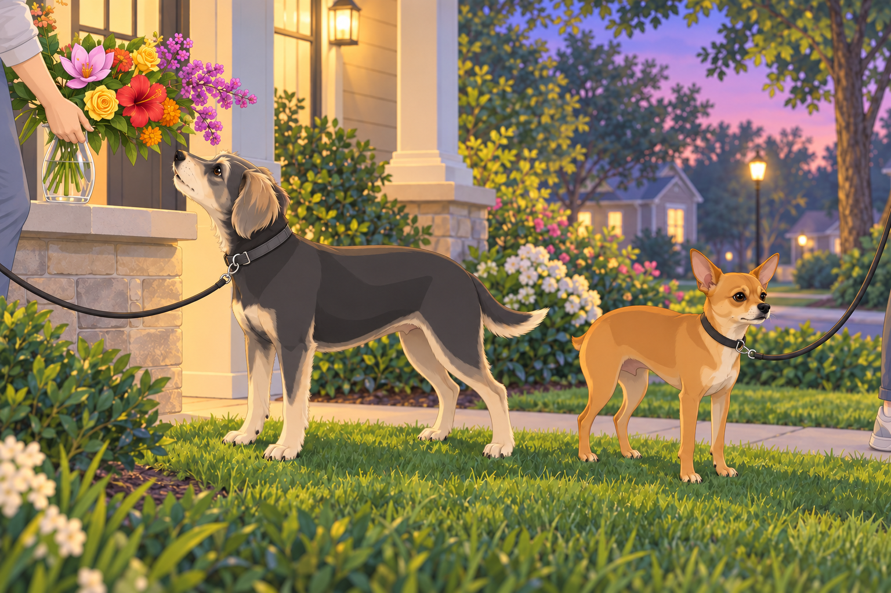

# The First Neighborhood Expedition

## Act I: An Enthusiastic Departure

Sagar stood at the front door holding two leashes. Outside, their first Austin neighborhood walk waited in the evening light. Buddy was making it difficult to attach his half of the equipment. Every time Sagar brought the clip near his collar, Buddy turned to see whether they had left yet.

Heather, radiant and contented, wrapped a soft scarf around her neck, smiling softly at Sagar. “Shall we begin our royal inspection of the neighborhood?”

Sagar nodded, smiling warmly. “Let us explore our new domain.”

At their feet, Neet stood poised, vibrating with pent-up excitement. Buddy was hopping in place, tail spinning like a helicopter rotor. “Adventure awaits! Squirrels, yards, possibly pizza dropped on sidewalks!”

“One moment,” Sagar said.

Buddy held still with the wounded patience of someone whose expedition had already been delayed twice. The clip clicked. He immediately forgave everyone.

Heather slipped her arm through Sagar’s, and together they stepped onto the sidewalk.

---

## Act II: Sidewalk Shenanigans and Glowing Pumpkins

The neighborhood unfolded before them— each house unique, charming, inviting exploration. Neet zigzagged furiously, nose leading the way, like a general scouting enemy territory.

Buddy tried three promising directions before Sagar had taken two steps.

“Pick one,” Sagar said.

Buddy picked a fourth.

Heather laughed as Neet tugged her toward an elaborate Halloween display. Suddenly, Neet froze, staring suspiciously at a large, glowing jack-o’-lantern, its orange grin sinister in the fading daylight.

“Alert!” Neet barked, jumping sideways, hackles raised. “Suspicious vegetable! State your allegiance!”

Heather giggled softly, kneeling beside him. “It’s just a pumpkin, Neet.”

Neet eyed it suspiciously. “It smiles without permission. Highly irregular.”

He sidestepped along the lawn. The smile seemed to follow him.

Heather covered her mouth.

Nearby, Buddy had encountered an innocent garden gnome. He paused, sniffed cautiously, and then yelped dramatically. “Tiny intruder spotted! Sagar! Assist immediately!”

Sagar chuckled, gently pulling Buddy along. “It’s harmless, Buddy. Just decoration.”

Buddy muttered suspiciously, “That’s what they want us to think.”

He gave the gnome a wide berth, then checked behind him to make sure it had stayed put.

---

## Act III: A Bouquet for the Queen

Further along their path, nature revealed its treasures. Trees lined the streets, branches heavy with blossoms, radiant in twilight’s glow.

Sagar, always attentive to beauty, began gently picking flowers, carefully selecting blooms worthy of Heather’s affection:

- Pink magnolias, delicate and fragrant, reminiscent of southern charm.

- Fiery red hibiscus, bold and dramatic, petals unfurled with passion.

- Golden-yellow roses, bright like captured sunlight, symbolizing warmth.

- Vibrant orange marigolds, cheerful guardians of happiness.

- Purple crepe myrtles, tiny blossoms clustered like amethyst jewels.

Heather’s eyes sparkled as Sagar carefully presented each blossom, laying them gently in her palm.

“For the queen of my heart,” he whispered, voice rich and tender.

Heather blushed softly, gathering the flowers like precious treasures. “You spoil me, my king.”

Neet looked approvingly upward. “Excellent gift selection, Sagar. Approved!”

Buddy chimed in happily, sniffing a marigold. “Is this edible?”

Heather lifted the bouquet. Buddy lifted his nose. She lifted it farther.

“Flowers,” she told him. “For looking at.”

Buddy looked at them with his mouth open.

Sagar gently guided his chin down. “That end is closed.”

---

## Act IV: Streets Written in the Stars

As twilight deepened, street lamps flickered awake, illuminating signs etched with celestial wonder. Heather pointed excitedly at one. “Andromeda Lane!”

Sagar nodded thoughtfully, glancing around. “Europa Street, Ganymede Drive, Orion Avenue… They’re all named after celestial bodies.”

Heather’s eyes softened, gazing dreamily upward. “It’s as if we’re walking through the galaxy itself.”

Neet looked up seriously. “Celestial names approved! Excellent thematic consistency.”

Buddy yipped happily. “I don’t know what you’re saying, but I love it!”

He sniffed the base of the signpost. Whatever galaxy this was, other dogs had already visited.

Heather squeezed Sagar’s hand affectionately. “I love that our new home feels like wandering among stars.”

Sagar smiled, eyes gentle. “Then we shall call it home among the heavens.”

---

## Act V: Neet’s Noble Confrontation

The peaceful stroll took an abrupt turn when a massive German shepherd emerged from a nearby yard, his owner— a kindly-looking woman— struggling to hold him back. The giant dog barked loudly, his deep voice echoing.

Neet’s ears shot upright, fur bristling dramatically. He stepped forward, eyes narrowed. “Identify yourself immediately!”

The German shepherd barked dismissively. “Who let the street rat out?”

Neet’s tiny frame quivered with fury. “Street rat? I’ll have you know, I am Inspector General Neet, a decorated hero, and a 4.75-star general! How dare you mock me?”

Buddy stopped beside Neet, then deliberately turned toward the sidewalk home. “Um…Neet, maybe we reconsider…he looks very large…”

He took one helpful step in the proposed direction. Neet declined to notice.

Neet stood firm, his chest puffed bravely. “Size is nothing! Bark is everything! Prepare yourself!”

The barking competition erupted furiously. Heather glanced nervously at Sagar. “Should we intervene?”

Sagar sighed calmly, stepping forward. “General Neet, stand down immediately. This duel is beneath you.”

Neet hesitated, dignity warring with loyalty. He turned toward Sagar. “On your orders. I want that in the report.”

The German shepherd huffed mockingly, but Neet proudly walked away, chin raised with dignified defiance.

Buddy whispered, impressed, “You’re the bravest coward I know, Neet.”

Neet glared. “Strategic withdrawal. I will accept no further comments.”

Buddy kept pace beside him.

After half a block, Neet said, “Was the withdrawal convincing?”

“Very. We’re quite far away.”

---

## Act VI: A Heavenly Twilight

The family resumed their peaceful walk. The sky was breathtaking now, a soft gradient of gold fading into lavender, dotted with the first faint stars.

Heather leaned her head gently on Sagar’s shoulder. “Isn’t it magical? It feels like we’re exactly where we’re supposed to be.”

Sagar squeezed her hand, tender and protective. “Together, we are always exactly where we should be.”

Buddy sniffed a mailbox excitedly, interrupting their romantic moment. “Guys, important news! Someone named ‘Johnson’ lives here and possibly likes chicken!”

Neet sniffed cautiously. “Also, their cat may pose a future security risk.”

Sagar smiled indulgently. “Good intel, gentlemen.”

Buddy planted his feet. At last, a location worth defending.

“No chicken,” Heather said, giving the leash a gentle invitation. “Come on.”

Buddy took one last breath of Johnson’s and brought the information with him.

---

## Act VII: Homeward Bound

As they reached their doorstep again, the evening breeze rustled gently, carrying the scent of jasmine and fresh-cut grass. Heather carefully placed her flower bouquet in water, admiring its vibrant beauty.

Neet conducted a quick perimeter check, declaring the area “secure but to be monitored closely.”

Buddy collapsed happily onto the soft lawn, rolling with joyous abandon. “Best walk ever! Can we do it again tomorrow?”

Sagar gently stroked Neet’s ears, smiling warmly. “Perhaps tomorrow we’ll have fewer duels.”

Neet nodded solemnly. “Only if the neighbors learn proper respect.”

Heather wrapped an arm lovingly around Sagar’s waist, looking around their neighborhood warmly. “Every corner feels familiar already.”

Sagar held her close, looking down into her eyes with endless affection. “That’s because home is wherever we’re together.”

Buddy got up and approached the flowers again. Heather nodded and moved the bouquet farther from his interested nose.

He had recovered enough to ask a second opinion.

Buddy barked happily from the grass. “Agreed! Especially if pizza is involved!”

Neet gave the street one last look. Tomorrow’s inspection could begin at the pumpkin. He still had questions about the smile.

## Provenance and editorial notes

Working selection dated October 3, 2026. Selection and shelf order are editorial; owner approval and event chronology remain unverified.

Original numbering: independent captured sequence Chapter 13.

- Proper-name spelling “Neat” normalized to “Neet.” Source pronouns, dialogue, events and rank claims remain.

Archive recovery: use [Studio recovery guidance](../Studio/Recovery.md). The paths below are paths **inside the verified snapshot**, not active navigation. SHA-256 pins identify the exact sources.

- `elevenlabs-reader-20` — `02_Story_Library/ElevenLabs_Imports/reader-20-the-first-neighborhood-expedition.txt`; SHA-256 `38f204314614f0a8cd4bd493b807590061a629badc6ca626c617ede181a03ab5`.

## Refinement record

Refined October 3, 2026; [episode record](../Productions/E040-the-first-neighborhood-expedition/episode.json) documents the reading comparison and illustration work. The pre-refinement text is preserved in the [dated recovery snapshot](/Users/sagar/Documents/ChatGPT/NBC_Archives/NBC-before-refinement-2026-10-03_200659.tar.gz) at `NBC/Stories/S040-the-first-neighborhood-expedition.md`. Historical provenance above remains unchanged.
