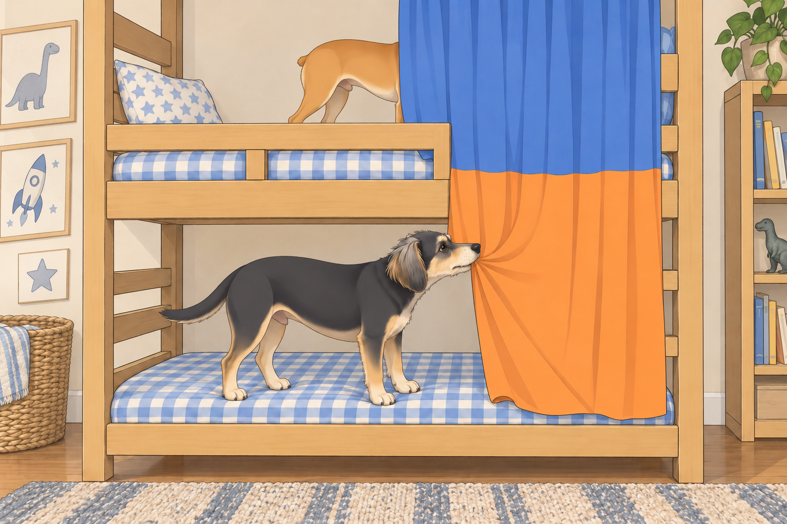
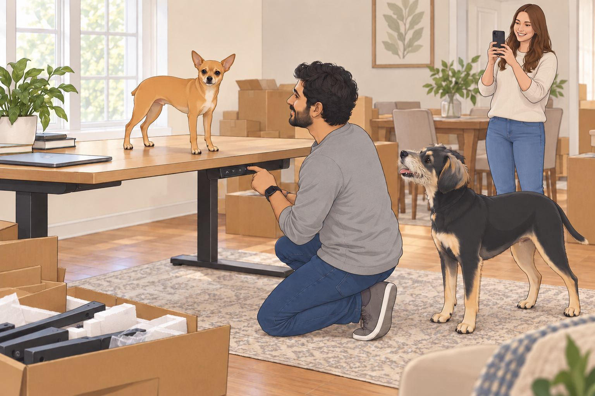
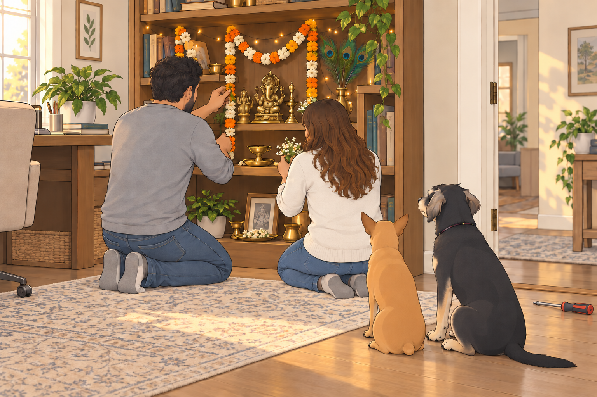

# The Epic Furniture Fiesta

## Act I: An Empty Canvas

Sagar and Heather stood in the empty living room on Saturday morning. Even Heather’s sigh echoed.

“Well, it’s beautifully minimalistic,” she laughed softly.

Sagar nodded dramatically. “Minimalist indeed— so minimalistic we don’t even have a chair.”

Neet trotted in, his paws clicking rhythmically. He surveyed the vast emptiness and announced with royal disdain, “Unacceptable! Where will I perform my royal naps?”

Buddy bounded into the room behind Neet, spinning in circles excitedly. “We live in a ballroom now! Can we dance?”

Buddy completed one turn, heard his own paws echo, and stopped to listen.

Neet looked behind him. “Who’s following us?”

Sagar chuckled and gently patted Buddy’s head. “First, we need furniture. IKEA awaits!”

---

## Act II: IKEA Shenanigans— Inspector General Neet on Duty

At IKEA, Heather and Sagar stood at the entrance, overwhelmed by aisles of furniture stretching infinitely.

Neet trotted forward proudly, declaring himself “Chief Ergonomics Officer.” Immediately he began evaluating everything:

- Dining chairs? He jumped onto one, placing his paws delicately on the table. “Height is satisfactory— optimal neck position achieved for elegant dining!”

- Sofas? Neet meticulously tested each cushion, carefully pressing down with his tiny paws. “Firmness acceptable, bounce ratio satisfactory.”

- Kitchen stools? He shook his head sternly. “Too high. Eating would result in compromised posture!”

Meanwhile, Buddy bounded enthusiastically onto a plush sectional sofa and promptly disappeared into a mountain of pillows, barking, “I’ve found paradise!”

Neet leaped onto the sofa after Buddy, dramatically reclining to measure space. “Comfort verified. Spacious enough for royal family movie nights. This might suffice.”

Heather smiled softly, amused. Sagar nodded approvingly, pretending seriousness. “Your analysis is impeccable, Inspector Neet.”

Heather lifted a pillow. Buddy was underneath it.

“We do have to leave this one here,” she said.

Buddy shut his eyes. Perhaps they would mistake him for another cushion.

Neet rose to test the next cushion. Someone had to keep working.

---

## Act III: Bunk Bed Battles and Curtain Conflicts

Soon, Neet and Buddy discovered the kids’ section and raced immediately toward an elaborate bunk bed display.

Buddy jumped onto the lower bunk, yelling gleefully, “Bottom bunk is mine— easy snack access!”

Neet scurried swiftly up the ladder, puffing his chest out heroically. “As senior officer, I claim top bunk to monitor security threats from higher vantage!”

Buddy protested immediately. “You’ll fall off in your sleep. You twitch when dreaming!”

Neet glared downward. “I twitch heroically. Also, you snore like a freight train. Lower deck suits you perfectly.”

Heather whispered playfully to Sagar, “Are we getting them bunk beds now?”

Sagar laughed warmly, shaking his head. “Only if they promise to sleep separately for once.”

Meanwhile, Neet tugged curtains around his bunk protectively, barking, “Curtain color must match my eyes— royal blue!”

Buddy countered fiercely, “No, bright orange! Matches cheese and snacks!”

Buddy caught a trailing curtain hem from the lower bunk. Neet pulled from above. The curtain drew across Neet’s face.

For a moment, the senior officer had no view of the threats.

“Visibility compromised,” he announced from behind the fabric.

Buddy let go. Neet’s ears reappeared first.

Heather finally intervened, giggling, “Okay boys, maybe we postpone bunk bed discussions.”

Sagar helped Neet down. Buddy abandoned the lower bunk immediately and followed him.

“Separately,” Sagar reminded Heather. “That was the condition.”

---

## Act IV: Dissatisfaction and Discovery

Despite fun-filled chaos, Heather and Sagar realized IKEA’s mass-produced styles weren’t quite fitting their personalities.

Sagar shook his head gently, touching a plain table. “It all feels… AI-generated. There’s no soul.”

Heather nodded sympathetically. “Let’s try someplace local. I heard good things about ‘Austin Artisan Furnishings’.”

Neet barked authoritatively, “Local business? Highly approved!”

Buddy looked back toward his sectional. The committee had apparently voted while he was asleep.

---

## Act V: Captain’s Chill Furniture Store

At Austin Artisan Furnishings, the moment they entered, a golden retriever named Captain trotted lazily forward, tail wagging slowly in greeting.

Neet stiffened, eyes narrowed in suspicion. “Identify yourself, stranger!”

Captain yawned lazily. “Relax, dude. I’m Captain— head of security. But mostly I nap.”

Buddy sniffed him cautiously, then settled on the other end of the rug. “I’m trying his recommendations.”

Neet nodded gravely. “For now, he passes.”

Captain flopped casually onto a rug. “Thanks, little dudes. Welcome.”

“Your entire security procedure is lying down?” Neet asked.

Captain lowered his chin.

Buddy lowered his too. The training was going well.

Heather and Sagar, charmed by Captain’s mellow vibes, explored further. Heather ran her hands over an exquisite wooden dining table, smiling brightly. “This is perfect.”

Sagar agreed warmly. They quickly chose a plush, inviting sofa in soft gray fabric, and a rustic, elegant TV console. Neet immediately jumped onto the new sofa, sprawling dramatically. “Cushion softness superior! Immediate purchase required.”

---

## Act VI: Home Assembly Mania

The weekend became an intense DIY adventure. Boxes piled high, tools scattered everywhere, instructions unfolded like ancient scrolls.

Neet supervised strictly, examining instructions carefully, barking orders: “Align screws properly! Misalignment detected! Immediate correction needed!”

Buddy gleefully ran off with a screwdriver, shouting triumphantly, “I’ve got the magic wand!”

Sagar held out his empty hand. Buddy went around the boxes to avoid interrupting him.

“Have you seen the screwdriver?” Sagar asked Heather.

“Yes,” she said. “It’s just turned the corner.”

The centerpiece of the excitement was the electric standing desks. Sagar lifted Neet onto one, grinning mischievously. “Payload testing commencing!”

Neet stood heroically atop the desk as it rose and lowered smoothly. “Height adjustable desk— highly ergonomic! Payload approves!”

Heather laughed heartily, recording the spectacle. “Neet’s officially a desk inspector now?”

Neet nodded solemnly, “Add it to my résumé!”

From the floor, Buddy watched the desk descend.

“Can it lower dinner?”

“Office equipment,” Neet said.

Buddy waited through another rise and fall. He wasn’t ready to rule it out.

---

## Act VII: Designing Spaces and Sacred Corners

Next, Heather set up her office, carefully hanging beautiful acoustic panel posters depicting forests and mountains. She strung delicate fairy lights, turning her workspace into a cozy haven.

Sagar carefully assembled his office, pausing thoughtfully before placing a beautiful wooden bookshelf.

He smiled softly. “This is perfect for our temple.”

With gentle care, Sagar arranged statues of deities, placing fragrant flower garlands, intricate peacock feathers, and tiny, twinkling lights. Heather joined him quietly, handing him each item reverently.

Neet sat solemnly by their side, whispering, “A temple inspection is sacred. Quiet, Buddy.”

Buddy brought the screwdriver as far as the office door, put it down, and sat beside them.

Sagar touched Buddy’s head in thanks, then set the tool aside. No one asked the magic wand to do anything else.

---

## Act VIII: First Puja and Family Blessing

As Sagar lit the diya, the room filled with soft, golden light. Heather and Sagar chanted softly, prayers filling the room with tranquility and warmth.

Buddy quietly approached, sitting gently by Sagar’s knee, eyes soft with reverence.

After finishing prayers, Sagar took the aarti flame, gently blessing Heather. She smiled warmly, her devotion shining brightly.

Then Sagar passed the warmth of his hands gently over Neet and Buddy’s heads.

Buddy wagged his tail gently, whispering, “I feel blessed— and hungry.”

Neet nodded solemnly. “This home has been consecrated officially. Blessings received.”

---

## Act IX: First Meal and Cozy Completion

As evening fell, the house now felt perfectly complete:

- The cozy new couch invited warm movie nights.

- The TV sat proudly atop the elegant console.

- The dining table gleamed invitingly under soft lights.

- Their offices were beautiful, functional, and inspiring.

At last, the family gathered around their new dining table, savoring their first homemade meal in their freshly furnished home. Heather raised her glass gently.

“To our home, our happiness, and endless adventures.”

Sagar smiled lovingly. “And to our inspectors Neet and Buddy— for tireless quality control.”

Neet sat regally on his designated chair, nodding approvingly. “Ergonomics verified— meal approved!”

Buddy happily barked, munching contentedly, “Best weekend ever!”

After dinner, Buddy went straight to the sofa. Neet joined him for one last cushion test.

Heather came in carrying a pillow and found Buddy already asleep. This time she left him where he was.

Neither inspector submitted a report.

## Provenance and editorial notes

Working selection dated October 3, 2026. Selection and shelf order are editorial; owner approval and event chronology remain unverified.

Original numbering: independent captured sequence Chapter 14.

- Proper-name spelling “Neat” normalized to “Neet.” Source pronouns, dialogue, events and rank claims remain.

Archive recovery: use [Studio recovery guidance](../Studio/Recovery.md). The paths below are paths **inside the verified snapshot**, not active navigation. SHA-256 pins identify the exact sources.

- `elevenlabs-reader-19` — `02_Story_Library/ElevenLabs_Imports/reader-19-the-epic-furniture-fiesta.txt`; SHA-256 `6e868cc1cb9ecad1a81619152bbc8bfea2cddf260dab0fe8a3d333c4b0680e6f`.

## Refinement record

Refined October 3, 2026; [episode record](../Productions/E041-the-epic-furniture-fiesta/episode.json) documents the reading comparison and illustration work. The pre-refinement text is preserved in the [dated recovery snapshot](/Users/sagar/Documents/ChatGPT/NBC_Archives/NBC-before-refinement-2026-10-03_200659.tar.gz) at `NBC/Stories/S041-the-epic-furniture-fiesta.md`. Historical provenance above remains unchanged.

Expanded October 4, 2026: the [second comedy pass](../Productions/E041-the-epic-furniture-fiesta/comedy-pass-v002.json) develops the existing incidents and records source comparison. Five proposed contextual illustrations await independent visual and complete rendered-reading review. Style and human likeness remain provisional; owner approval is unapproved and publication is not_published.
