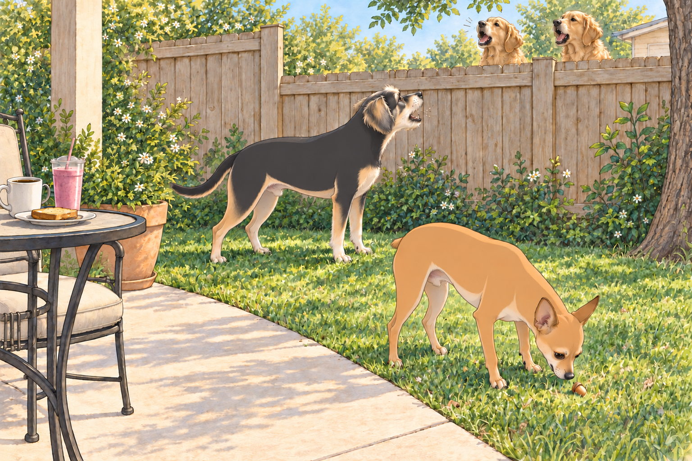
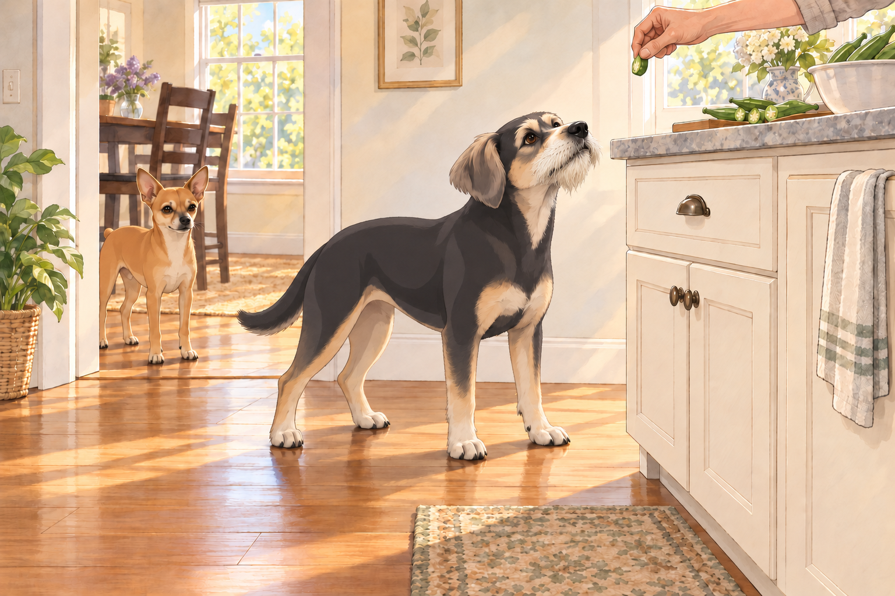
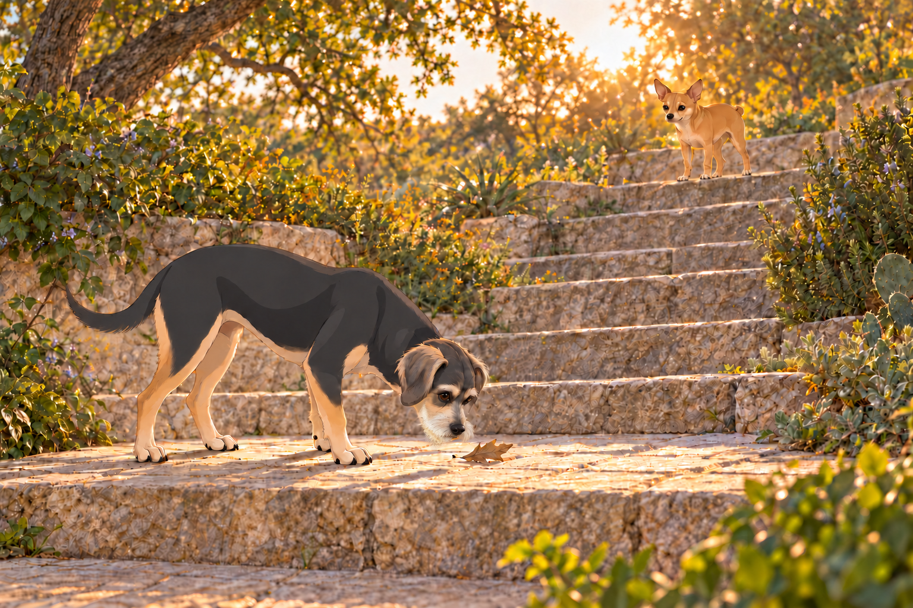

# The Day the Bark Stood Still

## Act I: From Hot-Head to Half-Lotus

There was a time, not so long ago, when Neet was the canine equivalent of a hair-trigger fire alarm. If something moved, creaked, rustled, or simply existed in the wrong place at the wrong time— Neet was on it.

Heather would be mid-sip of her coffee, and there he’d go— BAM!— launching into a fence-side filibuster. Sagar would be on a work call, and suddenly Neet was in the background delivering a Shakespearean bark monologue at the garden gnome three houses down.

His military title, 4.75-star general, was not self-proclaimed— it was earned, one “officer-level bark” at a time. The missing quarter-star? An incident involving a blow-up Santa Claus that ended with Neet tripping over his own leash and conceding temporary defeat.

Buddy had slept through the Santa incident. He still regarded it as an excellent tactical decision.

But Sagar had a vision. Over the past month, he’d been training Neet in what he called “Center Mode”: a state of calm where no outside provocation could shake his focus. Morning drills in the backyard, calm leash walking sessions, breathing cues (“Inhale… exhale… good boy”), and the sacred “Look at me, Neet” mantra had slowly begun to rewire the general’s instincts.

---

## Act II: The Backyard Breakfast Trial

The test came on a soft Austin morning.

Heather and Sagar sat at their patio table, breakfast laid out:

- Heather’s banana-strawberry smoothie in its tall glass.

- Sagar’s coffee, dark and rich.

- A small plate of toast between them.

Neet lounged nearby, eyes half-closed, soaking up the sunlight. Buddy sniffed around the grass, clearly plotting a pre-breakfast squirrel chase.

Then, the daily ritual began.

From the neighbor’s yard came the sharp crack of the back door, and out marched The Bark Sisters— Martha and Sally— two dogs with lungs the size of jet engines. They erupted into a synchronized bark-off that would’ve rattled the bones of lesser creatures.

Heather instinctively braced for the sprint-to-the-fence chaos. Sagar just smiled faintly, coffee in hand.

Neet lifted his head. His ears swiveled toward the sound. And then… nothing. No explosion. No fence charge. He stood, slow and deliberate, and strolled across the yard as if he were inspecting a royal garden.

Halfway to the fence, he spotted something in the grass: an acorn.

He lowered his head, sniffed, and rolled it once with his nose— turning his back to the barking storm. His posture remained serene.

Heather froze mid-sip. “Did… did he just ignore them?”

Sagar smiled knowingly. “He’s in his center.”

Heather lowered her glass very carefully, as though a clink might undo the month’s work.

Buddy’s eyes widened. “Wait— are we… not barking?” The Bark Sisters were still howling like sirens. He glanced at the quiet Neet, then at the fence. Someone had to answer. “Nope. Sorry. I’m going in.” And off he went, barking his best counter-attack.

Neet finally padded over and gave one low WOOF. “I’m here if you need me.” Then he turned toward the patio. Buddy barked once more, found he was arguing alone on this side of the fence, and followed.

“I had nearly finished,” he said.

Martha and Sally began another round. Buddy walked a little faster.

---

## Act III: The First True Weekend of Rest

It was the first weekend in months without a to-do list longer than a CVS receipt.

Heather, finally freed from furniture assembly and endless package disposal, decided to make her beloved dal and crispy okra for lunch. The kitchen filled with the earthy perfume of cumin seeds crackling in oil, garlic releasing its sweetness, okra sizzling until its edges crisped.

Neet stationed himself at the kitchen doorway, far enough to look innocent but close enough to field-test gravity’s generosity. Buddy took the riskier position— right under the chopping board— ready to intercept any vegetable that dared fall.

Heather caught a piece of okra before it reached the floor. Buddy stared at her hand.

“That was coming to me.”

Neet remained at the doorway. Center Mode was easier when someone else suffered the disappointment.

After lunch came a household-wide nap. Sagar stretched out on the couch, Heather curled against him, Neet sprawled near his feet, and Buddy tucked himself into a neat cinnamon-roll shape on the rug. Outside, the world went on— but inside, time slowed to a soft, sleepy hum.

---

## Act IV: Stairs to the Sky

By late afternoon, Sagar announced, “We’re going to catch the sunset.”

They drove to one of Austin’s iconic vantage points overlooking the Colorado River. The path to the top was a long series of stone stairs winding through greenery.

Neet saw them and immediately activated bunny mode. He hopped up the stairs with spring-loaded enthusiasm, pausing every few landings to look back like a tour guide checking on his group.

Buddy followed, alternating between bursts of energy and dramatic pauses to “inspect” stray leaves. Heather laughed, shaking her head. “He’s pretending to be tired so Neet doesn’t lap him twice.”

Buddy selected a leaf on a broad landing and gave it a very thorough sniff. Neet waited above him.

“Anything?” Neet asked.

“Still a leaf.” Buddy took another breath. “I’m checking.”

At the summit, the city stretched out below— Austin’s skyline glowing in the last light, the river glinting like liquid gold. As the sun dipped, the sky flushed golden pink, then lavender, as if heaven had pressed itself just beyond the horizon.

Neet and Buddy mingled happily— Neet even let a Golden Retriever sniff his shoulder without issuing a formal complaint. Progress.

---

## Act V: Pav Bhaji Night

Back home, the kitchen came alive again. Pav bhaji night was a family event:

- Heather chopped tomatoes and peppers with efficient precision.

- Sagar manned the stovetop, spices blooming in butter.

- Neet stretched up onto his hind legs to nudge folded napkins toward the center of the dining table, earning the title of Table Setting Deputy. Heather nudged the crooked stack straight after he dropped back down. Neet accepted the promotion without inspecting her corrections.

- Buddy took his usual role as Gravity Enforcement Officer, waiting beneath every counter edge.

At one point, Sagar lifted Neet onto the counter to watch the bhaji simmer. Neet stared into the pot like a philosopher contemplating the cosmos. “This,” he said gravely, “is the smell of joy.”

They sat down together, the pav toasted to golden perfection, the bhaji rich and spiced just right.

---

## Act VI: The Zen Sermon

As the meal wound down, Neet turned to Buddy, his voice low and wise.

“You don’t have to answer every bark,” he said. “I was halfway through inspecting that acorn.”

Buddy tilted his head. “So… we don’t bark unless it’s serious?”

Neet nodded. “Correct. Except for squirrels. And the vacuum cleaner. And that one mailman who smells of fear.”

Heather nearly choked on her water laughing. Sagar leaned back, smiling with the quiet pride of a teacher watching his student graduate.

---

## Act VII: The Night’s Quiet

Later, the couch cradled them all— Heather curled under a blanket, Sagar with his arm around her, Buddy snoring lightly, Neet stretched across the ottoman like a conquering hero.

A bark came faintly through the window. Buddy opened one eye. Neet stayed on the ottoman, and Buddy let his eye close again.

Tomorrow might bring a squirrel. That would require a separate decision.

## Provenance and editorial notes

Working selection dated October 3, 2026. Selection and shelf order are editorial; owner approval and event chronology remain unverified.

Original numbering: independent captured sequence Chapter 15.

Archive recovery: use [Studio recovery guidance](../Studio/Recovery.md). The paths below are paths **inside the verified snapshot**, not active navigation. SHA-256 pins identify the exact sources.

- `elevenlabs-reader-01` — `02_Story_Library/ElevenLabs_Imports/reader-01-the-day-the-bark-stood-still.txt`; SHA-256 `ff7f6a9a6ebc764faaea1f69f9bc6dc42876b89ee8f6c1f3a775e84765a00330`.

## Refinement record

Refined October 3, 2026; [episode record](../Productions/E042-the-day-the-bark-stood-still/episode.json) documents the reading comparison and illustration work. The pre-refinement text is preserved in the [dated recovery snapshot](/Users/sagar/Documents/ChatGPT/NBC_Archives/NBC-before-refinement-2026-10-03_200659.tar.gz) at `NBC/Stories/S042-the-day-the-bark-stood-still.md`. Historical provenance above remains unchanged.
