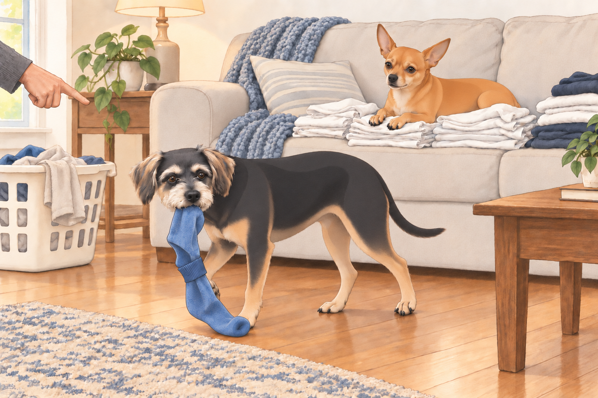
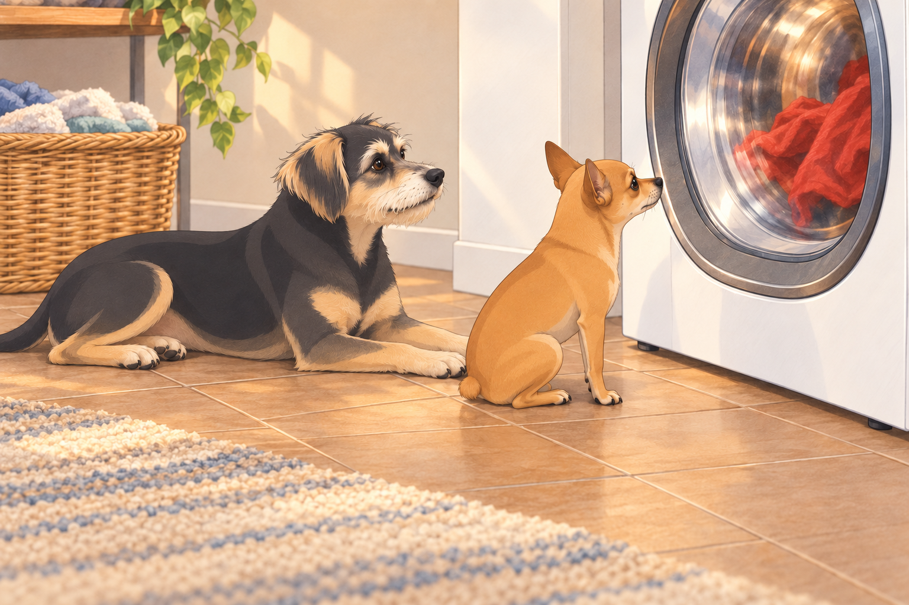
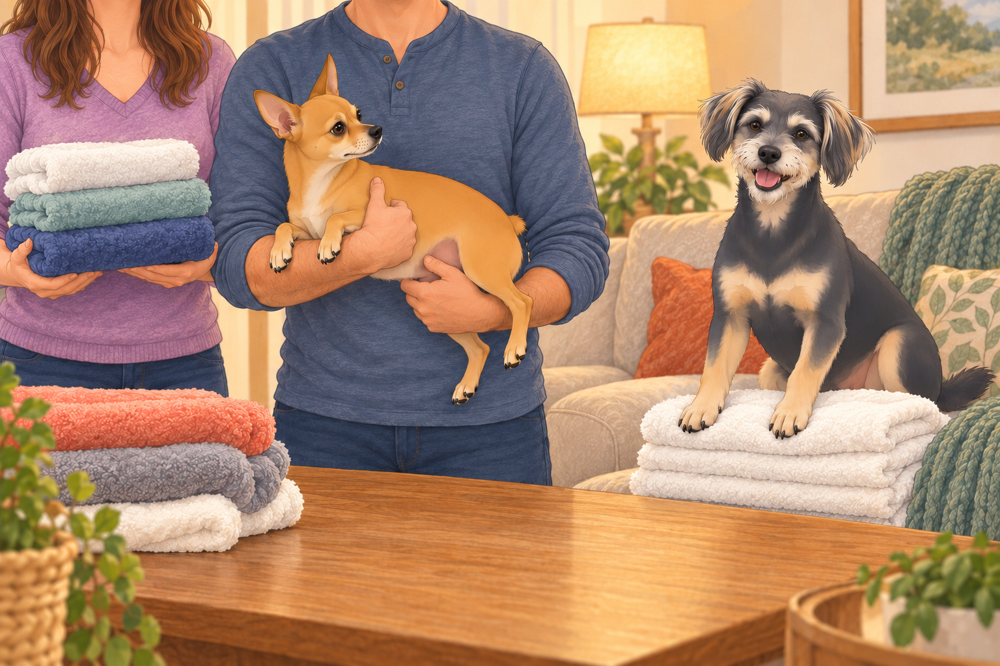

# The Great Laundry Day Uprising

## Act I: The Royal Proclamation

It was a golden Saturday morning in Austin. Heather stood in the living room with a laundry basket balanced on her hip. Neet looked up. Buddy quietly put a paw on the blanket.

Her voice was steady. “Today,” she declared, “we tackle everything. Sheets, towels, clothes, blankets… all of it.”

Sagar, sipping tea like a monarch receiving battle orders, nodded gravely. “We’ll need strategy. Endurance. And snacks.”

From the corner, Neet raised his head. He knew this day— Laundry Day— and in his mind, it was not about clean clothes. It was about power. The laundry pile was a kingdom to be conquered, defended, and redistributed to suit canine needs.

Buddy, however, saw it differently. To him, laundry day was a high-risk hostage situation. Socks disappeared. Blankets were whisked away for “washing” and sometimes never returned. His mission was clear: Protect the soft things.

Heather reached for the blanket. Buddy added his other paw.

“Thank you for sorting yourself into the blanket load,” she said.

Buddy stepped off. He had not considered that possibility.

---

## Act II: The First Load — Chaos Unfolds

Heather dropped the first clean load onto the couch. Neet moved instantly, nose twitching. He circled the pile once, twice— then pounced like a jungle cat and buried his face in a heap of freshly laundered T-shirts.

Heather laughed. “Neet! That’s not a bed.”

But Neet was already in deep— rolling onto his back, kicking his legs in the air, turning the T-shirts into a personal massage spa.

Neet rolled back onto his belly to watch.

Meanwhile, Buddy executed a stealth operation: he reached into the pile, gently clamped his jaws on a lone blue sock, and tiptoed toward the hallway. His plan might have worked— if the sock hadn’t been tucked into its mate. The second sock flapped like a victory flag, drawing Heather’s attention instantly.

“Buddy!”

Buddy froze. Perhaps she meant another Buddy.

“Blue sock. Mouth. You.”

He bolted, dragging the sock-pair like captured treasure.

---

## Act III: Dryer Diplomacy

When the wet clothes were loaded into the dryer, Neet appointed himself Official Dryer Inspector. He sat in front of the glass door, eyes locked on the tumbling rotation inside, head tilting left, then right, like he was tracking a tennis match.

The same red shirt passed the window again. Neet leaned closer. He had already inspected that one.

“Something keeps sending them back,” he told Buddy.

Buddy, never one to miss a comfort opportunity, lay down beside the dryer, soaking up the warmth. When Heather tried to retrieve a towel from the next load, he didn’t move— just gave her the look of a man who had reserved a spa lounger.

“Could you shift six inches?” she asked.

Buddy shifted his eyes.

Heather stepped over him. Neet watched the red shirt go round once more. Neither department was making progress.

---

## Act IV: Folding Frenzy

By mid-afternoon, clean laundry was stacked high on the couch. Heather and Sagar took their folding positions— Heather on the left, Sagar on the right.

Neet watched closely. His internal criteria for a “folded” item had nothing to do with neatness and everything to do with accessibility. He wanted every third towel to be slightly skewed so he could nose it open for a nap later.

The folding rhythm was soon broken when Neet leapt onto the couch mid-fold, planting himself directly onto the warmest pile— Heather’s freshly folded whites.

Sagar, half-smiling, lifted Neet off the stack. This freed up exactly enough space for Buddy to jump up and sit on the clean towels.

Sagar stood holding Neet. Heather looked at Buddy. Buddy settled his weight.

“Don’t put that one down,” Heather said.

Neet, suspended between victory and the floor, watched Buddy inherit his entire position.

Heather moved the next stack straight into the basket. Buddy leaned after it, then remembered he was sitting on the last stack. For once, protecting the soft things required a difficult choice.

He stayed.

The humans worked faster, trying to outpace the four-legged saboteurs. But it became obvious: every folded pile was destined to be “claimed” before it reached the closet.

---

## Act V: The Pillowcase Heist

With the final load in hand, Heather moved toward the bedroom. Neet trotted alongside her like a bodyguard… until his true intentions were revealed. In one smooth motion, he reached up, snagged a pillowcase from the top of the stack, and bolted down the hallway.

Buddy galloped behind him, then stopped at the hall entrance. Heather had to step around him; he looked delighted with this contribution.

“Move, getaway driver.”

Buddy moved into the other half of the doorway.

Heather gave chase, but Neet had the speed and agility of a parkour master. He leapt over a footstool, dodged around Sagar, and slid into the dining room like a baseball player stealing home.

Sagar finally intercepted him, scooping him up mid-run. “You,” he said, “are lucky you’re adorable.”

Neet just wagged, pillowcase still dangling from his teeth like a battle trophy.

---

## Act VI: The Final Stand

By evening, the laundry was put away— mostly. Heather and Sagar collapsed on the couch, tea in hand, victorious in appearance if not in spirit.

Neet sprawled on the rug, wearing the smug satisfaction of a general who knows his troops fought well. Buddy, curled beside him, dozed with one paw resting on a “rescued” sock, proof of his own heroism.

Heather sighed. “We got the laundry done.”

Sagar smirked. “Mostly. I’m sure there’s a sock under the couch now.”

They clinked mugs. The Great Laundry Day Uprising was over… for now.

---

## Act VII: The Aftermath

That night, as the household slept, Neet quietly padded into the living room. He jumped onto the couch and curled himself into the freshly folded blanket Heather had set aside for the guest room. Buddy, never far behind, climbed up too, resting his chin on Neet’s back.

The guest blanket still smelled clean. Buddy tucked the rescued blue sock beside his chin.

Neet made room without opening his eyes. The guest room could have the next one.

## Provenance and editorial notes

Working selection dated October 3, 2026. Selection and shelf order are editorial; owner approval and event chronology remain unverified.

Original numbering: independent captured sequence Chapter 16.

Archive recovery: use [Studio recovery guidance](../Studio/Recovery.md). The paths below are paths **inside the verified snapshot**, not active navigation. SHA-256 pins identify the exact sources.

- `elevenlabs-reader-06` — `02_Story_Library/ElevenLabs_Imports/reader-06-the-great-laundry-day-uprising-directors-cut.txt`; SHA-256 `0cb75c63faaf2a16e87127cf408ebaa2f1756509460d0016861035bc23513c0f`.

## Refinement record

Refined October 3, 2026; [episode record](../Productions/E043-the-great-laundry-day-uprising/episode.json) documents the reading comparison and illustration work. The pre-refinement text is preserved in the [dated recovery snapshot](/Users/sagar/Documents/ChatGPT/NBC_Archives/NBC-before-refinement-2026-10-03_200659.tar.gz) at `NBC/Stories/S043-the-great-laundry-day-uprising.md`. Historical provenance above remains unchanged.

Expanded comedy pass October 4, 2026: [comparison record](../Productions/E043-the-great-laundry-day-uprising/comedy-pass-v002.json). Three proposed pictures await independent visual and complete illustrated-reading review.
