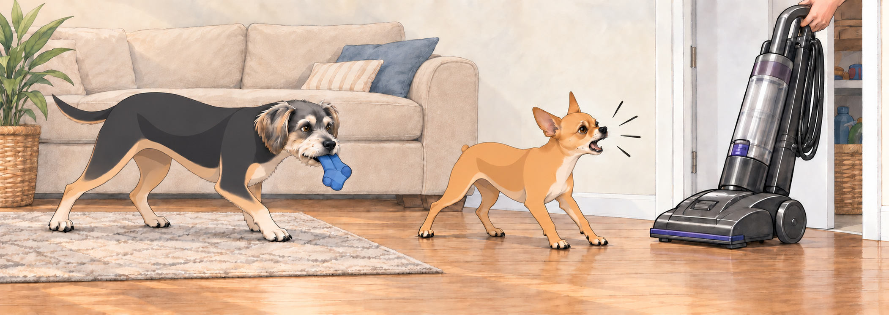
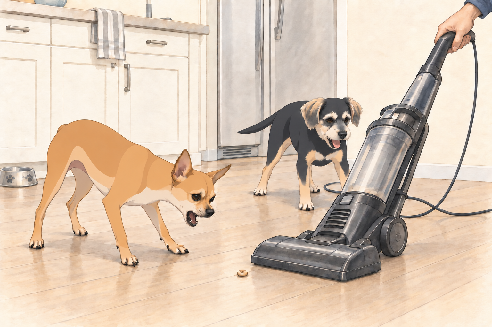

# The Vacuum Wars

## Act I: The Calm Before the Roar

The morning after the Great Laundry Day Uprising, the guest blanket still had two dog-shaped hollows in it.

Heather was in the kitchen making her coffee. Sagar was at the dining table, sipping chai and scrolling through the news. Neet and Buddy were still lounging in their “morning mode”— Neet sprawled on the ottoman like a retired general, Buddy tucked in a tight cinnamon roll on the rug.

Heather looked at the dog hair beneath the couch.

“Today… we vacuum.”

Neet’s head shot up. Buddy’s eyes went wide. The word had been spoken.

Sagar set down his chai. Neither dog took that as a good sign.

---

## Act II: The Enemy Awakens

From the closet, Sagar retrieved The Machine— a towering, corded beast known to humans as “vacuum cleaner,” but to Neet and Buddy, it was The Roaring Serpent of Doom.

As soon as it emerged, Neet leapt off the ottoman and began a perimeter circle, barking rapid-fire alerts: “Intruder! Sound the alarm! This thing eats everything!”

Buddy backed toward the couch, taking the rescued blue sock with him. “I told you this day would come…”

“Take cover!” Neet ordered.

Buddy was already doing so. He objected to having a sensible decision turned into an order.

---

## Act III: Battle Formation

The moment Sagar plugged it in, the Roaring Serpent awoke with a deafening WHOOOOSH.

Neet, fearless in his role as 4.75-star general, charged straight at it. He darted in low, barking in its “face” (or what he assumed was its face) before retreating with the agility of a prizefighter.

Buddy stayed behind enemy lines, peeking over the couch like a soldier in the trenches. Occasionally he’d poke his head out, bark once, then duck back down. He waited for the vacuum to drown out the end of each bark. There was no need to give away his exact position.

Heather tried reasoning with them. “Guys, it’s just cleaning. We like clean floors.”

Neet ignored her. “Don’t talk to me about floors— this thing just ate a Cheerio that was rightfully mine!”

“It’s been there since yesterday,” Sagar said.

“I was saving it.”

---

## Act IV: The Great Kitchen Standoff

Sagar maneuvered the vacuum into the kitchen. This was Neet’s turf— the location of his food bowl, his water station, and countless crumb jackpots. He was not going to let the Serpent claim it.

For the next five minutes, Neet engaged in a dramatic back-and-forth with the machine:

- The vacuum advanced— Neet retreated two steps, barking furiously.

- The vacuum retreated— Neet advanced three steps, tail high, as if forcing it into surrender.

Sagar paused to move a chair. Neet held his ground. The machine held its ground. Neet looked back at Buddy to make sure someone was witnessing the standoff.

Buddy checked that his sock was safely on the couch, then joined the fray. He kept clear of the machine and circled behind it, barking at its cord as if he were cutting off the supply lines. When Sagar turned, Buddy circled again and found himself back where he had started. He barked from there. A thorough encirclement could take time.

---

## Act V: Tactical Retreat

After an hour of strategic vacuuming— during which Neet launched no fewer than 14 sneak attacks and Buddy executed 9 flanking maneuvers— the Serpent was finally silenced and returned to the closet.

Neet strutted around the house with the swagger of a commander returning from victory. “Once again, I have defended the realm.”

Buddy trotted after him. “Yeah, we defended the realm. You’re welcome.”

Heather let the dogs into the yard. Neet returned across the freshly vacuumed throw rug with muddy paws.

Buddy stopped at the edge and looked down the little brown trail.

Then he stepped around it. He wanted credit for this, too.

Heather picked up the rug without looking at Sagar.

“Shall I get the vacuum again?” he asked.

Both dogs turned.

“No,” Heather said. “I would like to have breakfast.”

---

## Act VI: The Peace Banquet

To celebrate their “victory,” Sagar suggested a reward. Soon the kitchen smelled of scrambled eggs, toast, and chai.

Neet stationed himself by Sagar’s chair, still telling war stories under his breath. “And then I leapt at it, from this distance—”

Buddy cut in. “I saw it. You tripped over the cord.”

Neet paused. “The cord came at me.”

Heather laughed so hard she nearly spilled her tea. Buddy settled beside her chair, pleased to have contributed the part of the report Neet kept leaving out.

---

## Act VII: Lessons of the Day

By evening, the kingdom had returned to calm. Neet lay on the ottoman, head resting on his paws, watching the sunset glow through the windows. Buddy curled beside Heather, drifting toward sleep.

“Do you think they’ll ever stop overreacting to the vacuum?” Heather asked.

Sagar smirked. “Not a chance. The day Neet ignores the vacuum… the world will stop turning.”

Neet opened one eye. “You need me. That thing could rise again any day.”

And somewhere in the closet, the Roaring Serpent lay silent… plotting its next move.

## Provenance and editorial notes

Working selection dated October 3, 2026. Selection and shelf order are editorial; owner approval and event chronology remain unverified.

Original numbering: independent captured sequence Chapter 17.

Archive recovery: use [Studio recovery guidance](../Studio/Recovery.md). The paths below are paths **inside the verified snapshot**, not active navigation. SHA-256 pins identify the exact sources.

- `elevenlabs-reader-03` — `02_Story_Library/ElevenLabs_Imports/reader-03-the-vacuum-wars.txt`; SHA-256 `5fa3b412c30759cdd1d23ed81a00b02927d34f6e33998e5c3a885568a53eb7fd`.

## Refinement record

Refined October 3, 2026; [episode record](../Productions/E044-the-vacuum-wars/episode.json) documents the reading comparison and illustration work. The pre-refinement text is preserved in the [dated recovery snapshot](/Users/sagar/Documents/ChatGPT/NBC_Archives/NBC-before-refinement-2026-10-03_200659.tar.gz) at `NBC/Stories/S044-the-vacuum-wars.md`. Historical provenance above remains unchanged.
