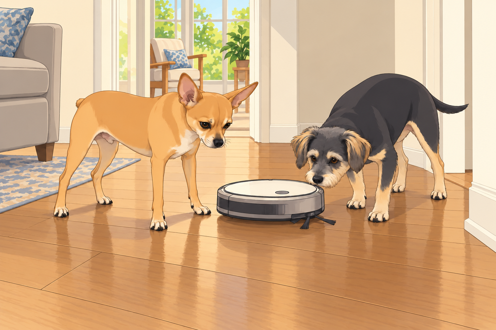
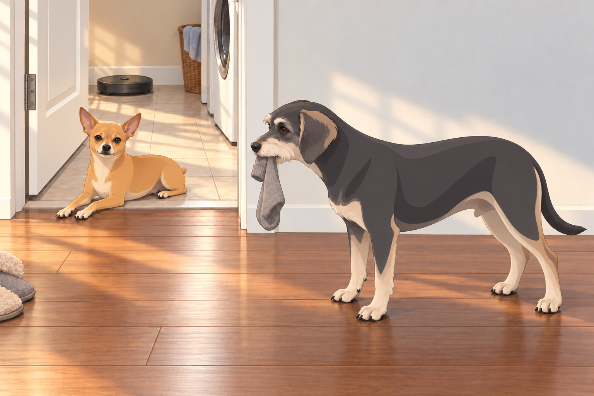
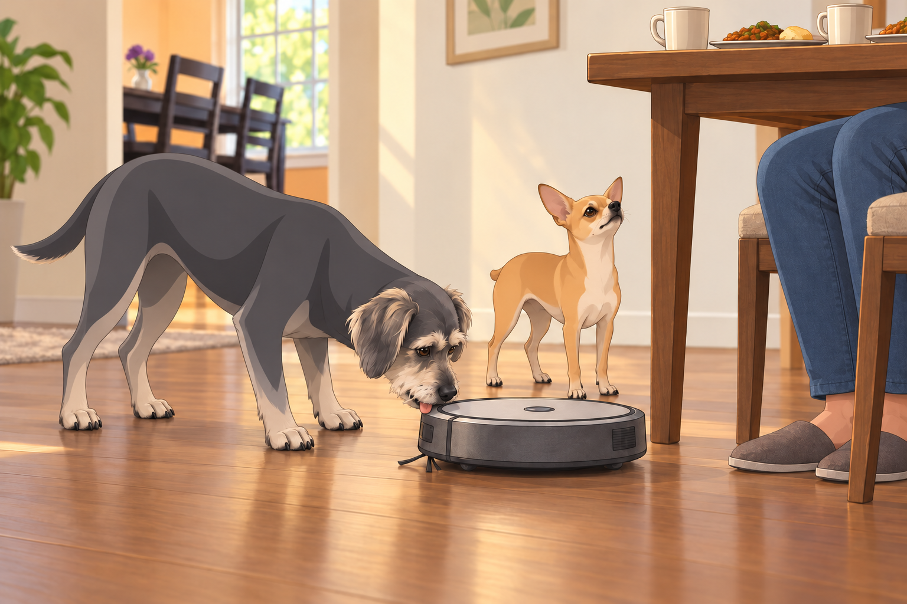

# The Robot Vacuum Coup

## A Box Full of Trouble

It started with that box.

Heather carried it into the living room like a proud parent bringing home a newborn. Sagar followed behind, coffee in hand, wearing the faint smirk of someone who already knew chaos was imminent.

The label on the box read “Wall-E: Smart Autonomous Cleaning Assistant.”

Neet’s pupils shrank to sniper-dot size.

Buddy tilted his head, ears flopping: “Smart? Assistant? Does this mean it brings snacks?”

Heather crouched to slice the tape. “This will keep the floors clean so we don’t have to vacuum as much.”

Neet: “Correction. YOU don’t have to vacuum as much. I now have to guard against an automated invader.”

Buddy: “If it’s an invader with treats, I’m okay with it.”

He inspected the empty box. Nothing. He inspected it again from the other end. A smart assistant might have hidden them.

---

## First Contact

Heather pressed the power button. Wall-E came to life with a cheerful bloop and a slow, deliberate pirouette.

Neet immediately dropped into a perimeter stance.

Buddy wagged so hard his back legs scooted.

Wall-E beeped twice, rolled forward in silence, and headed straight for the hallway.

Neet blocked the path like Gandalf: “You shall not pass.”

Wall-E, unfazed, rotated 30° and tried again.

Neet rotated exactly 30° to match.

They did this three more times — the dance of the mortal enemies.

Heather stepped around them with the packing foam. Neet let her through, then hurried to close the gap. Wall-E had no respect for visiting hours.

Then Wall-E pulled a dirty trick: a fake left, hard right, speed burst.

Neet whirled but it was too late — the invader had breached the hallway.

Buddy trotted after it, calling out helpful intel: “It’s going to the bedroom! I think it smells like socks!”

From the couch, Sagar narrated like a wildlife documentary:

“Observe the commander defending the hallway. His colleague appears to be giving the invader a tour.”

---

## The Second Patrol — Escalation

By the next day, Neet had moved beyond curiosity. This was now war.

- Blockade Operations: Standing precisely where Wall-E’s navigation app predicted its next turn.

- Psychological Warfare: Following it closely enough that his shadow fell across its sensors, forcing awkward spins.

- Counter-Espionage: Herding it into the coat closet and then walking away.

The app reported that the house was taking longer than expected to clean. Sagar looked at Neet. Neet looked pleased to have been mentioned.

Buddy, meanwhile, treated Wall-E like a part-time carnival ride:

- Attempted to stand on it while it moved (lasted 0.7 seconds before “emergency dismount”).

- Swiped its side brush and paraded it around like a parade baton. Heather retrieved it before the parade reached the kitchen.

- Barked compliments at it mid-clean: “You’re doing great, Wall-E! Hey, what’s in your snack drawer?”

Heather opened the dust compartment. Buddy leaned in, saw what his new friend had been collecting, and quietly moved behind her. There were limits to hospitality.

---

## The Night Raid

The turning point came on Tuesday at 3:12 AM.

Heather, experimenting with the app, scheduled an “overnight quiet run.”

The humans were asleep, the crickets chirped — and then the faint bloop-bloop echoed down the hallway.

Wall-E rolled out of its dock like a cat burglar who had read Sun Tzu.

Neet’s eyes snapped open. Not a sound — just the immediate, controlled rise to all fours.

Buddy stirred: “Bathroom break?”

Neet: “No. Enemy patrol. Follow me.”

They shadowed the invader silently, paws soft on the hardwood.

At the kitchen threshold, Neet executed a perfect intercept maneuver:

1. He stepped into Wall-E’s path, forcing it toward the laundry room.

2. Buddy ducked inside after a sock, then squeezed back out, nudging the half-open laundry door shut with his shoulder.

3. The door wasn’t even latched. Wall-E bumped it, turned, bumped the wall and searched for another route. Trapped.

By morning, Heather opened the laundry room to find:

- Wall-E powered down in the corner.

- Neet lying across the doorway like a sphinx.

- Buddy holding his recovered sock, pleased with an operation that had finally produced something useful.

Heather looked from the robot to the dogs. “It was supposed to clean while everybody slept.”

Neet lifted his chin.

Buddy put the sock down just long enough to yawn, then picked it up again.

---

## The Day of the Great Chase

Heather still insisted Wall-E could “integrate” with the household.

On Thursday, she unleashed it during awake hours.

Mistake.

Buddy immediately sprinted ahead of Wall-E to “lead the way,” except his idea of leading was zig-zagging like an excited toddler. Wall-E, determined, tracked him room to room — which looked suspiciously like chasing.

Neet cut in twice to block its approach to the sunroom (“Not the meditation zone.”), and once to physically escort Buddy onto the couch.

Buddy protested: “But I think it likes me!”

Neet: “It likes your crumb trail.”

Buddy looked back. Wall-E had stopped following him to work on a patch beneath the table.

He waited. Then he looked at Neet, wounded. “I showed it the bedroom.”

---

## The Treaty of Tuesday, Finally Ratified

Sagar, recognizing the escalation curve, convened a family meeting.

Over chai and leftover pav bhaji, the Treaty of Tuesday was drafted:

1. Limited Deployment — Wall-E may patrol only during post-walk naps or backyard play sessions.

2. Neet’s Override Authority — When Neet blocks the path, a human pauses the run.

3. Buddy’s “Escort Duty” — Twice weekly, supervised, with zero chewing privileges.

Buddy nudged Sagar’s knee at the last clause. Sagar kept reading. Buddy tried Heather’s knee. She pointed at the reattached side brush.

Heather, skeptical: “So… the dogs are basically in charge of the robot vacuum?”

Sagar, sipping chai: “Better than the alternative, which was them decommissioning it entirely.”

Neet signed the treaty with a dignified head tilt.

Heather pressed pause. Wall-E stopped. Neet glanced at Sagar to make sure this part had been witnessed.

Buddy licked Wall-E’s bumper and whispered: “One day, you and me — snack heist.”

## Provenance and editorial notes

Working selection dated October 3, 2026. Selection and shelf order are editorial; owner approval and event chronology remain unverified.

Original numbering: independent captured sequence Chapter 18.

Archive recovery: use [Studio recovery guidance](../Studio/Recovery.md). The paths below are paths **inside the verified snapshot**, not active navigation. SHA-256 pins identify the exact sources.

- `elevenlabs-reader-18` — `02_Story_Library/ElevenLabs_Imports/reader-18-the-robot-vacuum-coup.txt`; SHA-256 `ddb6bbbcc6d5588a3bddfb7183a1a9ec142a4b0c867efececf348f5948b59286`.

## Refinement record

Refined October 3, 2026; [episode record](../Productions/E045-the-robot-vacuum-coup/episode.json) documents the reading comparison and illustration work. The pre-refinement text is preserved in the [dated recovery snapshot](/Users/sagar/Documents/ChatGPT/NBC_Archives/NBC-before-refinement-2026-10-03_200659.tar.gz) at `NBC/Stories/S045-the-robot-vacuum-coup.md`. Historical provenance above remains unchanged.

Expanded comedy and illustration pass, October 4, 2026: [comparison and exact source pins](../Productions/E045-the-robot-vacuum-coup/comedy-pass-v002.json). Three proposed illustrations; independent visual review and complete rendered reading remain pending.
