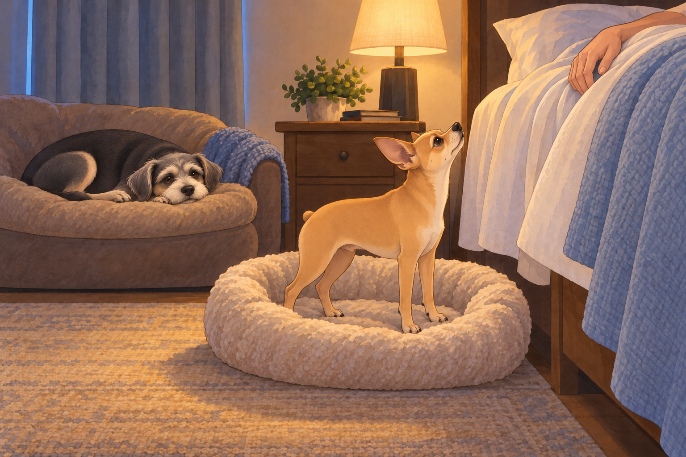
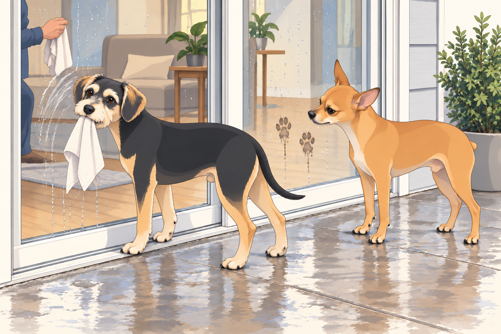

# The Rainbow Drill

It began with a rumble.

Not the kind that suggested a polite tummy grumble or distant fireworks — no, this was the operatic roll of storm clouds, announcing themselves like an orchestra tuning up. After a lunch of Heather’s Sunday leftovers, Sagar and Heather had drawn the curtains for a nap. Neet had already started his by the window.

And then BOOM.

The first thunderclap shook the house.

Neet, who had been meditating near the window sill like a little Zen gargoyle, immediately abandoned philosophy. His eyes bugged, his paws did a karate-paw sweep of the floor, and he bolted straight into the bedroom.

“Commander requests immediate asylum!” he barked, which translated in practice into a spectacular leap onto the bed.

Buddy, meanwhile, yelped in theatrical delay, galloped after Neet, then skidded to a halt beside the bed as if asking: Permission to panic as well?

Buddy checked both sides of the bed. Neet had taken the side with Sagar. This seemed less like panic now and more like poor planning.

Heather peeked from under her blanket. “Oh dear. The generals are restless.”

Sagar sat up, still half asleep. “Neet. Floor duty.”

With great reluctance, Neet was nudged down. He landed like a disgraced general, ears drooping, sighing with the weight of injustice. Sagar fetched Neet’s bed and placed it beside his own, close enough to reach down.

But thunder doesn’t negotiate. Another crack of lightning lit the room like paparazzi. Neet quivered. Buddy, however, had already scrambled onto the large sofa-bed tucked beside Heather’s nightstand, curled into a donut, and declared: “This is fine. I live here now.”

Neet tried his bed. He rotated. He flopped dramatically. He rearranged imaginary pillows. He looked up to see whether Sagar had noticed the effort. Sagar had closed his eyes.

Neet rotated once more, loudly. Nothing helped. Finally, when a bolt of lightning snapped across the sky, he performed a panicked double-jump back onto the royal bed and plastered himself against Sagar like a furry security blanket.

“Commander… please hold me until the storm signs the surrender treaty,” he whispered in canine Morse code.

And so, the Patel court — two humans, two dogs, and one oversized thunderclap soundtrack — drifted into a storm-nap pile.

---

They awoke to the soft hiss of rainfall.

The storm had matured into sheets of heavy rain, running like silver beads across the windows. Which reminded Sagar of… the plan.

“Window cleaning day,” he announced gravely, like a general calling troops to arms.

So out he went with the pressure washer, while Heather stationed herself inside with microfiber precision. Buddy instantly appointed himself Supervisor of Droplets, nose-printing each freshly cleaned glass panel.

Neet, meanwhile, patrolled the patio. But when Sagar blasted the first jet of pressurized water, Neet barked indignantly:

“You brought the Roaring Serpent outside?!”

Buddy padded over to explain, solemnly: “No, no. It’s like a garden hose… but it screams louder.”

“Approved? Not approved?” Neet muttered, eyes narrowed.

“Highly snack-adjacent,” Buddy countered, licking stray droplets. “Tastes like sky soup.”

---

That’s when the dogs decided to “help.”

Neet, ever the inspector, began following the water spray with his nose, barking commands like a building foreman. Every time Sagar cleared a pane, Neet trotted up and planted two perfect paw prints on the glass.

“Quality control,” he insisted.

Sagar washed off the prints. Neet put them back in almost exactly the same places.

Sagar lowered the nozzle and looked at him. Neet looked at the glass. The system was working.

Heather groaned from the inside. “Neet Patel, you are not ISO certified!”

Buddy wanted the rag Heather kept moving out of reach. When she left it on a chair, he grabbed it and brought it to the sliding door, rubbing his prize against the glass. Unfortunately, his version of polishing involved smearing dog drool in elegant spiral patterns. He stepped back proudly.

“Modern art,” he declared.

Heather stopped wiping her side of the pane. Buddy stopped too. For a moment they regarded each other through a window neither of them was improving.

Neet wasn’t impressed. “That is chaos.”

Buddy wagged. “Abstract chaos.”

Sagar kept pressure washing, but when the spray hit the patio door, Buddy mistook it for a personal attack and leapt dramatically sideways, rolling into a towel pile. He popped up, chest puffed. “Enemy fire intercepted!”

Neet shook his head like a disappointed elder. “You’re not supposed to intercept it. You’re supposed to document it.”

At one point, Buddy leapt against the glass in a fit of enthusiasm, his whole face smushed flat in joyful concentration. From inside, Heather doubled over laughing. “Sagar, look! He’s squeegeeing with his face!”

Heather wiped away the face print. Buddy watched it disappear with the quiet concern of an artist whose work had failed to find its audience.

The inspection continued until Neet finally sat down, solemn as a judge, and gave the entire operation his verdict:

“Not approved. Needs biscuits.”

Sagar put the washer away.

“Then we’re finished,” he said.

Neet remained seated. There appeared to have been a misunderstanding about the biscuits.

---

As evening settled, Heather began dinner: steaming jeera rice and dal lasooni, fragrant garlic sizzling in ghee. The house filled with warmth and golden smell — comfort incarnate.

Before she set the table, Heather noticed a change in the light through the newly cleaned glass.

“Wait. I need to see this.”

She slid open the door. Her breath caught.

There it was. A rainbow.

Not the faint kind — this one was bold, complete, a glowing arc stretching across the storm-cleared sky. The wet grass shimmered, the air was lit like stained glass.

“This is not a drill, Sagar Patel!” she cried, voice trembling with delight. “Please come out quickly!”

Sagar appeared at once, dish towel still in hand. He gazed up, smiled with that soft, steady warmth. “Come,” he said. “Let’s see from the front.”

They hurried through the house and onto the astronomy-themed street. From the front yard, the rainbow doubled, arching magnificently over their neighborhood like the crown jewel of the sky. The world glowed: clouds pink, horizon golden, every tree washed in divine light.

Together, hand in hand, they took a slow walk down Andromeda Drive, their hearts buoyed by the sky’s pageantry. Neighbors peeked out too, children squealing, one even chasing the rainbow’s end with a toy wagon.

When they returned, the dinner was ready. Rice fluffed, dal shimmering, garlic scent promising comfort. They ate as though each bite was its own blessing.

---

But the evening wasn’t done. After dinner, it was dog-walk round two.

Neet strutted with renewed authority: “The storm tested us, but the rainbow confirmed our victory.”

Buddy, meanwhile, had a running commentary: “Best puddle ever! Important news — mailbox smells like chicken again! Also, I may have stepped in destiny!”

Neighbors waved as the rainbow slowly faded into twilight. The streetlamps flickered on. Buddy stopped at another puddle. This one required a second opinion, so he put his other front paw in it. Neet waited for him without issuing an order.

Finally, back home, Sagar flipped on the backyard string lights. Tiny bulbs twinkled like earthbound stars. Then, with ceremonial flair, he activated Astro, the nebula-projecting robot. Colors swirled across the living room ceiling — galaxies, constellations, shifting auroras.

The family lay together, dogs at their sides, ceiling transformed into a cosmic theater.

Heather whispered, “Today felt… like a gift.”

Sagar smiled. Neet and Buddy sighed into sleep, their storm-anxieties dissolved.

And under rainbow memories, garlic-scented comfort, and twinkling lights, the Patel kingdom drifted peacefully into the night.

## Provenance and editorial notes

Working selection dated October 3, 2026. Selection and shelf order are editorial; owner approval and event chronology remain unverified.

Original numbering: independent captured sequence Chapter 18.

Archive recovery: use [Studio recovery guidance](../Studio/Recovery.md). The paths below are paths **inside the verified snapshot**, not active navigation. SHA-256 pins identify the exact sources.

- `elevenlabs-reader-15` — `02_Story_Library/ElevenLabs_Imports/reader-15-the-rainbow-drill-extended-cut.txt`; SHA-256 `a43dca1eeed114b7d1689bc060c3a0bb0f0c7ca231ee197e94682cf6fb95aafa`.

## Refinement record

Refined October 3, 2026; [episode record](../Productions/E046-the-rainbow-drill/episode.json) documents the reading comparison and illustration work. The pre-refinement text is preserved in the [dated recovery snapshot](/Users/sagar/Documents/ChatGPT/NBC_Archives/NBC-before-refinement-2026-10-03_200659.tar.gz) at `NBC/Stories/S046-the-rainbow-drill.md`. Historical provenance above remains unchanged.
