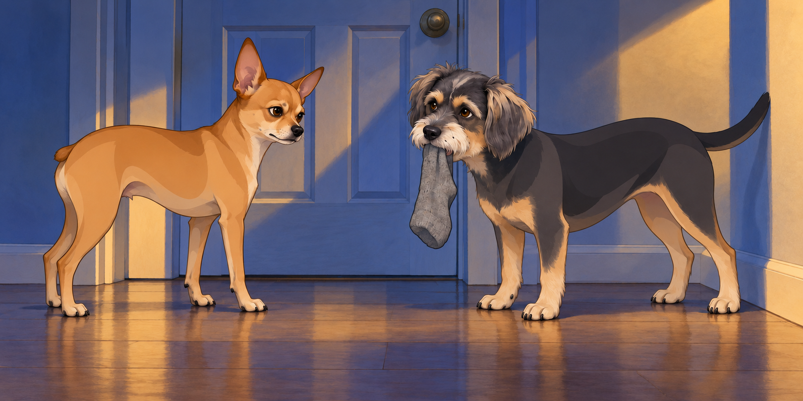
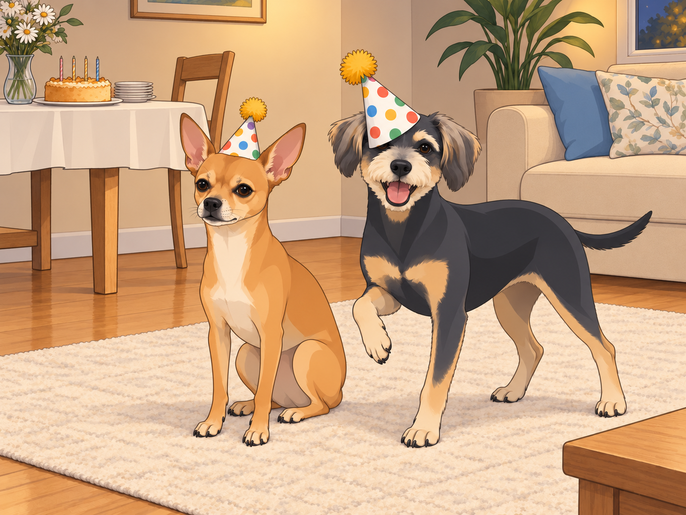
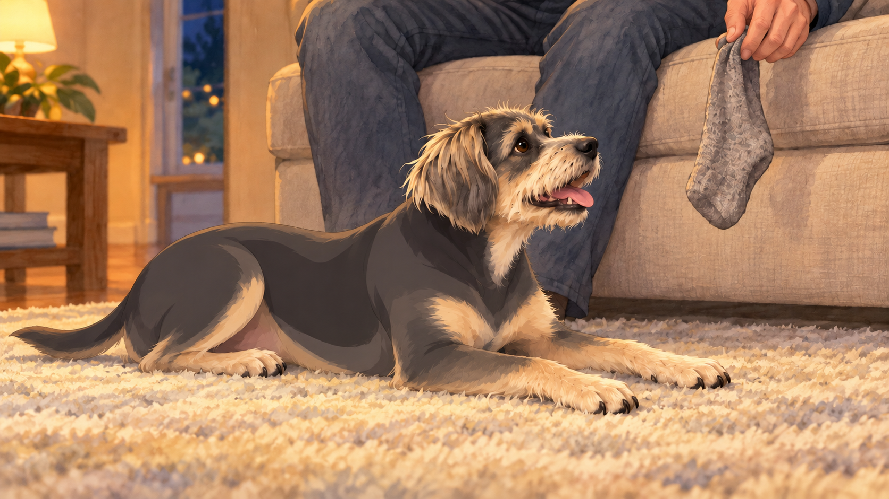

# The King’s Birthday

The night before the King’s birthday was no ordinary night in the Patel household.

At precisely 11:47 p.m., two shadows stirred in the living room. Neet, the 4.75-star general and recent Zen Master, sat upright like a strategist before battle. Buddy lay belly-up on the rug with a sock beside him.

Neet cleared his throat. “Tomorrow is the King’s birthday. We must plan.”

Buddy’s eyes popped open. “Cake?”

“Of course cake. But more importantly — protocol. We wake up early, 05:30 hours sharp. We line up at the royal door. We greet him with dignified devotion.”

Buddy wagged furiously. “YES. I’ll wag so hard my tail will become a helicopter. Should I bring a sock? A stick? Both?!”

Neet considered gravely. “No sticks. Too primitive. Socks… possibly. But our main weapon is sincerity.”

Buddy gasped. “Oh, I’m full of sincerity. I’ve got sincerity in my ears, my paws, and especially my stomach!”

Neet leaned closer, whispering like a general plotting an ambush. “Then it’s settled. We will wake the King with a loyalty display so glorious, the history books shall record it.”

Buddy drew the sock closer. “I’ll bring this one. It’s still got a heel.”

“Keep it ready,” Neet said. “Go to sleep. Tomorrow we make history.”

---

## The Early Morning Ambush

At 5:30 sharp, Neet’s eyes snapped open like alarm bells. He nudged Buddy awake.

“Mission time.”

Buddy picked up the sock, put it down to yawn, and picked it up again. Neet waited through this equipment check with visible difficulty.

The two padded silently to the bedroom door. Buddy carried his chosen sock. They had agreed on dignity. They had agreed on composure. They lasted exactly seven seconds.

Whiiiiiiine.

Scrabble scrabble.

Tap tap tap.

Buddy’s tail thumped like a war drum against the wall. Neet paced like a detective whose case had gone cold. Soon, both were whining in stereo — a canine duet of impatience.

Neet stopped long enough to whisper, “Dignity.”

Buddy stopped too. In the silence, his tail hit the wall again.

“Not that end,” said Neet.

From inside came a groggy royal groan. The door creaked open, and there stood the King himself, Sagar Patel, hair askew, eyes squinting.

“Really?” he muttered. “It’s still night outside.”

But seeing their shining faces, tails wagging with pure devotion, his frustration melted. He knelt, gave each a gentle pat.

“You love me too much, don’t you? Alright. Back to bed, generals.”

Buddy offered the sock. Sagar patted him again instead. Buddy took it back with him. Apparently presents opened later.

And with that, the King herded his soldiers back to their quarters, restoring peace to the realm until sunrise.

---

## The Arrival of the Hats

By 6:00 a.m., as sunlight warmed the curtains, the doorbell rang. Heather appeared at the doorstep, triumphant.

“The special package has arrived!”

Inside were the party hats of destiny:

- A silver crown for the Queen, shimmering like moonlight.

- A gold crown for the King, bold as the sun.

- And two colorful hats with pom-poms for the generals.

Heather beamed. “Exactly how the King envisioned.”

Neet inspected his. “This is undignified.”

Buddy tried to eat his. “Tastes like celebration!”

Heather rescued it, turned the damp edge to the back, and set it beyond reach. Buddy watched her carefully. His hat now had a front.

---

## The Day Unfolds

The day rolled forward with quiet anticipation. Sagar worked, Heather cleaned, the generals alternated between naps and reconnaissance. By late afternoon, it was time: the royal field trip.

Sagar and Heather ventured into the city for groceries and cake provisions while the dogs stayed home. Palak paneer ingredients, saffron, nuts, raisins, the works. But the real detour came at Jenny’s Ice Cream Parlor.

“One flavor each,” Heather warned, smiling knowingly.

Five minutes later, they were juggling spoons and grinning like children with a secret. They sampled:

- Strawberry Toffee (sweet nostalgia).

- Unopaque Dark Chocolate (Sagar: “What does unopaque even mean?”).

- Almond Butter Brittle (Buddy would’ve fainted in joy).

- Honey Vanilla (Heather’s quiet favorite).

By the end, they had not two, not three, but four flavors between them.

“One each,” Sagar said, looking at the spoons.

Heather took another taste. “We haven’t finished choosing.”

On the drive home, Sagar grew a little wistful. “I wish Neet and Buddy could taste this.”

Buddy, if he’d known, would’ve said: I would have given my left ear for Almond Butter Brittle.

Neet would’ve said: Not approved. Where’s mine?

---

## Royal Preparations

Back home, the kitchen filled with sizzling garlic, simmering spinach, and the fragrance of saffron blooming in ghee. Heather worked her magic: Palak Paneer fit for a king and Sheera Cake glowing golden with nuts and raisins.

Meanwhile, in the living room, Sagar assembled furniture. Allen wrench in hand, concentration furrowed.

Neet lay beside him, head on paws. Buddy watched from the couch, where he had placed the birthday sock in Sagar’s usual seat.

Suddenly — clang! — a screw fell.

Neet jumped three feet. “Enemy attack!”

Buddy bark-laughed. “It’s just a screw, drama king.”

Neet narrowed his eyes. “It startled me. I was meditating.”

Sagar chuckled, scratching Neet’s ears. “Some Zen Master you are.”

He picked up the screw. Neet watched it go back into the furniture, then moved his meditation six inches farther away.

---

## The Royal Feast

At last, evening descended. The table was set. The crowns and hats distributed.

The humans wore theirs proudly. The dogs… less so.

Neet froze when Heather placed the colorful cone on his head. “What is this? An antenna? Am I now a radio?”

Buddy’s pom-pom hat slid sideways over his eyes. “I can’t see, but I feel FABULOUS.”

Neet shook his head, trying to fling it off. “This is humiliation!”

Buddy pranced. “No, this is fashion!”

Heather laughed so hard she nearly dropped the cake knife.

She put it down before straightening Buddy’s hat. Buddy promptly tilted his head. The hat returned to its preferred position.

Then, with hats slightly askew but hearts perfectly aligned, they gathered around the glowing Sheera Cake. Heather lit the candles. Together they sang:

🎶“Happy Birthday, dear King…” 🎶

Sagar smiled, eyes shining. The cake was cut. The feast began.

---

## The Feast

The royal plates overflowed:

- Palak Paneer, rich and creamy.

- Parathas, warm and golden.

- Buttermilk and rose lassi, cool and fragrant.

- Sheera Cake, saffron-bright, studded with nuts and raisins.

Neet and Buddy received their own share — paratha bites, paneer cubes, and generous spoonfuls of Sheera.

Buddy’s eyes glazed with ecstasy. “Best. Day. Ever.”

Neet, licking saffron from his whiskers, declared, “Approved. Highly approved.”

---

## The Royal Benediction

When plates were cleared and candles dimmed, the King and Queen sat together, shoulders touching.

Heather looked at Sagar. “Happy birthday, my love. Every year with you is a blessing.”

Sagar squeezed her hand. “And every day with you, and them—” he nodded toward Neet and Buddy, sprawled in post-feast glory— “is a kingdom.”

The night ended with gratitude, laughter, and the soft glow of backyard lights twinkling like constellations.

Sagar found the sock tucked beside the cushion. He held it up for inspection.

“For me?” Sagar asked.

Buddy lifted his head.

He waited until Sagar put it beside him, then went back to sleep.

No ceremony. No instructions. The present had finally arrived.

## Provenance and editorial notes

Working selection dated October 3, 2026. Selection and shelf order are editorial; owner approval and event chronology remain unverified.

Original numbering: independent captured sequence Chapter 19.

Archive recovery: use [Studio recovery guidance](../Studio/Recovery.md). The paths below are paths **inside the verified snapshot**, not active navigation. SHA-256 pins identify the exact sources.

- `elevenlabs-reader-14` — `02_Story_Library/ElevenLabs_Imports/reader-14-the-kings-birthday.txt`; SHA-256 `c9f63970e3527c50f631381c662fee4b08b991792efa3921a019378f7051f821`.

## Refinement record

Refined October 3, 2026; [episode record](../Productions/E047-the-kings-birthday/episode.json) documents the reading comparison and illustration work. The pre-refinement text is preserved in the [dated recovery snapshot](/Users/sagar/Documents/ChatGPT/NBC_Archives/NBC-before-refinement-2026-10-03_200659.tar.gz) at `NBC/Stories/S047-the-kings-birthday.md`. Historical provenance above remains unchanged.
