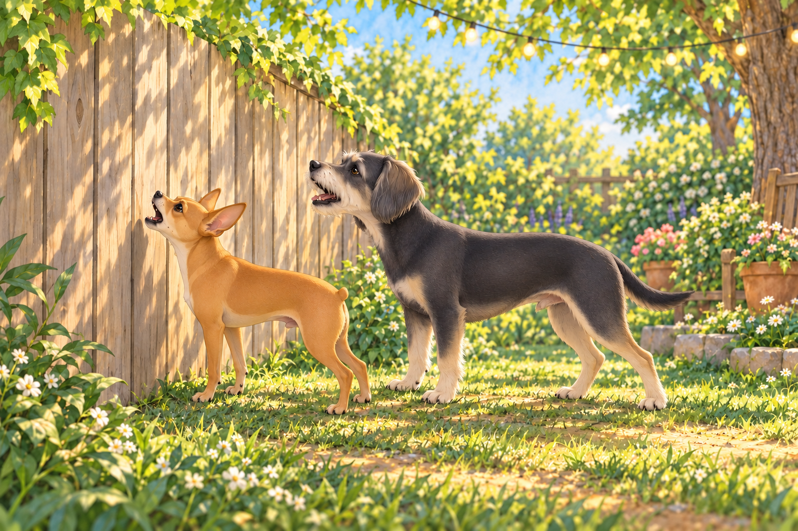
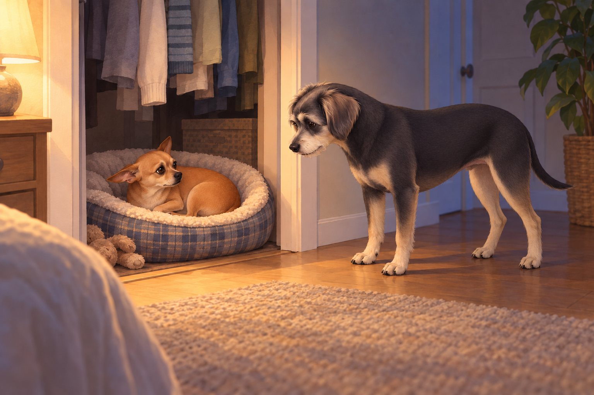
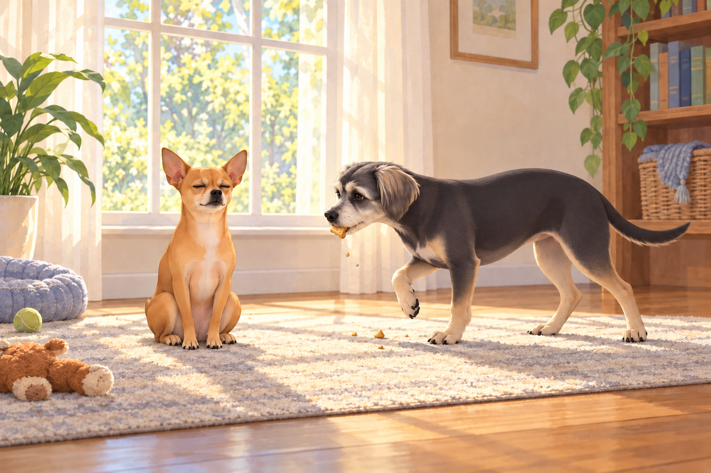

# The Fall of a Quarter Star

## The Chief on Edge

For weeks, Neet had been basking in his Zen Master glow.

He meditated with acorns, tolerated Martha & Sally’s window-rattling barkathons, and even ignored the mailman’s audacious sock choice.

But something had shifted. Perhaps it was the humidity. Perhaps the planets. Perhaps Buddy stealing the last sweet potato treat.

Buddy declined to comment on the treat. He was still chewing the evidence.

Whatever the cause, Neet’s composure had frayed.

By Saturday afternoon, his eyes gleamed not with peace but with the manic sparkle of a commander looking for war.

---

## The Bark-Off

The backyard was quiet, a rare ceasefire between kingdoms.

Heather watered the plants beneath her string lights, Buddy investigated the mailbox for chicken smells, and Sagar sipped iced chai.

Neet stood sentinel at the fence, ears up, chest puffed. Martha and Sally (a.k.a. The Bark Sisters) lounged on their side, blissfully silent.

And then…

He waited for a provocation. Martha yawned. Sally put her head down.

Neet gave them another moment to correct this.

Then Neet made the first move.

One sharp WOOF, aimed like a verbal javelin.

The Bark Sisters jolted upright, clearly confused.

Sagar, mid-sip: “Oh no.”

Heather: “That was Neet, wasn’t it?”

The neighbors’ dogs responded, not with words, but with an aria of outrage.

Neet countered with three quick barks, chest pressed against the fence like a heavyweight.

Buddy abandoned the mailbox. There was still no chicken, and at least this investigation had produced a result.

Swept up in the chaos, he contributed with his signature line:

“Best day ever!”

What followed could only be described as The Great Suburban Bark Opera.

Windows shook. Birds evacuated. Somewhere, a toddler dropped their juice box.

When Sagar set down his chai and crossed the patio to restore order, Neet instantly pivoted to meek mode — ears back, head tilted, the picture of misunderstood innocence.

Buddy, tail wagging at nuclear intensity, tried to play it off: “We were… rehearsing? For the talent show?”

Neet looked at him. Buddy gave one small, unhelpful encore.

But the damage was done. The Bark Sisters were still going three arias deep, their humans shouting “QUIET!” from the porch.

All because General Neet broke Zen to start a fence-line feud.

---

## The Night of the Roach

By evening, the household had returned to calm.

Heather prepared for bed, humming softly. The tune ended in a scream.

Heather froze mid-step, eyes locked on the bedroom wall.

There, sauntering with shameless antennae, was a giant roach, as if auditioning for a horror movie.

Heather: “SAGAR. NOW.”

Sagar (arriving at speed): “What’s wrong?”

Heather (whisper-shouting): “It’s… it’s THERE.”

The roach twitched a leg. Heather nearly levitated onto the bed.

---

## The Improvised Arsenal

Sagar, tactician at heart, scanned the room like a general surveying the battlefield.

He needed containment. Speed. Authority.

In a flash of genius— or lunacy— he sprinted to the garage and returned wielding… Wasp & Hornet Spray.

Heather: “SAGAR, IT’S A ROACH.”

Sagar: “Better to overkill than underkill.”

Heather looked from the can to the insect. “Did you bring anything for this species?”

One dramatic PSHHHHHHTTTT.

The roach staggered like it had taken a Shakespearean dagger.

The walls glistened in chemical rain.

Heather, coughing, swapped in with broom and dustpan: “Move. Let me finish this properly.”

In a synchronized routine, she swept the roach into the pan, carried it at arm’s length, and handed it off to Sagar like a biohazard baton.

Sagar, grim-faced, disposed of the carcass at the far corner of the backyard.

“May the kingdom know peace again.”

---

## The Interrogation of the General

But then came the question neither wanted to voice.

Heather, whispering: “How did a roach get inside? Isn’t that Neet’s job?”

Sagar, nodding gravely: “Chief of Perimeter Security. Sole mandate: prevent intrusions.”

They looked around.

Where was Neet?

Answer: hiding in his closet bed, curled in an awkward loaf of shame.

The closet door cracked just enough to reveal his guilty eyes.

When Sagar opened it, Neet performed the full guilty face package: ears drooped, tail tucked, avoiding eye contact like a politician after a scandal.

Heather: “All that barking this afternoon, and now you’re off duty?”

Neet blinked.

Buddy (helpfully): “To be fair, it was a really big roach.”

Neet edged farther into the bedding. At last, a witness for the defense.

“And very quiet,” Buddy added.

Neet stopped looking at him.

---

## The Demotion

The tribunal convened immediately in the bedroom.

Charges: dereliction of duty, starting an international bark war, and failure to intercept enemy bug forces.

Verdict: guilty.

Sentence: 0.25-star deduction.

Neet’s chest puffed in protest. “I am a 4.75-star general! I—”

Sagar: “Not anymore. You are officially a 4.25-star general.”

The silence was deafening.

Buddy gasped audibly. “They can DO that?!”

He shut his mouth before anyone remembered the encore.

Neet backed into his closet bed. Buddy glanced from him to Sagar, trying to make the new number fit the sentence.

“The general lost a quarter star,” Neet muttered. He was not accepting questions.

---

## Epilogue: A Kingdom in Question

By Sunday morning, things had settled.

The Bark Sisters were still holding grudge concerts at the fence.

Wall-E the robot vacuum looked smug, as if enjoying Neet’s downfall.

Buddy set off to console Neet with two snacks.

By the time he reached the window, both had disappeared. He sat beside Neet anyway.

“I brought moral support,” Buddy said.

Neet opened one eye at the crumbs in his beard.

“What’s left of it,” Buddy admitted.

And Neet?

He meditated beneath the window, eyes closed, paws folded.

He made room for Buddy without opening his eyes. Tomorrow, he would plot redemption.

Because no one stays at 4.25 stars forever.

## Provenance and editorial notes

Working selection dated October 3, 2026. Selection and shelf order are editorial; owner approval and event chronology remain unverified.

Original numbering: independent captured sequence Chapter 19.

- Source states a quarter-star demotion but changes 4.75 to 4.25. Retained as written.

Archive recovery: use [Studio recovery guidance](../Studio/Recovery.md). The paths below are paths **inside the verified snapshot**, not active navigation. SHA-256 pins identify the exact sources.

- `elevenlabs-reader-17` — `02_Story_Library/ElevenLabs_Imports/reader-17-the-fall-of-a-quarter-star.txt`; SHA-256 `06289da57ff1e1d82c3ab0c4191cd11c3ebcb52a1b79ec525449601d79500f5d`.

## Refinement record

Refined October 3, 2026; [episode record](../Productions/E048-the-fall-of-a-quarter-star/episode.json) documents the reading comparison and illustration work. The pre-refinement text is preserved in the [dated recovery snapshot](/Users/sagar/Documents/ChatGPT/NBC_Archives/NBC-before-refinement-2026-10-03_200659.tar.gz) at `NBC/Stories/S048-the-fall-of-a-quarter-star.md`. Historical provenance above remains unchanged.

Second comedy and illustration pass October 4, 2026: [comparison and scene decisions](../Productions/E048-the-fall-of-a-quarter-star/comedy-pass-v002.json). Three proposed illustrations await independent visual review and a fresh complete rendered reading; approval remains unapproved.
