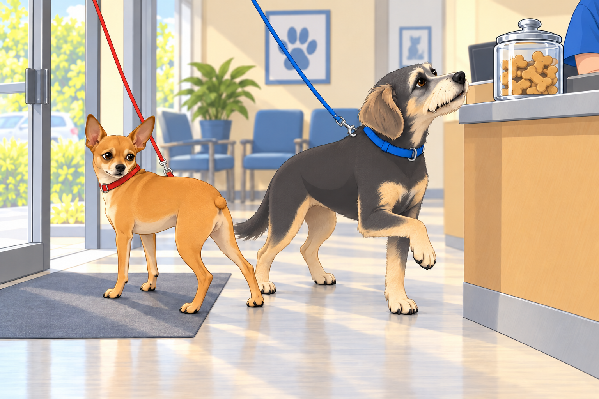
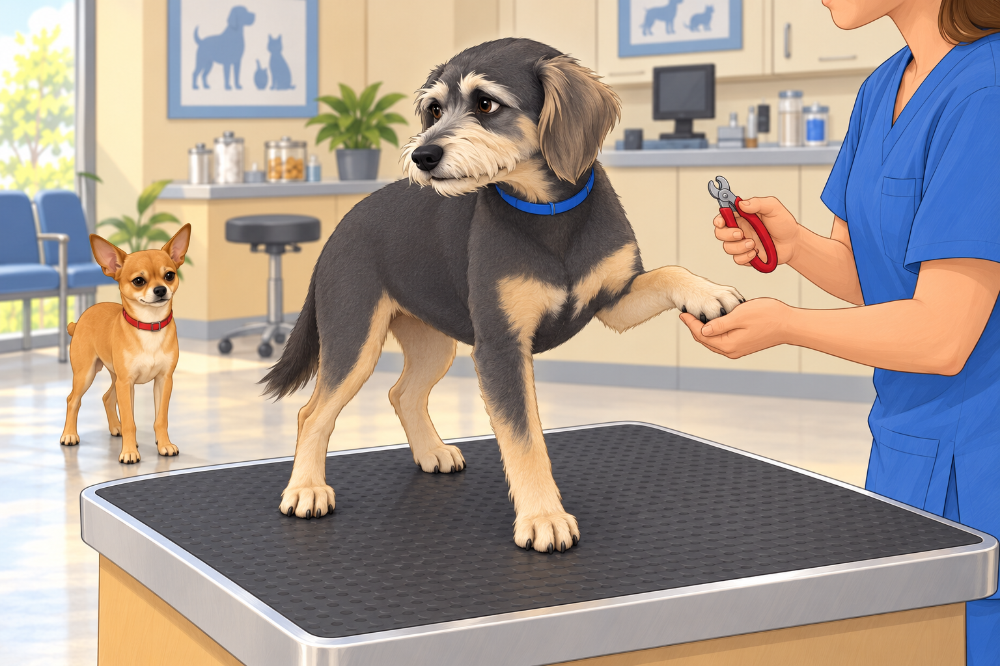
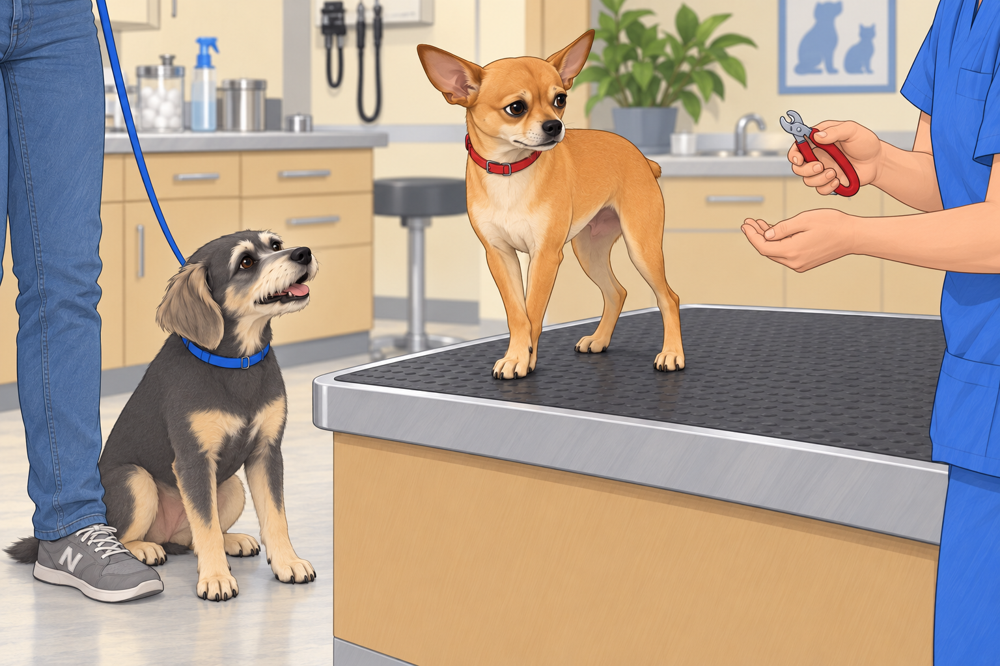
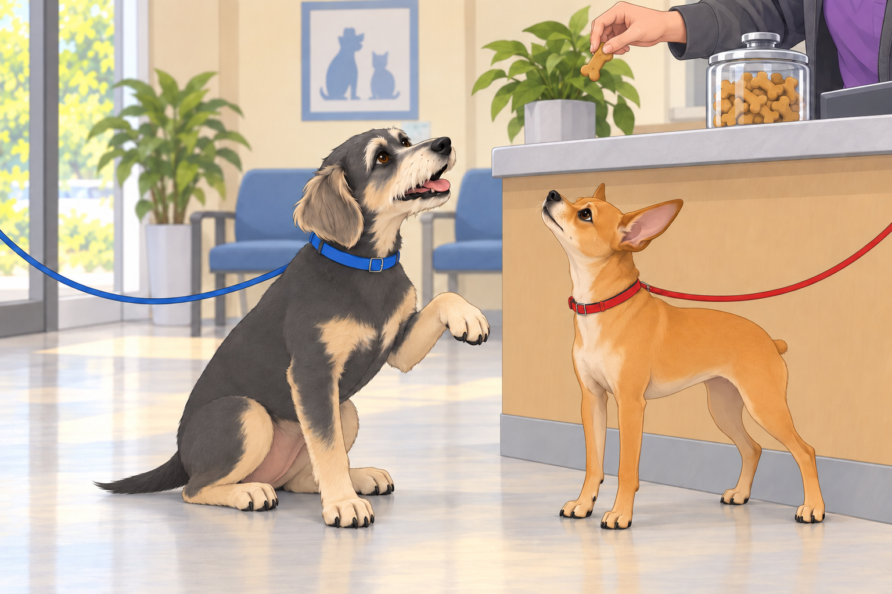

# The Great Vet Escapade

Saturday mornings in the Patel kingdom usually meant pancakes, backyard patrols, and possibly a nap as long as the Mississippi River. But this Saturday had a different destiny.

“Time for the vet,” Sagar announced, slipping leashes into his hand like a magician revealing cards.

Neet’s ears perked. “The car? An expedition? Adventure awaits!”

Buddy bounced like a spring-loaded potato. “Where? Park? Chiku Shack? Ice cream factory?!”

Heather looked at the leashes, then at Sagar. “They heard the car part.”

Neither suspected the truth.

---

## The Great Betrayal of the Threshold

The car ride began in pure euphoria. Neet sat tall, nose lifted to the wind, scanning the horizon like a commander inspecting his realm. Buddy pressed his whole face against the window, leaving foggy art and commentary: “Mail truck! Squirrel! Oooh, that hydrant smells heroic!”

Heather smiled knowingly from the passenger seat.

But then… the fateful arrival.

They reached the vet clinic. Sagar parked. The humans strolled toward the entrance as if nothing were amiss. Neet strutted confidently, chest puffed, paws tapping like a parade march.

He charged through the glass doors, tiny nub vibrating, announcing to the lobby: “General Neet has arrived to inspect your premises!”

And then.

The scent hit him. Disinfectant. Medicine. Fear. The Vet.

Neet froze mid-stride. His front half was in the lobby, but his back paws skidded into reverse like a cartoon character realizing he’d stepped into a mousetrap. His entire body did a 180° pivot back out the door, dragging Sagar an inch.

“Retreat! RETREAT!” Neet barked.

The receptionist chuckled. Heather covered her face, laughing.

Buddy trotted in clueless, tail wagging. “Oooh, cookies on the counter!”

Neet dug in harder. Buddy took one hopeful step forward. Between them, Sagar stood holding two very different opinions.

---

## The Whiner-in-Chief

While Neet sulked in the corner, contemplating his life choices, Buddy was called to the table first for a simple nail trim.

“Just nails,” Heather whispered to reassure him.

Buddy instantly began whining as though he were about to donate both kidneys.

The tech paused to adjust the clippers. Buddy paused too, watching her hands.

She picked them up again. He resumed exactly where he had left off.

“Eeeeeehhhhhh… eeeeeeeehhhh… Is that all of them?” Buddy tried to count the untouched paws.

He offered the paw she had just finished.

“Other one, sweetheart,” said Heather.

Buddy offered it more politely.

Neet watched from the corner. “I’m a 4.75-star general. I shall be setting an example.”

Buddy sniffled, looking betrayed. “But the clippers are sharp! They look at me funny!”

The vet tech, seasoned and amused, clipped with swift precision. Buddy continued his operatic aria of suffering, while Neet arranged his face into an expression he hoped the receptionist would remember.

---

## The Rabies Affair

Next up: Neet’s rabies shot.

Despite his protests at the threshold, when placed on the exam table, Neet straightened his back like a soldier at inspection. His eyes locked on Sagar: Commander, if I fall, tell my story with honor.

The vet calmly administered the shot. Neet didn’t even flinch. But Buddy gasped dramatically from the sidelines. “HE’S BEEN SPEARED!”

Neet huffed. “Minimal sting. Approved procedure. Next.”

The vet tech chuckled. “He’s very stoic.”

Heather nodded proudly. “He takes after Sagar.”

Sagar grinned. “Yeah, until it’s nail trim time.”

Neet had already begun accepting the compliment. He stopped halfway through a dignified nod.

---

## The Nail Trim Wars

Because now it was Neet’s turn.

The moment the clippers came out, the general’s composure cracked. His Zen evaporated like morning mist.

“Wait. WAIT. This was not in the treaty!” Neet barked, eyes bulging.

Buddy, still traumatized by his own manicure, sat beside Heather’s ankle and whispered gleefully, “See? Not so easy, General Tough Guy!”

Neet tucked one front paw behind the other. The tech waited. He changed which paw was in front.

“She knows how many you have,” Buddy said.

Sagar held Neet steady, murmuring calm assurances. Heather stroked his head. Buddy stopped gloating long enough to watch the clippers, then pressed closer to her ankle.

Clip. Clip.

Each nail produced a grunt, a side-eye, or an indignant sigh. But in the end, it was done. Neet hopped down, shaking his paws like a nobleman dusting off his sleeves after labor.

“Approved. But barely,” he muttered.

---

## The Exit Parade

When all procedures were complete, the humans collected paperwork and treats. Buddy sat very straight beneath the cookie counter, offering his freshly trimmed paw to the receptionist.

Now that it was voluntary, he could have held it there all morning.

Treat secured, Buddy strutted out the door, suddenly reborn, tail wagging: “See? I survived! I’m a hero!”

Neet followed with regal dignity, announcing to the waiting room, “Operation Vet completed. Casualties: none. Pride: slightly dented. Treats: acceptable.”

Back in the car, Buddy sprawled across Heather’s lap, already snoring. Neet, still upright, addressed Sagar solemnly.

“Commander, next time, please disclose the mission parameters before departure.”

Sagar chuckled. “If I did, you wouldn’t come.”

Neet blinked. “Correct.”

---

## Epilogue

Back home, the generals flopped into their sunroom thrones, exhausted by their ordeals. Heather poured chai for Sagar, who leaned back in his chair, smiling at the comedy of the morning.

The dogs sighed in unison. Despite indignities and trimmed nails, they were safe, loved, and home.

Buddy woke long enough to inspect his paws. Neet pretended not to notice, then inspected his own.

## Provenance and editorial notes

Working selection dated October 3, 2026. Selection and shelf order are editorial; owner approval and event chronology remain unverified.

Original numbering: independent captured sequence Chapter 20.

Archive recovery: use [Studio recovery guidance](../Studio/Recovery.md). The paths below are paths **inside the verified snapshot**, not active navigation. SHA-256 pins identify the exact sources.

- `elevenlabs-reader-13` — `02_Story_Library/ElevenLabs_Imports/reader-13-the-great-vet-escapade.txt`; SHA-256 `4612f2eaf70bacf460ef8d7760e562cfb0a09bb19ab5c846a2f0c3319969fa18`.

## Refinement record

Refined October 3, 2026; [episode record](../Productions/E049-the-great-vet-escapade/episode.json) documents the reading comparison and illustration work. The pre-refinement text is preserved in the [dated recovery snapshot](/Users/sagar/Documents/ChatGPT/NBC_Archives/NBC-before-refinement-2026-10-03_200659.tar.gz) at `NBC/Stories/S049-the-great-vet-escapade.md`. Historical provenance above remains unchanged.

Second comedy and illustration pass October 4, 2026: [comparison and scene decisions](../Productions/E049-the-great-vet-escapade/comedy-pass-v002.json). Four proposed illustrations await independent visual review and a fresh complete rendered reading; approval remains unapproved.
