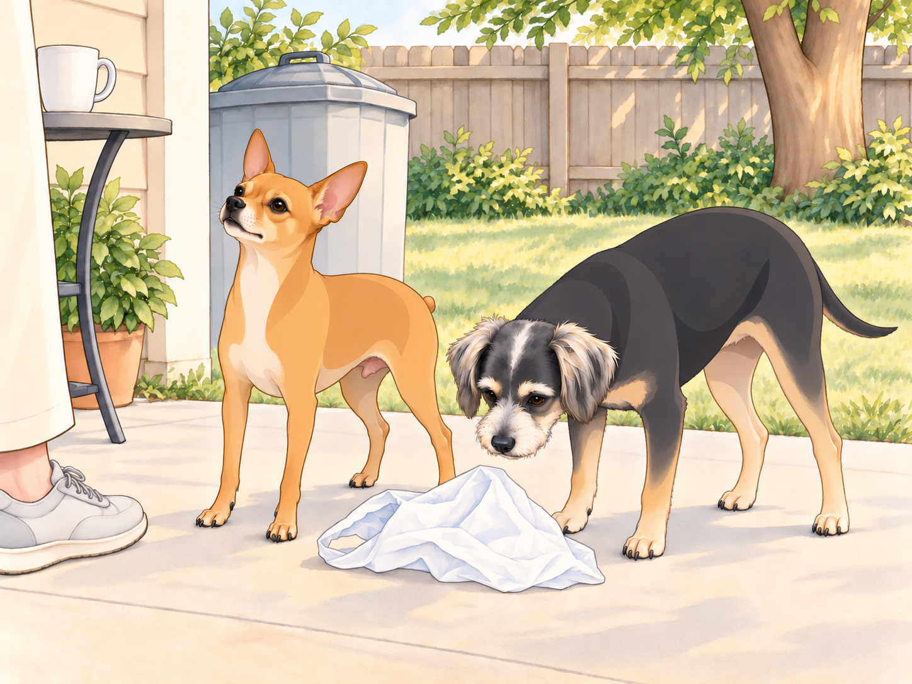
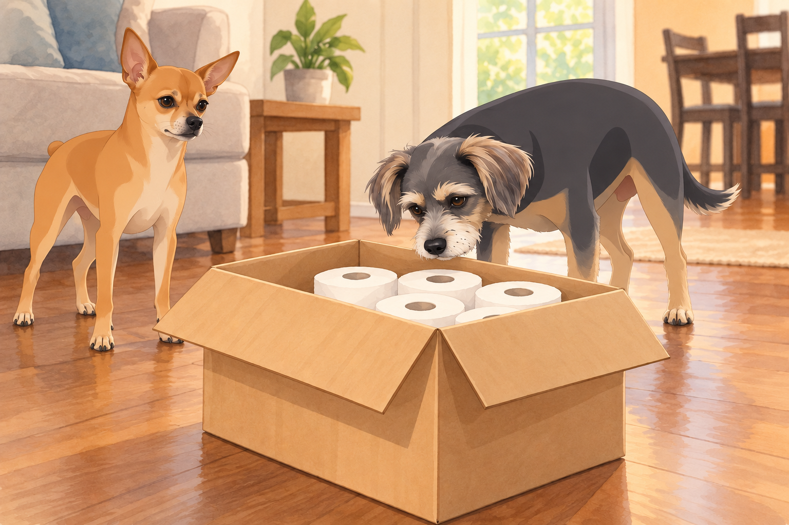
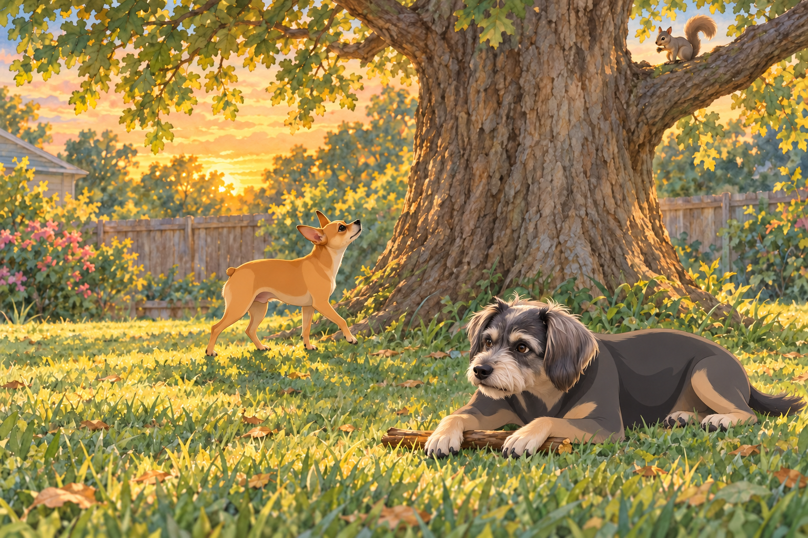

# The Redemption Crusade of the 4.25-Star General

## The Wound That Wouldn’t Heal

Night had fallen heavy across the kingdom, but for Neet, sleep was a stranger.

Once, he was the 4.75-star General, Guardian of the Realm, Zen Master of Sunbeams. But a roach had breached the walls. A bark feud had stirred chaos. And worst of all — the King himself had lowered his gaze and stripped away a precious quarter star.

Sagar had called him over for his usual ear scratch that evening. Neet had accepted, but he was certain the missing star would be the first thing anyone noticed.

Neet lay in his closet bed, rehearsing tomorrow’s patrol. Each time he found a more heroic route, he stood up, turned around, and lay down facing it.

Buddy pulled a sock over one ear.

In a whisper that trembled with devotion, Neet vowed:

“Tomorrow, he will have to reconsider.”

From the laundry pile, Buddy stirred, yawned, and muttered:

“You’re a lunatic.”

---

## The Plastic Bag Siege

The next morning, the trial came swiftly.

A rogue plastic bag rode the breeze into the backyard, fluttering like a trespassing flag.

Heather spotted it and shrugged. “I’ll grab it later.”

Buddy squinted. “Looks like snacks.”

But to Neet, this was destiny.

He looked toward Sagar first. A rescue performed without witnesses was practically housework.

With a war cry, he leapt from the deck, intercepting the bag midair. He dragged it down, shook it until it crumpled, and then paraded it across the lawn like a knight displaying a slain dragon.

Sagar glanced up from his tea, unimpressed.

The bag caught another puff of wind. Neet pounced on it a second time, just in case the first victory hadn’t been seen.

Neet planted the bag by the trash and stared up at him, chest heaving. “Recovered and presented. For the record.”

Buddy sniffed the bag and lost interest. “You just assaulted recycling. Absolute lunatic.”

---

## The Amazon Inquisition

Later, an Amazon van pulled up.

The driver, blissfully unaware, placed a package on the porch.

Most dogs bark. Neet unleashed Ragnarok.

He hurled himself against the door, bellowing like a war trumpet. The driver stumbled backward, retreating to his van.

“NEET!” Heather called. “He’s delivering toilet paper!”

Buddy joined in gleefully. “SNACKS! IT’S SNACKS!”

He hurried to the spot where Heather usually opened boxes. Whatever Neet was defending, Buddy intended to be first in line.

When the box was finally brought inside, Neet circled it like a paladin guarding sacred relics. Sniff, paw, sniff again — only after thirty minutes of vigil did he step back, eyes darting to Sagar.

Heather opened the flaps. Buddy put his nose over the edge, inspected the white rolls, then inspected the bottom corners for a smaller, better delivery.

Sagar exhaled, unimpressed.

Neet looked from Sagar to the box. Toilet paper. Not even an interesting capture.

Buddy flopped down. “Next time, wait until we know what’s in it.”

“You barked too.”

“Based on information available at the time.”

---

## The Squirrel Siege

By dusk, the final trial appeared: a squirrel, bold and twitchy-tailed, perched upon the fence.

Neet froze, hackles rising. This was no ordinary squirrel. This was The Intruder Supreme.

With a warrior’s bark, he charged. The squirrel darted into the oak tree.

Neet could not follow upward, but he circled its base, relentless, orbiting for forty-five minutes.

Neighbors passed by. Martha & Sally heckled from their yard.

The squirrel moved to the other side of the trunk. Neet reversed direction. A moment later, it moved back.

Buddy watched two changes of command before choosing a stick. He sprawled in the grass and began to chew.

“You’re just spinning in circles.” Buddy pushed the stick toward him. “Come here. Try this.”

Buddy waited for Neet’s next lap to make the offer again. Neet passed him without slowing. Buddy pulled the stick out of the patrol route.

But Neet didn’t stop. His lungs burned, his paws ached, but his eyes never left the branches. When the squirrel finally vanished into the canopy, he marched back to the deck, body quaking, tail held high.

He sat before Sagar and waited. Behind him, Buddy left the rejected stick by the water bowl.

---

## The Withheld Verdict

That evening, Neet positioned himself in the living room, rigid as a knight awaiting knighthood. He had three incidents to submit.

Heather looked at Sagar. “He’s been working… very hard.”

Sagar put down his mug and looked at the plastic bag, the delivery box and the stick Buddy had brought inside.

Heather lifted the stick. “Is this part of the evidence?”

Buddy stood up at once. That was his.

Neet leaned forward, ears sharp, waiting.

Finally, Sagar spoke.

“The tribunal acknowledges your efforts. But the matter of restoration… will be decided in time. The star remains withheld.”

Neet’s ears fell. The quarter star remained lost.

Heather set the stick down. Buddy recovered it, carried it back to Neet, and nudged it toward him again.

“You can stop for tonight, though.”

Neet lowered his head to the floor, a knight denied his armor, but his eyes burned with fresh determination.

The star had not returned. Neet still meant to earn it.

And until then… Neet would stop at nothing.

Except the stick. He rested his chin beside it, and Buddy settled at his shoulder.

---

## Epilogue: The Lunatic’s Oath

As the kingdom settled into sleep, Buddy whispered from his dryer-bed:

“Still 4.25 stars. Still need sleep.”

Neet curled tighter on his blanket, whispering into the shadows:

“One day, my King will see. And when he does… the crown of five stars shall be mine.”

Somewhere outside, the squirrel twitched its tail.

The war was far from over.

For the moment, however, the general had fallen asleep halfway through planning it.

## Provenance and editorial notes

Working selection dated October 3, 2026. Selection and shelf order are editorial; owner approval and event chronology remain unverified.

Original numbering: independent captured sequence Chapter 20.

Archive recovery: use [Studio recovery guidance](../Studio/Recovery.md). The paths below are paths **inside the verified snapshot**, not active navigation. SHA-256 pins identify the exact sources.

- `elevenlabs-reader-16` — `02_Story_Library/ElevenLabs_Imports/reader-16-the-redemption-crusade-of-the-4-25-star-general.txt`; SHA-256 `69560eb36dbc56ef0a5f0893ae0a222fbd41a5a2d3a3e6b78d56e339b6a4e75f`.

## Refinement record

Refined October 3, 2026; [episode record](../Productions/E050-the-redemption-crusade-of-the-4-25-star-general/episode.json) documents the reading comparison and illustration work. The pre-refinement text is preserved in the [dated recovery snapshot](/Users/sagar/Documents/ChatGPT/NBC_Archives/NBC-before-refinement-2026-10-03_200659.tar.gz) at `NBC/Stories/S050-the-redemption-crusade-of-the-4-25-star-general.md`. Historical provenance above remains unchanged.

Second comedy and illustration pass October 4, 2026: [comparison and scene decisions](../Productions/E050-the-redemption-crusade-of-the-4-25-star-general/comedy-pass-v002.json). Four proposed illustrations await independent visual review and a fresh complete rendered reading; approval remains unapproved.
