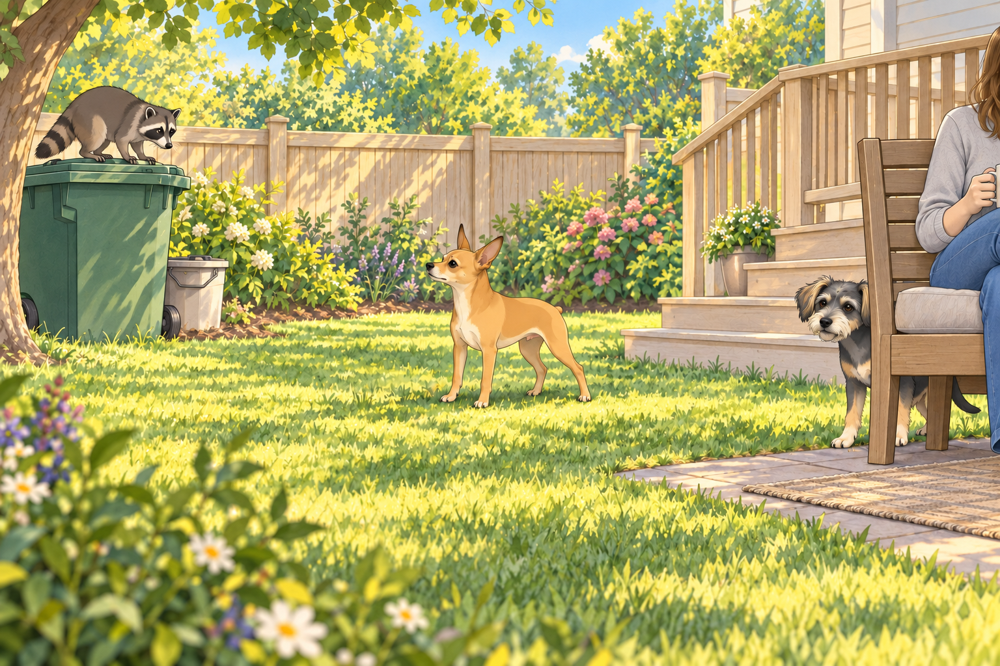
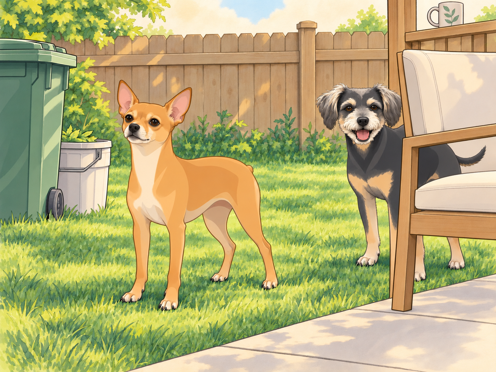
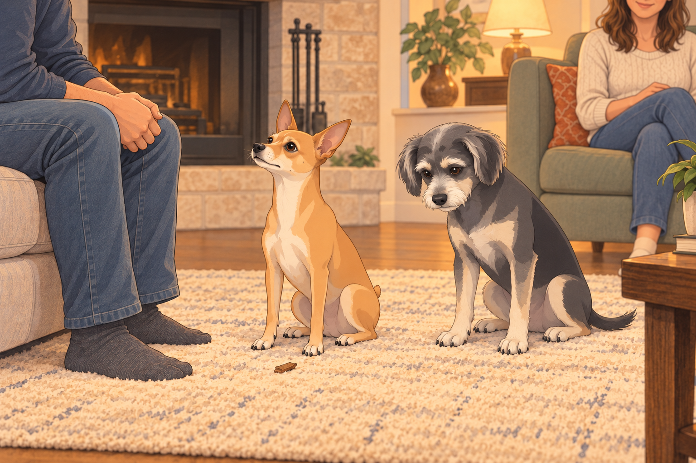

# The Redemption of the Star

## A General in Exile

The demotion hung over the household like a thundercloud.

Neet had been stripped of his quarter star — reduced to a 4.25-star general — and in his heart, it felt like exile.

He no longer patrolled with confidence. Instead, he brooded in corners, sighing like a knight mourning a lost crown.

Buddy watched him pace the living room one evening and muttered, “You look like a Shakespeare play, but with fleas.”

Neet ignored him, eyes fixed on the King. Every move Sagar made — pouring tea, tying shoelaces, adjusting the thermostat — Neet watched for a sign that another tribunal might be called.

Sagar bent to tie a shoelace. Neet sat to receive judgment. Sagar tied the other one.

Buddy waited until both shoes were finished before lying down again.

Even a sunbeam couldn’t distract Neet for long. He wanted the star back, and he wanted to earn it in front of Sagar.

---

## The Calm Before the Storm

Saturday dawned bright. Heather sat in the backyard with coffee, Buddy lounged belly-up in the grass, and Sagar leafed through his notes like the steady monarch he was.

Neet took up position near the deck stairs, still patrolling, but his movements were muted — the fire of pride dimmed to embers.

And then came the sound.

A metallic CLANG, followed by the unmistakable scritch-scritch of claws.

Heather jolted upright.

From the kingdom’s northern border — the trash cans — emerged a masked marauder.

The raccoon.

Thick-furred, beady-eyed, brazen. It clambered atop the lid, balancing like a circus acrobat, and looked straight into Heather’s eyes with insolence.

Heather froze. “Sagar…”

Buddy shot up and barked wildly: “SNACK BANDIT! STRIPED SNACK BANDIT!” before bolting behind a chair for cover.

Buddy leaned out for another warning bark. The raccoon looked at him. Buddy closed his mouth very slowly.

Neet’s head turned slowly. His eyes sharpened. His posture straightened. In that moment, the brooding knight vanished. What stood there was the General reborn.

---

## The Battle of the Backyard

With no warning, Neet charged.

He streaked across the lawn toward the trash cans. The raccoon hissed, raised its claws, and stood its ground. For a split second, the world seemed to hold its breath — a standoff between knight and outlaw.

The clash was chaos:

- The raccoon swiped; Neet ducked and countered with a bark so loud it rattled the fence slats.

- It leapt down, aiming for the compost bucket, but Neet body-blocked it with the precision of a medieval shield wall.

- They circled, locked in combat, dust rising from the battlefield (technically mulch, but the kingdom would remember it as dust).

Heather gasped from the porch, frozen with her mug in hand. She set it down carefully, missed the ledge, caught it, and put it down again without looking away.

Sagar rose at once and called Neet back. The general, having committed himself, scarcely seemed to hear.

Buddy peeked from behind the chair, eyes wide:

“Oh my God, he’s actually doing it. The lunatic is… heroic?”

Buddy moved to the other side of the chair for a better view. The raccoon turned. He changed sides again.

At last, with one final thunderous bark, Neet lunged. The raccoon faltered, scrambled back over the trash can, and fled over the fence, tail vanishing into the woods.

The backyard was still.

Neet stood tall, chest heaving, eyes fixed on the King.

Behind him, Buddy came out from the chair and gave the empty fence one firm bark.

“Stay out.”

---

## The Court Reconvenes

That evening, the tribunal gathered in the living room.

Heather recounted the tale, voice tinged with awe. “He scared it off. He protected me. Protected the house.”

Buddy added his own version: “It was terrifying. I mean, I was covering the rear flank from the porch— very important position. But yeah, the lunatic saved us.”

“From behind the chair,” Heather said, smiling at Buddy.

Buddy sat down. No need to dispute the geography.

Neet sat before them, posture perfect, gaze unwavering. His fur still carried the scent of battle, his chest puffed with the quiet pride of a knight who had stood against the odds.

A small piece of mulch fell from his chest onto the rug. Neet kept his eyes on Sagar. Buddy looked at the mulch, then decided this was not the moment.

And then came the silence.

Sagar, the King, looked down at him. The seconds stretched into eternities.

Neet’s ears twitched. His paws trembled. His whole being screamed: “Say it. Approve me. Restore me.”

Finally, Sagar spoke, his voice even but carrying the weight of a royal decree:

“The tribunal acknowledges the General’s bravery. His honor is restored. The star… returns.”

Heather clapped softly, smiling. Buddy dropped his jaw in exaggerated shock.

Neet held still until Sagar reached down. Then he pressed his head firmly into the waiting hand. He was once again 4.75 stars.

---

## The Coronation of Silence

That night, Neet sat on the deck, head high, gazing out across the kingdom he had defended. The crickets sang. The stars shimmered.

Buddy flopped beside him, licking his paw, and muttered:

“So… you’re a hero now. Still a lunatic, but a heroic lunatic.”

Neet shifted over to make room. Buddy settled, keeping the chair within a convenient distance.

“Good position?” Neet asked.

“Excellent.”

This time, Buddy stayed beside him.

The star was his once more. For tonight, the yard could manage without a patrol.

## Provenance and editorial notes

Working selection dated October 3, 2026. Selection and shelf order are editorial; owner approval and event chronology remain unverified.

Original numbering: independent captured sequence Chapter 21.

- The source restores 4.25 stars to 4.75; the stated quarter-star demotion elsewhere does not reconcile arithmetically.

Archive recovery: use [Studio recovery guidance](../Studio/Recovery.md). The paths below are paths **inside the verified snapshot**, not active navigation. SHA-256 pins identify the exact sources.

- `elevenlabs-reader-05` — `02_Story_Library/ElevenLabs_Imports/reader-05-the-redemption-of-the-star.txt`; SHA-256 `f5b6acc35c81cb9e8cb58606c0ef62feb6d920995514440ba9be785f81159ce7`.

## Refinement record

Refined October 3, 2026; [episode record](../Productions/E051-the-redemption-of-the-star/episode.json) documents the reading comparison and illustration work. The pre-refinement text is preserved in the [dated recovery snapshot](/Users/sagar/Documents/ChatGPT/NBC_Archives/NBC-before-refinement-2026-10-03_200659.tar.gz) at `NBC/Stories/S051-the-redemption-of-the-star.md`. Historical provenance above remains unchanged.

Second comedy and illustration pass October 4, 2026: [comparison and scene decisions](../Productions/E051-the-redemption-of-the-star/comedy-pass-v002.json). Three proposed illustrations await independent visual review and a fresh complete rendered reading; approval remains unapproved.
